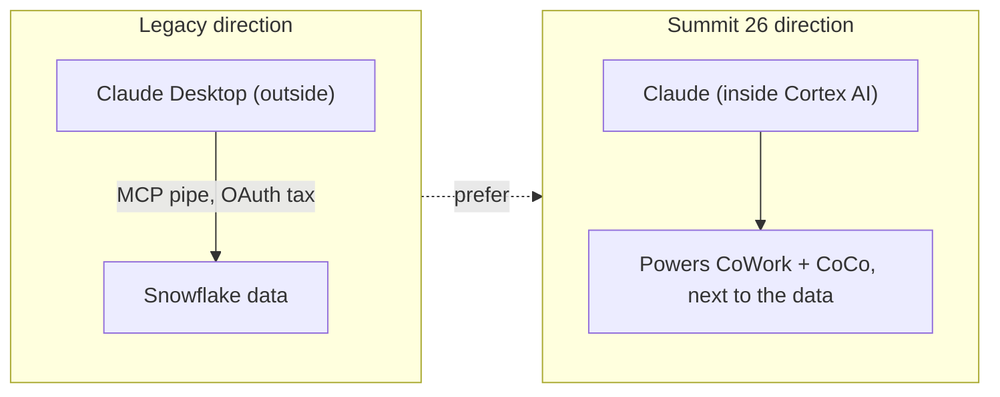
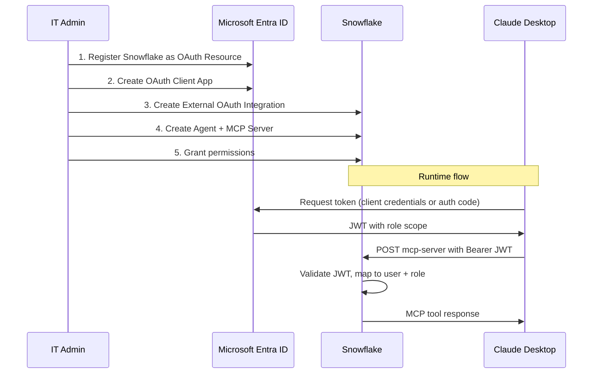

# Governed MCP — and the Legacy Text-to-SQL Path

MCP is not the villain. **Ungoverned, unconstrained, context-free MCP is.** This guide separates two very different things that the original version conflated:

1. **Governed MCP** — agents reaching enterprise tools through a gateway that enforces identity, policy, and audit per tool-call. This is a first-class, recommended pattern.
2. **Raw conversational text-to-SQL over MCP** — a generic chat agent pointed at a Cortex Agent that improvises SQL every turn. This is the **legacy anti-pattern** (~24% accuracy, uncontrolled cost) and now lives in the Claude Desktop setup section below as the last-choice option.

> **See also:** [The Context Layer](context-layer.md) (the accuracy fix you must apply to any MCP path) and [CoCo](coco.md) (delegate to a data-native agent instead of doing raw text-to-SQL).

---

## The Inversion: Claude Runs Inside Snowflake

The original framing — "connect Claude Desktop *in* to Snowflake" — was inverted by the **$200M Snowflake + Anthropic expansion** (June 1, 2026). Claude models now run *inside* Snowflake Cortex AI, powering CoWork and CoCo for 12,600+ customers. Inference stays within the Snowflake security perimeter, governed by RBAC.



**Implication:** before standing up an external MCP bridge, ask whether CoWork (business users) or CoCo (developers) already solves the need in-platform — with context grounding and governance you would otherwise have to rebuild.

---

## Governed Tool Access: the Natoma MCP Gateway

When an agent genuinely must reach Snowflake data *or act on external tools* (email, Slack, Jira), the governed pattern is a **centralized MCP gateway** — the capability Snowflake added by acquiring **Natoma** (announced May 27, 2026).

| Capability | What it provides |
|---|---|
| **Centralized MCP gateway** | One governed entry point for agent tool-calls instead of per-app OAuth wiring |
| **Identity, policy, audit per tool-call** | Verifies who requested an action, what permissions apply, whether to allow it |
| **Non-human identity governance** | Manages credentials for agents/service identities, not just humans |
| **Prebuilt MCP connectors** | Verified connectors for Atlassian, GitHub, Glean, Linear, Salesforce, Google Workspace — plus custom connector support |

The payoff: users can send emails, summarize Slack, or open Jira tickets from within CoWork or CoCo — every action from a governed environment with enterprise security, permissions, observability, and policy enforcement built in. This replaces the per-app OAuth plumbing in the legacy section below.

> **Availability:** Natoma was an announced acquisition at Summit 26. Confirm current integration and GA status with your Snowflake account team before designing around it.

---

## Accuracy Comes From the Foundation, Not the Connection

Any MCP path that ends in an agent writing SQL is only as accurate as the foundation behind it. The fix is the same foundation every path uses (see [The Context Layer](context-layer.md#the-one-thing-every-path-shares)):

- Describe your data in business terms (a **semantic view**), not bare tables.
- Save a handful of real questions with their correct answers, so common questions are answered reliably.
- Check it answers your real questions before exposing it to users.
- Keep the agent to `cortex_analyst_text_to_sql` (no `execute_sql`) so it stays read-only and can't improvise outside the semantic view.

---

# Claude Desktop Setup

If your directive is "implement Claude Desktop against Snowflake," this section is for you. There are two ways to do it, and the order of preference matters for accuracy and cost.

> **Living-document warning:** Claude Desktop's connector UI and the Snowflake MCP Server API both evolve. The steps below were accurate as of **2026-06-15**. If a menu path or field name doesn't match, check current [Anthropic Claude Desktop docs](https://claude.com/connectors/snowflake) (UI) and [Snowflake MCP Server docs](https://docs.snowflake.com/en/user-guide/snowflake-cortex/cortex-agents-mcp) (API).

## First, the Foundation (the Same for Every Path)

Good news: connecting Claude Desktop is the quick part, and the work that makes answers accurate isn't extra work for *this* path — it's the same foundation every path uses (CoWork, CoCo, and Claude Desktop all read from it). You build it once and it keeps paying off.

In short: describe your data in business terms (a semantic view), save a handful of real questions with their correct answers, and check it gets those questions right. A connected agent with no foundation behind it guesses; the same agent with a good foundation is trustworthy.

The plain-language, step-by-step version lives in **[The Context Layer](context-layer.md#the-one-thing-every-path-shares)**. The agent you create below simply points at the semantic view you build there. (This is also the honest answer to take back to your boss: "I can wire Claude Desktop today — and here's the small, reusable foundation that makes its answers trustworthy for every tool we use next.")

## Option C (Recommended): Let Claude Desktop Delegate to CoCo

The best way to satisfy "use Claude Desktop" *and* get accurate answers is **not** raw text-to-SQL — it's to have Claude Desktop delegate to the data-native CoCo agent, which reads your schema, RBAC, and context before generating SQL. No OAuth security integration, no MCP Server object, no Entra plumbing.

```json
{
  "mcpServers": {
    "cortex-code": {
      "command": "cortex",
      "args": ["mcp", "serve", "-c", "my_connection", "--bypass"]
    }
  }
}
```

Add that to `~/Library/Application Support/Claude/claude_desktop_config.json` (macOS) after installing the CoCo CLI and configuring a connection. Claude Desktop then exposes data-native tools (`cortex_code_agent`, `cortex_analyst_query`, catalog search) instead of one blind text-to-SQL tool.

> This uses the CoCo **CLI** (`cortex mcp serve`), which is **GA** — not the CoCo Desktop app. You only need the command-line tool installed.

### Option C, end to end

1. **Install the CoCo CLI and set up a connection** (one-time). See [coco.md → Install the CLI](coco.md#install-the-cli) and [Authentication](coco.md#authentication). Confirm it works:

   ```bash
   cortex connections list      # should show your connection
   ```

2. **Confirm the server starts** before wiring Claude Desktop:

   ```bash
   cortex mcp serve -c my_connection --bypass
   ```

   It should start and wait (it communicates over stdio). Press Ctrl-C — Claude Desktop will launch it for you once configured.

3. **Add the JSON above** to `claude_desktop_config.json`, then fully quit and reopen Claude Desktop.

4. **Verify inside Claude Desktop.** Open a new chat and click the tools/MCP icon — you should see the `cortex-code` server listed with tools like `cortex_code_agent` and `cortex_analyst_query`. Then test with a prompt:

   > *"Using Snowflake, how many tables are in my MY_DB.MY_SCHEMA schema?"*

   Claude Desktop should call a `cortex-code` tool and answer from your live account. If you see no tools, check the gotchas below.

> **You don't need a semantic view to start here.** `cortex_code_agent` explores your schema directly, so you can connect Claude Desktop today and see it working. Building the foundation in [The Context Layer](context-layer.md#the-one-thing-every-path-shares) is what makes the `cortex_analyst_query` (natural-language-to-answer) experience accurate for business users — do it next, not first.

| If this happens | Likely cause | Fix |
|---|---|---|
| No tools appear in Claude Desktop | Config not picked up | Fully quit and reopen Claude Desktop; check the JSON is valid |
| "cortex: command not found" in logs | CLI not on PATH for the GUI app | Use the full path to `cortex` in the `command` field |
| Tools appear but every call asks for approval | Missing `--bypass` | Add `--bypass` so Claude Desktop manages confirmations |
| Auth/browser prompt loops | Connection not established | Run `cortex connections list`; re-auth per [coco.md](coco.md#authentication) |

> Choose Options A/B below only if you specifically need Claude Desktop's *native Snowflake connector* (e.g., a non-developer who can't install the CoCo CLI). Otherwise Option C is simpler and more accurate. Background on why delegation beats raw text-to-SQL on accuracy and cost: [coco.md](coco.md#claude-code---coco-delegation-not-text-to-sql).

## Legacy MCP Path: Options A & B

> **When to use:** business-user convenience where CoWork and Option C are not available. **Accuracy note:** a Cortex Agent writing SQL is only as accurate as the foundation behind it (see *First, the Foundation* above). Keep it to `cortex_analyst_text_to_sql` (no `execute_sql`) so it can't improvise outside the semantic view.

### Prerequisites

Both options require a Cortex Agent and MCP Server in Snowflake. (Plus the semantic view and verified questions from *First, the Foundation*.)

#### 1. Create a Cortex Agent

```sql
USE ROLE SYSADMIN;

CREATE OR REPLACE AGENT MY_DB.MY_SCHEMA.MY_AGENT
  COMMENT = 'Cortex Agent for MCP access'
  FROM SPECIFICATION
  $$
  instructions:
    response: "You are a data analytics assistant. Answer questions concisely using the semantic view."
    orchestration: "Use the analyst tool for any data question grounded in the semantic view."

  tools:
    - tool_spec:
        type: "cortex_analyst_text_to_sql"
        name: "analyst"
        description: "Converts natural language to SQL"

  tool_resources:
    analyst:
      semantic_view: "MY_DB.MY_SCHEMA.MY_SEMANTIC_VIEW"
      execution_environment:
        type: "warehouse"
        warehouse: "MY_WAREHOUSE"
        query_timeout: 60
  $$;
```

> **Governance note:** assigning only `cortex_analyst_text_to_sql` (and NOT `execute_sql`) structurally limits the agent to read-only analytical queries through the semantic view. No prompt engineering bypasses this. **Accuracy note:** the agent is only as good as the semantic view behind it — this is where the context-layer work pays off.

#### 2. Create the MCP Server

```sql
CREATE OR REPLACE MCP SERVER MY_DB.MY_SCHEMA.MY_MCP_SERVER
  FROM SPECIFICATION $$
    tools:
      - name: "my-agent"
        type: "CORTEX_AGENT_RUN"
        identifier: "MY_DB.MY_SCHEMA.MY_AGENT"
        description: "Analytics agent for natural language data queries"
        title: "My Analytics Agent"
  $$;
```

#### 3. Grant Permissions

```sql
GRANT USAGE ON WAREHOUSE MY_WAREHOUSE TO ROLE DATA_READER;
GRANT USAGE ON DATABASE MY_DB TO ROLE DATA_READER;
GRANT USAGE ON SCHEMA MY_DB.MY_SCHEMA TO ROLE DATA_READER;
GRANT DATABASE ROLE SNOWFLAKE.CORTEX_USER TO ROLE DATA_READER;
GRANT USAGE ON AGENT MY_DB.MY_SCHEMA.MY_AGENT TO ROLE DATA_READER;
GRANT USAGE ON MCP SERVER MY_DB.MY_SCHEMA.MY_MCP_SERVER TO ROLE DATA_READER;
GRANT SELECT ON SEMANTIC VIEW MY_DB.MY_SCHEMA.MY_SEMANTIC_VIEW TO ROLE DATA_READER;
```

> No SELECT on underlying tables is needed — the semantic view is the interface.

---

### Option A: Snowflake OAuth (Built-in Claude Desktop Connector)

Fastest legacy path — uses Claude Desktop's native Snowflake connector with Snowflake's built-in OAuth.

### Step 1: Create OAuth Security Integration

```sql
USE ROLE ACCOUNTADMIN;

CREATE OR REPLACE SECURITY INTEGRATION claude_mcp_oauth
  TYPE = OAUTH
  OAUTH_CLIENT = CUSTOM
  ENABLED = TRUE
  OAUTH_CLIENT_TYPE = 'CONFIDENTIAL'
  OAUTH_REDIRECT_URI = 'https://claude.ai/api/mcp/auth_callback';
```

> **Role note:** MCP OAuth sessions use each user's `DEFAULT_ROLE` — secondary roles are not supported. Set each user's default role to the one that has USAGE on the MCP server and its tools, and ensure each user has a `DEFAULT_WAREHOUSE` set:
> ```sql
> ALTER USER <username> SET DEFAULT_ROLE = '<mcp_access_role>' DEFAULT_WAREHOUSE = '<warehouse_name>';
> ```
> Claude requests the `session:role:all` scope, which may display "secondary roles = ALL" on the consent screen — this is cosmetic only; Snowflake enforces the integration setting regardless.

### Step 2: Retrieve Client Credentials

```sql
SELECT SYSTEM$SHOW_OAUTH_CLIENT_SECRETS('CLAUDE_MCP_OAUTH');
```

Copy the `OAUTH_CLIENT_ID` and `OAUTH_CLIENT_SECRET` from the output.

### Step 3: Configure Claude Desktop

1. Open Claude Desktop, go to **Settings / Connectors**
2. Add the **Snowflake** connector
3. Enter:
   - **MCP Server URL:** `https://<ORG-ACCOUNT>.snowflakecomputing.com/api/v2/databases/<DB>/schemas/<SCHEMA>/mcp-servers/<MCP_SERVER_NAME>`
   - **Client ID** and **Client Secret** from Step 2
4. Click **Connect** — you'll be redirected to Snowflake's OAuth consent screen
5. After authorization, enable the agent/tool usage toggle on the connector

### Step 4: Verify

Start a new conversation, confirm MCP tools are available, and ask a question that routes through the agent.

---

### Option B: External OAuth via Entra ID (Enterprise)

Choose Option B only if your IT security policy requires all Snowflake tokens to come from your own Entra ID tenant *and* you cannot use Option A or C. If you're unsure, use Option A — it's simpler. (Option C's `externalbrowser` SSO needs none of this Entra plumbing at all.)



### Step 1: Register Snowflake as an OAuth Resource in Entra ID

1. **Azure Portal** -> Microsoft Entra ID -> App Registrations -> **New Registration**
2. Name: `Snowflake OAuth Resource`; Single Tenant; **Register**
3. **Expose an API** -> set Application ID URI (e.g., `api://<guid>`) -> save as `<SNOWFLAKE_APPLICATION_ID_URI>`
4. **Add a scope** for delegated access: `session:scope:<role_name>` (e.g., `session:scope:data_reader`)

For **client credentials flow** (service-to-service), add App Roles in the Manifest instead:

```json
"appRoles": [
    {
        "allowedMemberTypes": ["Application"],
        "description": "Snowflake role for MCP access",
        "displayName": "MCP Data Reader",
        "id": "<generate-a-guid>",
        "isEnabled": true,
        "origin": "Application",
        "value": "session:role:data_reader"
    }
]
```

### Step 2: Create an OAuth Client App in Entra ID

1. App Registrations -> **New Registration** -> `Claude Desktop MCP Client` -> Single Tenant
2. Copy **Application (client) ID** -> `<OAUTH_CLIENT_ID>`
3. **Certificates & secrets** -> New client secret -> copy value -> `<OAUTH_CLIENT_SECRET>`
4. **API Permissions** -> Add -> My APIs -> **Snowflake OAuth Resource** (delegated scopes or application roles) -> **Grant Admin Consent**

### Step 3: Collect Entra ID Metadata

| Value | Where to find it |
|---|---|
| `<AZURE_AD_ISSUER>` | Federation metadata -> `entityID` (e.g., `https://sts.windows.net/<tenant_id>/`) |
| `<AZURE_AD_JWS_KEY_ENDPOINT>` | OpenID Connect metadata -> `jwks_uri` (e.g., `https://login.microsoftonline.com/<tenant_id>/discovery/v2.0/keys`) |
| `<AZURE_AD_OAUTH_TOKEN_ENDPOINT>` | OAuth 2.0 token endpoint v2 (e.g., `https://login.microsoftonline.com/<tenant_id>/oauth2/v2.0/token`) |

### Step 4: Create External OAuth Security Integration in Snowflake

```sql
USE ROLE ACCOUNTADMIN;

CREATE OR REPLACE SECURITY INTEGRATION external_oauth_entra_mcp
  TYPE = EXTERNAL_OAUTH
  ENABLED = TRUE
  EXTERNAL_OAUTH_TYPE = AZURE
  EXTERNAL_OAUTH_ISSUER = '<AZURE_AD_ISSUER>'
  EXTERNAL_OAUTH_JWS_KEYS_URL = '<AZURE_AD_JWS_KEY_ENDPOINT>'
  EXTERNAL_OAUTH_AUDIENCE_LIST = ('<SNOWFLAKE_APPLICATION_ID_URI>')
  EXTERNAL_OAUTH_TOKEN_USER_MAPPING_CLAIM = 'upn'
  EXTERNAL_OAUTH_SNOWFLAKE_USER_MAPPING_ATTRIBUTE = 'login_name'
  EXTERNAL_OAUTH_ANY_ROLE_MODE = 'ENABLE';
```

**Notes:**

- `EXTERNAL_OAUTH_ANY_ROLE_MODE = 'ENABLE'` lets the token holder use any role granted to them.
- The `upn` claim maps to Snowflake `login_name` — ensure each user's `login_name` is their Entra UPN.
- Values are **case-sensitive**; the issuer URL trailing slash must match exactly.

### Step 5: Verify User Mapping

```sql
ALTER USER my_user SET LOGIN_NAME = 'user@company.com';
```

### Step 6: Get an Entra Token (Client Credentials Flow)

```bash
TOKEN=$(curl -s -X POST \
  "https://login.microsoftonline.com/<TENANT_ID>/oauth2/v2.0/token" \
  -d "client_id=<OAUTH_CLIENT_ID>" \
  -d "client_secret=<OAUTH_CLIENT_SECRET>" \
  -d "scope=<SNOWFLAKE_APPLICATION_ID_URI>/.default" \
  -d "grant_type=client_credentials" | jq -r .access_token)
```

For **authorization code flow** (on behalf of a user), see the [Snowflake community KB on Auth Code + PKCE with Entra](https://community.snowflake.com/s/article/oauth-authorization-code-grant-entra-id).

### Step 7: Validate the Token

```sql
SELECT SYSTEM$VERIFY_EXTERNAL_OAUTH_TOKEN('<access_token>');
```

### Step 8: Configure Claude Desktop

| OS | Path |
|---|---|
| macOS | `~/Library/Application Support/Claude/claude_desktop_config.json` |
| Windows | `%APPDATA%\Claude\claude_desktop_config.json` |
| Linux | `~/.config/Claude/claude_desktop_config.json` |

```json
{
    "mcpServers": {
        "snowflake": {
            "url": "https://<ORG-ACCOUNT>.snowflakecomputing.com/api/v2/databases/<DB>/schemas/<SCHEMA>/mcp-servers/<MCP_SERVER_NAME>",
            "headers": {
                "Authorization": "Bearer <ENTRA_ACCESS_TOKEN>"
            }
        }
    }
}
```

> **Token refresh:** Entra access tokens expire (~60 min), which makes the static `headers` config above impractical for sustained use.
> - **For dev/testing:** use a long-lived PAT instead of an Entra JWT — no expiry headache (see [CoCo auth](coco.md#authentication) for PAT setup).
> - **For production:** run a lightweight proxy that re-fetches a token via the client-credentials grant (the curl in Step 6) before each expiry and injects it as the `Authorization` header. Or sidestep token management entirely with Option C.
>
> Restart Claude Desktop fully after editing the config.

---

## Testing the Legacy Path

```bash
# Test the MCP endpoint directly (JSON-RPC)
curl -s -X POST \
  "https://<ORG-ACCOUNT>.snowflakecomputing.com/api/v2/databases/<DB>/schemas/<SCHEMA>/mcp-servers/<MCP_SERVER_NAME>" \
  -H "Content-Type: application/json" -H "Accept: application/json" \
  -H "Authorization: Bearer $TOKEN" \
  -d '{"jsonrpc":"2.0","id":1,"method":"tools/list","params":{}}'
```

1. **Verify the agent in Snowsight** first — if it fails there, the issue is Snowflake-side (agent, semantic view, grants), not MCP.
2. **Verify read-only enforcement** — `cortex_analyst_text_to_sql` only generates SELECT; an attempt to "create a view" is refused.

---

## Common Gotchas (Legacy MCP)

| Issue | Cause | Fix |
|---|---|---|
| Session uses wrong role (Option A) | User's `DEFAULT_ROLE` lacks USAGE on MCP server/tools | `ALTER USER ... SET DEFAULT_ROLE = '<mcp_role>' DEFAULT_WAREHOUSE = '<wh>'` |
| "does not exist or not authorized" | Role lacks USAGE on MCP server | `GRANT USAGE ON MCP SERVER ... TO ROLE ...` |
| URL connection failure / TLS error | Underscores in org/account name | Replace `_` with `-` in hostname |
| Token validation fails (Option B) | Issuer URL trailing slash mismatch | Exact match required |
| HTTP 200 but JSON-RPC error | Auth failure in JSON-RPC body | Check `error` field, not HTTP status |
| "Incompatible auth server: DCR" | Client uses `mcp-remote` | Snowflake MCP does not support DCR — use PAT or built-in connector |
| Token expires mid-session (Option B) | Entra tokens ~60 min TTL | Implement refresh or use PAT for dev |
| Confidently wrong answers | No context layer behind the agent | Add semantic views + verified queries ([context-layer.md](context-layer.md)) |

---

## URL Format Reference

| Use case | URL pattern |
|---|---|
| Claude Desktop (native Snowflake connector) | `https://<ORG-ACCOUNT>.snowflakecomputing.com/api/v2/databases/<DB>/schemas/<SCHEMA>/mcp-servers/<SERVER_NAME>` |
| REST / curl / JSON config (JSON-RPC) | `https://<ORG-ACCOUNT>.snowflakecomputing.com/api/v2/databases/<DB>/schemas/<SCHEMA>/mcp-servers/<SERVER_NAME>` |

**Hostname rule:** always hyphens, never underscores.

```sql
SELECT CURRENT_ORGANIZATION_NAME() || '-' || CURRENT_ACCOUNT_NAME();
```

---

## References

- [Snowflake to Acquire Natoma — Governed Agentic Access](https://www.snowflake.com/en/blog/snowflake-acquire-natoma-governed-agentic-access/)
- [Snowflake + Anthropic $200M Expanded Partnership](https://www.anthropic.com/news/snowflake-anthropic-expanded-partnership)
- [Snowflake MCP Server Documentation](https://docs.snowflake.com/en/user-guide/snowflake-cortex/cortex-agents-mcp)
- [Configure Entra ID for External OAuth](https://docs.snowflake.com/en/user-guide/oauth-azure)
- [CREATE SECURITY INTEGRATION (External OAuth)](https://docs.snowflake.com/en/sql-reference/sql/create-security-integration-oauth-external)
- [CREATE MCP SERVER Reference](https://docs.snowflake.com/en/sql-reference/sql/create-mcp-server)
- [CREATE AGENT Reference](https://docs.snowflake.com/en/sql-reference/sql/create-agent)
- [OAuth 2.0 Auth Code Grant + PKCE with Entra (Community KB)](https://community.snowflake.com/s/article/oauth-authorization-code-grant-entra-id)
