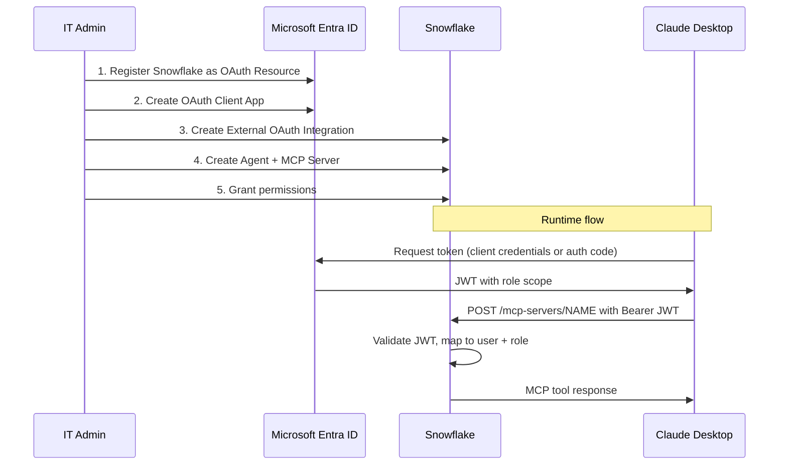

# Claude Desktop + Snowflake MCP: OAuth and Entra ID

Connect Claude Desktop to a Snowflake-managed MCP server. Two auth options: Snowflake's built-in OAuth (10 minutes) or External OAuth via Microsoft Entra ID for enterprise SSO (45 minutes).

> **See also:** [Cortex Code Plugin](cortex-code-plugin.md) for the CLI-based path with profiles and experience shaping — no MCP server needed.

---

## Prerequisites

Both options require a Cortex Agent and MCP Server in Snowflake.

### 1. Create a Cortex Agent

```sql
USE ROLE SYSADMIN;

CREATE OR REPLACE AGENT MY_DB.MY_SCHEMA.MY_AGENT
  COMMENT = 'Cortex Agent for MCP access'
  FROM SPECIFICATION
  $$
  models:
    orchestration: auto

  instructions:
    response: "You are a data analytics assistant. Answer questions concisely using the semantic view."
    orchestration: "Use the analyst tool for any data question grounded in the semantic view."

  tools:
    - tool_spec:
        type: "cortex_analyst_text_to_sql"
        name: "analyst"
        description: "Converts natural language to SQL"

  tool_resources:
    analyst:
      semantic_view: "MY_DB.MY_SCHEMA.MY_SEMANTIC_VIEW"
      execution_environment:
        type: "warehouse"
        warehouse: "MY_WAREHOUSE"
        query_timeout: 60
  $$;
```

> **Governance note:** By assigning only `cortex_analyst_text_to_sql` (and NOT `execute_sql`), the agent is structurally limited to read-only analytical queries generated through the semantic view. No amount of prompt engineering bypasses this.

### 2. Create the MCP Server

```sql
CREATE OR REPLACE MCP SERVER MY_DB.MY_SCHEMA.MY_MCP_SERVER
  FROM SPECIFICATION $$
    tools:
      - name: "my-agent"
        type: "CORTEX_AGENT_RUN"
        identifier: "MY_DB.MY_SCHEMA.MY_AGENT"
        description: "Analytics agent for natural language data queries"
        title: "My Analytics Agent"
  $$;
```

### 3. Grant Permissions

```sql
GRANT USAGE ON WAREHOUSE MY_WAREHOUSE TO ROLE DATA_READER;
GRANT USAGE ON DATABASE MY_DB TO ROLE DATA_READER;
GRANT USAGE ON SCHEMA MY_DB.MY_SCHEMA TO ROLE DATA_READER;
GRANT DATABASE ROLE SNOWFLAKE.CORTEX_USER TO ROLE DATA_READER;
GRANT USAGE ON AGENT MY_DB.MY_SCHEMA.MY_AGENT TO ROLE DATA_READER;
GRANT USAGE ON MCP SERVER MY_DB.MY_SCHEMA.MY_MCP_SERVER TO ROLE DATA_READER;
GRANT SELECT ON SEMANTIC VIEW MY_DB.MY_SCHEMA.MY_SEMANTIC_VIEW TO ROLE DATA_READER;
```

> No SELECT on underlying tables is needed — the semantic view acts as the interface.

---

## Option A: Snowflake OAuth (Built-in Claude Desktop Connector)

Fastest path — uses Claude Desktop's native Snowflake connector with Snowflake's built-in OAuth.

### Step 1: Create OAuth Security Integration

```sql
USE ROLE ACCOUNTADMIN;

CREATE OR REPLACE SECURITY INTEGRATION claude_mcp_oauth
  TYPE = OAUTH
  OAUTH_CLIENT = CUSTOM
  ENABLED = TRUE
  OAUTH_CLIENT_TYPE = 'CONFIDENTIAL'
  OAUTH_REDIRECT_URI = 'https://claude.ai/api/mcp/auth_callback'
  OAUTH_USE_SECONDARY_ROLES = IMPLICIT;
```

> **Critical:** `OAUTH_USE_SECONDARY_ROLES = IMPLICIT` is required. Other values cause opaque connection failures with no useful error message.

### Step 2: Retrieve Client Credentials

```sql
SELECT SYSTEM$SHOW_OAUTH_CLIENT_SECRETS('CLAUDE_MCP_OAUTH');
```

Copy the `OAUTH_CLIENT_ID` and `OAUTH_CLIENT_SECRET` from the output.

### Step 3: Configure Claude Desktop

1. Open Claude Desktop → **Customize** → **Connectors**
2. Browse for the **Snowflake** connector
3. Enter:
   - **MCP Server URL:** `https://<ORG-ACCOUNT>.snowflakecomputing.com/api/v2/mcp/servers/<DB>.<SCHEMA>.<MCP_SERVER_NAME>/sse`
   - **Client ID:** from Step 2
   - **Client Secret:** from Step 2
4. Click **Connect** — you'll be redirected to Snowflake's OAuth consent screen
5. After authorization, enable the **agent usage toggle** on the connector

### Step 4: Verify

Start a new conversation in Claude Desktop. You should see a hammer icon indicating MCP tools are available. Ask *"What were our top 5 products by revenue last quarter?"* and verify it routes through the agent.

---

## Option B: External OAuth via Entra ID (Enterprise)

Use this when your organization requires tokens issued by your own Entra ID tenant for centralized identity governance or Zero Trust compliance.



### Step 1: Register Snowflake as an OAuth Resource in Entra ID

1. **Azure Portal** → Microsoft Entra ID → App Registrations → **New Registration**
2. Name: `Snowflake OAuth Resource`
3. Supported account types: **Single Tenant**
4. Click **Register**
5. Go to **Expose an API** → Click **Set** next to Application ID URI
   - Set a unique URI (e.g., `api://<guid>`)
   - Save this as `<SNOWFLAKE_APPLICATION_ID_URI>`
6. **Add a scope** for delegated access (on behalf of user):
   - Scope name: `session:scope:<role_name>` (e.g., `session:scope:data_reader`)
   - Who can consent: Admins and users
   - Click **Add Scope**

**For client credentials flow (service-to-service)**, add App Roles in the Manifest instead:

```json
"appRoles": [
    {
        "allowedMemberTypes": ["Application"],
        "description": "Snowflake role for MCP access",
        "displayName": "MCP Data Reader",
        "id": "<generate-a-guid>",
        "isEnabled": true,
        "lang": null,
        "origin": "Application",
        "value": "session:role:data_reader"
    }
]
```

### Step 2: Create an OAuth Client App in Entra ID

1. **Azure Portal** → App Registrations → **New Registration**
2. Name: `Claude Desktop MCP Client`
3. Supported account types: **Single Tenant**
4. Click **Register**
5. Copy **Application (client) ID** → this is `<OAUTH_CLIENT_ID>`
6. **Certificates & secrets** → New client secret → Copy value → this is `<OAUTH_CLIENT_SECRET>`
7. **API Permissions** → Add Permission → My APIs → Select **Snowflake OAuth Resource**
   - For delegated: check **Delegated Permissions** (the scopes from Step 1)
   - For client credentials: check **Application Permissions** (the roles from Step 1)
8. Click **Grant Admin Consent**

### Step 3: Collect Entra ID Metadata

Navigate to **App Registrations** → Snowflake OAuth Resource → **Endpoints**:

| Value | Where to Find It |
|-------|-----------------|
| `<AZURE_AD_ISSUER>` | Federation metadata → `entityID` in XML root (e.g., `https://sts.windows.net/<tenant_id>/`) |
| `<AZURE_AD_JWS_KEY_ENDPOINT>` | OpenID Connect metadata → `jwks_uri` (e.g., `https://login.microsoftonline.com/<tenant_id>/discovery/v2.0/keys`) |
| `<AZURE_AD_OAUTH_TOKEN_ENDPOINT>` | OAuth 2.0 token endpoint (v2) (e.g., `https://login.microsoftonline.com/<tenant_id>/oauth2/v2.0/token`) |

### Step 4: Create External OAuth Security Integration in Snowflake

```sql
USE ROLE ACCOUNTADMIN;

CREATE OR REPLACE SECURITY INTEGRATION external_oauth_entra_mcp
  TYPE = EXTERNAL_OAUTH
  ENABLED = TRUE
  EXTERNAL_OAUTH_TYPE = AZURE
  EXTERNAL_OAUTH_ISSUER = '<AZURE_AD_ISSUER>'
  EXTERNAL_OAUTH_JWS_KEYS_URL = '<AZURE_AD_JWS_KEY_ENDPOINT>'
  EXTERNAL_OAUTH_AUDIENCE_LIST = ('<SNOWFLAKE_APPLICATION_ID_URI>')
  EXTERNAL_OAUTH_TOKEN_USER_MAPPING_CLAIM = 'upn'
  EXTERNAL_OAUTH_SNOWFLAKE_USER_MAPPING_ATTRIBUTE = 'login_name'
  EXTERNAL_OAUTH_ANY_ROLE_MODE = 'ENABLE';
```

**Important notes:**

- `EXTERNAL_OAUTH_ANY_ROLE_MODE = 'ENABLE'` allows the token holder to use any role granted to them
- The `upn` claim maps to Snowflake `login_name` — ensure each Snowflake user has `login_name` set to their Entra UPN
- Values are **case-sensitive** and must exactly match what Entra provides
- The issuer URL trailing slash matters — check with/without `/`

### Step 5: Verify Snowflake User Mapping

```sql
ALTER USER my_user SET LOGIN_NAME = 'user@company.com';
```

### Step 6: Get an Entra Token (Client Credentials Flow)

```bash
TOKEN=$(curl -s -X POST \
  "https://login.microsoftonline.com/<TENANT_ID>/oauth2/v2.0/token" \
  -d "client_id=<OAUTH_CLIENT_ID>" \
  -d "client_secret=<OAUTH_CLIENT_SECRET>" \
  -d "scope=<SNOWFLAKE_APPLICATION_ID_URI>/.default" \
  -d "grant_type=client_credentials" | jq -r .access_token)
```

For **authorization code flow** (on behalf of a user), see the [Snowflake community KB on Auth Code + PKCE with Entra](https://community.snowflake.com/s/article/oauth-authorization-code-grant-entra-id).

### Step 7: Validate the Token in Snowflake

```sql
SELECT SYSTEM$VERIFY_EXTERNAL_OAUTH_TOKEN('<access_token>');
```

### Step 8: Configure Claude Desktop

**Config file locations:**

| OS | Path |
|---|---|
| macOS | `~/Library/Application Support/Claude/claude_desktop_config.json` |
| Windows | `%APPDATA%\Claude\claude_desktop_config.json` |
| Linux | `~/.config/Claude/claude_desktop_config.json` |

```json
{
    "mcpServers": {
        "snowflake": {
            "url": "https://<ORG-ACCOUNT>.snowflakecomputing.com/api/v2/databases/<DB>/schemas/<SCHEMA>/mcp-servers/<MCP_SERVER_NAME>",
            "headers": {
                "Authorization": "Bearer <ENTRA_ACCESS_TOKEN>"
            }
        }
    }
}
```

> **Token refresh:** Entra access tokens expire (~60 minutes). For production, implement a refresh mechanism or use a lightweight proxy for token exchange.

Restart Claude Desktop fully (quit and reopen) after editing the config.

---

## Governance Model (MCP)

Three layers working together:

| Layer | What It Controls | How |
|-------|-----------------|-----|
| **Snowflake RBAC** | Who can access the MCP server and agent | `GRANT USAGE ON MCP SERVER` + `GRANT USAGE ON AGENT` |
| **Semantic View** | What data the agent can see | Only tables/columns in the view are queryable |
| **Agent Tool List** | What operations are possible | Omitting `execute_sql` = structurally read-only |

---

## Testing

### Test 1: Verify Agent in Snowsight

1. Navigate to the Agent in Snowsight → use the built-in chat panel
2. Send test prompts to verify the semantic view is working
3. If this fails, the issue is Snowflake-side (agent config, semantic view, grants)

### Test 2: Test MCP Endpoint with curl

```bash
curl -s -X POST \
  "https://<ORG-ACCOUNT>.snowflakecomputing.com/api/v2/databases/<DB>/schemas/<SCHEMA>/mcp-servers/<MCP_SERVER_NAME>" \
  -H "Content-Type: application/json" \
  -H "Accept: application/json" \
  -H "Authorization: Bearer $TOKEN" \
  -d '{"jsonrpc":"2.0","id":1,"method":"tools/list","params":{}}'
```

### Test 3: Verify Read-Only Enforcement

1. Temporarily grant `CREATE VIEW` to the role
2. Try *"Create a view..."* — agent refuses (cortex_analyst_text_to_sql only generates SELECT)
3. Revoke the extra grants

---

## Common Gotchas

| Issue | Cause | Fix |
|-------|-------|-----|
| Connection fails silently (Option A) | `OAUTH_USE_SECONDARY_ROLES` not `IMPLICIT` | Set to `IMPLICIT` |
| "does not exist or not authorized" | Role lacks USAGE on MCP server | `GRANT USAGE ON MCP SERVER ... TO ROLE ...` |
| URL connection failure / TLS error | Underscores in org/account name | Replace `_` with `-` in hostname |
| Token validation fails (Option B) | Issuer URL trailing slash mismatch | Exact match required |
| HTTP 200 but JSON-RPC error | Auth failure in JSON-RPC body | Check `error` field, not HTTP status |
| "Incompatible auth server: DCR" | Client uses `mcp-remote` | Use PAT or built-in connector |
| Token expires mid-session (Option B) | Entra tokens ~60 min TTL | Implement refresh or use PAT for dev |
| MCP tools not callable | Agent usage toggle not enabled | Enable it on the connector |

---

## URL Format Reference

| Use Case | URL Pattern |
|---|---|
| Claude Desktop native connector (SSE) | `https://<ORG-ACCOUNT>.snowflakecomputing.com/api/v2/mcp/servers/<DB>.<SCHEMA>.<SERVER_NAME>/sse` |
| REST / curl / JSON config (JSON-RPC) | `https://<ORG-ACCOUNT>.snowflakecomputing.com/api/v2/databases/<DB>/schemas/<SCHEMA>/mcp-servers/<SERVER_NAME>` |

**Hostname rule:** Always use hyphens, never underscores.

```sql
SELECT CURRENT_ORGANIZATION_NAME() || '-' || CURRENT_ACCOUNT_NAME();
```

---

## References

- [Snowflake MCP Server Documentation](https://docs.snowflake.com/en/user-guide/snowflake-cortex/cortex-agents-mcp)
- [Configure Entra ID for External OAuth](https://docs.snowflake.com/en/user-guide/oauth-azure)
- [CREATE SECURITY INTEGRATION (External OAuth)](https://docs.snowflake.com/en/sql-reference/sql/create-security-integration-oauth-external)
- [CREATE MCP SERVER Reference](https://docs.snowflake.com/en/sql-reference/sql/create-mcp-server)
- [CREATE AGENT Reference](https://docs.snowflake.com/en/sql-reference/sql/create-agent)
- [OAuth 2.0 Auth Code Grant + PKCE with Entra (Community KB)](https://community.snowflake.com/s/article/oauth-authorization-code-grant-entra-id)
- [Kevin Keller: External OAuth + MCP (Mar 2026)](https://kevinkeller.org/posts/snowflake-mcp-external-oauth-authentication/)
- [InterWorks: Governed NL Access via Claude Desktop (Apr 2026)](https://interworks.com/blog/2026/04/01/governed-natural-language-access-to-snowflake-data-via-claude-desktop/)
- [Claude Desktop Snowflake Connector](https://claude.com/connectors/snowflake)
