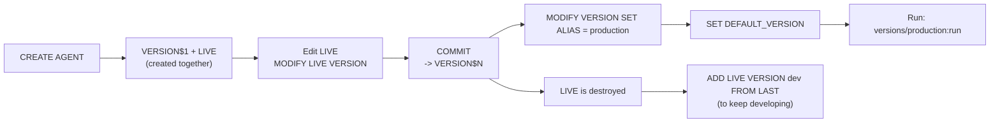

# Versioning Cortex Agents with GitHub

A **Cortex Agent** is an AI assistant that lives in Snowflake and answers questions by reasoning and calling tools. Once an agent is doing real work, you need the same discipline you'd apply to any production software: a way to snapshot a known-good configuration, promote it deliberately, and roll back fast when something breaks.

Snowflake gives agents a built-in **versioning** model. This guide explains that model in plain terms, then shows the two ways teams operate it — **iterate-in-Snowflake** and **Git-driven** — with a bias toward keeping GitHub as your source of truth. It ships with a small, runnable example agent so you can watch the whole lifecycle happen.

**Audience:** anyone who has (or is about to have) a Cortex Agent in production and wants a sane release process. No deep Snowflake background assumed.

**Created:** 2026-07-01 | **Expires:** 2026-12-31 | **Status:** ACTIVE

Pair-programmed by SE Community + Cortex Code

> **No support provided.** Reference only; test before you rely on it in production. Every SQL/REST claim here was checked against Snowflake's official docs on the created date above. Agent versioning is a **current, fast-moving** capability — if a command errors with `Unsupported feature 'AGENT VERSIONING'`, ask your account admin to enable it, and re-verify syntax before quoting it.

---

## New to this? Read these words once

| Term | In plain words |
|---|---|
| **Cortex Agent** | An AI assistant inside Snowflake that answers questions by reasoning and calling tools. |
| **Specification** (`agent_spec.yaml`) | The agent's full definition — its model, instructions, tools — as one YAML (or JSON) file. This is the thing you version. |
| **`LIVE` version** | The single **mutable** working copy of an agent. You edit `LIVE` during development. |
| **`VERSION$N`** | A **committed, immutable** snapshot (`VERSION$1`, `VERSION$2`, …). It never changes once created. |
| **Alias** | A human-readable label on a version, like `production` or `staging`. You move it to redirect traffic. |
| **`DEFAULT`** | The version that unversioned calls (`agent:run`) resolve to when no version is named. |
| **Commit** | `ALTER AGENT ... COMMIT` — snapshots `LIVE` into the next `VERSION$N`. |
| **Git repository object** | A Snowflake clone of a GitHub repo, exposed as a read-only stage (`@repo/...`) that Snowflake can read spec files from. |

> **The one-line model.** You develop on `LIVE`, freeze it into an immutable `VERSION$N` when it's good, put an `alias` (like `production`) on that version, and point traffic at it. Rolling back is just moving the alias back.

---

## How versioning works (the lifecycle)



Three facts that trip everyone up the first time:

1. **`CREATE AGENT` makes two versions at once** — a committed `VERSION$1` *and* a mutable `LIVE`.
2. **`COMMIT` destroys `LIVE`.** There is no live version afterward until you recreate one with `ADD LIVE VERSION ... FROM LAST`. This is the single most common versioning mistake.
3. **Once any version is committed, unversioned traffic follows `DEFAULT`, not `LIVE`.** Both `agent:run` and `DESCRIBE AGENT` switch to showing the default version. To always hit `LIVE`, call `versions/LIVE:run` explicitly.

---

## Two ways to operate it — pick your model

Both models use the exact same underlying commands. They differ only in **where the edit happens** and therefore **where your source of truth lives.**

| | **Iterate-in-Snowflake** | **Git-driven** (recommended for teams) |
|---|---|---|
| Where you edit the spec | `LIVE` version, via SQL / Snowsight | `agent_spec.yaml` in GitHub |
| Source of truth | The Snowflake `LIVE` version | The Git repo |
| Review / approval | Informal | Pull request + review |
| How a version is created | `COMMIT` the `LIVE` version | `ADD VERSION FROM @repo/...` (bypasses `LIVE`) |
| Best for | Solo dev, rapid prototyping, demos | Multiple contributors, audit trail, CI/CD |
| Rollback | Repoint alias / default | Repoint alias / default (optionally via PR) |
| Trade-off | Fast, but no diff history or review | More setup, but every change is reviewed and reproducible |

> **Recommendation.** Prototype with **iterate-in-Snowflake**, then graduate to **Git-driven** the moment more than one person touches the agent — you get code review, a diff history, and reproducible deployments for free. The two models interoperate: you can develop on `LIVE`, export the spec to Git, and thereafter deploy from Git.

### Iterate-in-Snowflake flow

```
Edit LIVE  ->  COMMIT (VERSION$N)  ->  alias production  ->  SET DEFAULT_VERSION
           ->  ADD LIVE VERSION dev FROM LAST  (to resume editing)
```
See [`sql/03_iterate_commit_promote.sql`](sql/03_iterate_commit_promote.sql).

### Git-driven flow

```
Edit agent_spec.yaml in Git  ->  PR + review  ->  merge / tag
   ->  Snowflake FETCH  ->  ADD VERSION FROM @repo/tags/vN/specs  ->  alias production
```
See [`sql/04_git_driven_import.sql`](sql/04_git_driven_import.sql) and [`github-actions/deploy-agent.yml`](github-actions/deploy-agent.yml).

---

## Git operation ↔ Snowflake command

This is the whole bridge between GitHub and Snowflake agent versioning:

| You do this in Git… | …and Snowflake does this |
|---|---|
| Commit `agent_spec.yaml` to a feature branch | *(nothing yet — it's just under review)* |
| Open a pull request | Reviewers see the exact spec diff |
| Merge to `main` | `ALTER GIT REPOSITORY agent_repo FETCH;` picks it up |
| Tag a release (`agent-v2.1`) | `ALTER AGENT ... ADD VERSION FROM @agent_repo/tags/agent-v2.1/specs` → new immutable `VERSION$N` |
| Decide it's production-ready | `ALTER AGENT ... MODIFY VERSION VERSION$N SET ALIAS = production` |
| Route unversioned callers | `ALTER AGENT ... SET DEFAULT_VERSION = 'VERSION$N'` |
| Discover a regression | Repoint alias/default to the previous `VERSION$N` (optionally via a revert PR) |

Snowflake connects to GitHub **natively** — an API integration plus a `GIT REPOSITORY` object clone the repo into a read-only stage, so `ADD VERSION FROM @repo/...` reads your merged YAML directly. No external file copy step required.

---

## Running a specific version (REST)

```
POST /api/v2/databases/{db}/schemas/{schema}/agents/{name}/versions/{version}:run
```

`{version}` accepts a system name (`VERSION$2`), an alias (`production`), or a shortcut (`FIRST`, `LAST`, `DEFAULT`, `LIVE`). URL-encode `$` as `%24`. This is how you pin callers to a release, or test a new version before promoting it.

---

## Quick Start

Run the scripts in order in a Snowflake account **with agent versioning enabled** (a sandbox, not a shared prod account). Each file is self-contained and commented.

```
sql/01_setup.sql                 -- warehouse, sample ORDERS table, semantic view
sql/02_create_agent.sql          -- CREATE AGENT -> VERSION$1 + LIVE
sql/03_iterate_commit_promote.sql-- edit LIVE, COMMIT, alias, default, resume dev
sql/04_git_driven_import.sql     -- connect GitHub, import a version from the repo
sql/05_promote_rollback.sql      -- move the production alias + default (both ways)
sql/06_inspect.sql               -- read any version's spec verbatim from its stage
sql/99_teardown.sql              -- remove everything
```

Steps 04 requires `CREATE INTEGRATION` (ACCOUNTADMIN). If you only want the versioning mechanics, run 01→03, 05→06, then 99.

### Files

| Path | Role |
|---|---|
| [`specs/agent_spec.yaml`](specs/agent_spec.yaml) | The source-of-truth spec — the file you version in GitHub |
| [`sql/`](sql/) | The seven-step runnable lifecycle (setup → create → iterate → git → promote → inspect → teardown) |
| [`github-actions/deploy-agent.yml`](github-actions/deploy-agent.yml) | Example CI/CD: on a release tag, import + (optionally) promote a version |
| [`AGENTS.md`](AGENTS.md) | Project instructions + the verified-facts list |

---

## Gotchas (the part worth reading twice)

- **`COMMIT` destroys `LIVE`.** Always follow a commit with `ADD LIVE VERSION ... FROM LAST` if you plan to keep developing.
- **`DEFAULT_VERSION` does not accept aliases.** Use a system id (`'VERSION$3'`) or a shortcut (`FIRST` / `LAST`). Aliases like `production` work everywhere *else* (API, stage URIs) but not here.
- **`ALIAS` is version-level, not agent-level.** Use `MODIFY VERSION ... SET ALIAS`. `ALTER AGENT SET ALIAS` errors (`001420`).
- **`SPECIFICATION` is `LIVE`-only.** Use `MODIFY LIVE VERSION SET SPECIFICATION`. And a new spec **fully replaces** the old — omitted fields are removed.
- **`DESCRIBE AGENT` can mislead.** After committing versions it shows the *default* version's spec, not `LIVE`. To read a specific version, query its stage file (`snow://agent/.../versions/<v>/agent_spec.yaml`).
- **The staged file must be named `agent_spec.yaml`.** `ADD VERSION FROM @repo/...` copies only that file; anything else is ignored.
- **Unquoted aliases are stored UPPERCASE.** `SET ALIAS = production` becomes `PRODUCTION` in stage paths. Double-quote to preserve case.
- **You can't drop the default version**, or a committed version that is the base of the current `LIVE`. Change the default first.

---

## Let Cortex Code guide you

Reading is one thing; doing it against your own agent is another. Paste the prompt below
into **Cortex Code** (the `cortex` CLI, or the Cortex Code panel in Snowsight) and it will
walk you through setting this up for your environment — asking about your agent and how
your team ships changes before it builds anything.

```text
Help me set up a versioning and release process for my Cortex Agent in Snowflake.
To start, I'm thinking: keep the agent spec as the source of truth, commit stable
snapshots as named versions, put a `production` alias on whichever version is live,
and have a clean way to roll back - but I'm open to your suggestions. Before you
build or run anything, ask me a few questions about my current agent, who deploys
changes, and whether I want GitHub in the loop, so we can shape it to my setup.
Keep this first version simple; we can layer on CI/CD once I see it working.
```

> If you have this guide's folder open in Cortex Code, it also loads the bundled
> `cortex-agent-versioning` skill and `AGENTS.md` automatically — so CoCo already knows
> the commands, the gotchas, and this example's layout.

## References

- [Cortex Agent versioning](https://docs.snowflake.com/en/user-guide/snowflake-cortex/cortex-agents-versioning)
- [ALTER AGENT](https://docs.snowflake.com/en/sql-reference/sql/alter-agent)
- [CREATE GIT REPOSITORY](https://docs.snowflake.com/en/sql-reference/sql/create-git-repository) · [CREATE API INTEGRATION](https://docs.snowflake.com/en/sql-reference/sql/create-api-integration)
- [Using a Git repository in Snowflake](https://docs.snowflake.com/en/developer-guide/git/git-overview)
