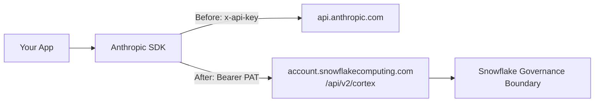

# Cortex Anthropic API Redirect Guide

**Pair-programmed by:** SE Community + Cortex Code
**Created:** 2026-03-17 | **Expires:** 2026-04-16 | **Status:** ACTIVE

Existing Anthropic API code running against `api.anthropic.com`? Change **3 lines** and it runs through Snowflake Cortex instead -- same SDK, same request body, same response format. Your data stays within Snowflake's governance boundary.

> **No support provided.** This code is for reference only. Review, test, and modify before any production use.

## Quick Start

**Get just this guide:**
```bash
bash <(curl -sL https://raw.githubusercontent.com/sfc-gh-miwhitaker/sfe-public/main/shared/get-project.sh) guide-cortex-anthropic-redirect
cd sfe-public/guide-cortex-anthropic-redirect
```

**Install and run:**
```bash
python -m venv .venv
source .venv/bin/activate
pip install -r requirements.txt
cp .env.example .env   # fill in your credentials
source .env

# 1. Verify Anthropic direct access
python python/01_anthropic_direct.py

# 2. Verify Cortex redirect
python python/02_cortex_redirect.py

# 3. Run side-by-side comparison (the key demo)
python python/03_side_by_side.py
```

## What Changes (and What Doesn't)

| | Anthropic Direct | Cortex Redirect |
|---|---|---|
| **Endpoint** | `api.anthropic.com` | `<account>.snowflakecomputing.com/api/v2/cortex` |
| **Auth** | `x-api-key` header (API key) | `Authorization: Bearer` (Snowflake PAT) |
| **SDK `api_key`** | Your Anthropic key | `"not-used"` (required but ignored) |
| **Request body** | _unchanged_ | _unchanged_ |
| **Model names** | _unchanged_ (e.g., `claude-sonnet-4-5`) | _unchanged_ |
| **Response format** | _unchanged_ | _unchanged_ |
| **Streaming** | _unchanged_ | _unchanged_ |
| **Tool calling** | _unchanged_ | _unchanged_ |



## The 3-Line Change

**Before** (Anthropic direct):
```python
import anthropic

client = anthropic.Anthropic()  # uses ANTHROPIC_API_KEY
```

**After** (Cortex redirect):
```python
import anthropic, httpx, os

PAT = os.environ["SNOWFLAKE_PAT"]
ACCOUNT = os.environ["SNOWFLAKE_ACCOUNT"]

client = anthropic.Anthropic(
    api_key="not-used",  # pragma: allowlist secret
    base_url=f"https://{ACCOUNT}.snowflakecomputing.com/api/v2/cortex",
    http_client=httpx.Client(headers={"Authorization": f"Bearer {PAT}"}),
    default_headers={"Authorization": f"Bearer {PAT}"},
)
```

Everything after client creation is identical -- `client.messages.create(...)`, streaming, tool calling, all of it.

## Prerequisites

### 1. Anthropic API Key

You already have this. Set it:
```bash
export ANTHROPIC_API_KEY="sk-ant-..."  # pragma: allowlist secret
```

### 2. Snowflake Account URL

Your Snowflake account identifier (e.g., `myorg-myaccount`):
```bash
export SNOWFLAKE_ACCOUNT="myorg-myaccount"
```

### 3. Snowflake Programmatic Access Token (PAT)

Create a PAT in Snowsight or SQL:

**Option A -- Snowsight UI:**
1. Click your name (bottom-left) -> My Profile
2. Under "Programmatic access tokens", click **Generate**
3. Name it, set an expiration, select your default role
4. Copy the token value (shown only once)

**Option B -- SQL:**
```sql
ALTER USER my_user ADD PROGRAMMATIC ACCESS TOKEN cortex_api_demo
  DAYS_TO_EXPIRY = 30
  COMMENT = 'Cortex Anthropic redirect guide';
```
Copy the `token_secret` value from the result (shown only once -- no way to retrieve it later).

```bash
export SNOWFLAKE_PAT="ver:1:..."
```

### 4. Verify Cortex Access

Your default role must have `SNOWFLAKE.CORTEX_USER` (granted to PUBLIC by default):
```sql
SELECT CURRENT_ROLE();
-- If needed: GRANT DATABASE ROLE SNOWFLAKE.CORTEX_USER TO ROLE my_role;
```

## Production Auth: Key-Pair JWT

PAT is great for testing. For production, service accounts, and CI/CD, use key-pair JWT:

| Scenario | PAT | Key-Pair JWT |
|----------|-----|-------------|
| Quick testing and dev | Recommended | Works |
| Service accounts (no human login) | Not ideal | Recommended |
| CI/CD pipelines | Requires token rotation | Recommended |
| No-password security policies | May not comply | Compliant |
| Long-running backend services | Token may expire | Auto-refreshed (1h, cached) |

### One-Time Setup

```bash
# 1. Generate RSA key pair
openssl genrsa -out rsa_key.pem 2048
openssl rsa -in rsa_key.pem -pubout -out rsa_key.pub

# 2. Get public key content (strip header/footer)
grep -v "BEGIN\|END" rsa_key.pub | tr -d '\n'

# 3. Assign to Snowflake user (run as ACCOUNTADMIN in Snowsight)
# ALTER USER MY_SERVICE_USER SET RSA_PUBLIC_KEY='MIIBIjANBgkqhki...';
```

### Set Environment Variables

```bash
export SNOWFLAKE_ACCOUNT="myorg-myaccount"
export SNOWFLAKE_USER="MY_SERVICE_USER"
export SNOWFLAKE_PRIVATE_KEY_PATH="./rsa_key.pem"
```

### Run It

```bash
python python/06_keypair_auth.py
```

### The Code

The helper module `python/snowflake_auth.py` builds either client type:

```python
from snowflake_auth import build_cortex_client_keypair

client = build_cortex_client_keypair()

# Same API from here on -- identical to PAT
response = client.messages.create(
    model="claude-sonnet-4-5",
    max_tokens=1024,
    messages=[{"role": "user", "content": "Hello from key-pair JWT!"}],
)
```

The only difference from PAT auth: the `Authorization` header carries a signed JWT, and `X-Snowflake-Authorization-Token-Type: KEYPAIR_JWT` is added. The helper handles JWT generation, caching, and auto-refresh.

## Files

| File | What It Shows |
|------|---------------|
| [`python/01_anthropic_direct.py`](python/01_anthropic_direct.py) | Baseline: standard Anthropic SDK call |
| [`python/02_cortex_redirect.py`](python/02_cortex_redirect.py) | Same call via Cortex (3 changes highlighted) |
| [`python/03_side_by_side.py`](python/03_side_by_side.py) | Both APIs, same prompt, side-by-side with timing |
| [`python/04_streaming.py`](python/04_streaming.py) | Streaming token-by-token from both APIs |
| [`python/05_tool_calling.py`](python/05_tool_calling.py) | Tool calling with identical tool definitions |
| [`python/06_keypair_auth.py`](python/06_keypair_auth.py) | Production key-pair JWT auth |
| [`python/snowflake_auth.py`](python/snowflake_auth.py) | Shared helper: builds Cortex client (PAT or key-pair) |
| [`curl_examples.sh`](curl_examples.sh) | Raw curl for both APIs |

## Feature Compatibility

All features below work identically through Cortex (Claude models only):

| Feature | Supported | Notes |
|---------|-----------|-------|
| Text completion | Yes | Same request/response format |
| Streaming | Yes | SSE with `client.messages.stream()` |
| Tool calling | Yes | Identical tool definitions and responses |
| Structured output | Yes | Via `tool_use` pattern |
| Prompt caching | Yes | `cache_control` with 5-min TTL |
| Image input | Yes | Base64 source blocks |
| Extended thinking | Yes | `thinking` parameter with `type: "adaptive"` |
| Beta features | Yes | Via `anthropic-beta` header |
| Multi-turn conversations | Yes | Same message array format |

For non-Claude models (OpenAI, Llama, Mistral, DeepSeek), use the Cortex Chat Completions API with the OpenAI SDK instead.

## Why Cortex?

| Benefit | Detail |
|---------|--------|
| **Governance** | Inference runs within Snowflake -- data never leaves your perimeter |
| **Unified billing** | LLM costs appear on your Snowflake bill as credits |
| **Multi-model** | Access Claude, GPT, Llama, Mistral, DeepSeek from one endpoint |
| **No model keys** | No Anthropic API key needed in production -- just Snowflake auth (PAT or key-pair JWT) |
| **Rate limits** | Up to 600 RPM / 600K TPM for claude-sonnet-4-5 (higher with cross-region) |

## Development Tools

This project is designed for AI-pair development.

- **AGENTS.md** -- Project instructions for Cortex Code and compatible AI tools
- **.claude/skills/** -- Project-specific AI skill teaching the AI this project's patterns
- **Cortex Code in Snowsight** -- Open in a Workspace for AI-assisted development
- **Cursor** -- Open locally for AI-pair coding

> New to AI-pair development? See [Cortex Code docs](https://docs.snowflake.com/en/user-guide/cortex-code/cortex-code)

## Learn More

- [Cortex REST API docs](https://docs.snowflake.com/en/user-guide/snowflake-cortex/cortex-rest-api)
- [Programmatic Access Tokens](https://docs.snowflake.com/en/user-guide/programmatic-access-tokens)
- [Key-Pair Authentication](https://docs.snowflake.com/en/user-guide/key-pair-auth)
- [Anthropic Messages API reference](https://docs.anthropic.com/en/api/messages)
- [PAT to Key-Pair JWT Migration](../guide-api-agent-context/migrate_pat_to_keypair_jwt.md) -- detailed recipes for Node.js, Python, and curl
