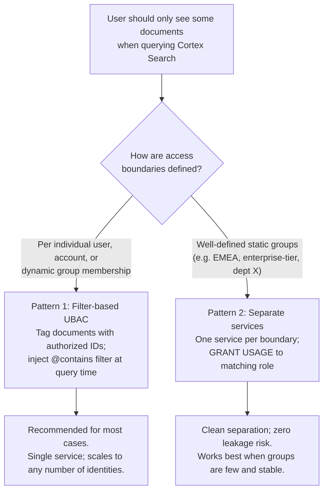

# Cortex Search Access Control

**Cortex Search Services run as their owner** — not as whoever calls them. Any role granted permission to query a service can retrieve any document the service has indexed, regardless of that role's privileges on the underlying table. Row-level masking policies on the source table do not apply.

This guide covers the two patterns available today for scoping what different users can see, and is direct about what the platform does not yet support.

**Audience:** anyone building or advising on a Cortex Search deployment where different users should see different content.
**Created:** 2026-07-23 | **Expires:** 2026-10-21 | **Status:** ACTIVE

Pair-programmed by SE Community + Cortex Code

> **No support provided.** Reference only; test before you rely on it in production. Every SQL claim in this guide was verified against Snowflake's official docs on the created date above; re-verify before quoting it to anyone.

---

## New to Snowflake? Read these words once

| Term | In plain words |
|---|---|
| **Cortex Search Service** | A search index you build from a Snowflake table. Users query it with natural-language text; it returns the most relevant rows. |
| **Owner's rights** | The security model Cortex Search uses today. The service runs as its creator's role, not as whoever calls it. If you can call the service, you see what the owner sees. |
| **Caller's rights** | An alternative model — not yet available for Cortex Search — where the service would run as the calling user's role, inheriting their row-level access. |
| **ATTRIBUTES** | Columns you declare at service-creation time as filterable. At query time, you can narrow results to rows matching a filter on these columns. |
| **`@contains` filter** | A Cortex Search filter operator that checks whether an ARRAY column contains a given value. The key operator for identity-based access control. |
| **UBAC** | User-Based Access Control — restricting results by the identity of the caller, not by static role membership. |
| **Access control identifier** | Any external ID used as an access gate: Salesforce Account ID, tenant ID, workspace ID, user email, etc. |

> **The one-line answer.** To scope what a caller sees, you either (a) tag each document with who is allowed to see it and inject a filter at query time, or (b) create separate services for each access boundary so the data never crosses. Both work today. Native caller's rights — where the platform handles this automatically — is not yet available.

---

## Start Here: Which Pattern Do You Need?

---

## Pattern Comparison

| | [Pattern 1: Filter UBAC](filter-attribute-ubac.md) | [Pattern 2: Separate services](separate-services.md) |
|---|---|---|
| **How it works** | Tag each document with allowed identifiers; inject `@contains` filter at query time | Index only the right documents into each service; grant USAGE per role |
| **Best for** | Dynamic, user-level, or external-ID-based access (per account, per tenant, per user) | Static groups with clean, known boundaries |
| **Number of services** | One | One per group |
| **Leakage if filter not injected** | Yes — full index exposed | None — data isn't in the service |
| **Requires data model change** | Yes — add ARRAY attribute column to source | No |
| **Access enforced at** | Query time (application injects filter) | Index time (service scope) |
| **Maturity** | GA | GA |

---

## What the Platform Does Not Yet Support

| Gap | Reality |
|---|---|
| **Native caller's rights** | Not available. Owner's rights is the only model. The two patterns in this guide are the workaround. |
| **Row-level masking inherited from source table** | A masking policy on the underlying table does not restrict what Cortex Search returns. The service bypasses it. |
| **Dynamic data masking in search results** | Not supported. If a column would be masked for a given user on the source table, the service still returns it unmasked. |
| **Fine-grained access within a single service** | USAGE on a service is all-or-nothing. Scoping requires one of the two patterns above. |

**If native caller's rights is a hard requirement for your deployment, tell your account team.** Customer demand is how Snowflake prioritizes features — a concrete use case tied to your account carries more weight than a general request. Ask your AE to log it as a formal feature request.

---

## Quick Picks by Scenario

| Scenario | Recommended Pattern |
|---|---|
| SaaS platform: each customer account sees only their own content | [Pattern 1](filter-attribute-ubac.md) — tag with account ID array |
| Market research: reports licensed per client | [Pattern 1](filter-attribute-ubac.md) — tag with licensed client IDs |
| Healthcare: patients see only their own records | [Pattern 1](filter-attribute-ubac.md) — tag with patient ID |
| Multi-tenant B2B: small number of tiers, each with separate content | [Pattern 2](separate-services.md) — one service per tier |
| Regional compliance: EMEA data must stay EMEA | [Pattern 2](separate-services.md) — one service per region |
| Internal HR: employees see only their department | Pattern 1 for many departments; Pattern 2 if few and stable |

---

## External References

- [CREATE CORTEX SEARCH SERVICE](https://docs.snowflake.com/en/sql-reference/sql/create-cortex-search) — official DDL syntax including ATTRIBUTES clause
- [Query a Cortex Search Service — Filter syntax](https://docs.snowflake.com/en/user-guide/snowflake-cortex/cortex-search/query-cortex-search-service#filter-syntax) — `@contains`, `@eq`, `@and`, `@or` operators
- [Querying with Owner's Rights](https://docs.snowflake.com/en/user-guide/snowflake-cortex/cortex-search/query-cortex-search-service#querying-with-owner-s-rights) — the security model, documented

---

Pair-programmed by SE Community + Cortex Code
