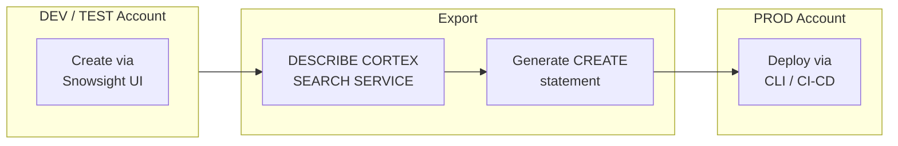

# Cortex Search Automation Guide

Inspired by a real operational question: *"I built a Cortex Search service in my test account -- how do I promote it to production without clicking through the UI again?"*

This guide provides automation patterns not found in the official docs: spec export/recreation, parameterized deployment templates, CI/CD pipeline examples, runnable E2E tests, Python SDK production patterns, and agent integration. The official docs cover syntax; this guide covers operations.

**Author:** SE Community
**Last Updated:** 2026-03-02 | **Status:** ACTIVE

> **No support provided.** This code is for reference only. Review, test, and modify before any production use.

---

## The Approach



| Resource | Unique Value |
|----------|--------------|
| [automation_patterns.sql](automation_patterns.sql) | Spec export/recreation, parameterized deployment |
| [cortex_search_e2e_test.sql](cortex_search_e2e_test.sql) | Runnable E2E test with sample data |
| [deployment_guide.md](deployment_guide.md) | CI/CD pipelines, GitHub Actions, Git Repository integration |
| [python_sdk_examples.py](python_sdk_examples.py) | Production Python patterns (REST API, not SEARCH_PREVIEW) |
| [agent_integration.sql](agent_integration.sql) | Use Cortex Search as a Cortex Agent tool |

> [!TIP]
> **Pattern demonstrated:** `DESCRIBE CORTEX SEARCH SERVICE` + parameterized CLI deployment for promoting Cortex Search services across environments.

---

## Quick Start

```bash
bash <(curl -sL https://raw.githubusercontent.com/sfc-gh-miwhitaker/sfe-public/main/shared/get-project.sh) guide-cortex-search
cd sfe-public/guide-cortex-search
```

### Export -> Redeploy

```sql
DESCRIBE CORTEX SEARCH SERVICE my_db.my_schema.my_search;

-- Generate CREATE from the DESCRIBE output (see automation_patterns.sql)

snow sql -f service.sql \
  -D database=PROD_DB \
  -D schema=PROD_SCHEMA \
  -D warehouse=PROD_WH \
  --connection prod
```

### Run the E2E Test

```sql
-- Uses SNOWFLAKE_PUBLIC_DATA_FREE.PUBLIC_DATA_FREE.COMPANY_EVENT_TRANSCRIPT_ATTRIBUTES
-- Execute sections sequentially in cortex_search_e2e_test.sql
```

---

## Quick Links

| Task | Resource |
|------|----------|
| Create a service | [CREATE CORTEX SEARCH SERVICE](https://docs.snowflake.com/en/sql-reference/sql/create-cortex-search) |
| Query (SQL testing) | [SEARCH_PREVIEW Function](https://docs.snowflake.com/en/sql-reference/functions/search_preview-snowflake-cortex) |
| Query (production) | [REST API](https://docs.snowflake.com/en/developer-guide/snowflake-rest-api/cortex-search/cortex-search-introduction) / [Python SDK](https://docs.snowflake.com/en/user-guide/snowflake-cortex/cortex-search/query-cortex-search-service) |
| Filter syntax | [Query Service docs](https://docs.snowflake.com/en/user-guide/snowflake-cortex/cortex-search/query-cortex-search-service#filter-syntax) |
| Use in Cortex Agent | [agent_integration.sql](agent_integration.sql) |
