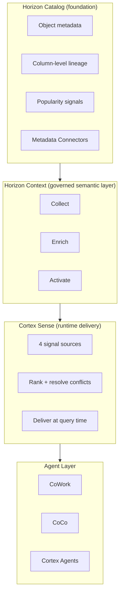
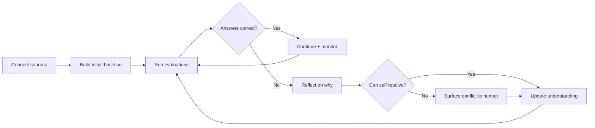

# Cortex Sense: The Runtime Context Layer for Agentic AI

**Cortex Sense** is a background service that automatically assembles business context — from query history, object metadata, BI dashboards, and governed semantic views — and delivers it to Snowflake's agents (CoWork, CoCo, Cortex Agents) at the moment they answer a question. It does not replace semantic views; it extends coverage to the vast majority of tables nobody has documented yet, and it does this without manual ontology work.

**Audience:** Snowflake SEs who already understand Cortex Analyst and semantic views, and need to explain or position the new context stack announced at Summit 2026.
**Created:** 2026-07-02 | **Expires:** 2026-12-31 | **Status:** ACTIVE

Pair-programmed by SE Community + Cortex Code

> **Forward-looking statements.** Cortex Sense enters private preview mid-July 2026. Features described here reflect official Snowflake blog content and Summit announcements as of the created date. Capabilities may change before GA. Re-verify before quoting in customer-facing material.

---

## The Problem: Why Agents Fail on Enterprise Data

The core failure mode is not model quality — it is missing context. A frontier agent connected via MCP to a Snowflake account with 10,000 tables must **guess**:

- Which of the dozen `REVENUE`-ish tables is the source of truth
- Which join path avoids fan-out (one-to-many silently doubles totals)
- What "net revenue" means (gross minus what? which currency? which fiscal calendar?)
- What "region" maps to (sales region? billing region? a derived rollup?)

Snowflake's own product data team measured this: with ~9,685 internal tables, only **under 5%** had semantic views. Anything inside that 5% got good answers. Everything outside it — most of what people actually ask about — got confident, wrong answers or outright refusals.

The benchmark put a number on it:

| Configuration | Accuracy | Cost/query |
|---|---|---|
| Frontier coding agent + MCP (no context) | ~24% | $1.76 |
| CoCo/CoWork without Cortex Sense | ~47% | — |
| CoCo/CoWork **with** Cortex Sense | ~86% | $0.59 |

The 3.5x accuracy lift and 3x cost reduction both come from the same mechanism: context eliminates the agent's need to run dozens of `DESCRIBE TABLE` calls to figure out what it's looking at.

---

## The Stack: Three Layers

Snowflake's context architecture is three distinct layers, each with a different job:



| Layer | What it owns | Analogy |
|---|---|---|
| **Horizon Catalog** | Raw metadata, lineage graphs, access logs, popularity scores | The library's card catalog |
| **Horizon Context** | Governed business definitions, semantic views, enrichment, interop standards | The curated reference section |
| **Cortex Sense** | Runtime assembly and delivery of context to agents at query time | The librarian who finds the right reference for your question |

The key insight: **Horizon Context defines the truth; Cortex Sense delivers it.** You invest in definitions once in Horizon Context; Cortex Sense operationalizes them automatically for every agent interaction.

---

## Horizon Context: What's New at Summit 2026

Horizon Context is a new capability within Horizon Catalog that turns raw metadata into governed business meaning. It operates in three stages.

### Collect: Build the Complete Picture

Your AI needs context from your entire data estate — inside and outside Snowflake. Horizon Context extracts context from external systems into Horizon Catalog.

| Capability | Status | What it does |
|---|---|---|
| **Metadata Connectors** | Private preview | 5 out-of-the-box connectors: PostgreSQL, SQL Server, Tableau, Power BI, dbt. Collects schemas, query logs, dashboard definitions. |
| **OpenLineage API** | Public preview | Configure OpenLineage producers (Apache Airflow, etc.) to send lineage directly to Horizon Catalog. |
| **Open Semantic Interchange (OSI)** | Spec published | Open standard for exchanging semantic metadata across vendors. 54 participating companies. Prevents vendor lock-in of your definitions. |

**Why this matters for SEs:** Customers no longer need to argue about whether to centralize metadata. The connectors pull it automatically from where it already lives. The OSI spec is Snowflake's answer to "but what if I also use Databricks" — definitions are portable by design.

### Enrich: Turn Raw Metadata into Business Meaning

Raw metadata is just table names and column types. Enrichment creates higher-level meaning.

| Capability | Status | What it does |
|---|---|---|
| **Column-level lineage** | GA (Snowflake-native); expanding | Mines lineage from Snowflake query logs, external query logs, BI systems, and OpenLineage feeds. Stitches into a complete graph. |
| **Popularity** | GA | Uses query and access logs to rank assets by actual usage — a signal for which tables are authoritative vs. abandoned. |
| **AI-generated documentation** | GA | Auto-generates table and column descriptions using metadata + (optionally) sample data. |
| **Semantic View Autopilot** | GA | Ingests existing SQL patterns, Tableau workbooks (.twb/.twbx), and Power BI files to auto-generate semantic views. No manual YAML authoring. |
| **Semantic Studio** | Private preview | Full AI-assisted IDE in Workspaces for building semantic views. CoCo integration + Git versioning in one workspace. |
| **Advanced Semantics** | Private preview | Level-of-detail (LOD) calculations, composable metric definitions, user-defined materializations with automatic query rewrite. |

**Why this matters for SEs:** Semantic View Autopilot is GA and dramatically reduces the "but nobody has time to build semantic views" objection. It mines your customer's existing Tableau/Power BI/SQL and generates the view. Advanced Semantics (when it lands) gives semantic views the same power as Tableau LOD calculations — a frequent reason customers keep BI-tool-specific logic today.

### Activate: Make Context Work Automatically

The last mile: making sure context actually gets used without the user knowing where to look.

| Capability | Status | What it does |
|---|---|---|
| **Context Search** | GA (enhanced) | Hybrid keyword + semantic search with popularity-based ranking and RBAC filtering. New: search across entire data estate (private preview), upgraded AI models for relevance. |
| **Automatic semantic view discovery** | GA | When asked a data question, CoCo automatically searches for and queries relevant semantic views, falling back to raw tables only if none exist. |
| **Semantic View MCP interop** | GA | Expose semantic views via MCP, governed by Horizon Catalog. Connect from Claude, Cursor, any MCP-aware client. |
| **BI platform support** | Expanding | GA: Omni, Sigma, Hex, Tableau. Private preview soon: Power BI, Excel. Early access: ThoughtSpot. Preview: Looker. |

**Why this matters for SEs:** "Automatic semantic view discovery" is the silent killer feature. Your customer doesn't need to wire anything — if a semantic view exists for the topic, CoCo finds and uses it. If it doesn't exist, that's where Cortex Sense picks up.

---

## Cortex Sense: Deep Dive

### What It Is

Cortex Sense is **not** a chatbot. It is **not** something a user talks to. It is a background service that two Snowflake agents use:

- **CoWork** (the personal work agent, formerly Snowflake Intelligence)
- **CoCo** (the coding agent, formerly Cortex Code)
- **Cortex Agents** (custom-built agents)

When any of these agents answers a question, Cortex Sense finds the relevant business definitions and serves them to the agent before it generates a response. The agent never has to be told ahead of time which definitions matter — Sense works that out per-question at runtime.

### Four Signal Sources

Cortex Sense builds its understanding from signals that already exist in your Snowflake account:

| Signal | What it captures | Example |
|---|---|---|
| **Query history** | How analysts actually query data — join patterns, filter conventions, which tables get used together | 500 production queries all join `orders` to `customers` on `account_id`, not `customer_id` |
| **Object metadata** | Table/column names, descriptions, schemas, data types | Column `arr_usd` is described as "Annual Recurring Revenue in USD" |
| **BI dashboard definitions** | Metric calculations, filter logic, dimension hierarchies from Power BI and Tableau | Tableau workbook defines "Net Revenue" = Gross - Refunds - Chargebacks |
| **Semantic views (Horizon Context)** | Governed, human-curated definitions — treated as the highest-authority signal | Semantic view formally defines `net_revenue` with its exact SQL formula |

**Key architectural point:** Cortex Sense ingests **metadata and usage patterns only** — not your actual data rows.

### How Signals Get Ranked

When signals conflict (and they will — every enterprise has multiple definitions of "daily active users"), Cortex Sense ranks them using four factors:

| Factor | What it means | Example |
|---|---|---|
| **Relevance** | How well the definition matches the specific question being asked | A definition about "monthly revenue" ranks higher for a revenue question than one about "monthly users" |
| **Authority** | Source credibility — governed semantic views outrank inferred patterns | A semantic view definition beats one inferred from 3 ad-hoc queries |
| **Popularity** | Usage frequency as a proxy for trustworthiness | A join pattern appearing in 500 production queries outweighs one in 3 |
| **Freshness** | Recency — newer definitions supersede older ones | A metric updated last month beats one from two years ago |

This is conceptually similar to how web search ranks pages — multiple signals combined into a relevance score. The technical implementation uses hybrid search (semantic + keyword) with reranking, the same architecture Snowflake documents for Cortex Search.

### The Self-Correcting Evaluation Loop

This is the most architecturally interesting part. Cortex Sense doesn't just build a static model — it continuously evaluates and corrects itself.



**Three evaluation input sources:**

1. **Gold-standard benchmarks** — Questions with known-good answers that you provide. The system uses each mismatch to correct its understanding.
2. **User feedback** — Real users flagging wrong answers in production. Each correction improves the model.
3. **System-suggested gaps** — Cortex Sense identifies areas where its own coverage is thin and suggests evaluation questions to fill them.

**Conflict resolution workflow:**

When Cortex Sense finds conflicting definitions (e.g., "dozens of different definitions of daily active users" — Snowflake's own experience), it:
1. Does **not** silently pick one
2. Surfaces the conflict to the builder (via CoCo)
3. Asks the human to settle it in natural language
4. Updates its model with the correction

This "forcing honesty" about ambiguity is what separates it from RAG systems that simply retrieve whatever they find and hope it's right.

### Access Control

- **Current (private preview):** You specify a single role that gets access to all of Cortex Sense's assembled context.
- **Planned:** Per-role contexts, so marketing and finance see different context scopes.
- **Governance:** Access is scoped through Snowflake's existing RBAC — no separate permission system to manage.

### Cost Model

| Component | Cost behavior |
|---|---|
| **Initial indexing** | One-time cost that depends on how much data is being indexed. |
| **Per-query context delivery** | Lower than without Sense ($0.59 vs $1.76) because the agent stops burning tokens on `DESCRIBE TABLE` exploration. |
| **Net economics** | Initial indexing cost is paid off over time by lower per-query costs. |
| **Pricing** | Included with all Cortex AI products — not a separate SKU or upsell. |

---

## The Benchmark: What the Numbers Actually Measure

The ~86% accuracy figure comes from Snowflake's own internal benchmark. Understanding what it measures (and doesn't) is essential for honest positioning.

**What the benchmark tests:**
- Hard product analytics questions on Snowflake's internal data
- Questions requiring cross-table joins
- Questions requiring metric formula lookups
- Questions requiring knowledge of filter conventions

**What the three configurations are:**

| Config | What it represents |
|---|---|
| Frontier agent + MCP (~24%) | A general-purpose coding agent (like Claude) with direct SQL access but **no** business context. It has to `DESCRIBE TABLE` its way through everything. |
| CoCo/CoWork without Sense (~47%) | Snowflake's own agents with access to semantic views (if they exist) but without Cortex Sense's broader signal assembly. |
| CoCo/CoWork with Sense (~86%) | Full context stack — agents automatically receive relevant definitions from all four signal sources at query time. |

**What the ~14% error rate means:**
- About 1 in 6 answers is still wrong
- The agent does **not** flag these as uncertain — it delivers them with the same confidence as correct answers
- Better context helps the agent produce better answers. It does **not** verify whether the answer is mathematically correct.
- Some errors come from incomplete context, some from imperfect retrieval, and some from calculation validity issues that no context layer catches (e.g., summing a distinct count across time periods)

**Honest positioning:** Cortex Sense is a massive accuracy improvement. It is not a correctness guarantee. The remaining errors are real and undetectable without separate verification.

---

## How It Ships: Onboarding Flow

Onboarding is deliberately minimal — "standing up Cortex Sense took a single day" per the official blog.

```
1. Turn on Cortex Sense through CoCo
2. Connect to sources (Horizon Context connectors, existing semantic views)
3. System builds initial baseline automatically
4. Feed evaluation questions (gold-standard Q&A pairs)
5. Review conflicts surfaced by the system
6. Resolve ambiguities conversationally (natural language, not code)
7. System continuously improves on refresh cadence
```

**Contrast with traditional approaches:**

| Traditional semantic modeling | Cortex Sense |
|---|---|
| Weeks/months of manual ontology building | Baseline built in a day |
| Requires semantic modeling expertise | Corrections in natural language |
| Coverage limited to what humans document | Auto-extends to undocumented tables |
| Falls behind as business changes | Refreshes continuously from live signals |
| Separate maintenance burden | Self-correcting loop |

**Important nuance:** Cortex Sense works **alongside** semantic views, not instead of them. Where you need governed, consistent, auditable answers (financial metrics, compliance), the semantic view remains the gold standard and Cortex Sense treats it as the highest-authority signal. Across the rest of your data estate, it builds understanding automatically.

---

## Competitive Note: Databricks Genie Ontology

Databricks announced Genie Ontology the same week as Cortex Sense (June 2026). Both target the same problem — automatically building a context layer so AI agents stop guessing about business meaning. Both claim similar accuracy improvements (~80%+).

**Key differences:**

| Dimension | Cortex Sense | Genie Ontology |
|---|---|---|
| Platform | Snowflake only | Databricks only |
| Architecture | Two-layer split: Horizon Context (governance) + Cortex Sense (runtime delivery) | Unity Catalog metrics + continuously learned ontology |
| Governance model | Native RBAC, governed at definition level | Unity Catalog governance |
| Interop standard | OSI (54 vendors), MCP exposure | Unity Catalog APIs |
| Self-correction | Eval loop with human-in-the-loop conflict resolution | Continuous learning from feedback |

**The one-line framing:** "Context layer follows data gravity." If your data is in Snowflake, Cortex Sense is the path. If it's in Databricks, Genie Ontology is theirs. The deeper question — which layer becomes the cross-platform control plane — is unresolved and will play out over 2026-2027.

**When a customer asks:** This is not a feature you need to compare head-to-head in a bake-off. It's a platform capability that works with the data platform they've already chosen. If they're on Snowflake, they get Cortex Sense included with Cortex AI. No separate purchase, no POC needed.

---

## Positioning Notes

### The Elevator Pitch

> "Cortex Sense automatically learns what your data means — from how your team already queries it, from your BI dashboards, and from any semantic views you've built — and gives that understanding to every Snowflake agent at the moment it answers. It took our internal team one day to stand up, covers tables nobody had documented, and improved accuracy from 24% to 86% on hard analytics questions."

### What It Does NOT Do

Be honest about these limits — they build credibility:

1. **Does not replace semantic views.** Where you need governed, auditable definitions (financials, compliance), semantic views remain the gold standard. Cortex Sense uses them as highest-authority input.
2. **Does not verify answer correctness.** It makes the agent more likely to query the right data. It cannot tell you whether the resulting calculation is mathematically valid (e.g., whether summing a per-day distinct count across a month is valid).
3. **Does not access your data rows.** It only processes metadata and usage patterns.
4. **Does not work outside Snowflake.** It serves context to CoWork, CoCo, and Cortex Agents. Third-party agents (Claude Desktop, Cursor) benefit indirectly through semantic view MCP exposure, not through Cortex Sense directly.

### When a Customer Asks "What Is This?"

Frame it simply:

> "You know how your team has thousands of tables but only documented a handful? Cortex Sense is the thing that makes our AI understand all of them — by learning from how your analysts actually use the data, not by making you document everything first."

---

## Maturity Summary

| Component | Status | Notes |
|---|---|---|
| **Horizon Catalog** | GA | Foundation metadata layer |
| **Horizon Context** | GA (core); components vary | See breakdown below |
| Metadata Connectors (5 sources) | Private preview | PostgreSQL, SQL Server, Tableau, Power BI, dbt |
| OpenLineage API | Public preview | Airflow and other producers |
| Open Semantic Interchange (OSI) | Spec published | 54 participating vendors |
| Column-level lineage | GA (Snowflake-native) | Expanding to external sources |
| Popularity scoring | GA | |
| AI-generated documentation | GA | |
| Semantic View Autopilot | GA | Ingests Tableau, Power BI, SQL |
| Semantic Studio | Private preview | AI-assisted IDE + Git |
| Advanced Semantics (LOD, composable) | Private preview | |
| Context Search (enhanced) | GA | Cross-estate search in private preview |
| Auto semantic view discovery | GA | CoCo automatically finds relevant views |
| Semantic View MCP interop | GA | Expose to Claude, Cursor, etc. |
| **Cortex Sense** | Private preview (mid-July 2026) | |
| Cortex Sense: single-role access | Private preview | |
| Cortex Sense: per-role contexts | Planned | No date announced |

---

## References

**Official Snowflake sources (primary):**
- [Introducing Cortex Sense: Grounded Context for the Data You Never Modeled](https://www.snowflake.com/en/blog/enterprise-ai-agents-grounded-context/) — Official blog, Jun 30, 2026
- [Snowflake Horizon Context: The Governed Context Layer for AI, BI and Apps](https://www.snowflake.com/en/blog/horizon-context-governed-context/) — Official blog, Jun 2, 2026
- [Horizon Context product page](https://www.snowflake.com/en/product/features/horizon-context/)
- [Horizon Catalog product page](https://www.snowflake.com/en/product/features/horizon/)
- [Semantic View Autopilot documentation](https://docs.snowflake.com/en/user-guide/views-semantic/autopilot)
- [CoWork press release](https://www.snowflake.com/en/news/press-releases/snowflake-cowork-powers-the-agentic-enterprise-as-the-personal-agent-for-knowledge-workers-to-work-smarter/)

**Analyst coverage:**
- [Futurum: Four Infrastructure Bets That Determine Whether the Agentic Enterprise Delivers](https://futurumgroup.com/insights/snowflake-summit-2026-four-infrastructure-bets-that-determine-whether-the-agentic-enterprise-delivers/) — Jun 3, 2026
- [Typedef: What Is Cortex Sense? Snowflake's Runtime Context Layer, Explained](https://www.typedef.ai/blog/what-is-cortex-sense-snowflakes-runtime-context-layer-explained) — Jun 5, 2026

**Related guides in this repo:**
- [guide-connecting-claude-snowflake/context-layer.md](../guide-connecting-claude-snowflake/context-layer.md) — How context applies to the Claude Desktop connection path
- [guide-agent-to-agent-orchestration](../guide-agent-to-agent-orchestration/) — How agents consume context in multi-agent setups
