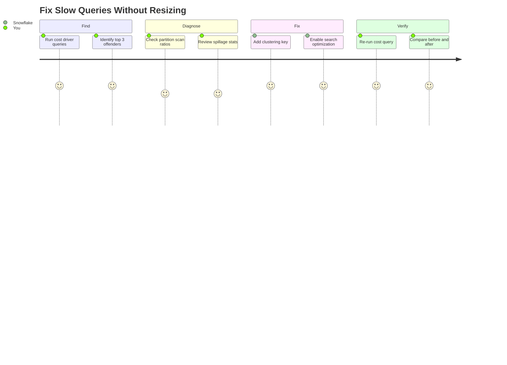

# Find Your Top 3 Cost Drivers

> [!CAUTION]
> **No support provided.** This content is for reference only. Review and validate before applying to any production workflow.


**Pair-programmed by:** SE Community + Cortex Code
**Created:** 2026-03-17 | **Expires:** 2027-03-17 | **Status:** ACTIVE

> **FinOps Journey (4 of 4):** This guide addresses warehouse and query-level costs. For Cortex AI-specific cost governance, see [tool-cortex-cost-intelligence](../tool-cortex-cost-intelligence/). For REST API token billing, see [tool-cortex-rest-api-cost](../tool-cortex-rest-api-cost/).

Before you resize your warehouse, run this notebook. Most "slow query" problems are actually **pruning problems** -- Snowflake is scanning partitions it doesn't need.



**Time:** ~30 minutes | **Result:** Faster queries, lower costs, no warehouse resize

## Who This Is For

Anyone troubleshooting slow queries or high warehouse costs. You need access to `SNOWFLAKE.ACCOUNT_USAGE` views (typically `ACCOUNTADMIN` or a role with imported privileges on the `SNOWFLAKE` database).

**Already know your problem table?** Skip to Section 3 in the notebook for the fix templates.

---

## Quick Start

**Run in Snowsight:**
1. Upload `cost_drivers_workbook.ipynb` to Snowsight (Projects > Notebooks > Import)
2. Run cells sequentially to find your cost drivers
3. Apply fixes from Section 3

**Run with Cortex Code:**
```bash
bash <(curl -sL https://raw.githubusercontent.com/sfc-gh-miwhitaker/sfe-public/main/shared/get-project.sh) guide-cost-drivers
cd sfe-public/guide-cost-drivers && cortex
```
Then ask: *"Help me find why my queries are slow"*

---

## What You'll Learn

| Section | What You Find | What You Fix |
|---------|---------------|--------------|
| 1. Find | Top queries by time, spillage, queue | Know which queries to optimize |
| 2. Diagnose | Tables with poor pruning, missing clustering | Understand WHY queries are slow |
| 3. Fix | Clustering keys, Search Optimization, rewrites | Apply targeted fixes |
| 4. Verify | Before/after comparison | Prove the improvement |
| 5. Monitor | Weekly trend query | Catch regressions early |

---

## Key Insight

**Resizing the warehouse is usually the wrong answer.**

| Symptom | Wrong Fix | Right Fix |
|---------|-----------|-----------|
| Query scans 100% of partitions | Bigger warehouse | Add `CLUSTER BY` |
| Point lookups are slow | Bigger warehouse | Add `SEARCH OPTIMIZATION` |
| Query spills to disk | Bigger warehouse | Rewrite query to scan less data |
| Queue time is high | Multi-cluster warehouse | Optimize queries first, THEN scale |

The notebook walks you through diagnosing each symptom and applying the right fix.

---

## References

| Resource | URL |
|----------|-----|
| Clustering Keys | https://docs.snowflake.com/en/user-guide/tables-clustering-keys |
| Search Optimization Service | https://docs.snowflake.com/en/user-guide/search-optimization-service |
| Query Profile | https://docs.snowflake.com/en/user-guide/ui-query-profile |
| QUERY_HISTORY View | https://docs.snowflake.com/en/sql-reference/account-usage/query_history |
