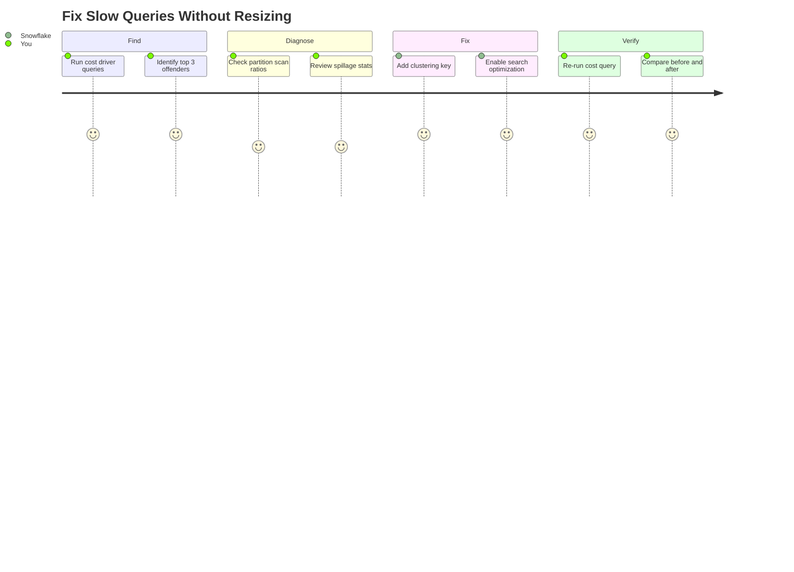

# Find Your Top 3 Cost Drivers

Inspired by the question every Snowflake admin asks: *"My warehouse costs spiked -- should I resize it?"*

Before you resize your warehouse, run this notebook. Most "slow query" problems are actually **pruning problems** -- Snowflake is scanning partitions it doesn't need. This guide walks through diagnosing each symptom and applying the right fix: clustering keys, search optimization, or query rewrites -- not bigger compute.

**Pair-programmed by:** SE Community + Cortex Code
**Created:** 2026-03-17 | **Expires:** 2027-03-17 | **Status:** ACTIVE

> **No support provided.** This content is for reference only. Review and validate before applying to any production workflow.

> **FinOps Journey (4 of 4):** For Cortex AI cost governance, see [tool-cortex-cost-intelligence](../tool-cortex-cost-intelligence/). For REST API token billing, see [tool-cortex-rest-api-cost](../tool-cortex-rest-api-cost/).

**Time:** ~30 minutes | **Result:** Faster queries, lower costs, no warehouse resize

---

## Who This Is For

Anyone troubleshooting slow queries or high warehouse costs. You need access to `SNOWFLAKE.ACCOUNT_USAGE` views (typically `ACCOUNTADMIN`).

---

## The Approach



| Section | What You Find | What You Fix |
|---------|---------------|--------------|
| 1. Find | Top queries by time, spillage, queue | Know which queries to optimize |
| 2. Diagnose | Tables with poor pruning | Understand WHY queries are slow |
| 3. Fix | Clustering keys, Search Optimization, rewrites | Apply targeted fixes |
| 4. Verify | Before/after comparison | Prove the improvement |
| 5. Monitor | Weekly trend query | Catch regressions early |

> [!TIP]
> **Core insight:** Resizing the warehouse is usually the wrong answer.
>
> | Symptom | Wrong Fix | Right Fix |
> |---------|-----------|-----------|
> | Scans 100% of partitions | Bigger warehouse | Add `CLUSTER BY` |
> | Point lookups are slow | Bigger warehouse | Add `SEARCH OPTIMIZATION` |
> | Spills to disk | Bigger warehouse | Rewrite query to scan less |
> | Queue time is high | Multi-cluster warehouse | Optimize queries first |

---

## Quick Start

1. Upload `cost_drivers_workbook.ipynb` to Snowsight (**Projects > Notebooks > Import**)
2. Run cells sequentially to find your cost drivers
3. Apply fixes from Section 3

```bash
bash <(curl -sL https://raw.githubusercontent.com/sfc-gh-miwhitaker/sfe-public/main/shared/get-project.sh) guide-cost-drivers
cd sfe-public/guide-cost-drivers && cortex
```

Then ask: *"Help me find why my queries are slow"*

---

## References

| Resource | URL |
|----------|-----|
| Clustering Keys | https://docs.snowflake.com/en/user-guide/tables-clustering-keys |
| Search Optimization Service | https://docs.snowflake.com/en/user-guide/search-optimization-service |
| Query Profile | https://docs.snowflake.com/en/user-guide/ui-query-profile |
| QUERY_HISTORY View | https://docs.snowflake.com/en/sql-reference/account-usage/query_history |
