# Data Quality Governance Guide

> [!CAUTION]
> **No support provided.** This content is for reference only. Review and validate before applying to any production workflow.


**Pair-programmed by:** SE Community + Cortex Code
**Created:** 2026-03-23 | **Expires:** 2027-03-23 | **Status:** ACTIVE

Reusable patterns for data quality governance using Snowflake-native features: Data Metric Functions, object tagging, tag-based masking, anomaly detection, and the Snowsight Data Quality UI. All patterns in this guide are extracted from working demos in this repository.

```mermaid
flowchart LR
  subgraph ingest [Ingest]
    LoadData[COPY INTO / Snowpipe]
    RawTable[RAW Tables]
  end

  subgraph quality [Quality Gates]
    DMF[Data Metric Functions]
    Expectations[Expectations]
    AnomalyDetect[Anomaly Detection]
  end

  subgraph govern [Governance]
    Tags[Object Tags]
    Masking[Tag-Based Masking]
    Notifications[DQ Notifications]
  end

  subgraph observe [Observe]
    DQMonitor[Snowsight Data Quality UI]
    Streamlit[Streamlit Dashboard]
    Alerts[Email Alerts]
  end

  ingest --> quality --> govern --> observe
```



**Time:** ~20 minutes to read | **Result:** Governance patterns you can apply to any table in your account

## Who This Is For

Data engineers and platform teams who want to add automated quality monitoring and governance to existing tables. You should be comfortable writing SQL in Snowsight. No prior experience with DMFs or tagging is required.

**Already have DMFs deployed?** Skip to [Part 3](#part-3-object-tagging-for-governance) for tagging patterns or [Part 5](#part-5-anomaly-detection) for ML-powered anomaly detection.

---

## Part 1: Data Metric Functions (DMFs)

DMFs are SQL functions that Snowflake evaluates automatically against your tables. They run on a schedule you control and report results through the Snowsight Data Quality UI.

### System DMFs

Snowflake provides built-in DMFs in the `SNOWFLAKE.CORE` schema:

```sql
ALTER TABLE MY_SCHEMA.MY_TABLE ADD DATA METRIC FUNCTION
    SNOWFLAKE.CORE.NULL_COUNT ON (customer_id)
    EXPECTATION no_null_customers (VALUE = 0);

ALTER TABLE MY_SCHEMA.MY_TABLE ADD DATA METRIC FUNCTION
    SNOWFLAKE.CORE.FRESHNESS ON (updated_at)
    ANOMALY_DETECTION = TRUE;

ALTER TABLE MY_SCHEMA.MY_TABLE ADD DATA METRIC FUNCTION
    SNOWFLAKE.CORE.ROW_COUNT ON ()
    EXPECTATION min_row_count (VALUE > 0)
    ANOMALY_DETECTION = TRUE;
```

### Custom DMFs

Write custom checks for business-specific rules:

```sql
CREATE OR REPLACE DATA METRIC FUNCTION DMF_METRIC_VALUE_VALID_PCT (
    t TABLE (metric_value FLOAT)
)
RETURNS NUMBER
COMMENT = 'Metric value validity percent -- values between 0 and 100'
AS
$$
  SELECT ROUND(
    100 * (COUNT_IF(t.metric_value BETWEEN 0 AND 100) / NULLIF(COUNT(*), 0)),
    2
  )
  FROM t
$$;

ALTER TABLE MY_SCHEMA.MY_TABLE
    ADD DATA METRIC FUNCTION DMF_METRIC_VALUE_VALID_PCT ON (metric_value)
    EXPECTATION validity_threshold (VALUE >= 90);
```

### Foreign Key Checks

DMFs can validate referential integrity across tables:

```sql
CREATE OR REPLACE DATA METRIC FUNCTION DMF_FK_CHECK(
    arg_t1 TABLE(arg_c1 VARCHAR),
    arg_t2 TABLE(arg_c2 VARCHAR)
)
RETURNS NUMBER
COMMENT = 'Count of orphaned foreign key references'
AS
$$
    SELECT COUNT(*)
    FROM arg_t1
    WHERE arg_c1 IS NOT NULL
      AND arg_c1 NOT IN (SELECT arg_c2 FROM arg_t2 WHERE arg_c2 IS NOT NULL)
$$;

ALTER TABLE STG_INVOICE ADD DATA METRIC FUNCTION
    DMF_FK_CHECK ON (customer_id, TABLE STG_CUSTOMER(customer_id))
    EXPECTATION no_orphan_invoices (VALUE = 0);
```

---

## Part 2: Scheduling DMFs

### TRIGGER_ON_CHANGES (Recommended for Most Cases)

Runs DMFs only when the table data changes -- avoids unnecessary compute:

```sql
ALTER TABLE MY_SCHEMA.MY_TABLE
    SET DATA_METRIC_SCHEDULE = 'TRIGGER_ON_CHANGES';
```

### Cron Schedule

For tables with predictable update cadence:

```sql
ALTER TABLE MY_SCHEMA.MY_TABLE
    SET DATA_METRIC_SCHEDULE = 'USING CRON 0 * * * * UTC';
```

### When to Use Which

| Schedule | Best For |
|---|---|
| `TRIGGER_ON_CHANGES` | Tables updated by streams, tasks, or Dynamic Tables |
| `USING CRON` | Tables loaded on a known cadence (hourly, daily) |

Allow ~10 minutes after first setting a schedule for initial DMF results to populate.

---

## Part 3: Object Tagging for Governance

Tags classify tables and columns with business metadata. They enable policy-based governance at scale.

### Create Tags with Allowed Values

```sql
CREATE OR REPLACE TAG DATA_DOMAIN
    ALLOWED_VALUES 'PERFORMANCE', 'ENGAGEMENT', 'QUALITY_METRICS'
    COMMENT = 'Business domain classification for tables and columns';

CREATE OR REPLACE TAG DATA_SENSITIVITY
    ALLOWED_VALUES 'PUBLIC', 'INTERNAL', 'CONFIDENTIAL'
    COMMENT = 'Column-level sensitivity classification';

CREATE OR REPLACE TAG DATA_QUALITY_TIER
    ALLOWED_VALUES 'RAW', 'VALIDATED', 'CURATED'
    COMMENT = 'Data quality tier for tables and views';
```

### Apply Tags to Tables and Columns

```sql
ALTER TABLE RAW_ATHLETE_PERFORMANCE SET TAG
    DATA_DOMAIN = 'PERFORMANCE',
    DATA_QUALITY_TIER = 'RAW';

ALTER TABLE RAW_ATHLETE_PERFORMANCE ALTER COLUMN athlete_id
    SET TAG DATA_SENSITIVITY = 'CONFIDENTIAL';
```

### Query Tag Coverage

Use `TAG_REFERENCES` to audit which objects are tagged:

```sql
SELECT
    tag_name,
    tag_value,
    object_name,
    column_name
FROM TABLE(INFORMATION_SCHEMA.TAG_REFERENCES('MY_SCHEMA.MY_TABLE', 'TABLE'))
ORDER BY tag_name, column_name;
```

---

## Part 4: Tag-Based Masking

Combine tags with masking policies so that governance follows the metadata -- no need to apply masking policies individually to each column.

### Create a Masking Policy

```sql
CREATE OR REPLACE MASKING POLICY CONFIDENTIAL_STRING_MASK AS (val STRING)
RETURNS STRING ->
    CASE
        WHEN IS_ROLE_IN_SESSION('ACCOUNTADMIN') THEN val
        WHEN SYSTEM$GET_TAG_ON_CURRENT_COLUMN('MY_SCHEMA.DATA_SENSITIVITY') = 'CONFIDENTIAL'
            THEN '***MASKED***'
        ELSE val
    END;
```

### Assign Policy to Tag

Every column tagged `CONFIDENTIAL` is automatically masked:

```sql
ALTER TAG DATA_SENSITIVITY SET MASKING POLICY CONFIDENTIAL_STRING_MASK;
```

### Teardown Order

When cleaning up, you must unset the masking policy from the tag before dropping either:

```sql
ALTER TAG DATA_SENSITIVITY UNSET MASKING POLICY CONFIDENTIAL_STRING_MASK;
DROP MASKING POLICY IF EXISTS CONFIDENTIAL_STRING_MASK;
DROP TAG IF EXISTS DATA_SENSITIVITY;
```

---

## Part 5: Anomaly Detection

Snowflake's ML-powered anomaly detection works with DMFs. Enable it on metrics where you want automatic outlier detection:

```sql
ALTER TABLE MY_SCHEMA.MY_TABLE ADD DATA METRIC FUNCTION
    SNOWFLAKE.CORE.FRESHNESS ON (updated_at)
    ANOMALY_DETECTION = TRUE;

ALTER TABLE MY_SCHEMA.MY_TABLE ADD DATA METRIC FUNCTION
    SNOWFLAKE.CORE.ROW_COUNT ON ()
    ANOMALY_DETECTION = TRUE;
```

### Check Anomaly Status

```sql
SELECT *
FROM TABLE(SNOWFLAKE.LOCAL.DATA_QUALITY_MONITORING_ANOMALY_DETECTION_STATUS);
```

### View Monitoring Results

```sql
SELECT
    scheduled_time,
    measurement_time,
    metric_name,
    value
FROM TABLE(SNOWFLAKE.LOCAL.DATA_QUALITY_MONITORING_RESULTS(
    REF_ENTITY_NAME  => 'MY_SCHEMA.MY_TABLE',
    REF_ENTITY_DOMAIN => 'TABLE'
))
ORDER BY scheduled_time DESC;
```

### On-Demand Evaluation

Run expectations immediately without waiting for the schedule:

```sql
SELECT *
FROM TABLE(SYSTEM$EVALUATE_DATA_QUALITY_EXPECTATIONS(
    REF_ENTITY_NAME => 'MY_SCHEMA.MY_TABLE'
));
```

---

## Part 6: Notifications

Get alerted when quality expectations fail or anomalies are detected.

### Set Up Email Notifications

```sql
CREATE OR REPLACE NOTIFICATION INTEGRATION SFE_DQ_EMAIL_INT
    TYPE = EMAIL
    ENABLED = TRUE
    ALLOWED_RECIPIENTS = ('team@example.com');
```

### Enable Database-Level DQ Monitoring

```sql
ALTER DATABASE MY_DATABASE SET DATA_QUALITY_MONITORING_SETTINGS =
$$
notification:
  enabled: TRUE
  integrations:
    - SFE_DQ_EMAIL_INT
  metadata_included: TRUE
$$;
```

This sends notifications for all DMF violations and anomalies detected across the database.

---

## Governance Strategy Decision Tree

| Question | Recommendation |
|---|---|
| "How do I check for NULLs?" | System DMF: `SNOWFLAKE.CORE.NULL_COUNT` with `EXPECTATION (VALUE = 0)` |
| "How do I check referential integrity?" | Custom DMF: `DMF_FK_CHECK` pattern (Part 1) |
| "When should DMFs run?" | `TRIGGER_ON_CHANGES` unless you have a known load cadence |
| "How do I classify sensitive data?" | Object tags: `DATA_SENSITIVITY` with `ALLOWED_VALUES` |
| "How do I mask sensitive columns?" | Tag-based masking: assign policy to tag, not individual columns |
| "How do I detect unexpected changes?" | `ANOMALY_DETECTION = TRUE` on FRESHNESS and ROW_COUNT |
| "How do I get alerted?" | Notification integration + database-level monitoring settings |

---

## Related Projects

- [`demo-dataquality-metrics`](../demo-dataquality-metrics/) -- Full deployable demo with DMFs, tagging, masking, and Streamlit dashboard
- [`demo-api-quickbooks-medallion`](../demo-api-quickbooks-medallion/) -- Medallion architecture with system DMFs, custom DMFs, anomaly detection, and Cortex AI anomaly analysis
- [`guide-csv-import`](../guide-csv-import/) -- Data loading fundamentals (prerequisite for quality monitoring)
