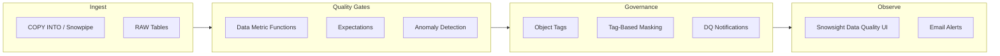

# Data Quality Governance Guide

Inspired by the question every data platform team asks: *"How do I know when bad data lands in my tables -- and enforce governance automatically?"*

Reusable patterns for data quality governance using Snowflake-native features: Data Metric Functions (system + custom), object tagging with allowed values, tag-based masking, ML-powered anomaly detection, and notification integrations. Every pattern is extracted from working demos in this repository and ready to apply to any table in your account.

**Pair-programmed by:** SE Community + Cortex Code
**Created:** 2026-03-23 | **Expires:** 2026-05-22 | **Status:** ACTIVE

> **No support provided.** This content is for reference only. Review and validate before applying to any production workflow.

**Time:** ~20 minutes to read | **Result:** Governance patterns for any table

---

## Who This Is For

Data engineers and platform teams who want to add automated quality monitoring and governance to existing tables. Comfortable with SQL. No prior DMF or tagging experience required.

**Already have DMFs deployed?** Skip to [Part 3](#part-3-object-tagging-for-governance) for tagging or [Part 5](#part-5-anomaly-detection) for ML-powered anomaly detection.

---

## The Approach



| Part | What It Covers |
|------|---------------|
| [Part 1: Data Metric Functions](#part-1-data-metric-functions-dmfs) | System DMFs, custom DMFs, FK checks |
| [Part 2: Scheduling DMFs](#part-2-scheduling-dmfs) | TRIGGER_ON_CHANGES vs cron |
| [Part 3: Object Tagging](#part-3-object-tagging-for-governance) | Tags with ALLOWED_VALUES for classification |
| [Part 4: Tag-Based Masking](#part-4-tag-based-masking) | Masking policy attached to tags |
| [Part 5: Anomaly Detection](#part-5-anomaly-detection) | ML-powered outlier detection on DMFs |
| [Part 6: Notifications](#part-6-notifications) | Email alerts on quality failures |

> [!TIP]
> **Core insight:** Attach governance to metadata (tags), not individual objects. Tag a column as CONFIDENTIAL and masking follows automatically across every table.

---

## Part 1: Data Metric Functions (DMFs)

```sql
ALTER TABLE MY_TABLE ADD DATA METRIC FUNCTION
    SNOWFLAKE.CORE.NULL_COUNT ON (customer_id)
    EXPECTATION no_null_customers (VALUE = 0);

CREATE DATA METRIC FUNCTION DMF_METRIC_VALUE_VALID_PCT(ref TABLE(metric_value FLOAT))
    RETURNS NUMBER AS
    'SELECT ROUND(100.0 * COUNT_IF(metric_value BETWEEN 0 AND 100) / NULLIF(COUNT(*), 0), 2)
     FROM TABLE(ref)';

CREATE DATA METRIC FUNCTION DMF_FK_CHECK(
    ref TABLE(parent_id NUMBER),
    parent_ref TABLE(id NUMBER)
)
    RETURNS NUMBER AS $$
    SELECT COUNT(*)
    FROM TABLE(ref) r
    LEFT JOIN TABLE(parent_ref) p ON r.parent_id = p.id
    WHERE p.id IS NULL
    $$;
```

## Part 2: Scheduling DMFs

```sql
ALTER TABLE MY_TABLE SET DATA_METRIC_SCHEDULE = 'TRIGGER_ON_CHANGES';
```

## Part 3: Object Tagging for Governance

```sql
CREATE TAG DATA_SENSITIVITY ALLOWED_VALUES 'PUBLIC', 'INTERNAL', 'CONFIDENTIAL';
ALTER TABLE MY_TABLE ALTER COLUMN ssn SET TAG DATA_SENSITIVITY = 'CONFIDENTIAL';
```

## Part 4: Tag-Based Masking

```sql
CREATE MASKING POLICY CONFIDENTIAL_STRING_MASK AS (val STRING) RETURNS STRING ->
    CASE WHEN IS_ROLE_IN_SESSION('ACCOUNTADMIN') THEN val
         WHEN SYSTEM$GET_TAG_ON_CURRENT_COLUMN('MY_SCHEMA.DATA_SENSITIVITY') = 'CONFIDENTIAL' THEN '***MASKED***'
         ELSE val END;

ALTER TAG DATA_SENSITIVITY SET MASKING POLICY CONFIDENTIAL_STRING_MASK;
```

## Part 5: Anomaly Detection

> [!NOTE]
> Anomaly detection is supported on `SNOWFLAKE.CORE.ROW_COUNT` and `SNOWFLAKE.CORE.FRESHNESS` only. Enabling it on custom DMFs or other system DMFs will fail.

```sql
ALTER TABLE MY_TABLE ADD DATA METRIC FUNCTION
    SNOWFLAKE.CORE.FRESHNESS ON (updated_at) ANOMALY_DETECTION = TRUE;
```

## Part 6: Notifications

Prerequisites: the database owner role needs `MANAGE DATA QUALITY` on the account and `USAGE` on the notification integration. Email recipients must be verified Snowflake account users.

```sql
GRANT MANAGE DATA QUALITY ON ACCOUNT TO ROLE MY_DB_OWNER_ROLE;

CREATE NOTIFICATION INTEGRATION SFE_DQ_EMAIL_INT TYPE = EMAIL ENABLED = TRUE
    ALLOWED_RECIPIENTS = ('team@example.com');

GRANT USAGE ON INTEGRATION SFE_DQ_EMAIL_INT TO ROLE MY_DB_OWNER_ROLE;

ALTER DATABASE MY_DATABASE SET DATA_QUALITY_MONITORING_SETTINGS = $$
notification:
  enabled: TRUE
  integrations:
    - SFE_DQ_EMAIL_INT
$$;
```

---

## Decision Tree

| Question | Recommendation |
|---|---|
| "Check for NULLs?" | System DMF: `SNOWFLAKE.CORE.NULL_COUNT` |
| "Referential integrity?" | Custom DMF: `DMF_FK_CHECK` (Part 1) |
| "When should DMFs run?" | `TRIGGER_ON_CHANGES` unless known load cadence |
| "Classify sensitive data?" | Object tags with `ALLOWED_VALUES` |
| "Mask sensitive columns?" | Tag-based masking (Part 4) |
| "Detect unexpected changes?" | `ANOMALY_DETECTION = TRUE` (ROW_COUNT and FRESHNESS only) |
| "Get alerted?" | Notification integration (Part 6) |

---

## Related Projects

- [`demo-dataquality-metrics`](../demo-dataquality-metrics/) -- Full deployable demo with DMFs, tagging, masking, and Streamlit
- [`demo-api-quickbooks-medallion`](../demo-api-quickbooks-medallion/) -- Medallion architecture with DMFs and anomaly detection
- [`guide-csv-import`](../guide-csv-import/) -- Data loading fundamentals (prerequisite)
