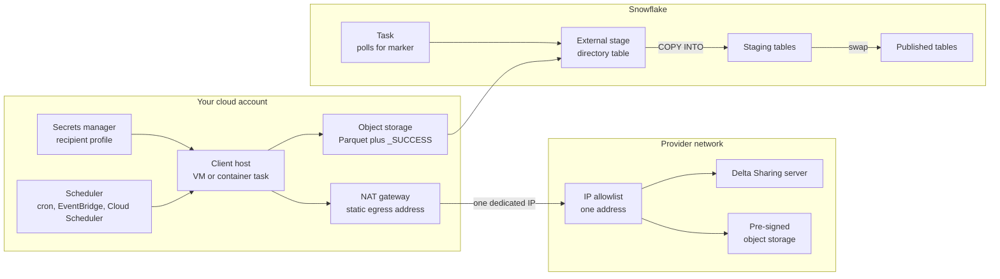
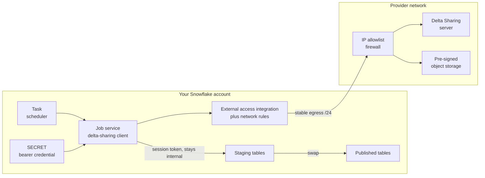

# Consuming a Delta Sharing Feed When the Provider Demands a Static IP

Your vendor delivers data through Databricks Delta Sharing. They will only accept requests from IP addresses you register with them in advance — typically one to three. You are a Snowflake shop. Snowflake's native way of reading that feed has no IP address you can register, so the simple path is closed by their policy.

This guide is about what to do then.

**Audience:** Snowflake account administrators and data engineers holding a vendor onboarding form that asks for "a list of IP addresses to whitelist", with no good answer to put in the field.

```text
Pair-programmed by SE Community + Cortex Code
```

**Created:** 2026-09-17 | **Expires:** 2026-12-16 | **Status:** ACTIVE

> **No support provided.** Reference only; validate before production use.

---

## Start Here

**The answer is almost certainly to run the Delta Sharing client in your own cloud account, behind a NAT gateway with a static IP, and land the output in Snowflake through an external stage.** That is [Section 1](#section-1-run-the-client-behind-your-own-static-ip-nat-gateway).

It is the only approach that gives the provider what they actually asked for: one address, that you control, permanently. Every other option requires them to agree to something they have not already agreed to.

Before you build it, spend a day on [Section 2](#section-2-first-try-the-questions-that-make-this-unnecessary). Four questions to the provider could collapse the whole thing into two SQL statements, and they cost nothing to ask.

### Why the simpler paths are usually closed

| Approach | Why it is probably not available to you |
| --- | --- |
| **Native Delta Sharing catalog integration** — two SQL statements, GA since 2026-07-21 | Snowflake documents no allowlistable egress IP for catalog integrations. There is no address to put on their form. Not a Snowflake limitation — their policy. Worth checking anyway: [Section 2](#section-2-first-try-the-questions-that-make-this-unnecessary) covers four questions that reopen it |
| **Databricks provider-to-provider sharing** — no token, no allowlist | Requires your own Databricks workspace with Unity Catalog. If you had one you would not be reading this. Still worth one internal question before building anything |
| **Delta Sharing client on Snowpark Container Services** — stays inside Snowflake | Does produce an allowlistable range, but it is a shared regional `/24`: 256 addresses, shared with every Snowflake account in your region. A provider asking for one to three addresses may simply refuse it. [Section 3](#section-3-the-spcs-alternative-only-if-the-provider-accepts-a-shared-24) |

If you arrived here from an earlier version of this guide, or from a conversation using letters: Path A was Databricks direct sharing, Path B the native catalog integration, Path C the SPCS client, and Path D — now Section 1 — the static-IP client.

### Two things to get right on day one, whichever path you take

**Submit two allowlist entries, not one.** The provider emails the credential as a download link, and that link is usually restricted by the same allowlist as the data. So the human who clicks it needs *their* corporate or VPN egress address registered, separately from whatever address your pipeline uses. Register only the pipeline's and the download fails before you can configure anything.

**Ask for the storage hostnames up front.** Delta Sharing does not stream data through the sharing endpoint. It returns short-lived pre-signed URLs pointing at the provider's object storage, on a **different hostname**. Both need to be reachable from wherever your client runs. The signature of missing this: listing the tables works, reading the data fails.

---

## Section 1: Run the Client Behind Your Own Static IP (NAT Gateway)

> **Directional.** The Snowflake-side load pattern here is ordinary external-stage work and is partly syntax-validated. The Delta Sharing client call, the cloud NAT and IAM configuration, and end-to-end connectivity through a provider firewall are **not validated** — that needs a live provider endpoint and a real allowlist entry. Cloud infrastructure is described at the shape level rather than as Terraform on purpose: the specifics vary enough per organisation that prescriptive IaC would be wrong more often than right. The [verification table](#what-was-verified-in-this-guide) states exactly what was checked and how.

Build this when the provider will not accept a shared range, or when your Snowflake account runs on GCP, where no allowlistable egress range exists at all. It gives them exactly what the form asked for: one address, that you control, permanently.

What it costs you is a small piece of infrastructure inside your own patching and monitoring scope, and a second scheduler. What it removes is any further dependency on the provider agreeing to anything, and the range-expiry treadmill described in [Section 4](#section-4-what-snowflakes-stable-egress-ips-actually-give-you). If you have not yet asked the provider the four questions in [Section 2](#section-2-first-try-the-questions-that-make-this-unnecessary), ask them before you build this — one of them may remove the work entirely.

### Shape of the solution



Two properties of this design are load-bearing.

**The client holds no Snowflake credentials.** It reads from the provider and writes files. Everything Snowflake-side is driven by Snowflake polling those files. That is what keeps the blast radius of a host in your own VPC small, and it is why the freshness logic sits where it does in Step 5.

**Orchestration splits across two schedulers.** Your cloud scheduler drives the pull; Snowflake drives the load. This is the one genuinely new failure surface compared with staying inside Snowflake, and Step 5 exists to stop the two from lying to each other.

### Step 1: The static address

Give the provider the **NAT gateway's address, not the client host's.** This is the whole design point — it lets you rebuild, resize, or replace the client without opening a vendor support case to change the allowlist.

| Cloud | Components |
| --- | --- |
| AWS | Client in a private subnet, NAT Gateway with an allocated Elastic IP |
| Azure | Client in a VNet subnet, NAT Gateway with a static Public IP |
| GCP | Client in a VPC subnet, Cloud NAT with a reserved static external IP |

Two things to get right before you submit the address:

- **Multi-AZ NAT means one address per zone.** A NAT gateway per availability zone is the resilient default, and each has its own address. Either pin the client to a single zone and register one address, or register all of them — a client that fails over to an unregistered zone produces an intermittent connection failure that looks like a provider outage.
- **Do not release the Elastic IP on teardown.** It is yours until you release it, and releasing it means a new support case. Tag it so nobody cleans it up.

### Step 2: Where the credential lives

The recipient profile goes in your cloud secrets manager, read by the client's instance role or workload identity. Read it at **start-up**, not build time, so a rotated provider token needs no redeploy.

Two provider-side facts to plan around:

- The credential file is typically downloadable **once**. Treat the download as the only chance; if it is mishandled, ask the provider to reissue and disable the old one.
- The download link is usually **IP-restricted on the same allowlist** — see the day-one note in [Start Here](#two-things-to-get-right-on-day-one-whichever-path-you-take).

### Step 3: The client

A single module: read the share, write Parquet, write a completion marker last. The marker is what Step 5 gates on, and the ordering here is what makes that safe — `mark_complete` is unreachable unless every table landed.

```python
"""Pull every table from a Delta Sharing share and land it as Parquet.

Runs in your own cloud account behind the static address the provider has
allowlisted. Deliberately holds no Snowflake credentials: it writes files, and
the Snowflake side decides what to load. Fails loudly, because a partial load
that looks successful is worse than a job that stops.
"""

import json
import logging
import os
import sys
import tempfile

import delta_sharing
import pandas as pd
import pyarrow as pa
import pyarrow.parquet as pq
import s3fs

LOG = logging.getLogger("delta-ingest")

SECRET_NAME = os.environ["SHARE_SECRET_NAME"]
SHARE_NAME = os.environ["SHARE_NAME"]
SCHEMA_IN_SHARE = os.environ["SCHEMA_IN_SHARE"]
BUCKET = os.environ["LANDING_BUCKET"]
PREFIX = os.environ["LANDING_PREFIX"]
INFO_TABLE = os.getenv("INFO_TABLE", "_info")
INFO_DATE_COLUMN = os.getenv("INFO_DATE_COLUMN", "execution_date")


def configure_logging() -> None:
    handler = logging.StreamHandler(sys.stdout)
    handler.setFormatter(logging.Formatter("%(name)s - %(levelname)s - %(message)s"))
    LOG.addHandler(handler)
    LOG.setLevel(logging.INFO)


def read_secret(name: str) -> str:
    """Fetch the recipient profile JSON from your cloud secrets manager.

    The one deliberately cloud-specific seam in this module: boto3
    secretsmanager, Azure Key Vault, or GCP Secret Manager all fit here.
    """
    raise NotImplementedError("Wire this to your secrets manager")


def profile_path() -> str:
    """Materialise the recipient profile where the delta-sharing client wants it.

    The client takes a file path, not a dict, so the secret is copied to a temp
    file scoped to this process.
    """
    profile = json.loads(read_secret(SECRET_NAME))

    required = {"shareCredentialsVersion", "bearerToken", "endpoint"}
    missing = required - profile.keys()
    if missing:
        raise ValueError(f"Recipient profile is missing required keys: {sorted(missing)}")

    handle_fd, path = tempfile.mkstemp(suffix=".share")
    with os.fdopen(handle_fd, "w", encoding="utf-8") as out:
        json.dump(profile, out)
    return path


def feed_date_from_marker(share_profile: str):
    """Read the provider's own refresh date from the share.

    Read through the sharing client rather than from anything already landed: a
    check against landed data cannot run before the first load.
    """
    marker_url = f"{share_profile}#{SHARE_NAME}.{SCHEMA_IN_SHARE}.{INFO_TABLE}"
    marker = delta_sharing.load_as_pandas(marker_url)
    if marker.empty:
        raise RuntimeError(f"Provider marker table {INFO_TABLE} is empty; cannot date this feed.")
    return pd.to_datetime(marker[INFO_DATE_COLUMN]).max().date()


def write_table(fs, frame, table_name: str, feed_date) -> None:
    """Write one share table as Parquet under a date-partitioned prefix.

    Partitioning by feed date means a failed run never overwrites the last good
    one, and the Snowflake side can COPY a single complete prefix.
    """
    target = f"{BUCKET}/{PREFIX}/feed_date={feed_date}/{table_name.upper()}.parquet"
    with fs.open(target, "wb") as handle:
        pq.write_table(pa.Table.from_pandas(frame, preserve_index=False), handle)


def mark_complete(fs, feed_date, table_count: int) -> None:
    """Write the marker Snowflake polls for. Must be the last write."""
    target = f"{BUCKET}/{PREFIX}/feed_date={feed_date}/_SUCCESS"
    with fs.open(target, "wb") as handle:
        handle.write(f"{table_count}".encode("utf-8"))


def ingest() -> None:
    configure_logging()
    share_profile = profile_path()
    client = delta_sharing.SharingClient(share_profile)

    tables = [
        table
        for table in client.list_all_tables()
        if table.share == SHARE_NAME
        and table.schema == SCHEMA_IN_SHARE
        and not table.name.startswith("_")
    ]
    if not tables:
        raise RuntimeError(
            f"No tables found in share '{SHARE_NAME}' schema '{SCHEMA_IN_SHARE}'. "
            "Check the share name, the schema name, and that the bearer token has not expired."
        )

    feed_date = feed_date_from_marker(share_profile)
    LOG.info("Provider feed date %s, %d tables to land", feed_date, len(tables))

    fs = s3fs.S3FileSystem()
    failures = []

    for table in tables:
        url = f"{share_profile}#{table.share}.{table.schema}.{table.name}"
        try:
            frame = delta_sharing.load_as_pandas(url)
            write_table(fs, frame, table.name, feed_date)
            LOG.info("Landed %s: %d rows", table.name, len(frame))
        except Exception as exc:  # noqa: BLE001 - collect and re-raise together
            LOG.error("Table %s failed: %s", table.name, exc)
            failures.append(table.name)

    if failures:
        # No marker on partial success. Its absence is what stops Snowflake from
        # publishing a half-landed feed, and it leaves the date free to retry.
        raise RuntimeError(f"Ingest failed for {len(failures)} tables: {failures}")

    mark_complete(fs, feed_date, len(tables))
    LOG.info("Landed %d tables for %s", len(tables), feed_date)


if __name__ == "__main__":
    ingest()
```

Three deliberate choices worth keeping if you rewrite this:

- **Filter leading-underscore tables out of the load loop.** `_info` and `_refresh_time` are control tables, not data.
- **Collect failures and raise once**, rather than aborting on the first one. You learn everything broken in a single run.
- **Never write the marker in a `finally`.** Its whole purpose is to be absent when something failed.

Run it on whatever your organisation already operates — a scheduled ECS or Cloud Run task, a Container App job, or a small VM with cron. The pull is a short daily batch, so a task that exits beats a VM that idles.

### Step 4: Landing in Snowflake

Nothing here is Delta-specific; it is the standard external-stage pattern.

```sql
USE ROLE ACCOUNTADMIN;

CREATE DATABASE IF NOT EXISTS DELTA_FEED;
CREATE SCHEMA IF NOT EXISTS DELTA_FEED.INGEST;
CREATE SCHEMA IF NOT EXISTS DELTA_FEED.PUBLISHED;

-- The Task in Step 5 runs the load SQL. Smallest size that comfortably handles
-- the widest table in the feed; a daily batch does not need more.
CREATE WAREHOUSE IF NOT EXISTS DELTA_FEED_WH
  WAREHOUSE_SIZE = XSMALL
  AUTO_SUSPEND = 60
  INITIALLY_SUSPENDED = TRUE
  STATEMENT_TIMEOUT_IN_SECONDS = 3600;

CREATE OR REPLACE STORAGE INTEGRATION DELTA_FEED_STAGE_INT
  TYPE = EXTERNAL_STAGE
  STORAGE_PROVIDER = 'S3'
  ENABLED = TRUE
  STORAGE_AWS_ROLE_ARN = '<arn_of_role_snowflake_will_assume>'
  STORAGE_ALLOWED_LOCATIONS = ('s3://<landing_bucket>/<prefix>/');

-- Retrieve STORAGE_AWS_IAM_USER_ARN and STORAGE_AWS_EXTERNAL_ID, then add them
-- to the trust policy of the role above. The integration does not work until
-- this round trip is complete, and the failure mode is an opaque access denial.
DESC INTEGRATION DELTA_FEED_STAGE_INT;
```

```sql
CREATE OR REPLACE STAGE DELTA_FEED.INGEST.PROVIDER_LANDING
  STORAGE_INTEGRATION = DELTA_FEED_STAGE_INT
  URL = 's3://<landing_bucket>/<prefix>/'
  DIRECTORY = (ENABLE = TRUE)
  FILE_FORMAT = (TYPE = PARQUET);
```

The audit table Step 5 gates on must exist before the first run:

```sql
CREATE TABLE IF NOT EXISTS DELTA_FEED.INGEST.LOAD_AUDIT (
    feed_execution_date DATE          NOT NULL,
    loaded_at           TIMESTAMP_LTZ NOT NULL,
    table_count         NUMBER
);
```

So must the staging and published tables, one pair per table in the share. Their columns come from the provider's schema, so this guide cannot write them for you — but the two must match, because `SWAP WITH` requires identical structures. The path of least effort is to let the first `COPY INTO` infer the shape, then clone it:

```sql
-- Derive the staging table from the Parquet the client already landed, rather
-- than hand-writing columns you will have to keep in sync with the provider.
CREATE OR REPLACE TABLE DELTA_FEED.INGEST.PATIENTS_STG
  USING TEMPLATE (
    SELECT ARRAY_AGG(OBJECT_CONSTRUCT(*))
    FROM TABLE(
      INFER_SCHEMA(
        LOCATION => '@DELTA_FEED.INGEST.PROVIDER_LANDING/feed_date=<feed_date>/',
        FILES    => ('PATIENTS.parquet'),
        FILE_FORMAT => 'DELTA_FEED.INGEST.PARQUET_FMT'
      )
    )
  );

-- The consumer-facing table must have the same structure for SWAP to work.
CREATE TABLE IF NOT EXISTS DELTA_FEED.PUBLISHED.PATIENTS
  LIKE DELTA_FEED.INGEST.PATIENTS_STG;
```

`INFER_SCHEMA` needs a named file format object rather than the inline one on the stage:

```sql
CREATE FILE FORMAT IF NOT EXISTS DELTA_FEED.INGEST.PARQUET_FMT TYPE = PARQUET;
```

Re-running the `CREATE OR REPLACE TABLE ... USING TEMPLATE` is also how you absorb a deliberate provider schema change — but do it knowingly, because it silently discards the old shape. See the `MATCH_BY_COLUMN_NAME` gotcha for why an *undeclared* schema change is the dangerous case.

```sql
-- TRUNCATE first, and not only for tidiness. Two failure modes need it:
--
--   1. SWAP exchanges contents, so after yesterday's publish this staging table
--      holds yesterday's published rows. COPY INTO appends -- without TRUNCATE
--      you publish yesterday's data plus today's, every day.
--   2. TRUNCATE also clears the table's load metadata. Without that, a retry
--      after a failed swap SKIPS the file as already-loaded, loads zero rows,
--      and republishes whatever was left in staging. Silently, with no error.
TRUNCATE TABLE DELTA_FEED.INGEST.PATIENTS_STG;

-- Column names come from the Parquet schema, so MATCH_BY_COLUMN_NAME avoids
-- restating them -- but see the gotchas: it NULL-fills on schema drift rather
-- than failing, so pair it with a post-load assertion on regulated feeds.
-- The trailing slash on the FROM path is load-bearing: FILES is concatenated
-- onto it. PURGE stays FALSE, because the landed files are your only record of
-- what the provider actually sent and are worth keeping for a dispute.
COPY INTO DELTA_FEED.INGEST.PATIENTS_STG
FROM @DELTA_FEED.INGEST.PROVIDER_LANDING/feed_date=<feed_date>/
FILES = ('PATIENTS.parquet')
MATCH_BY_COLUMN_NAME = CASE_INSENSITIVE
PURGE = FALSE;
```

Publish by swapping, never by loading in place. A full historical refresh arrives complete every day, so **never append** — you will duplicate the dataset daily — and **never truncate the table your consumers read**, or they see an empty table for the duration of the load.

```sql
-- Atomic from the reader's perspective, and instantly reversible.
ALTER TABLE DELTA_FEED.PUBLISHED.PATIENTS
  SWAP WITH DELTA_FEED.INGEST.PATIENTS_STG;
```

For a derived reporting layer on top, Dynamic Tables are the natural fit. Landing to native tables, as this design does, also sidesteps the Iceberg-on-Delta constraints you would hit reading the Delta files directly: tables created from Delta files predating the 2024_04 release bundle are not supported in Dynamic Tables, and streams on Delta-derived Iceberg tables with partition columns are not supported either.

### Step 5: Keep the two schedulers from lying to each other

The risk this design adds is Snowflake loading a prefix the client has not finished writing. Do not solve it with a time offset — "the client is usually done by 07:00" fails the first time the provider is slow.

Gate on the `_SUCCESS` marker the client writes last. The stage's directory table makes it visible to SQL:

```sql
ALTER STAGE DELTA_FEED.INGEST.PROVIDER_LANDING REFRESH;

-- Complete, unloaded feed dates. The marker is written only after every table has
-- landed, so its presence is the signal that the prefix is safe to COPY.
--
-- Three deliberate choices here:
--   ENDSWITH, not LIKE '%/_SUCCESS' -- underscore is a single-character wildcard
--     in LIKE, so that pattern also matches a stray '/XSUCCESS' and would load a
--     prefix the client never finished writing.
--   TRY_TO_DATE with an anchored [0-9]{4}-[0-9]{2}-[0-9]{2} pattern -- a hard
--     ::DATE cast on a looser [0-9-]+ lets one malformed prefix error the whole
--     query, which stops every feed until someone cleans the bucket. The explicit
--     character class is used rather than \d on purpose: backslash is an escape
--     character in Snowflake string literals, so the escaping is a trap in a
--     block people copy and paste.
--   NOT EXISTS against the audit ledger, not > MAX(date) -- a high-water mark
--     permanently hides a date the provider later re-publishes as a correction.
WITH complete_feeds AS (
    SELECT TRY_TO_DATE(
               REGEXP_SUBSTR(d.RELATIVE_PATH, 'feed_date=([0-9]{4}-[0-9]{2}-[0-9]{2})', 1, 1, 'e', 1),
               'YYYY-MM-DD'
           ) AS feed_date
    FROM DIRECTORY(@DELTA_FEED.INGEST.PROVIDER_LANDING) AS d
    WHERE ENDSWITH(d.RELATIVE_PATH, '/_SUCCESS')
)
SELECT c.feed_date
FROM complete_feeds AS c
WHERE c.feed_date IS NOT NULL
  AND NOT EXISTS (
      SELECT 1
      FROM DELTA_FEED.INGEST.LOAD_AUDIT AS a
      WHERE a.feed_execution_date = c.feed_date
  )
ORDER BY c.feed_date;
```

A Snowflake Task drives that query, then `TRUNCATE`, `COPY INTO`, the swap, and the audit insert. That is several statements, so the Task body needs a `BEGIN ... END` scripting block or a stored procedure.

The ordering inside the block is what makes a retry safe:

1. `TRUNCATE` the staging tables — this is what restores idempotency, for both reasons in the `COPY INTO` comment above.
2. `COPY INTO` each staging table.
3. Assert what you care about — at minimum a row count, and on a regulated feed a non-NULL count on a column you know must be populated.
4. Swap each table.
5. Insert the audit row **last**.

The audit insert goes last deliberately: no audit row means the gate re-offers the same date, which is what you want after any failure above it. Note that the swap itself is not atomic across multiple tables — a failure partway through step 4 leaves some tables at the new feed date and some at the previous one, and nothing detects that on its own. If mixed vintage across tables is unacceptable for your consumers, the only reliable fix is to publish through views you repoint after all swaps succeed.

Alternative if you would rather not poll: Snowpipe with auto-ingest on a storage notification. For a daily full refresh the polling Task is simpler to reason about and cheaper to debug, and it gives you one place to enforce the marker rule.

### The failure this gate does not catch

The gate fails closed, which is the right direction: a prefix with no marker is skipped. But that means a cloud-side scheduler that dies mid-run produces **silence, not an error** — Snowflake sees nothing new and reports success forever. Alert on it explicitly:

```sql
-- A feed-date prefix that has existed for hours with no completion marker means
-- the cloud-side client started and never finished. Nothing else surfaces this.
WITH prefixes AS (
    SELECT
        REGEXP_SUBSTR(d.RELATIVE_PATH, 'feed_date=([0-9]{4}-[0-9]{2}-[0-9]{2})', 1, 1, 'e', 1) AS feed_tag,
        MAX(d.LAST_MODIFIED) AS newest_file,
        COUNT_IF(ENDSWITH(d.RELATIVE_PATH, '/_SUCCESS')) AS marker_count
    FROM DIRECTORY(@DELTA_FEED.INGEST.PROVIDER_LANDING) AS d
    GROUP BY 1
)
SELECT p.feed_tag, p.newest_file
FROM prefixes AS p
WHERE p.feed_tag IS NOT NULL
  AND p.marker_count = 0
  AND p.newest_file < DATEADD('hour', -4, CURRENT_TIMESTAMP());
```

### Gotchas specific to this design

**Addressing and networking**

- **Register the NAT address, not the host address.** Registering the instance's own address couples the allowlist to a machine you will eventually replace.
- **Multi-AZ NAT has one address per zone.** Pin the client or register every zone.
- **The pre-signed storage hostnames still matter.** The client follows redirects to a second host, and your own security group and egress rules govern that. If you run a restrictive egress policy on the subnet, both hostnames need allowing there.
- **Cross-region egress is billable.** A landing bucket in a different region from your Snowflake account adds cloud egress charges on every load.

**Stage and integration**

- **The storage integration trust policy is a round trip.** `DESC INTEGRATION` after creation, then update the cloud role. Skipping it produces an access denial with nothing useful in the Snowflake error.
- **Re-running `CREATE OR REPLACE STORAGE INTEGRATION` can invalidate that trust policy.** The external ID is not guaranteed stable across a recreate. Prefer `CREATE ... IF NOT EXISTS` once it works, and re-run `DESC INTEGRATION` after any recreate. Confirm the current behaviour before relying on either reading.
- **A directory table does not refresh itself here.** The stage sets no `AUTO_REFRESH`, which defaults to false, so `ALTER STAGE ... REFRESH` before the gate query is required, not hygiene.

**Load semantics**

- **`TRUNCATE` before every `COPY INTO`.** It prevents both the append-onto-swapped-contents duplication and the skipped-file-on-retry silent failure.
- **`MATCH_BY_COLUMN_NAME` NULL-fills rather than failing.** If the provider renames or drops a column, the load succeeds and the column arrives entirely NULL. If the file is restructured wholesale you can load a full set of all-NULL rows and still succeed. Assert a row count and a non-NULL count before the swap, especially on regulated data.
- **Parquet plus `MATCH_BY_COLUMN_NAME` errors on empty string values.** An empty column value produces an error under `CASE_SENSITIVE` or `CASE_INSENSITIVE`. Plausible in a real provider feed.
- **`PURGE = TRUE` destroys your evidence.** The landed Parquet is the only record of what the provider actually sent. Keep it under a lifecycle policy instead.
- **The trailing slash on the `COPY INTO` path is load-bearing.** `FILES` is concatenated onto it, so dropping it produces `feed_date=XPATIENTS.parquet`. It fails loudly, but it is invisible in a diff.

**Marker and orchestration**

- **`ENDSWITH` is case-sensitive.** A client writing `_success` produces a feed that never loads and never errors. Keep the marker name identical on both sides.
- **Use `[0-9]`, not `\d`, in these regexes.** Backslash is an escape character in Snowflake string literals, so a pattern that looks right in a document can arrive at the regex engine meaning something else and silently match nothing. The character class has no such ambiguity. This one bit the guide itself.
- **The multi-table swap is not atomic.** Publish through repointed views if mixed vintage is unacceptable.
- **Insert the audit row last.** It is the only thing telling the gate a date is done; writing it before the swap means a failure mid-publish is never retried.
- **Refresh timestamps are UTC**, and a feed-level execution date overwritten by a later tier cannot tell you which tier you received. If the feed publishes in tiers, track them separately using per-table refresh timestamps.
- **Some tables refresh weekly, not daily.** Do not alert on staleness uniformly. Tables that are empty rather than absent are normal when the provider ships a schema for a module you do not license.

---

## Section 2: First, Try the Questions That Make This Unnecessary

Section 1 is a week of work and a standing operational obligation. Four questions to the provider, plus one internal question, could remove all of it. Ask them in a single message rather than sequentially — each costs nothing, and any one of them landing changes the design.

### The internal question

**Does your organisation already run a Databricks workspace with Unity Catalog?** If so, provider-to-provider direct sharing removes both the bearer token and the IP allowlist entirely, because providers scope it to your own environment. You would then land the data in Snowflake separately, or query it where it sits — a hop this guide does not cover.

If you had such a workspace you probably would not be reading this. But the question is cheap and occasionally the answer is yes, so confirm before building anything.

### The four provider questions

1. *Will you accept a Snowflake regional egress CIDR range on the allowlist?* It is a `/24`, it is published by Snowflake, and it rotates. Some providers will take it. A yes puts [Section 3](#section-3-the-spcs-alternative-only-if-the-provider-accepts-a-shared-24) on the table.
2. *Do you support OIDC token federation for Delta Sharing recipients?* Snowflake supports `TYPE = OIDC` for Delta Sharing catalog integrations, acting as the workload identity provider with short-lived JWTs. This eliminates the long-lived bearer token, which is often the thing the provider's security team actually cares about.
3. *Failing that, do you support OAuth2 client credentials?* Snowflake also supports `TYPE = OAUTH` for Delta Sharing, exchanging a client ID and secret at the provider's token endpoint for a short-lived access token. Ask this as a fallback to question 2 rather than instead of it: OIDC federation is something the provider has to build, whereas a provider who already runs an OAuth2 token endpoint for their other APIs may be able to issue you client credentials today. It still removes the long-lived bearer token, which is what question 4 turns on.
4. *Can IP allowlisting be waived for a recipient authenticating with federated identity or OAuth rather than a bearer token?* The allowlist exists to compensate for a credential that can be copied. Remove that credential and the compensating control has a weaker rationale. **This is the highest-value question on the list**, because a yes collapses everything into the two statements below.

There is a fifth, lower-odds option worth naming in the same message, with one caveat to check first. **Outbound private connectivity sidesteps IP allowlisting altogether**, and Snowflake documents it for catalog integrations — but the mechanism is `CATALOG_API_TYPE = PRIVATE` inside `REST_CONFIG`, and that parameter does not appear in the `CREATE CATALOG INTEGRATION (Delta Sharing)` syntax. The documented private-connectivity paths cover Iceberg REST, Open Catalog, Glue, S3 Tables, and Unity Catalog, not `CATALOG_SOURCE = DELTA_SHARING`. Confirm with Snowflake that it extends to Delta Sharing before you ask the provider for it — asking a vendor to provision an endpoint Snowflake cannot then consume is worse than not asking. If it does apply, it requires Business Critical edition or higher, Snowflake and the provider on the same cloud provider and region, and the provider to provision and approve a private endpoint.

If the provider's endpoint is not reachable by IP allowlisting at all — on-premises, hybrid, or a deny-all-inbound network where there is no public address to allow traffic *to* — then none of the above applies and [Data Connectivity Proxy](https://docs.snowflake.com/en/user-guide/data-connectivity-proxy) is the documented route. It is the inverse of this guide's problem: stable egress IPs answer "which address will Snowflake come from", whereas the proxy answers "there is no address for Snowflake to reach". Worth recognising which of the two you actually have before building either design.

### What you get if a question lands: the native catalog integration

Snowflake reads Delta Sharing natively. Consuming Delta Shares as a catalog-linked database reached general availability on 2026-07-21. It is genuinely two statements:

```sql
USE ROLE ACCOUNTADMIN;

CREATE OR REPLACE CATALOG INTEGRATION delta_share_int
  CATALOG_SOURCE = DELTA_SHARING
  TABLE_FORMAT = DELTA
  REST_CONFIG = (
    CATALOG_URI = '<endpoint_from_credential_file>'
    CATALOG_NAME = 'shares/<share_name>'
    ACCESS_DELEGATION_MODE = VENDED_CREDENTIALS
  )
  REST_AUTHENTICATION = (
    TYPE = BEARER
    BEARER_TOKEN = '<bearer_token_from_credential_file>'
  )
  ENABLED = TRUE;

CREATE OR REPLACE DATABASE delta_share_db
  LINKED_CATALOG = (
    CATALOG = delta_share_int
    ALLOWED_WRITE_OPERATIONS = 'NONE'
    SYNC_INTERVAL_SECONDS = 30
  );
```

Snowflake converts the Delta tables to Iceberg on the way in, and your masking policies, row access policies, and other governance controls apply to them exactly as they would to your own tables — so choosing this path costs you nothing in governance coverage. Verify before you build anything on top:

```sql
SELECT SYSTEM$VERIFY_CATALOG_INTEGRATION('delta_share_int');
SELECT SYSTEM$LIST_NAMESPACES_FROM_CATALOG('delta_share_int');
SELECT SYSTEM$LIST_ICEBERG_TABLES_FROM_CATALOG('delta_share_int', '<schema_in_share>');
```

If OIDC is on the table, only the authentication block changes:

```sql
CREATE OR REPLACE CATALOG INTEGRATION delta_share_int_oidc
  CATALOG_SOURCE = DELTA_SHARING
  TABLE_FORMAT = DELTA
  REST_CONFIG = (
    CATALOG_URI = '<recipient_endpoint>'
    CATALOG_NAME = 'shares/<share_name>'
    ACCESS_DELEGATION_MODE = VENDED_CREDENTIALS
  )
  REST_AUTHENTICATION = (
    TYPE = OIDC
    OIDC_AUDIENCE = '<audience_the_provider_expects>'
  )
  ENABLED = TRUE;
```

Then hand the provider the federation identity values so they can configure their recipient policy:

```sql
DESC CATALOG INTEGRATION delta_share_int_oidc;
-- Provide WORKLOAD_IDENTITY_FEDERATION_ISSUER and
-- WORKLOAD_IDENTITY_FEDERATION_SUBJECT to the provider, along with the
-- audience value above. All three must match their policy exactly.
```

If the provider offers OAuth2 client credentials instead, the authentication block is again the only change. Snowflake exchanges the client ID and secret at their token endpoint for a short-lived access token:

```sql
CREATE OR REPLACE CATALOG INTEGRATION delta_share_int_oauth
  CATALOG_SOURCE = DELTA_SHARING
  TABLE_FORMAT = DELTA
  REST_CONFIG = (
    CATALOG_URI = '<recipient_endpoint>'
    CATALOG_NAME = 'shares/<share_name>'
    ACCESS_DELEGATION_MODE = VENDED_CREDENTIALS
  )
  REST_AUTHENTICATION = (
    TYPE = OAUTH
    OAUTH_CLIENT_ID = '<oauth_client_id>'
    OAUTH_CLIENT_SECRET = '<oauth_client_secret>'
    OAUTH_TOKEN_URI = 'https://<token_server_uri>'
  )
  ENABLED = TRUE;
```

Note that `CATALOG_NAME` also accepts the bare share name without the `shares/` prefix, so a provider who hands you only a share name has not given you something malformed.

### The failure mode that makes the native path look broken

`ACCESS_DELEGATION_MODE = VENDED_CREDENTIALS` is the only access delegation mode Delta Sharing supports, and it depends on the provider's server exposing a `/temporary-table-credentials` endpoint. **Servers implementing version 1 of the Delta Sharing protocol do not have that endpoint.** Against one of those, credential vending fails and the shared tables arrive as uninitialized placeholders you cannot query — the catalog integration verifies, the namespaces list, and the data is unreachable.

Check for this before you conclude the native path is unavailable, because it is a plausible shape for exactly the kind of provider this guide is about: a vendor whose onboarding is a form and a support case is not necessarily running a current server. The documented workaround is to drop credential vending and give Snowflake direct storage access through an external volume instead:

```sql
-- Note the absence of ACCESS_DELEGATION_MODE. Any of the three
-- authentication types works here; BEARER is shown for brevity.
CREATE OR REPLACE CATALOG INTEGRATION delta_share_int_ext_vol
  CATALOG_SOURCE = DELTA_SHARING
  TABLE_FORMAT = DELTA
  REST_CONFIG = (
    CATALOG_URI = '<recipient_endpoint>'
    CATALOG_NAME = 'shares/<share_name>'
  )
  REST_AUTHENTICATION = (
    TYPE = BEARER
    BEARER_TOKEN = '<bearer_token_from_credential_file>'
  )
  ENABLED = TRUE;

-- Delta Sharing tables are read-only in Snowflake, so this volume never
-- needs write access. STORAGE_BASE_URL is the provider's storage location
-- backing the share -- ask them for it, or read it from the base location
-- the sharing server returns.
CREATE OR REPLACE EXTERNAL VOLUME delta_share_ext_vol
  STORAGE_LOCATIONS = (
    (
      NAME = 'provider-share-storage'
      STORAGE_PROVIDER = 'S3'
      STORAGE_BASE_URL = 's3://<provider_bucket>/'
      STORAGE_AWS_ROLE_ARN = '<arn_of_role_snowflake_will_assume>'
      STORAGE_AWS_EXTERNAL_ID = '<external_id>'
    )
  )
  ALLOW_WRITES = FALSE;

CREATE OR REPLACE DATABASE delta_share_db
  LINKED_CATALOG = (
    CATALOG = delta_share_int_ext_vol
    ALLOWED_WRITE_OPERATIONS = 'NONE'
    SYNC_INTERVAL_SECONDS = 30
  )
  EXTERNAL_VOLUME = 'delta_share_ext_vol';
```

Raise this one with the provider early, because it changes the conversation you are having with them. Vended credentials mean Snowflake only ever talks to the sharing endpoint; an external volume means Snowflake reads their object storage directly, using a role **they** have to trust. That is a different ask than an IP allowlist entry, and for some providers it is an easier one.

### Why this is blocked by default

`SYSTEM$GET_SNOWFLAKE_EGRESS_IP_RANGES` documents exactly three supported uses:

1. External access from UDFs and stored procedures
2. **Snowpark Container Services external access**, and Openflow on SPCS
3. Snowflake Git integration with IP-restricted Git servers

Catalog integrations are not on that list. There is no documented, allowlistable CIDR range you can hand the provider for the traffic this integration generates — which is why an IP allowlist closes this path, and why the four questions above are aimed at removing the allowlist rather than satisfying it.

---

## Section 3: The SPCS Alternative (Only If the Provider Accepts a Shared /24)

This is the design to build **only if the provider confirmed they will accept a shared regional `/24`** — question 1 in [Section 2](#section-2-first-try-the-questions-that-make-this-unnecessary). It keeps everything inside Snowflake, which is its real attraction: no VPC, no NAT gateway, no client host to patch, one scheduler instead of two.

What it costs you is a provider dependency and a recurring obligation. The range it produces is shared and it expires, and there is no API on the provider's side to update. Read [Section 4](#section-4-what-snowflakes-stable-egress-ips-actually-give-you) before you promise your security team anything.

### First: confirm your account can produce a range at all

Stable egress IPs are not uniformly available, and this determines whether this design is viable before anything else about it matters.

| Cloud | Stable egress IP status | Implication |
| --- | --- | --- |
| **AWS commercial** | Generally available | Works as documented |
| **Azure** | **Preview** | Works, with preview caveats; output format differs — see [Azure output](#azure-output-has-an-extra-field-that-matters) |
| **GCP** | Not documented as supported | **This design produces no allowlistable IP.** Use the static-IP design in [Section 1](#section-1-run-the-client-behind-your-own-static-ip-nat-gateway) |

```sql
SELECT
    t.VALUE:ipv4_prefix::VARCHAR  AS cidr,
    t.VALUE:effective::TIMESTAMP  AS effective_from,
    t.VALUE:expires::TIMESTAMP    AS expires_at
FROM TABLE(FLATTEN(input => PARSE_JSON(SYSTEM$GET_SNOWFLAKE_EGRESS_IP_RANGES()))) AS t
ORDER BY expires_at;
```

An empty result or an error means this account cannot supply a stable egress range, and this design is not viable as written.

### Shape of the solution



Two things about this diagram are load-bearing.

**The write side needs no egress.** The container authenticates back to Snowflake using the OAuth token Snowflake mounts at `/snowflake/session/token` plus the `SNOWFLAKE_HOST` environment variable. That traffic never leaves the Snowflake network, so it needs no external access integration and no firewall consideration. Only the read from the provider goes out through the allowlisted range.

**The provider hands back a second hostname.** Delta Sharing does not stream data through the sharing endpoint. It returns short-lived pre-signed URLs pointing at the provider's object storage, which is a **different hostname**. SPCS network rules require full hostnames and **do not support wildcards**, so both the sharing endpoint and every storage hostname must be enumerated in your rules. Get these from the provider during onboarding. This is the single most common reason a first attempt fails with an opaque network error after the catalog listing already worked.

### Step 1: Store the credential

The provider's credential file is JSON containing an endpoint, a bearer token, and an expiry. Store the whole thing so the container can read both fields from one place.

```sql
USE ROLE ACCOUNTADMIN;

CREATE DATABASE IF NOT EXISTS DELTA_FEED;
CREATE SCHEMA IF NOT EXISTS DELTA_FEED.INGEST;
CREATE SCHEMA IF NOT EXISTS DELTA_FEED.PUBLISHED;

CREATE OR REPLACE SECRET DELTA_FEED.INGEST.PROVIDER_SHARE_CREDENTIAL
  TYPE = GENERIC_STRING
  SECRET_STRING = '<paste_the_provider_credential_file_contents_here>'
  COMMENT = 'Delta Sharing recipient profile. Rotate on provider token expiry.';
```

> The provider typically allows the credential file to be downloaded **once**. Put it in this secret immediately and delete your local copy. If it is mishandled, ask the provider to reissue — they can disable the old one.

### Step 2: Network rules for both hostnames

```sql
-- The Delta Sharing REST endpoint.
CREATE OR REPLACE NETWORK RULE DELTA_FEED.INGEST.SHARING_ENDPOINT_RULE
  MODE = EGRESS
  TYPE = HOST_PORT
  VALUE_LIST = ('<delta_sharing_host>')
  COMMENT = 'Provider Delta Sharing REST endpoint. Port 443 is implied.';

-- The pre-signed object storage hosts the endpoint redirects to.
-- Obtain the exact list from the provider. Wildcards are NOT supported.
CREATE OR REPLACE NETWORK RULE DELTA_FEED.INGEST.SHARING_STORAGE_RULE
  MODE = EGRESS
  TYPE = HOST_PORT
  VALUE_LIST = (
    '<storage_host_1>',
    '<storage_host_2>'
  )
  COMMENT = 'Pre-signed URL targets for share data files.';
```

Two constraints to design around:

- Omitting the port implies 443. If the provider uses a non-standard port, SPCS permits only **22, 80, 443, and 1024 or above**. Anything else fails at service creation, not at runtime.
- `VALUE_LIST` takes full hostnames only. `*.example.com` is not valid.

### Step 3: External access integration

```sql
CREATE OR REPLACE EXTERNAL ACCESS INTEGRATION DELTA_FEED_SHARING_EAI
  ALLOWED_NETWORK_RULES = (
    DELTA_FEED.INGEST.SHARING_ENDPOINT_RULE,
    DELTA_FEED.INGEST.SHARING_STORAGE_RULE
  )
  ALLOWED_AUTHENTICATION_SECRETS = (DELTA_FEED.INGEST.PROVIDER_SHARE_CREDENTIAL)
  ENABLED = TRUE
  COMMENT = 'Egress to provider Delta Sharing endpoint and its storage hosts.';
```

### Step 4: Role and compute pool

The service owner role is the identity the container uses for every SQL statement it runs. Note that **you cannot create a service with ACCOUNTADMIN** — the role must be a normal role.

```sql
USE ROLE ACCOUNTADMIN;

CREATE ROLE IF NOT EXISTS DELTA_FEED_SVC;

GRANT USAGE ON DATABASE DELTA_FEED TO ROLE DELTA_FEED_SVC;
GRANT USAGE ON SCHEMA DELTA_FEED.INGEST TO ROLE DELTA_FEED_SVC;
GRANT CREATE TABLE, CREATE SERVICE ON SCHEMA DELTA_FEED.INGEST TO ROLE DELTA_FEED_SVC;
GRANT READ ON SECRET DELTA_FEED.INGEST.PROVIDER_SHARE_CREDENTIAL TO ROLE DELTA_FEED_SVC;
GRANT USAGE ON INTEGRATION DELTA_FEED_SHARING_EAI TO ROLE DELTA_FEED_SVC;

CREATE COMPUTE POOL IF NOT EXISTS DELTA_FEED_POOL
  MIN_NODES = 1
  MAX_NODES = 1
  INSTANCE_FAMILY = CPU_X64_M
  AUTO_SUSPEND_SECS = 300
  COMMENT = 'Runs the Delta Sharing ingest job. Sized for a daily batch pull.';

GRANT USAGE, MONITOR ON COMPUTE POOL DELTA_FEED_POOL TO ROLE DELTA_FEED_SVC;
GRANT ROLE DELTA_FEED_SVC TO ROLE SYSADMIN;
```

The image repository and the specification stage also have to exist before Step 5 and Step 6 can reference them, along with the warehouse the container runs its SQL in:

```sql
CREATE IMAGE REPOSITORY IF NOT EXISTS DELTA_FEED.INGEST.REPO;

CREATE STAGE IF NOT EXISTS DELTA_FEED.INGEST.SPECS
  DIRECTORY = (ENABLE = TRUE)
  COMMENT = 'Holds ingest_spec.yaml for EXECUTE JOB SERVICE.';

CREATE WAREHOUSE IF NOT EXISTS DELTA_FEED_WH
  WAREHOUSE_SIZE = XSMALL
  AUTO_SUSPEND = 60
  INITIALLY_SUSPENDED = TRUE
  STATEMENT_TIMEOUT_IN_SECONDS = 3600;

GRANT READ, WRITE ON IMAGE REPOSITORY DELTA_FEED.INGEST.REPO TO ROLE DELTA_FEED_SVC;
GRANT READ ON STAGE DELTA_FEED.INGEST.SPECS TO ROLE DELTA_FEED_SVC;
GRANT USAGE ON WAREHOUSE DELTA_FEED_WH TO ROLE DELTA_FEED_SVC;
```

The `image:` path in the Step 6 specification is the repository's URL path, not its name. Read it off `SHOW IMAGE REPOSITORIES` rather than assembling it by hand:

```sql
SHOW IMAGE REPOSITORIES IN SCHEMA DELTA_FEED.INGEST;
-- Use repository_url from the output as the docker push target, and the
-- /<db>/<schema>/<repo>/<image>:<tag> portion as the spec's image value.
```

Right-size `INSTANCE_FAMILY` against the widest table in the share, not the total feed size — the client materialises one table at a time.

### Step 5: The container

> **Not validated.** The Dockerfile and Python below are a starting shape. Neither has been run against a live provider endpoint.

```dockerfile
FROM python:3.12-slim

RUN pip install --no-cache-dir \
      delta-sharing \
      "snowflake-snowpark-python[pandas]" \
      pyarrow

COPY ingest.py /app/ingest.py
WORKDIR /app
ENTRYPOINT ["python3", "ingest.py"]
```

```python
"""SPCS variant of the client in Section 1.

Four differences from the static-IP version; everything else -- the table filter,
the collect-failures-then-raise behaviour, the leading-underscore exclusion -- is
identical, so start from that module and swap these pieces in.
"""

import json
import os
import tempfile

import delta_sharing
import pandas as pd
from snowflake.snowpark import Session

SECRET_DIR = os.getenv("SHARE_SECRET_DIR", "/usr/local/creds")
TARGET_SCHEMA = os.environ["TARGET_SCHEMA"]
STAGING_SUFFIX = os.getenv("STAGING_SUFFIX", "_STG")
SHARE_NAME = os.environ["SHARE_NAME"]
SCHEMA_IN_SHARE = os.environ["SCHEMA_IN_SHARE"]
INFO_TABLE = os.getenv("INFO_TABLE", "_info")
INFO_DATE_COLUMN = os.getenv("INFO_DATE_COLUMN", "execution_date")


# 1. The profile comes from a mounted Snowflake secret, not a cloud secrets manager.
def profile_path() -> str:
    with open(f"{SECRET_DIR}/secret_string", "r", encoding="utf-8") as handle:
        profile = json.load(handle)

    required = {"shareCredentialsVersion", "bearerToken", "endpoint"}
    missing = required - profile.keys()
    if missing:
        raise ValueError(f"Recipient profile is missing required keys: {sorted(missing)}")

    handle_fd, path = tempfile.mkstemp(suffix=".share")
    with os.fdopen(handle_fd, "w", encoding="utf-8") as out:
        json.dump(profile, out)
    return path


# 2. The container authenticates back to Snowflake over the internal network.
def snowflake_session() -> Session:
    """Use the OAuth token Snowflake refreshes in the container.

    Read it at connection time and never cache it -- it is rotated every few
    minutes. This traffic stays inside Snowflake, so it needs no external access
    integration and no firewall consideration.
    """
    with open("/snowflake/session/token", "r", encoding="utf-8") as handle:
        token = handle.read()

    return Session.builder.configs(
        {
            "host": os.environ["SNOWFLAKE_HOST"],
            "account": os.environ["SNOWFLAKE_ACCOUNT"],
            "authenticator": "oauth",
            "token": token,
            "warehouse": os.environ["SNOWFLAKE_WAREHOUSE"],
            "database": os.environ["SNOWFLAKE_DATABASE"],
            "schema": os.environ["SNOWFLAKE_SCHEMA"],
        }
    ).create()


# 3. Because it HAS a session, the freshness gate can compare against the audit
#    table directly -- no _SUCCESS marker and no directory table needed. Read the
#    provider marker through the sharing client, not from a staged copy: a staged
#    copy does not exist before the first load, so gating on it would deadlock.
def pending_feed_date(session: Session, share_profile: str):
    marker_url = f"{share_profile}#{SHARE_NAME}.{SCHEMA_IN_SHARE}.{INFO_TABLE}"
    marker = delta_sharing.load_as_pandas(marker_url)
    if marker.empty:
        return None

    feed_date = pd.to_datetime(marker[INFO_DATE_COLUMN]).max().date()

    # NOT EXISTS against the ledger, deliberately not feed_date > MAX(loaded).
    # A high-water mark permanently hides a date the provider later re-publishes
    # as a correction -- the same reasoning as the directory-table gate in
    # Section 1, and the same defect if you get it wrong here instead.
    already_loaded = session.sql(
        f"SELECT COUNT(*) AS n FROM {TARGET_SCHEMA}.LOAD_AUDIT "
        f"WHERE feed_execution_date = ?::DATE",
        params=[str(feed_date)],
    ).collect()[0]["N"]
    return None if already_loaded else feed_date


# 4. The write goes through Snowpark with mode("overwrite"), which is what stops
#    the daily full refresh from duplicating. The external-stage version gets the
#    same guarantee from TRUNCATE before COPY INTO instead.
def write_table(session: Session, frame, table_name: str) -> None:
    staging = f"{TARGET_SCHEMA}.{table_name.upper()}{STAGING_SUFFIX}"
    session.create_dataframe(frame).write.mode("overwrite").save_as_table(staging)
```

Keep the rest of Section 1's `ingest()` as-is, with two changes: wrap the loop in
`with snowflake_session() as session`, and replace the `mark_complete` call with
the `LOAD_AUDIT` insert — the audit row is what this variant gates on.

```python
session.sql(
    f"INSERT INTO {TARGET_SCHEMA}.LOAD_AUDIT "
    f"(feed_execution_date, loaded_at, table_count) "
    f"SELECT ?::DATE, CURRENT_TIMESTAMP(), ?",
    params=[str(feed_date), len(tables)],
).collect()
```

### Step 6: The job service

Mount the secret with `directoryPath`, not `envVarName`. Snowflake refreshes file-mounted secrets in running containers but does **not** update secrets passed as environment variables after the service is created — which matters when the bearer token is rotated.

```yaml
spec:
  containers:
    - name: main
      image: /delta_feed/ingest/repo/delta_sharing_ingest:latest
      env:
        SNOWFLAKE_WAREHOUSE: DELTA_FEED_WH
        SHARE_SECRET_DIR: /usr/local/creds
        SHARE_NAME: <share_name>
        SCHEMA_IN_SHARE: <schema_in_share>
        TARGET_SCHEMA: DELTA_FEED.INGEST
      secrets:
        - snowflakeSecret: DELTA_FEED.INGEST.PROVIDER_SHARE_CREDENTIAL
          directoryPath: /usr/local/creds
```

```sql
USE ROLE DELTA_FEED_SVC;

EXECUTE JOB SERVICE
  IN COMPUTE POOL DELTA_FEED_POOL
  NAME = DELTA_FEED.INGEST.SHARE_INGEST_JOB
  EXTERNAL_ACCESS_INTEGRATIONS = (DELTA_FEED_SHARING_EAI)
  FROM @DELTA_FEED.INGEST.SPECS
  SPECIFICATION_FILE = 'ingest_spec.yaml';
```

When it fails — and the first run will — these are the two commands that tell you why:

```sql
SHOW SERVICE CONTAINERS IN SERVICE DELTA_FEED.INGEST.SHARE_INGEST_JOB;
SELECT SYSTEM$GET_SERVICE_LOGS('DELTA_FEED.INGEST.SHARE_INGEST_JOB', 0, 'main');
```

### Step 7: Orchestrate on the feed's own signals, not the clock

Providers of daily feeds routinely decline to guarantee an availability time. A cron schedule that fires at a fixed hour will sometimes load yesterday's data and report success.

Most Delta Sharing feeds expose refresh metadata — commonly an `_info` table with an execution date and a `_refresh_time` table with per-table timestamps, in UTC. Drive off those.

The freshness check belongs **inside the container**, reading the marker table from the share itself, for a reason worth stating: a check written in SQL against a staged copy of the marker cannot run before the first ingest, because the staged copy does not exist yet. Reading the marker through the sharing client breaks that circularity, and it also means a polling run that finds nothing new costs one small read instead of a full load.

So the Task stays trivial and simply invokes the job on a polling schedule:

```sql
-- Job tasks use the serverless model: do NOT specify a WAREHOUSE on the task.
-- The warehouse the container runs SQL in is set with QUERY_WAREHOUSE below.
CREATE OR REPLACE TASK DELTA_FEED.INGEST.SHARE_INGEST_TASK
  SCHEDULE = 'USING CRON 0,30 8-23 * * * UTC'
  COMMENT = 'Polls the provider refresh marker; the container exits early if nothing is new.'
AS
  EXECUTE JOB SERVICE
    IN COMPUTE POOL DELTA_FEED_POOL
    NAME = DELTA_FEED.INGEST.SHARE_INGEST_JOB
    QUERY_WAREHOUSE = DELTA_FEED_WH
    EXTERNAL_ACCESS_INTEGRATIONS = (DELTA_FEED_SHARING_EAI)
    FROM @DELTA_FEED.INGEST.SPECS
    SPECIFICATION_FILE = 'ingest_spec.yaml';

ALTER TASK DELTA_FEED.INGEST.SHARE_INGEST_TASK RESUME;
```

The task owner needs `EXECUTE MANAGED TASK` on the account for the serverless model:

```sql
USE ROLE ACCOUNTADMIN;
GRANT EXECUTE MANAGED TASK ON ACCOUNT TO ROLE DELTA_FEED_SVC;
```

Two things to get right here:

- **Do not add `ASYNC = TRUE`.** Run the job synchronously, or the task reports completion before the job has finished and any downstream step in a task graph fires against half-loaded staging tables.
- The audit table the container writes to must exist before the first run:

```sql
CREATE TABLE IF NOT EXISTS DELTA_FEED.INGEST.LOAD_AUDIT (
    feed_execution_date DATE       NOT NULL,
    loaded_at           TIMESTAMP_LTZ NOT NULL,
    table_count         NUMBER
);
```

If the feed publishes in tiers — for example a morning financial refresh and an evening clinical one, where the shared execution date is overwritten by the second delivery — track them separately using the per-table refresh timestamps rather than the single feed-level date. A feed-level date alone cannot tell you which tier you just received.

### Step 8: Publish by swapping, not by loading in place

A full historical refresh arrives complete every day. Two consequences:

- **Never append.** You will duplicate the entire dataset daily.
- **Never truncate the table your consumers read.** They will see an empty table for the duration of the load.

Load to staging, then swap:

```sql
-- Atomic from the reader's perspective, and instantly reversible.
ALTER TABLE DELTA_FEED.PUBLISHED.PATIENTS
  SWAP WITH DELTA_FEED.INGEST.PATIENTS_STG;
```

The staging tables need no pre-creation here — Snowpark's `mode("overwrite")` creates them on the first run. The published tables do, because `SWAP WITH` requires both sides to exist with identical structures. Create each one from its staging counterpart after the first successful ingest, before the first swap:

```sql
CREATE TABLE IF NOT EXISTS DELTA_FEED.PUBLISHED.PATIENTS
  LIKE DELTA_FEED.INGEST.PATIENTS_STG;
```

Grant the service role what it needs to publish, not just to stage:

```sql
GRANT USAGE ON SCHEMA DELTA_FEED.PUBLISHED TO ROLE DELTA_FEED_SVC;
GRANT CREATE TABLE ON SCHEMA DELTA_FEED.PUBLISHED TO ROLE DELTA_FEED_SVC;
GRANT OWNERSHIP ON TABLE DELTA_FEED.PUBLISHED.PATIENTS
  TO ROLE DELTA_FEED_SVC COPY CURRENT GRANTS;
```

`SWAP WITH` requires OWNERSHIP on both tables, which is why the published table is transferred rather than merely granted on. `COPY CURRENT GRANTS` preserves whatever your consumers were already granted.

Only reach for `ALTER TABLE ... SWAP WITH` after the ingest job has exited successfully. That is why the Python above raises rather than exiting 0 on partial failure.

For a derived reporting layer on top, Dynamic Tables are the natural fit — but note the constraint if you ever move to reading Delta files directly rather than through a client: Iceberg tables created from Delta files predating the 2024_04 release bundle are not supported in Dynamic Tables, and streams on Delta-derived Iceberg tables with partition columns are not supported either. Landing to native tables, as this design does, sidesteps all of that.

---

## Section 4: What Snowflake's Stable Egress IPs Actually Give You

Read this section before you tell your security team or the provider what you are proposing. Three of these four points routinely surprise people late in an implementation.

### It is a shared /24, not your IP address

```sql
SELECT
    t.VALUE:ipv4_prefix::VARCHAR  AS cidr,
    t.VALUE:effective::TIMESTAMP  AS effective_from,
    t.VALUE:expires::TIMESTAMP    AS expires_at
FROM TABLE(FLATTEN(input => PARSE_JSON(SYSTEM$GET_SNOWFLAKE_EGRESS_IP_RANGES()))) AS t
ORDER BY expires_at;
```

The ranges are `/24` CIDR blocks — 256 addresses each — and Snowflake's documentation is explicit that they are **scoped to the region and shared among all Snowflake accounts in that region**. They are not unique to your account.

Provider onboarding guidance for this pattern commonly says something close to: *keep the list of IP addresses as few as possible, thereby reducing the surface area to which your data is exposed*, and notes that customers typically retrieve data from one to three addresses.

What you are actually asking for is several hundred addresses in a pool shared with other Snowflake customers in your region. That is a defensible control — the bearer token still gates access, and any other tenant in that range would need your token to read your data — but it is not what the provider's form is asking for, and pretending otherwise will damage your credibility in the security review. Raise it yourself, in those terms, before they find it.

### The ranges expire, and the provider has no API

Every range carries an `expires` timestamp. Snowflake's documented practice is to automate refresh: poll the function, diff against current rules, and push changes through the target's API, CLI, or an infrastructure-as-code pipeline.

That assumes the far end has an API. When the allowlist is maintained by a vendor support case and an onboarding form, the automation half of the recommended pattern is unavailable to you. A solved problem becomes a standing operational obligation.

New ranges appear in the function output **at least 60 days before they become effective**, which is the window you have to work with. Monitor it:

```sql
CREATE OR REPLACE VIEW DELTA_FEED.INGEST.EGRESS_RANGE_STATUS AS
SELECT
    t.VALUE:ipv4_prefix::VARCHAR AS cidr,
    t.VALUE:effective::TIMESTAMP AS effective_from,
    t.VALUE:expires::TIMESTAMP   AS expires_at,
    DATEDIFF('day', CURRENT_TIMESTAMP(), t.VALUE:expires::TIMESTAMP) AS days_until_expiry,
    CASE
        WHEN t.VALUE:effective::TIMESTAMP > CURRENT_TIMESTAMP() THEN 'UPCOMING - submit to provider now'
        WHEN DATEDIFF('day', CURRENT_TIMESTAMP(), t.VALUE:expires::TIMESTAMP) <= 30 THEN 'EXPIRING - confirm replacement is allowlisted'
        ELSE 'ACTIVE'
    END AS range_status
FROM TABLE(FLATTEN(input => PARSE_JSON(SYSTEM$GET_SNOWFLAKE_EGRESS_IP_RANGES()))) AS t;
```

The alert sends email, which needs a notification integration naming every recipient. Snowflake only delivers to addresses that are verified on a user in this account, so add the distribution list as a user and verify it first, or the alert fires and silently delivers nothing:

```sql
CREATE OR REPLACE NOTIFICATION INTEGRATION DELTA_FEED_NOTIFY
  TYPE = EMAIL
  ENABLED = TRUE
  ALLOWED_RECIPIENTS = ('<data_platform_distribution_list>')
  COMMENT = 'Egress range change notifications for the provider allowlist.';

GRANT USAGE ON INTEGRATION DELTA_FEED_NOTIFY TO ROLE DELTA_FEED_SVC;
```

```sql
CREATE OR REPLACE ALERT DELTA_FEED.INGEST.EGRESS_RANGE_ALERT
  WAREHOUSE = DELTA_FEED_WH
  SCHEDULE = 'USING CRON 0 13 * * MON UTC'
  IF (EXISTS (
        SELECT 1 FROM DELTA_FEED.INGEST.EGRESS_RANGE_STATUS
        WHERE range_status <> 'ACTIVE'
      ))
  THEN CALL SYSTEM$SEND_EMAIL(
    'DELTA_FEED_NOTIFY',
    '<data_platform_distribution_list>',
    'Snowflake egress range change affects the provider allowlist',
    'A new or expiring Snowflake egress range needs a provider support case. Query DELTA_FEED.INGEST.EGRESS_RANGE_STATUS for details.'
  );
```

Weekly, not daily. The window is measured in months, and a daily alert on a slow-moving obligation trains people to ignore it.

Alerts, like tasks, are created suspended:

```sql
ALTER ALERT DELTA_FEED.INGEST.EGRESS_RANGE_ALERT RESUME;
```

### There are two allowlist entries, for two different things

This one stalls onboarding on day one and is almost never noticed in advance.

| What is being accessed | Traffic originates from | Allowlist entry needed |
| --- | --- | --- |
| The credential file download link | The browser of the person the provider emails it to | That person's **corporate egress IP** |
| The Delta Sharing data endpoint | Your Snowflake account | Snowflake's **egress CIDR range** |

Providers commonly restrict the credential download link to the same allowlist as the data. So the human retrieving the token needs their office or VPN egress address registered too — and if you submitted only Snowflake's range, that download fails before you can configure anything. Submit both, labelled, in the initial form.

### Azure output has an extra field that matters

On Azure the function returns additional fields and inline JSON comments. Pass `TRUE` to suppress the comments, or `PARSE_JSON` will fail:

```sql
-- Azure only. On AWS this errors with
-- "SYSTEM$GET_SNOWFLAKE_EGRESS_IP_RANGES() does not accept (1) parameter"
-- because the hideAnnotations argument exists only in Azure regions.
SELECT
    t.VALUE:ipv4_prefix::VARCHAR AS cidr,
    t.VALUE:published::TIMESTAMP AS published_at,
    t.VALUE:expires::TIMESTAMP   AS expires_at,
    t.VALUE:usage                AS usage_scopes
FROM TABLE(FLATTEN(input => PARSE_JSON(SYSTEM$GET_SNOWFLAKE_EGRESS_IP_RANGES(TRUE)))) AS t
ORDER BY expires_at;
```

If you maintain one monitoring script across both clouds, branch on the deployment rather than passing the argument unconditionally — the parameterless form is the portable one.

The `usage` array is the part to read carefully. Some ranges are marked only as `Network Identifier - use for Azure services such as Storage, Key Vault`. Those are **not** the ranges to send a provider hosting an endpoint outside Azure. You want the ones that include `Stable Egress IP - use for endpoints hosted outside of Azure`. Sending the wrong subset produces a connection that fails intermittently or not at all, with nothing in the Snowflake logs to explain it.

`published` is also meaningful on Azure: if a range's `published` date is later than your last allowlist submission, resubmit before its `effective` date.

### Static IP you control versus shared /24: the comparison

If the shared-`/24` conversation goes badly — or you are on GCP, where SPCS does not produce an allowlistable range at all — the static-IP design in [Section 1](#section-1-run-the-client-behind-your-own-static-ip-nat-gateway) satisfies the provider's stated preference precisely. Vendor guidance for this scenario often recommends it explicitly: *use a gateway to limit IP addresses, or use a staging environment to stage the data.*

| | SPCS client | Static IP you control |
| --- | --- | --- |
| IPs given to provider | Shared regional `/24` | **One address you control** |
| Address rotation | Snowflake-driven, expires | None — yours until you release it |
| Works on GCP-hosted Snowflake | No | Yes |
| Infrastructure to own | None outside Snowflake | A VM or task, a NAT gateway, IAM |
| Credential lives in | Snowflake secret | Your cloud secrets manager |
| Compute billing | Snowflake credits | Cloud provider |
| Requires provider assent | Yes — to a shared range | **No** |

The trade is real and goes both ways: you give up staying entirely inside Snowflake, and you take on a small piece of infrastructure to patch and monitor. In exchange you hand the provider exactly what they asked for, permanently, and the expiry treadmill disappears.

Which side that lands on depends on whether your organisation would rather run a NAT gateway or renew a vendor support case on a schedule. Both are legitimate answers. Decide it deliberately rather than by default.

The build is [Section 1](#section-1-run-the-client-behind-your-own-static-ip-nat-gateway).

---

## Section 5: Operations and Lifecycle

### Dated obligations

None of these is enforced by tooling. All break the feed silently when missed.

| Obligation | Applies to | Typical cadence | Failure mode |
| --- | --- | --- | --- |
| Rotate the bearer token | All paths | Provider-set, often 1 year after issue; a short-lived token is common for initial validation | Ingest fails on auth; no warning beforehand |
| Resubmit egress ranges | **SPCS only** | Whenever a new range is published, at least 60 days ahead of effective | Ingest fails on connect after the provider's firewall stops matching |
| Patch and monitor the client host | **Static IP only** | Your organisation's normal cadence | Not a feed failure at first — a security finding, then an outage when it is remediated urgently |

The static-IP design trades the second obligation for the third. That is the honest summary of the choice: a recurring vendor support case versus a small piece of infrastructure in your patching scope. Neither is free, and the expiry treadmill is the one more likely to be forgotten, because nothing in your existing operational tooling will flag it.

Put the dated items in a shared calendar with the ticket-raising instructions attached, and record the token expiry where the on-call engineer will find it:

```sql
ALTER SECRET DELTA_FEED.INGEST.PROVIDER_SHARE_CREDENTIAL
  SET COMMENT = 'Delta Sharing recipient profile. Provider token expires <YYYY-MM-DD>. Reissue via provider support case, then CREATE OR REPLACE this secret.';
```

Rotation itself is a `CREATE OR REPLACE SECRET` with the new profile. Because the spec mounts the secret by `directoryPath`, running containers pick up the change without a redeploy.

On the static-IP design the equivalent is a new version in your cloud secrets manager. Have the client read the secret at start-up rather than baking it into an image, and rotation needs no redeploy there either.

### Gotchas

These are SPCS gotchas unless marked otherwise. The static-IP design has its own set in [Section 1](#gotchas-specific-to-this-design).

**Network and egress**

- Network rule `VALUE_LIST` requires full hostnames. Wildcards are not supported, so every pre-signed storage host must be enumerated.
- SPCS permits only ports 22, 80, 443, and 1024 or above. A non-standard provider port outside that set fails at service creation.
- The catalog listing call can succeed while data reads fail — that asymmetry means you missed the storage hostnames, not the endpoint.
- Egress ranges are regional. A second Snowflake account in another region needs a separate allowlist submission.

**Credential and identity**

- The credential file is typically downloadable once. Treat the download as the only chance.
- Secrets mounted as environment variables are **not** refreshed after service creation. Use `directoryPath`.
- The container's SQL runs as the service owner role, not as whoever triggered the Task. Grant to that role.
- You cannot create a service using ACCOUNTADMIN.
- The session token at `/snowflake/session/token` is rotated every few minutes. Read it at connection time; never cache it.

**Data semantics**

- The share is read-only and not bidirectional. There is nothing to write back.
- A full historical refresh means overwrite-and-swap, never append.
- Refresh timestamps are UTC. A feed-level execution date that gets overwritten by a later tier cannot tell you which tier you have.
- Some tables in a feed may refresh weekly rather than daily. Do not alert on staleness uniformly across all tables.
- Tables that are empty rather than absent are normal when the provider ships a schema for a module you do not license.

**Orchestration**

- Job tasks use the **serverless** model. Do not put `WAREHOUSE =` on the `CREATE TASK`; set the container's SQL warehouse with `QUERY_WAREHOUSE` on `EXECUTE JOB SERVICE` instead.
- Run the job **synchronously**. With `ASYNC = TRUE` the task reports success before the container has finished, and any dependent task fires against half-loaded staging tables.
- The task owner needs `EXECUTE MANAGED TASK` on the account.
- Tasks are created suspended. `ALTER TASK ... RESUME` is not optional.
- Filter the provider's metadata tables out of the load loop. Names beginning with an underscore are usually control tables, not data.

**Cost**

- A compute pool bills while nodes are active regardless of whether the container is doing anything. Set `AUTO_SUSPEND_SECS` and use a job service, which exits, rather than a long-running service, which does not.
- Auto-suspend does not apply to job services and is not supported on services with public endpoints. This design needs neither.
- The polling Task consumes warehouse credits on every check. Use the smallest warehouse and a sensible polling window rather than every five minutes around the clock.

### Governance note

Feeds of this kind frequently carry regulated personal data — patient records, financial detail, staff information. That is a question about account edition, masking and row access policies, access history retention, and who in your organisation is permitted to query the landed tables. It belongs in the same review as the network design, not after it.

Worth restating: tables consumed through the native catalog-linked database inherit the masking and row access policies you apply to your own tables, so the native path in [Section 2](#section-2-first-try-the-questions-that-make-this-unnecessary) costs you nothing in governance coverage.

---

## What Was Verified in This Guide

Being specific about this matters more than usual, because the parts that cannot be verified are the parts most likely to bite you.

| Element | Status |
| --- | --- |
| `SYSTEM$GET_SNOWFLAKE_EGRESS_IP_RANGES` queries | **Run live** on an AWS commercial account; returned two shared `/24` ranges with expiry dates |
| `hideAnnotations` argument is Azure-only | **Confirmed live** — errors on AWS |
| Egress range monitoring view logic | Compiles |
| Delta Sharing catalog integration DDL | **Syntax validated** — the bearer-token form, pasted verbatim, reached the privilege check without a compilation error. Option names and the OIDC and OAuth variants checked against the current `CREATE CATALOG INTEGRATION (Delta Sharing)` reference; not executed against a live share |
| External volume fallback for providers without credential vending | Taken from current Snowflake reference documentation; not executed. The protocol-version-1 cause is documented, not observed here |
| Storage integration DDL (Section 1) | **Syntax validated** — a deliberate omission was rejected as a compilation error, the corrected form reached the privilege check |
| Compute pool DDL | **Syntax validated** — reached the privilege check without a compilation error |
| External stage DDL (Section 1) | **Syntax validated** — requalified to an existing database, reached the privilege check |
| Network rule, secret, EAI DDL | Taken from current reference documentation; **not syntax-validated**, because they are schema-qualified and the guide's placeholder database does not exist in the authoring account |
| `COPY INTO` (Section 1) | **Not syntax-validated** — cannot be compiled without an existing target table. Option validity checked against the current `COPY INTO <table>` reference |
| Directory-table marker query (Section 1) | **Logic executed** against mock rows: correctly excluded an already-loaded date, a data file, a malformed `feed_date`, a path with no `feed_date` segment, a lowercase `_success`, and an `XSUCCESS` decoy. Not run against a real stage |
| Marker-query regex, exactly as printed | **Executed live.** An earlier draft used `\\d` and matched nothing; the `[0-9]` form printed here was verified character-for-character against the file |
| Stuck-prefix alert query (Section 1) | **Logic executed** against mock rows: flagged a marker-less stale prefix, ignored a complete one. Not run against a real stage |
| `INFER_SCHEMA` / `CREATE TABLE ... USING TEMPLATE` staging pattern | Taken from current reference documentation; **not executed** — requires a real stage holding a real Parquet file |
| Notification integration and alert DDL | Taken from current reference documentation; not executed. Email delivery to an unverified recipient fails silently, so test yours before relying on it |
| Private connectivity for `CATALOG_SOURCE = DELTA_SHARING` | **Checked and found unsupported as documented.** `CATALOG_API_TYPE = PRIVATE` does not appear in the Delta Sharing `CREATE CATALOG INTEGRATION` syntax; the documented private-connectivity paths cover Iceberg REST, Open Catalog, Glue, S3 Tables, and Unity Catalog. Confirm with Snowflake before asking a provider for it |
| Warehouse, external volume, notification integration DDL | **Syntax validated** \u2014 each reached the privilege check without a compilation error |
| `SWAP WITH` requires OWNERSHIP on both tables | **Confirmed against the current `ALTER TABLE` reference**, which also notes that renaming additionally requires CREATE TABLE on the schema |
| All `GRANT` statements in this guide | **Cannot be syntax-validated.** Snowflake rejects `GRANT` at the compile-only stage regardless of correctness \u2014 an unambiguously valid `GRANT USAGE` fails the same way \u2014 so these were checked against reference documentation only |
| Task-invokes-job pattern | Matches the documented serverless form; not executed |
| Python ingest module | Parses; **never run against a live Delta Sharing endpoint** |
| Static-IP client Python (Section 1) | Parses; **never run**; `s3fs` is one reasonable choice, not a requirement |
| Load-gate idempotency and swap atomicity (Section 1) | **Reasoned through, not executed.** The `TRUNCATE` requirement and the non-atomic multi-table swap were identified by review against documented `COPY INTO` load-metadata and `SWAP` behaviour |
| Service specification YAML | Parses as YAML; never deployed |
| Cloud-side NAT, IAM, and scheduler configuration | **Not verified and deliberately not prescribed.** Described at the shape level for your cloud team to implement |
| End-to-end connectivity through a provider firewall | **Not verified.** Requires a live provider endpoint and a real allowlist entry |

Before you commit either design in a plan or a design review, run the DDL in a scratch database in your own account. Syntax validation runs *before* the privilege check, so a privilege error on a `CREATE` statement is itself useful evidence that the syntax is sound — but it is not evidence the object will work.

---

## Related Guides

- [Snowpark Container Services: service networking](https://docs.snowflake.com/en/developer-guide/snowpark-container-services/service-network-communications)
- [Securing ingress of Snowflake requests with egress IP addresses](https://docs.snowflake.com/en/user-guide/egress-ip/network-egress)
- [Configure a catalog integration for Delta Sharing](https://docs.snowflake.com/en/user-guide/tables-iceberg-configure-catalog-integration-delta-sharing)
- [Configuring secure access to Amazon S3](https://docs.snowflake.com/en/user-guide/data-load-s3-config-storage-integration)
- [Delta Sharing open-source project](https://delta.io/sharing/)

## External References

- [SYSTEM$GET_SNOWFLAKE_EGRESS_IP_RANGES](https://docs.snowflake.com/en/sql-reference/functions/system_get_snowflake_egress_ip_ranges)
- [CREATE CATALOG INTEGRATION (Delta Sharing)](https://docs.snowflake.com/en/sql-reference/sql/create-catalog-integration-delta-sharing)
- [Consuming Delta Shares in Horizon Catalog — GA announcement](https://docs.snowflake.com/en/release-notes/2026/other/2026-07-21-delta-sharing-horizon-catalog-ga)
- [Snowpark Container Services: SQL execution](https://docs.snowflake.com/en/developer-guide/snowpark-container-services/spcs-execute-sql)
- [Snowpark Container Services: working with services](https://docs.snowflake.com/en/developer-guide/snowpark-container-services/working-with-services)
- [Use a catalog-linked database for Apache Iceberg tables](https://docs.snowflake.com/en/user-guide/tables-iceberg-catalog-linked-database)
- [Private connectivity for outbound network traffic](https://docs.snowflake.com/en/user-guide/private-connectivity-outbound)
- [Data Connectivity Proxy](https://docs.snowflake.com/en/user-guide/data-connectivity-proxy)
- [CREATE NETWORK RULE](https://docs.snowflake.com/en/sql-reference/sql/create-network-rule)
- [CREATE STAGE](https://docs.snowflake.com/en/sql-reference/sql/create-stage)
- [COPY INTO ‹table›](https://docs.snowflake.com/en/sql-reference/sql/copy-into-table)
- [Directory tables](https://docs.snowflake.com/en/user-guide/data-load-dirtables)
- [Delta Sharing protocol REST API](https://github.com/delta-io/delta-sharing/blob/main/PROTOCOL.md#rest-apis)
