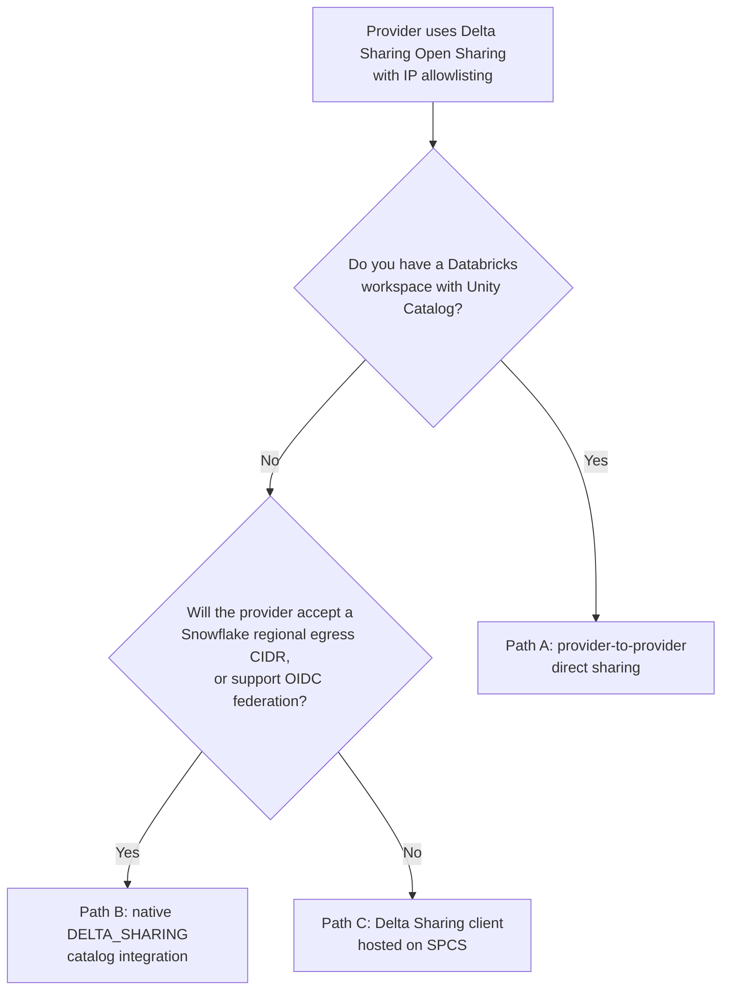
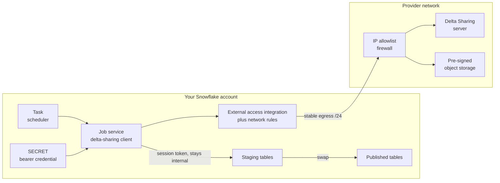
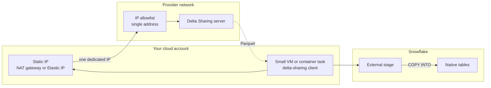

# Consuming a Delta Sharing Feed Behind an IP Allowlist

Your vendor delivers data through Databricks Delta Sharing. Their security model restricts access to IP addresses you register with them in advance. You are a Snowflake shop with no Databricks workspace. This guide covers how to get that data into Snowflake, which of the three available paths actually satisfies the IP requirement, and what the IP allowlist will and will not buy you.

**Audience:** Snowflake account administrators and data engineers who have been handed a vendor onboarding form asking for "a list of IP addresses to whitelist" and need to decide what to put in that field.

```text
Pair-programmed by SE Community + Cortex Code
```

**Created:** 2026-09-17 | **Expires:** 2026-12-16 | **Status:** ACTIVE

> **No support provided.** Reference only; validate before production use.

> **Directional guide.** The SQL in this document is syntax-checked against Snowflake. The container image, the Delta Sharing client call, and end-to-end connectivity through a provider firewall are **not validated** — that requires a live provider endpoint and a real allowlist entry. Treat the SPCS section as a design you must prove in your own environment, not a recipe that is known to run.

---

## Start Here

The provider almost certainly offers two sharing models. Which one you get determines whether you have a hard problem or an easy one.

| Provider model | Auth | IP allowlist | Needs your own Databricks |
| --- | --- | --- | --- |
| **Open Sharing** | Bearer token, typically short-lived for validation then long-lived for production | **Required** | No |
| **Provider-to-provider direct sharing** | Metastore / sharing identifier | Not required | Yes, with Unity Catalog |

If you are on Open Sharing and you are a Snowflake shop, you are reading the right document.

The uncomfortable centre of this guide, stated up front:

> Snowflake has a native, generally available Delta Sharing path that needs **two SQL statements** and no containers. It is the correct destination. But Snowflake does not document an allowlistable egress IP range for it — so if your provider enforces IP allowlisting, that path is blocked by their policy, not by any technical limitation of the feed.

Everything that follows is about closing that gap honestly.

**Route yourself:**

- Want the simplest thing, and willing to ask the provider one question first? → [Section 1](#section-1-choosing-a-connection-path)
- Provider will not budge on IP allowlisting, need a design? → [Section 2](#section-2-the-spcs-client-architecture)
- Need to tell your security team what you are actually asking them to approve? → [Section 3](#section-3-what-stable-egress-ips-really-give-you)
- Building the runbook? → [Section 4](#section-4-operations-and-lifecycle)

---

## Section 1: Choosing a Connection Path

### The three options



| | Path A: direct sharing | Path B: native catalog integration | Path C: SPCS client |
| --- | --- | --- | --- |
| Effort | Provider-side config | Two SQL statements | Container build, compute pool, orchestration |
| Bearer token to manage | No | Yes, unless OIDC | Yes |
| Allowlistable egress IP | Not needed | **Not documented** | Yes — via external access integration |
| Data lands as | Tables in your Databricks | Read-only catalog-linked database | Native Snowflake tables you own |
| Snowflake-only shop | No | Yes | Yes |
| Ongoing operational load | Low | Low | Moderate |

### Path A: provider-to-provider direct sharing

If your organisation already runs a Databricks workspace with Unity Catalog enabled, this is the least work and removes both the bearer token and the IP allowlist from the picture entirely. Providers typically restrict this to your own environment, not a third party's.

You would then land the data in Snowflake separately, or query it where it sits. This guide does not cover that hop — but it is worth confirming internally that no such workspace exists before you build anything. The question is cheap to ask and occasionally the answer is yes.

### Path B: the native Delta Sharing catalog integration

Snowflake reads Delta Sharing natively. Consuming Delta Shares as a catalog-linked database reached general availability on 2026-07-21. It is genuinely two statements:

```sql
USE ROLE ACCOUNTADMIN;

CREATE OR REPLACE CATALOG INTEGRATION delta_share_int
  CATALOG_SOURCE = DELTA_SHARING
  TABLE_FORMAT = DELTA
  REST_CONFIG = (
    CATALOG_URI = '<endpoint_from_credential_file>'
    CATALOG_NAME = 'shares/<share_name>'
    ACCESS_DELEGATION_MODE = VENDED_CREDENTIALS
  )
  REST_AUTHENTICATION = (
    TYPE = BEARER
    BEARER_TOKEN = '<bearer_token_from_credential_file>'
  )
  ENABLED = TRUE;

CREATE OR REPLACE DATABASE delta_share_db
  LINKED_CATALOG = (
    CATALOG = delta_share_int
    ALLOWED_WRITE_OPERATIONS = 'NONE'
    SYNC_INTERVAL_SECONDS = 30
  );
```

Snowflake converts the Delta tables to Iceberg on the way in, and your masking policies, row access policies, and other governance controls apply to them exactly as they would to your own tables. Verify before you build anything on top:

```sql
SELECT SYSTEM$VERIFY_CATALOG_INTEGRATION('delta_share_int');
SELECT SYSTEM$LIST_NAMESPACES_FROM_CATALOG('delta_share_int');
SELECT SYSTEM$LIST_ICEBERG_TABLES_FROM_CATALOG('delta_share_int', '<schema_in_share>');
```

**Why this may not be available to you.** `SYSTEM$GET_SNOWFLAKE_EGRESS_IP_RANGES` documents exactly three supported uses:

1. External access from UDFs and stored procedures
2. **Snowpark Container Services external access**, and Openflow on SPCS
3. Snowflake Git integration with IP-restricted Git servers

Catalog integrations are not on that list. So there is no documented, allowlistable CIDR range you can hand the provider for the traffic this integration generates.

Outbound private connectivity *is* supported for catalog integrations, which would sidestep IP allowlisting altogether — but it requires Business Critical edition or higher, requires Snowflake and the provider to be on the same cloud provider and region, and requires the provider to provision and approve a private endpoint on their side. A vendor whose onboarding process is a form and a support case is unlikely to offer that.

**Three questions worth putting to the provider before you accept Path C.** Any single yes collapses weeks of work into the two statements above:

1. *Will you accept a Snowflake regional egress CIDR range on the allowlist?* It is a `/24`, it is published by Snowflake, and it rotates. Some providers will take it.
2. *Do you support OIDC token federation for Delta Sharing recipients?* Snowflake supports `TYPE = OIDC` for Delta Sharing catalog integrations, acting as the workload identity provider with short-lived JWTs. This eliminates the long-lived bearer token, which is often the thing the provider's security team actually cares about — and it may make them more relaxed about IP restrictions.
3. *Can IP allowlisting be waived for a recipient authenticating with federated identity rather than a bearer token?* The allowlist exists to compensate for a credential that can be copied. Remove that credential and the compensating control has a weaker rationale.

If OIDC is on the table, the integration changes only in the authentication block:

```sql
CREATE OR REPLACE CATALOG INTEGRATION delta_share_int_oidc
  CATALOG_SOURCE = DELTA_SHARING
  TABLE_FORMAT = DELTA
  REST_CONFIG = (
    CATALOG_URI = '<recipient_endpoint>'
    CATALOG_NAME = 'shares/<share_name>'
    ACCESS_DELEGATION_MODE = VENDED_CREDENTIALS
  )
  REST_AUTHENTICATION = (
    TYPE = OIDC
    OIDC_AUDIENCE = '<audience_the_provider_expects>'
  )
  ENABLED = TRUE;
```

Then hand the provider the federation identity values so they can configure their recipient policy:

```sql
DESC CATALOG INTEGRATION delta_share_int_oidc;
-- Provide WORKLOAD_IDENTITY_FEDERATION_ISSUER and
-- WORKLOAD_IDENTITY_FEDERATION_SUBJECT to the provider, along with the
-- audience value above. All three must match their policy exactly.
```

### Path C: a Delta Sharing client hosted on SPCS

If the provider holds firm on IP allowlisting and bearer tokens, this is the path that produces an IP address you can actually write on their form, because SPCS external access is explicitly on the supported-uses list for stable egress IPs.

You are trading two SQL statements for a container image, a compute pool, an orchestration layer, and a standing operational obligation. Go in knowing that. [Section 2](#section-2-the-spcs-client-architecture) is the design; [Section 3](#section-3-what-stable-egress-ips-really-give-you) is the part to read before you promise your security team anything.

### Per-cloud availability

Stable egress IPs are not uniformly available, and this determines whether Path C works at all.

| Cloud | Stable egress IP status | Implication for Path C |
| --- | --- | --- |
| **AWS commercial** | Generally available | Works as documented |
| **Azure** | **Preview** | Works, with preview caveats; output format differs — see [Section 3](#azure-output-has-an-extra-field-that-matters) |
| **GCP** | Not documented as supported | **Path C does not produce an allowlistable IP.** Use Path A, or the customer-NAT pattern in [Section 3](#the-alternative-that-actually-gives-the-provider-one-ip) |

Confirm your own account before designing around this:

```sql
SELECT
    t.VALUE:ipv4_prefix::VARCHAR  AS cidr,
    t.VALUE:effective::TIMESTAMP  AS effective_from,
    t.VALUE:expires::TIMESTAMP    AS expires_at
FROM TABLE(FLATTEN(input => PARSE_JSON(SYSTEM$GET_SNOWFLAKE_EGRESS_IP_RANGES()))) AS t
ORDER BY expires_at;
```

An empty result or an error means this account cannot supply a stable egress range, and Path C is not viable as written.

---

## Section 2: The SPCS Client Architecture

### Shape of the solution



Two things about this diagram are load-bearing.

**The write side needs no egress.** The container authenticates back to Snowflake using the OAuth token Snowflake mounts at `/snowflake/session/token` plus the `SNOWFLAKE_HOST` environment variable. That traffic never leaves the Snowflake network, so it needs no external access integration and no firewall consideration. Only the read from the provider goes out through the allowlisted range.

**The provider hands back a second hostname.** Delta Sharing does not stream data through the sharing endpoint. It returns short-lived pre-signed URLs pointing at the provider's object storage, which is a **different hostname**. SPCS network rules require full hostnames and **do not support wildcards**, so both the sharing endpoint and every storage hostname must be enumerated in your rules. Get these from the provider during onboarding. This is the single most common reason a first attempt fails with an opaque network error after the catalog listing already worked.

### Step 1: Store the credential

The provider's credential file is JSON containing an endpoint, a bearer token, and an expiry. Store the whole thing so the container can read both fields from one place.

```sql
USE ROLE ACCOUNTADMIN;

CREATE DATABASE IF NOT EXISTS DELTA_FEED;
CREATE SCHEMA IF NOT EXISTS DELTA_FEED.INGEST;

CREATE OR REPLACE SECRET DELTA_FEED.INGEST.PROVIDER_SHARE_CREDENTIAL
  TYPE = GENERIC_STRING
  SECRET_STRING = '<paste_the_provider_credential_file_contents_here>'
  COMMENT = 'Delta Sharing recipient profile. Rotate on provider token expiry.';
```

> The provider typically allows the credential file to be downloaded **once**. Put it in this secret immediately and delete your local copy. If it is mishandled, ask the provider to reissue — they can disable the old one.

### Step 2: Network rules for both hostnames

```sql
-- The Delta Sharing REST endpoint.
CREATE OR REPLACE NETWORK RULE DELTA_FEED.INGEST.SHARING_ENDPOINT_RULE
  MODE = EGRESS
  TYPE = HOST_PORT
  VALUE_LIST = ('<delta_sharing_host>')
  COMMENT = 'Provider Delta Sharing REST endpoint. Port 443 is implied.';

-- The pre-signed object storage hosts the endpoint redirects to.
-- Obtain the exact list from the provider. Wildcards are NOT supported.
CREATE OR REPLACE NETWORK RULE DELTA_FEED.INGEST.SHARING_STORAGE_RULE
  MODE = EGRESS
  TYPE = HOST_PORT
  VALUE_LIST = (
    '<storage_host_1>',
    '<storage_host_2>'
  )
  COMMENT = 'Pre-signed URL targets for share data files.';
```

Two constraints to design around:

- Omitting the port implies 443. If the provider uses a non-standard port, SPCS permits only **22, 80, 443, and 1024 or above**. Anything else fails at service creation, not at runtime.
- `VALUE_LIST` takes full hostnames only. `*.example.com` is not valid.

### Step 3: External access integration

```sql
CREATE OR REPLACE EXTERNAL ACCESS INTEGRATION DELTA_FEED_SHARING_EAI
  ALLOWED_NETWORK_RULES = (
    DELTA_FEED.INGEST.SHARING_ENDPOINT_RULE,
    DELTA_FEED.INGEST.SHARING_STORAGE_RULE
  )
  ALLOWED_AUTHENTICATION_SECRETS = (DELTA_FEED.INGEST.PROVIDER_SHARE_CREDENTIAL)
  ENABLED = TRUE
  COMMENT = 'Egress to provider Delta Sharing endpoint and its storage hosts.';
```

### Step 4: Role and compute pool

The service owner role is the identity the container uses for every SQL statement it runs. Note that **you cannot create a service with ACCOUNTADMIN** — the role must be a normal role.

```sql
USE ROLE ACCOUNTADMIN;

CREATE ROLE IF NOT EXISTS DELTA_FEED_SVC;

GRANT USAGE ON DATABASE DELTA_FEED TO ROLE DELTA_FEED_SVC;
GRANT USAGE ON SCHEMA DELTA_FEED.INGEST TO ROLE DELTA_FEED_SVC;
GRANT CREATE TABLE, CREATE SERVICE ON SCHEMA DELTA_FEED.INGEST TO ROLE DELTA_FEED_SVC;
GRANT READ ON SECRET DELTA_FEED.INGEST.PROVIDER_SHARE_CREDENTIAL TO ROLE DELTA_FEED_SVC;
GRANT USAGE ON INTEGRATION DELTA_FEED_SHARING_EAI TO ROLE DELTA_FEED_SVC;

CREATE COMPUTE POOL IF NOT EXISTS DELTA_FEED_POOL
  MIN_NODES = 1
  MAX_NODES = 1
  INSTANCE_FAMILY = CPU_X64_M
  AUTO_SUSPEND_SECS = 300
  COMMENT = 'Runs the Delta Sharing ingest job. Sized for a daily batch pull.';

GRANT USAGE, MONITOR ON COMPUTE POOL DELTA_FEED_POOL TO ROLE DELTA_FEED_SVC;
GRANT ROLE DELTA_FEED_SVC TO ROLE SYSADMIN;
```

Right-size `INSTANCE_FAMILY` against the widest table in the share, not the total feed size — the client materialises one table at a time.

### Step 5: The container

> **Not validated.** The Dockerfile and Python below are a starting shape. Neither has been run against a live provider endpoint.

```dockerfile
FROM python:3.12-slim

RUN pip install --no-cache-dir \
      delta-sharing \
      "snowflake-snowpark-python[pandas]" \
      pyarrow

COPY ingest.py /app/ingest.py
WORKDIR /app
ENTRYPOINT ["python3", "ingest.py"]
```

```python
"""Pull tables from a Delta Sharing share into Snowflake staging tables.

Reads the recipient profile from a mounted Snowflake secret, writes through the
Snowflake-provided session token. Deliberately fails loudly: a partial load that
looks successful is worse than a job that stops.
"""

import json
import logging
import os
import sys
import tempfile

import delta_sharing
import pandas as pd
from snowflake.snowpark import Session

LOG = logging.getLogger("delta-ingest")

SECRET_DIR = os.getenv("SHARE_SECRET_DIR", "/usr/local/creds")
SHARE_NAME = os.environ["SHARE_NAME"]
SCHEMA_IN_SHARE = os.environ["SCHEMA_IN_SHARE"]
TARGET_SCHEMA = os.environ["TARGET_SCHEMA"]
STAGING_SUFFIX = os.getenv("STAGING_SUFFIX", "_STG")
INFO_TABLE = os.getenv("INFO_TABLE", "_info")
INFO_DATE_COLUMN = os.getenv("INFO_DATE_COLUMN", "execution_date")


def configure_logging() -> None:
    handler = logging.StreamHandler(sys.stdout)
    handler.setFormatter(logging.Formatter("%(name)s - %(levelname)s - %(message)s"))
    LOG.addHandler(handler)
    LOG.setLevel(logging.INFO)


def snowflake_session() -> Session:
    """Connect back to Snowflake over the internal network.

    Uses the OAuth token Snowflake refreshes in the container. Read it at
    connection time, never cache it -- it is rotated every few minutes.
    """
    with open("/snowflake/session/token", "r", encoding="utf-8") as handle:
        token = handle.read()

    return Session.builder.configs(
        {
            "host": os.environ["SNOWFLAKE_HOST"],
            "account": os.environ["SNOWFLAKE_ACCOUNT"],
            "authenticator": "oauth",
            "token": token,
            "warehouse": os.environ["SNOWFLAKE_WAREHOUSE"],
            "database": os.environ["SNOWFLAKE_DATABASE"],
            "schema": os.environ["SNOWFLAKE_SCHEMA"],
        }
    ).create()


def profile_path() -> str:
    """Materialise the recipient profile where the delta-sharing client wants it.

    The client takes a file path, not a dict, so the mounted secret is copied to
    a temp file scoped to this process.
    """
    with open(f"{SECRET_DIR}/secret_string", "r", encoding="utf-8") as handle:
        profile = json.load(handle)

    required = {"shareCredentialsVersion", "bearerToken", "endpoint"}
    missing = required - profile.keys()
    if missing:
        raise ValueError(f"Recipient profile is missing required keys: {sorted(missing)}")

    handle_fd, path = tempfile.mkstemp(suffix=".share")
    with os.fdopen(handle_fd, "w", encoding="utf-8") as out:
        json.dump(profile, out)
    return path


def pending_feed_date(session: Session, share_profile: str):
    """Return the provider's refresh date if it is newer than our last load, else None.

    Read the marker from the share, not from a local staging table -- a staging
    table only exists after a successful load, so gating on it would deadlock the
    very first run.
    """
    marker_url = f"{share_profile}#{SHARE_NAME}.{SCHEMA_IN_SHARE}.{INFO_TABLE}"
    marker = delta_sharing.load_as_pandas(marker_url)
    if marker.empty:
        LOG.warning("Provider marker table %s is empty", INFO_TABLE)
        return None

    feed_date = pd.to_datetime(marker[INFO_DATE_COLUMN]).max().date()

    audit = session.sql(
        f"SELECT COALESCE(MAX(feed_execution_date), '1900-01-01'::DATE) AS last_loaded "
        f"FROM {TARGET_SCHEMA}.LOAD_AUDIT"
    ).collect()
    last_loaded = audit[0]["LAST_LOADED"]

    LOG.info("Provider marker %s, last loaded %s", feed_date, last_loaded)
    return feed_date if feed_date > last_loaded else None


def ingest() -> None:
    configure_logging()
    LOG.info("Starting Delta Sharing ingest")

    share_profile = profile_path()
    client = delta_sharing.SharingClient(share_profile)

    tables = [
        table
        for table in client.list_all_tables()
        if table.share == SHARE_NAME
        and table.schema == SCHEMA_IN_SHARE
        and not table.name.startswith("_")
    ]
    if not tables:
        raise RuntimeError(
            f"No tables found in share '{SHARE_NAME}' schema '{SCHEMA_IN_SHARE}'. "
            "Check the share name, the schema name, and that the bearer token has not expired."
        )

    failures = []

    with snowflake_session() as session:
        feed_date = pending_feed_date(session, share_profile)
        if feed_date is None:
            LOG.info("Feed not refreshed since last load; exiting without work.")
            return

        LOG.info("Loading %d tables for feed date %s", len(tables), feed_date)

        for table in tables:
            url = f"{share_profile}#{table.share}.{table.schema}.{table.name}"
            staging = f"{TARGET_SCHEMA}.{table.name.upper()}{STAGING_SUFFIX}"
            try:
                # The feed is a full historical refresh, so load the whole table
                # and overwrite. Appending would duplicate every row every day.
                frame = delta_sharing.load_as_pandas(url)
                LOG.info("Loaded %s: %d rows", table.name, len(frame))
                session.create_dataframe(frame).write.mode("overwrite").save_as_table(staging)
            except Exception as exc:  # noqa: BLE001 - collect and re-raise together
                LOG.error("Table %s failed: %s", table.name, exc)
                failures.append(table.name)

        if failures:
            # Never exit 0 on partial success. The Task must see this as a failure so
            # the swap step does not publish a half-loaded dataset, and so no audit
            # row is written -- leaving the next run free to retry the same date.
            raise RuntimeError(f"Ingest failed for {len(failures)} tables: {failures}")

        session.sql(
            f"INSERT INTO {TARGET_SCHEMA}.LOAD_AUDIT "
            f"(feed_execution_date, loaded_at, table_count) "
            f"SELECT ?::DATE, CURRENT_TIMESTAMP(), ?",
            params=[str(feed_date), len(tables)],
        ).collect()

    LOG.info("Ingest complete: %d tables staged for %s", len(tables), feed_date)


if __name__ == "__main__":
    ingest()
```

### Step 6: The job service

Mount the secret with `directoryPath`, not `envVarName`. Snowflake refreshes file-mounted secrets in running containers but does **not** update secrets passed as environment variables after the service is created — which matters when the bearer token is rotated.

```yaml
spec:
  containers:
    - name: main
      image: /delta_feed/ingest/repo/delta_sharing_ingest:latest
      env:
        SNOWFLAKE_WAREHOUSE: DELTA_FEED_WH
        SHARE_SECRET_DIR: /usr/local/creds
        SHARE_NAME: <share_name>
        SCHEMA_IN_SHARE: <schema_in_share>
        TARGET_SCHEMA: DELTA_FEED.INGEST
      secrets:
        - snowflakeSecret: DELTA_FEED.INGEST.PROVIDER_SHARE_CREDENTIAL
          directoryPath: /usr/local/creds
```

```sql
USE ROLE DELTA_FEED_SVC;

EXECUTE JOB SERVICE
  IN COMPUTE POOL DELTA_FEED_POOL
  NAME = DELTA_FEED.INGEST.SHARE_INGEST_JOB
  EXTERNAL_ACCESS_INTEGRATIONS = (DELTA_FEED_SHARING_EAI)
  FROM @DELTA_FEED.INGEST.SPECS
  SPECIFICATION_FILE = 'ingest_spec.yaml';
```

When it fails — and the first run will — these are the two commands that tell you why:

```sql
SHOW SERVICE CONTAINERS IN SERVICE DELTA_FEED.INGEST.SHARE_INGEST_JOB;
SELECT SYSTEM$GET_SERVICE_LOGS('DELTA_FEED.INGEST.SHARE_INGEST_JOB', 0, 'main');
```

### Step 7: Orchestrate on the feed's own signals, not the clock

Providers of daily feeds routinely decline to guarantee an availability time. A cron schedule that fires at a fixed hour will sometimes load yesterday's data and report success.

Most Delta Sharing feeds expose refresh metadata — commonly an `_info` table with an execution date and a `_refresh_time` table with per-table timestamps, in UTC. Drive off those.

The freshness check belongs **inside the container**, reading the marker table from the share itself, for a reason worth stating: a check written in SQL against a staged copy of the marker cannot run before the first ingest, because the staged copy does not exist yet. Reading the marker through the sharing client breaks that circularity, and it also means a polling run that finds nothing new costs one small read instead of a full load.

So the Task stays trivial and simply invokes the job on a polling schedule:

```sql
-- Job tasks use the serverless model: do NOT specify a WAREHOUSE on the task.
-- The warehouse the container runs SQL in is set with QUERY_WAREHOUSE below.
CREATE OR REPLACE TASK DELTA_FEED.INGEST.SHARE_INGEST_TASK
  SCHEDULE = 'USING CRON 0,30 8-23 * * * UTC'
  COMMENT = 'Polls the provider refresh marker; the container exits early if nothing is new.'
AS
  EXECUTE JOB SERVICE
    IN COMPUTE POOL DELTA_FEED_POOL
    NAME = DELTA_FEED.INGEST.SHARE_INGEST_JOB
    QUERY_WAREHOUSE = DELTA_FEED_WH
    EXTERNAL_ACCESS_INTEGRATIONS = (DELTA_FEED_SHARING_EAI)
    FROM @DELTA_FEED.INGEST.SPECS
    SPECIFICATION_FILE = 'ingest_spec.yaml';

ALTER TASK DELTA_FEED.INGEST.SHARE_INGEST_TASK RESUME;
```

The task owner needs `EXECUTE MANAGED TASK` on the account for the serverless model:

```sql
USE ROLE ACCOUNTADMIN;
GRANT EXECUTE MANAGED TASK ON ACCOUNT TO ROLE DELTA_FEED_SVC;
```

Two things to get right here:

- **Do not add `ASYNC = TRUE`.** Run the job synchronously, or the task reports completion before the job has finished and any downstream step in a task graph fires against half-loaded staging tables.
- The audit table the container writes to must exist before the first run:

```sql
CREATE TABLE IF NOT EXISTS DELTA_FEED.INGEST.LOAD_AUDIT (
    feed_execution_date DATE       NOT NULL,
    loaded_at           TIMESTAMP_LTZ NOT NULL,
    table_count         NUMBER
);
```

If the feed publishes in tiers — for example a morning financial refresh and an evening clinical one, where the shared execution date is overwritten by the second delivery — track them separately using the per-table refresh timestamps rather than the single feed-level date. A feed-level date alone cannot tell you which tier you just received.

### Step 8: Publish by swapping, not by loading in place

A full historical refresh arrives complete every day. Two consequences:

- **Never append.** You will duplicate the entire dataset daily.
- **Never truncate the table your consumers read.** They will see an empty table for the duration of the load.

Load to staging, then swap:

```sql
-- Atomic from the reader's perspective, and instantly reversible.
ALTER TABLE DELTA_FEED.PUBLISHED.PATIENTS
  SWAP WITH DELTA_FEED.INGEST.PATIENTS_STG;
```

Only reach for `ALTER TABLE ... SWAP WITH` after the ingest job has exited successfully. That is why the Python above raises rather than exiting 0 on partial failure.

For a derived reporting layer on top, Dynamic Tables are the natural fit — but note the constraint if you ever move to reading Delta files directly rather than through a client: Iceberg tables created from Delta files predating the 2024_04 release bundle are not supported in Dynamic Tables, and streams on Delta-derived Iceberg tables with partition columns are not supported either. Landing to native tables, as this design does, sidesteps all of that.

---

## Section 3: What Stable Egress IPs Really Give You

Read this section before you tell your security team or the provider what you are proposing. Three of these four points routinely surprise people late in an implementation.

### It is a shared /24, not your IP address

```sql
SELECT
    t.VALUE:ipv4_prefix::VARCHAR  AS cidr,
    t.VALUE:effective::TIMESTAMP  AS effective_from,
    t.VALUE:expires::TIMESTAMP    AS expires_at
FROM TABLE(FLATTEN(input => PARSE_JSON(SYSTEM$GET_SNOWFLAKE_EGRESS_IP_RANGES()))) AS t
ORDER BY expires_at;
```

The ranges are `/24` CIDR blocks — 256 addresses each — and Snowflake's documentation is explicit that they are **scoped to the region and shared among all Snowflake accounts in that region**. They are not unique to your account.

Provider onboarding guidance for this pattern commonly says something close to: *keep the list of IP addresses as few as possible, thereby reducing the surface area to which your data is exposed*, and notes that customers typically retrieve data from one to three addresses.

What you are actually asking for is several hundred addresses in a pool shared with other Snowflake customers in your region. That is a defensible control — the bearer token still gates access, and any other tenant in that range would need your token to read your data — but it is not what the provider's form is asking for, and pretending otherwise will damage your credibility in the security review. Raise it yourself, in those terms, before they find it.

### The ranges expire, and the provider has no API

Every range carries an `expires` timestamp. Snowflake's documented practice is to automate refresh: poll the function, diff against current rules, and push changes through the target's API, CLI, or an infrastructure-as-code pipeline.

That assumes the far end has an API. When the allowlist is maintained by a vendor support case and an onboarding form, the automation half of the recommended pattern is unavailable to you. A solved problem becomes a standing operational obligation.

New ranges appear in the function output **at least 60 days before they become effective**, which is the window you have to work with. Monitor it:

```sql
CREATE OR REPLACE VIEW DELTA_FEED.INGEST.EGRESS_RANGE_STATUS AS
SELECT
    t.VALUE:ipv4_prefix::VARCHAR AS cidr,
    t.VALUE:effective::TIMESTAMP AS effective_from,
    t.VALUE:expires::TIMESTAMP   AS expires_at,
    DATEDIFF('day', CURRENT_TIMESTAMP(), t.VALUE:expires::TIMESTAMP) AS days_until_expiry,
    CASE
        WHEN t.VALUE:effective::TIMESTAMP > CURRENT_TIMESTAMP() THEN 'UPCOMING - submit to provider now'
        WHEN DATEDIFF('day', CURRENT_TIMESTAMP(), t.VALUE:expires::TIMESTAMP) <= 30 THEN 'EXPIRING - confirm replacement is allowlisted'
        ELSE 'ACTIVE'
    END AS range_status
FROM TABLE(FLATTEN(input => PARSE_JSON(SYSTEM$GET_SNOWFLAKE_EGRESS_IP_RANGES()))) AS t;
```

```sql
CREATE OR REPLACE ALERT DELTA_FEED.INGEST.EGRESS_RANGE_ALERT
  WAREHOUSE = DELTA_FEED_WH
  SCHEDULE = 'USING CRON 0 13 * * MON UTC'
  IF (EXISTS (
        SELECT 1 FROM DELTA_FEED.INGEST.EGRESS_RANGE_STATUS
        WHERE range_status <> 'ACTIVE'
      ))
  THEN CALL SYSTEM$SEND_EMAIL(
    'DELTA_FEED_NOTIFY',
    '<data_platform_distribution_list>',
    'Snowflake egress range change affects the provider allowlist',
    'A new or expiring Snowflake egress range needs a provider support case. Query DELTA_FEED.INGEST.EGRESS_RANGE_STATUS for details.'
  );
```

Weekly, not daily. The window is measured in months, and a daily alert on a slow-moving obligation trains people to ignore it.

### There are two allowlist entries, for two different things

This one stalls onboarding on day one and is almost never noticed in advance.

| What is being accessed | Traffic originates from | Allowlist entry needed |
| --- | --- | --- |
| The credential file download link | The browser of the person the provider emails it to | That person's **corporate egress IP** |
| The Delta Sharing data endpoint | Your Snowflake account | Snowflake's **egress CIDR range** |

Providers commonly restrict the credential download link to the same allowlist as the data. So the human retrieving the token needs their office or VPN egress address registered too — and if you submitted only Snowflake's range, that download fails before you can configure anything. Submit both, labelled, in the initial form.

### Azure output has an extra field that matters

On Azure the function returns additional fields and inline JSON comments. Pass `TRUE` to suppress the comments, or `PARSE_JSON` will fail:

```sql
-- Azure only. On AWS this errors with
-- "SYSTEM$GET_SNOWFLAKE_EGRESS_IP_RANGES() does not accept (1) parameter"
-- because the hideAnnotations argument exists only in Azure regions.
SELECT
    t.VALUE:ipv4_prefix::VARCHAR AS cidr,
    t.VALUE:published::TIMESTAMP AS published_at,
    t.VALUE:expires::TIMESTAMP   AS expires_at,
    t.VALUE:usage                AS usage_scopes
FROM TABLE(FLATTEN(input => PARSE_JSON(SYSTEM$GET_SNOWFLAKE_EGRESS_IP_RANGES(TRUE)))) AS t
ORDER BY expires_at;
```

If you maintain one monitoring script across both clouds, branch on the deployment rather than passing the argument unconditionally — the parameterless form is the portable one.

The `usage` array is the part to read carefully. Some ranges are marked only as `Network Identifier - use for Azure services such as Storage, Key Vault`. Those are **not** the ranges to send a provider hosting an endpoint outside Azure. You want the ones that include `Stable Egress IP - use for endpoints hosted outside of Azure`. Sending the wrong subset produces a connection that fails intermittently or not at all, with nothing in the Snowflake logs to explain it.

`published` is also meaningful on Azure: if a range's `published` date is later than your last allowlist submission, resubmit before its `effective` date.

### The alternative that actually gives the provider one IP

If the shared-`/24` conversation goes badly — or you are on GCP, where Path C does not produce an allowlistable range at all — there is a pattern that satisfies the provider's stated preference precisely. Vendor guidance for this scenario often recommends it explicitly: *use a gateway to limit IP addresses, or use a staging environment to stage the data.*



| | SPCS client | Customer-NAT client |
| --- | --- | --- |
| IPs given to provider | Shared regional `/24` | **One address you control** |
| Address rotation | Snowflake-driven, expires | None — yours until you change it |
| Works on GCP-hosted Snowflake | No | Yes |
| Infrastructure to own | None outside Snowflake | A VM or task, a NAT gateway, IAM |
| Credential lives in | Snowflake secret | Your secrets manager |
| Compute billing | Snowflake credits | Cloud provider |

The trade is real and goes both ways: you give up staying entirely inside Snowflake, and you take on a small piece of infrastructure to patch and monitor. In exchange you hand the provider exactly what they asked for, permanently, and the expiry treadmill disappears.

Which side that lands on depends on whether your organisation would rather run a NAT gateway or renew a vendor support case on a schedule. Both are legitimate answers. Decide it deliberately rather than by default.

---

## Section 4: Operations and Lifecycle

### Dated obligations

Neither of these is enforced by tooling. Both break the feed silently when missed.

| Obligation | Typical cadence | Failure mode |
| --- | --- | --- |
| Rotate the bearer token | Provider-set, often 1 year after issue; a short-lived token is common for initial validation | Ingest fails on auth; no warning beforehand |
| Resubmit egress ranges | Whenever a new range is published, at least 60 days ahead of effective | Ingest fails on connect after the provider's firewall stops matching |

Put both in a shared calendar with the ticket-raising instructions attached, and record the token expiry where the on-call engineer will find it:

```sql
ALTER SECRET DELTA_FEED.INGEST.PROVIDER_SHARE_CREDENTIAL
  SET COMMENT = 'Delta Sharing recipient profile. Provider token expires <YYYY-MM-DD>. Reissue via provider support case, then CREATE OR REPLACE this secret.';
```

Rotation itself is a `CREATE OR REPLACE SECRET` with the new profile. Because the spec mounts the secret by `directoryPath`, running containers pick up the change without a redeploy.

### Gotchas

**Network and egress**

- Network rule `VALUE_LIST` requires full hostnames. Wildcards are not supported, so every pre-signed storage host must be enumerated.
- SPCS permits only ports 22, 80, 443, and 1024 or above. A non-standard provider port outside that set fails at service creation.
- The catalog listing call can succeed while data reads fail — that asymmetry means you missed the storage hostnames, not the endpoint.
- Egress ranges are regional. A second Snowflake account in another region needs a separate allowlist submission.

**Credential and identity**

- The credential file is typically downloadable once. Treat the download as the only chance.
- Secrets mounted as environment variables are **not** refreshed after service creation. Use `directoryPath`.
- The container's SQL runs as the service owner role, not as whoever triggered the Task. Grant to that role.
- You cannot create a service using ACCOUNTADMIN.
- The session token at `/snowflake/session/token` is rotated every few minutes. Read it at connection time; never cache it.

**Data semantics**

- The share is read-only and not bidirectional. There is nothing to write back.
- A full historical refresh means overwrite-and-swap, never append.
- Refresh timestamps are UTC. A feed-level execution date that gets overwritten by a later tier cannot tell you which tier you have.
- Some tables in a feed may refresh weekly rather than daily. Do not alert on staleness uniformly across all tables.
- Tables that are empty rather than absent are normal when the provider ships a schema for a module you do not license.

**Orchestration**

- Job tasks use the **serverless** model. Do not put `WAREHOUSE =` on the `CREATE TASK`; set the container's SQL warehouse with `QUERY_WAREHOUSE` on `EXECUTE JOB SERVICE` instead.
- Run the job **synchronously**. With `ASYNC = TRUE` the task reports success before the container has finished, and any dependent task fires against half-loaded staging tables.
- The task owner needs `EXECUTE MANAGED TASK` on the account.
- Tasks are created suspended. `ALTER TASK ... RESUME` is not optional.
- Filter the provider's metadata tables out of the load loop. Names beginning with an underscore are usually control tables, not data.

**Cost**

- A compute pool bills while nodes are active regardless of whether the container is doing anything. Set `AUTO_SUSPEND_SECS` and use a job service, which exits, rather than a long-running service, which does not.
- Auto-suspend does not apply to job services and is not supported on services with public endpoints. This design needs neither.
- The polling Task consumes warehouse credits on every check. Use the smallest warehouse and a sensible polling window rather than every five minutes around the clock.

### Governance note

Feeds of this kind frequently carry regulated personal data — patient records, financial detail, staff information. That is a question about account edition, masking and row access policies, access history retention, and who in your organisation is permitted to query the landed tables. It belongs in the same review as the network design, not after it.

Worth knowing for the Path B comparison: tables consumed through a catalog-linked database inherit the masking and row access policies you apply to your own tables, so choosing Path B does not cost you governance coverage.

---

## What Was Verified in This Guide

Being specific about this matters more than usual, because the parts that cannot be verified are the parts most likely to bite you.

| Element | Status |
| --- | --- |
| `SYSTEM$GET_SNOWFLAKE_EGRESS_IP_RANGES` queries | **Run live** on an AWS commercial account; returned two shared `/24` ranges with expiry dates |
| `hideAnnotations` argument is Azure-only | **Confirmed live** — errors on AWS |
| Egress range monitoring view logic | Compiles |
| Delta Sharing catalog integration DDL | Taken verbatim from current Snowflake reference documentation; not executed |
| Network rule, secret, EAI, compute pool DDL | Taken from current reference documentation; **not compile-checked** — the session used to write this guide was privilege-scoped in a way that rejects `CREATE` statements before syntax validation runs |
| Task-invokes-job pattern | Matches the documented serverless form; not executed |
| Python ingest module | Parses; **never run against a live Delta Sharing endpoint** |
| Service specification YAML | Parses as YAML; never deployed |
| End-to-end connectivity through a provider firewall | **Not verified.** Requires a live provider endpoint and a real allowlist entry |

Before you commit to Path C in a plan or a design review, run the DDL in a scratch database in your own account. It is cheap, and it is the step that turns this from a direction into a design.

---

## Related Guides

- [Snowpark Container Services: service networking](https://docs.snowflake.com/en/developer-guide/snowpark-container-services/service-network-communications)
- [Securing ingress of Snowflake requests with egress IP addresses](https://docs.snowflake.com/en/user-guide/egress-ip/network-egress)
- [Configure a catalog integration for Delta Sharing](https://docs.snowflake.com/en/user-guide/tables-iceberg-configure-catalog-integration-delta-sharing)
- [Delta Sharing open-source project](https://delta.io/sharing/)

## External References

- [SYSTEM$GET_SNOWFLAKE_EGRESS_IP_RANGES](https://docs.snowflake.com/en/sql-reference/functions/system_get_snowflake_egress_ip_ranges)
- [CREATE CATALOG INTEGRATION (Delta Sharing)](https://docs.snowflake.com/en/sql-reference/sql/create-catalog-integration-delta-sharing)
- [Consuming Delta Shares in Horizon Catalog — GA announcement](https://docs.snowflake.com/en/release-notes/2026/other/2026-07-21-delta-sharing-horizon-catalog-ga)
- [Snowpark Container Services: SQL execution](https://docs.snowflake.com/en/developer-guide/snowpark-container-services/spcs-execute-sql)
- [Snowpark Container Services: working with services](https://docs.snowflake.com/en/developer-guide/snowpark-container-services/working-with-services)
- [Use a catalog-linked database for Apache Iceberg tables](https://docs.snowflake.com/en/user-guide/tables-iceberg-catalog-linked-database)
- [Private connectivity for outbound network traffic](https://docs.snowflake.com/en/user-guide/private-connectivity-outbound)
- [Data Connectivity Proxy](https://docs.snowflake.com/en/user-guide/data-connectivity-proxy)
- [CREATE NETWORK RULE](https://docs.snowflake.com/en/sql-reference/sql/create-network-rule)
- [Delta Sharing protocol REST API](https://github.com/delta-io/delta-sharing/blob/main/PROTOCOL.md#rest-apis)
