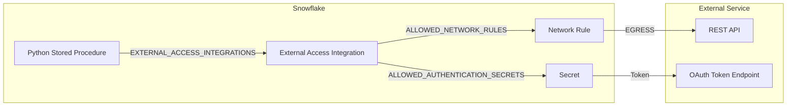

# External Access Playbook

Inspired by a real customer question: *"How do I call an external REST API from inside a Snowflake stored procedure -- and do it securely?"*

Unified patterns for secure API egress from Snowflake: network rules, External Access Integrations, secrets management, OAuth flows, and production hardening (credential rotation, scheduling, monitoring). All patterns are extracted from working demos and tools in this repository.

**Pair-programmed by:** SE Community + Cortex Code
**Created:** 2026-03-23 | **Expires:** 2027-03-23 | **Status:** ACTIVE

> **No support provided.** This content is for reference only. Review and validate before applying to any production workflow.

**Time:** ~20 minutes to read | **Result:** Patterns for secure API egress from Snowflake

---

## Who This Is For

Data engineers who need to call external REST APIs from Snowflake stored procedures. Comfortable with SQL and basic Python. No prior External Access Integration experience required.

---

## The Approach



| Part | What It Covers |
|------|---------------|
| [Part 1: Network Rules](#part-1-network-rules) | Firewall layer for egress |
| [Part 2: Secrets](#part-2-secrets) | OAuth, API keys, credential storage |
| [Part 3: External Access Integrations](#part-3-external-access-integrations) | Binding rules + secrets together |
| [Part 4: Python Stored Procedures](#part-4-python-stored-procedures-with-external-access) | Code patterns with and without auth |
| [Part 5: Production Hardening](#part-5-production-hardening) | Rotation, scheduling, monitoring |

> [!TIP]
> **Core insight:** Network Rule (where you can go) + Secret (how you authenticate) + EAI (the binding) = one reference on the stored procedure.

---

## Part 1: Network Rules

```sql
CREATE NETWORK RULE SFE_API_NETWORK_RULE
    MODE = EGRESS TYPE = HOST_PORT
    VALUE_LIST = ('jsonplaceholder.typicode.com:443');
```

## Part 2: Secrets

```sql
CREATE SECRET SFE_QBO_OAUTH_SECRET TYPE = OAUTH2
    API_AUTHENTICATION = SFE_QBO_OAUTH_INTEGRATION;
```

## Part 3: External Access Integrations

```sql
CREATE EXTERNAL ACCESS INTEGRATION SFE_API_ACCESS
    ALLOWED_NETWORK_RULES = (SFE_API_NETWORK_RULE) ENABLED = TRUE;
```

## Part 4: Python Stored Procedures with External Access

```sql
CREATE PROCEDURE SFE_FETCH_USERS()
    RETURNS TABLE(id NUMBER, name VARCHAR, email VARCHAR)
    LANGUAGE PYTHON RUNTIME_VERSION = '3.11'
    PACKAGES = ('snowflake-snowpark-python', 'requests')
    HANDLER = 'fetch_users'
    EXTERNAL_ACCESS_INTEGRATIONS = (SFE_API_ACCESS)
AS $$ ... $$;
```

For OAuth: add `SECRETS = ('qbo_cred' = SFE_QBO_OAUTH_SECRET)` and use `_snowflake.get_oauth_access_token('qbo_cred')` at runtime.

## Part 5: Production Hardening

- **Credential rotation** -- See [tool-secrets-rotation-aws](../tool-secrets-rotation-aws/) for automated rotation with AWS Secrets Manager
- **Scheduling** -- Wrap procedures in tasks with `USING CRON`
- **Monitoring** -- Query `QUERY_HISTORY` for procedure execution status

---

## Decision Tree

| Question | Recommendation |
|---|---|
| Public API, no auth? | Network rule + EAI only -- see [tool-api-data-fetcher](../tool-api-data-fetcher/) |
| API with OAuth? | Full stack: security integration + secret + network rule + EAI -- see [demo-api-quickbooks-medallion](../demo-api-quickbooks-medallion/) |
| API with API key? | `TYPE = GENERIC_STRING` secret + EAI |
| Need credential rotation? | See [tool-secrets-rotation-aws](../tool-secrets-rotation-aws/) |
| Need AI enrichment of API data? | Combine EAI with Cortex AI -- see [demo-api-quickbooks-medallion](../demo-api-quickbooks-medallion/) |

---

## Related Projects

- [`tool-api-data-fetcher`](../tool-api-data-fetcher/) -- Simplest pattern: public API, no auth
- [`demo-api-quickbooks-medallion`](../demo-api-quickbooks-medallion/) -- Full OAuth with medallion + Cortex AI
- [`tool-secrets-rotation-aws`](../tool-secrets-rotation-aws/) -- PAT and key-pair rotation with AWS
