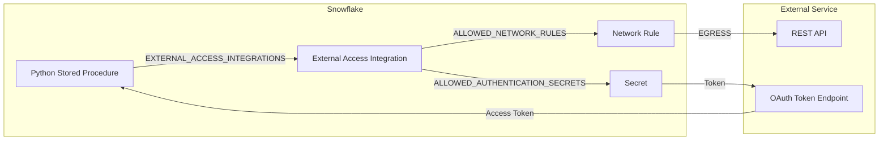

# External Access Playbook

> [!CAUTION]
> **No support provided.** This content is for reference only. Review and validate before applying to any production workflow.


**Pair-programmed by:** SE Community + Cortex Code
**Created:** 2026-03-23 | **Expires:** 2027-03-23 | **Status:** ACTIVE

Unified patterns for calling external APIs from Snowflake: network rules, External Access Integrations, secrets management, OAuth flows, and production hardening. All patterns are extracted from working demos and tools in this repository.



**Time:** ~20 minutes to read | **Result:** Patterns for secure API egress from Snowflake

## Who This Is For

Data engineers who need to call external REST APIs from Snowflake stored procedures. You should be comfortable writing SQL and basic Python. No prior experience with External Access Integrations is required.

---

## Part 1: Network Rules

Network rules define which external hosts your Snowflake account can reach. They are the firewall layer for egress.

### Simple Pattern (Public API, No Auth)

```sql
CREATE OR REPLACE NETWORK RULE SFE_API_NETWORK_RULE
    MODE = EGRESS
    TYPE = HOST_PORT
    VALUE_LIST = ('jsonplaceholder.typicode.com:443')
    COMMENT = 'Allow egress to JSONPlaceholder API';
```

### OAuth Pattern (API + Token Endpoint)

When using OAuth, include both the API host and the token endpoint:

```sql
CREATE OR REPLACE NETWORK RULE SFE_QBO_NETWORK_RULE
    MODE = EGRESS
    TYPE = HOST_PORT
    VALUE_LIST = (
        'sandbox-quickbooks.api.intuit.com',
        'quickbooks.api.intuit.com',
        'oauth.platform.intuit.com'
    )
    COMMENT = 'Egress to QuickBooks Online REST API and OAuth token endpoint';
```

### Key Points

- `MODE = EGRESS` -- all external access rules use egress mode
- `TYPE = HOST_PORT` -- specify the exact hosts (not IP ranges) for API endpoints
- Include all hosts the procedure needs to reach (API, auth, CDN, etc.)
- Requires `ACCOUNTADMIN` to create

---

## Part 2: Secrets

Secrets store credentials that stored procedures can access at runtime without exposing them in code.

### OAuth Secret

```sql
CREATE OR REPLACE SECURITY INTEGRATION SFE_QBO_OAUTH_INTEGRATION
    TYPE = API_AUTHENTICATION
    AUTH_TYPE = OAUTH2
    OAUTH_CLIENT_ID = '<YOUR_CLIENT_ID>'
    OAUTH_CLIENT_SECRET = '<YOUR_CLIENT_SECRET>'
    OAUTH_TOKEN_ENDPOINT = 'https://oauth.platform.intuit.com/oauth2/v1/tokens/bearer'
    OAUTH_AUTHORIZATION_ENDPOINT = 'https://appcenter.intuit.com/connect/oauth2'
    OAUTH_ALLOWED_SCOPES = ('com.intuit.quickbooks.accounting')
    ENABLED = TRUE;

CREATE OR REPLACE SECRET SFE_QBO_OAUTH_SECRET
    TYPE = OAUTH2
    API_AUTHENTICATION = SFE_QBO_OAUTH_INTEGRATION;
```

### Granting Access to Secrets

```sql
GRANT READ ON SECRET SFE_QBO_OAUTH_SECRET TO ROLE SYSADMIN;
```

### Key Points

- Security integrations manage OAuth client credentials and token endpoints
- Secrets of `TYPE = OAUTH2` automatically handle token refresh
- Never hardcode credentials in stored procedure code
- For non-OAuth APIs, use `TYPE = PASSWORD` or `TYPE = GENERIC_STRING` secrets

---

## Part 3: External Access Integrations

External Access Integrations bind network rules and secrets together. They are the single object you reference from stored procedures.

### Without Auth (Public API)

```sql
CREATE OR REPLACE EXTERNAL ACCESS INTEGRATION SFE_API_ACCESS
    ALLOWED_NETWORK_RULES = (SFE_API_NETWORK_RULE)
    ENABLED = TRUE
    COMMENT = 'External access for public REST API';
```

### With OAuth

```sql
CREATE OR REPLACE EXTERNAL ACCESS INTEGRATION SFE_QBO_API_INTEGRATION
    ALLOWED_NETWORK_RULES = (SFE_QBO_NETWORK_RULE)
    ALLOWED_AUTHENTICATION_SECRETS = (SFE_QBO_OAUTH_SECRET)
    ENABLED = TRUE
    COMMENT = 'External access for QuickBooks API with OAuth';

GRANT USAGE ON INTEGRATION SFE_QBO_API_INTEGRATION TO ROLE SYSADMIN;
```

---

## Part 4: Python Stored Procedures with External Access

### Simple Pattern (No Auth)

```sql
CREATE OR REPLACE PROCEDURE SFE_FETCH_USERS()
    RETURNS TABLE(id NUMBER, name VARCHAR, email VARCHAR)
    LANGUAGE PYTHON
    RUNTIME_VERSION = '3.11'
    PACKAGES = ('snowflake-snowpark-python', 'requests')
    HANDLER = 'fetch_users'
    EXTERNAL_ACCESS_INTEGRATIONS = (SFE_API_ACCESS)
AS
$$
import requests

def fetch_users(session):
    response = requests.get(
        'https://jsonplaceholder.typicode.com/users',
        timeout=30
    )
    response.raise_for_status()
    data = response.json()

    rows = [(u['id'], u['name'], u['email']) for u in data]
    df = session.create_dataframe(rows, schema=['id', 'name', 'email'])
    return df
$$;
```

### OAuth Pattern

```sql
CREATE OR REPLACE PROCEDURE FETCH_QBO_ENTITY(
    entity_name VARCHAR,
    realm_id    VARCHAR
)
RETURNS VARCHAR
LANGUAGE PYTHON
RUNTIME_VERSION = '3.11'
PACKAGES = ('snowflake-snowpark-python', 'requests')
HANDLER = 'run'
EXTERNAL_ACCESS_INTEGRATIONS = (SFE_QBO_API_INTEGRATION)
SECRETS = ('qbo_cred' = SFE_QBO_OAUTH_SECRET)
AS
$$
import _snowflake
import requests

def run(session, entity_name: str, realm_id: str) -> str:
    token = _snowflake.get_oauth_access_token('qbo_cred')
    headers = {"Authorization": f"Bearer {token}", "Accept": "application/json"}

    url = f"https://quickbooks.api.intuit.com/v3/company/{realm_id}/query"
    resp = requests.get(url, headers=headers, params={"query": f"SELECT * FROM {entity_name}"})
    resp.raise_for_status()

    # Process and store results...
    return f"OK: Fetched {entity_name}"
$$;
```

### Key Points

- `EXTERNAL_ACCESS_INTEGRATIONS = (...)` on the procedure -- this is the link to the EAI
- `SECRETS = ('alias' = SECRET_NAME)` maps a secret to a runtime alias
- Use `_snowflake.get_oauth_access_token('alias')` to get a fresh OAuth token
- Always set `timeout` on `requests` calls
- Use `response.raise_for_status()` for clear error propagation

---

## Part 5: Production Hardening

### Credential Rotation

For service accounts using PATs or key pairs, automate rotation:
- See [tool-secrets-rotation-aws](../tool-secrets-rotation-aws/) for key-pair and PAT rotation with AWS Secrets Manager

### Scheduling API Fetches

Wrap your procedure in a task for automated ingestion:

```sql
CREATE OR REPLACE TASK FETCH_DAILY_DATA
    WAREHOUSE = MY_WAREHOUSE
    SCHEDULE = 'USING CRON 0 6 * * * UTC'
AS
    CALL FETCH_QBO_ENTITY('Invoice', '<REALM_ID>');

ALTER TASK FETCH_DAILY_DATA RESUME;
```

### Error Handling Patterns

- Check HTTP status codes and log failures to a table
- Use `ON_ERROR = 'CONTINUE'` in downstream `COPY INTO` to handle partial failures
- Set `STATEMENT_TIMEOUT_IN_SECONDS` on the warehouse to prevent hung API calls

### Monitoring Egress

Query `QUERY_HISTORY` for procedures that use external access:

```sql
SELECT
    query_id,
    user_name,
    start_time,
    execution_status,
    error_message,
    total_elapsed_time
FROM SNOWFLAKE.ACCOUNT_USAGE.QUERY_HISTORY
WHERE query_type = 'CALL'
  AND query_text ILIKE '%FETCH%'
  AND start_time >= DATEADD('day', -7, CURRENT_TIMESTAMP())
ORDER BY start_time DESC;
```

---

## Decision Tree

| Question | Recommendation |
|---|---|
| "Calling a public API with no auth?" | Network rule + EAI (no secrets) -- see [tool-api-data-fetcher](../tool-api-data-fetcher/) |
| "Calling an API with OAuth?" | Full stack: security integration + secret + network rule + EAI -- see [demo-api-quickbooks-medallion](../demo-api-quickbooks-medallion/) |
| "Calling an API with an API key?" | Use `TYPE = GENERIC_STRING` secret + EAI |
| "Need to rotate credentials?" | See [tool-secrets-rotation-aws](../tool-secrets-rotation-aws/) for PAT and key-pair patterns |
| "Need the API data enriched with AI?" | Combine EAI with Cortex AI functions -- see [demo-api-quickbooks-medallion](../demo-api-quickbooks-medallion/) |

---

## Related Projects

- [`tool-api-data-fetcher`](../tool-api-data-fetcher/) -- Simplest pattern: public API, no auth, one procedure
- [`demo-api-quickbooks-medallion`](../demo-api-quickbooks-medallion/) -- Full OAuth pattern with medallion architecture and Cortex AI enrichment
- [`tool-secrets-rotation-aws`](../tool-secrets-rotation-aws/) -- Credential rotation for PATs and key pairs with AWS Secrets Manager
- [`demo-cortex-openai-enrichment`](../demo-cortex-openai-enrichment/) -- Cortex AI enrichment of external API data (no outbound calls from Snowflake)
