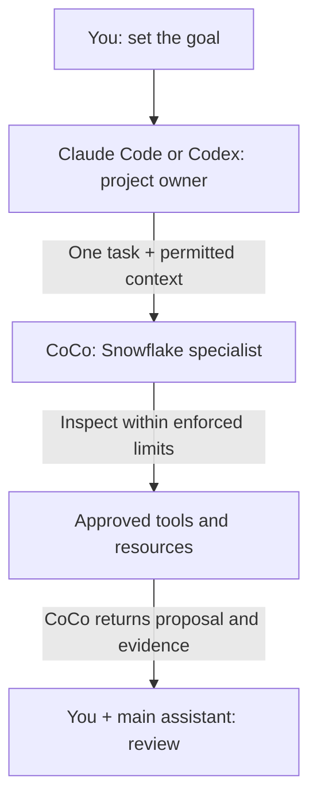

# Use Claude Code or Codex with CoCo for Snowflake Work

Keep building in Claude Code or Codex. When part of the project needs Snowflake-specific investigation, give Cortex Code (CoCo) that assignment and ask for a proposal with supporting evidence. Your usual assistant keeps ownership of application code and Git; you review the result before authorizing changes.

**Audience:** Developers using Claude Code or Codex for applications that involve Snowflake, and platform teams approving that workflow.

Pair-programmed by SE Community + Cortex Code

**Created:** 2026-10-08 | **Last verified:** 2026-10-08 | **Expires:** 2026-12-07 | **Status:** ACTIVE

> **No support provided.** Reference only; validate before production use.

---

## Start Here

**Keep one assistant in charge. Give CoCo one clear Snowflake job.**



*Responsibilities, not a security boundary: returned information may enter the external assistant's provider context. Written instructions do not enforce access limits.*

**For example:** You are building an order-summary endpoint. Keep the API work in your usual assistant; ask CoCo to check whether joining orders to order items counts an order's revenue twice. CoCo returns a proposed correction and checks, not permission to deploy it.

Think of a general contractor assigning an electrician one job. The contractor still owns the project. An assignment is not a key: database permissions and local restrictions determine what CoCo can actually reach.

### In This Guide

- [Connect Claude Code or Codex](#native-mcp-explicit-delegation)
- [Try your first assignment](#try-it-review-an-order-summary)
- [Add automatic routing with AI Kit](#ai-kit-automatic-routing)
- [Write a reliable handoff](#the-handoff-contract)
- [Manage permissions and data](#data-and-authority-boundaries)
- [Troubleshoot](#troubleshooting) and [explore alternatives](#reference-which-interface-is-this)

Prefer plain language? Read the [companion guide](ELI5.md).

## Before Connecting

Your organization must permit the external assistant and the information returned to it. Start with synthetic inputs, not production rows. Never send credentials or unrelated conversations.

Install the [CoCo CLI](https://docs.snowflake.com/en/user-guide/cortex-code/cortex-code-cli) through your approved process, configure a development connection, and confirm its effective privileges. Do not choose an administrative connection merely because it is the default. A read-only request is not a database-enforced restriction.

This walkthrough uses **native MCP**, the connection that lets your main assistant call CoCo as a tool. Start here before adding automatic routing; do not enable both integrations for the same workflow initially. You are assigning CoCo a task, not changing your usual assistant's model provider.

No Snowflake infrastructure is deployed. Registering the integration changes your assistant's configuration; review that change before applying it.

## Native MCP: Explicit Delegation

Your main assistant starts CoCo as a local process and calls its `cortex_code_agent` tool. The processes communicate through standard input and output (stdio). On the CoCo CLI 1.2.8 interface, each agent call is independent: send the context needed for that assignment.

### 1. Check CoCo

Use CoCo's **standard mode** for Snowflake work. Its separate **code mode** disables Snowflake data tools, MCP servers, and skills. [Mode reference](https://docs.snowflake.com/en/user-guide/cortex-code/code-mode)

Run these in your terminal:

```bash
cortex --version
cortex connections list
cortex mcp serve --help
```

Keep connection output private. Confirm that the last command actually describes **Start Cortex Code as an MCP server over stdio**, not just generic MCP management help. A successful exit code alone does not prove the subcommand exists. If the CLI says its version is no longer supported, update through your organization's approved process before troubleshooting the integration.

Select the approved connection name interactively; no credentials belong in a prompt or MCP configuration:

```bash
printf 'Approved development connection name: '
read -r COCO_CONNECTION
```

Run the following registration command for **one host**, from the intended project directory. These combine the hosts' documented stdio registration syntax with CoCo's server command. The connection must already be configured locally.

### 2. Register your assistant

Use **one** of the following blocks.

#### Claude Code

```bash
claude mcp add --transport stdio --scope local coco-snowflake -- \
  cortex mcp serve --connection "$COCO_CONNECTION" --workdir "$PWD"
```

Local scope keeps this registration personal to the project. Use `/mcp` in Claude Code to inspect connectivity and discovered tools. Project-shared configuration belongs in `.mcp.json`, not `.claude/mcp_servers.json`; agree on portable connection names and paths before sharing it. [Claude MCP documentation](https://code.claude.com/docs/en/mcp)

#### Codex

```bash
codex mcp add coco-snowflake -- \
  cortex mcp serve --connection "$COCO_CONNECTION" --workdir "$PWD"
```

Codex normally stores this in `~/.codex/config.toml`, shared by its local clients. That registration captures this project's absolute path: do not reuse it for another checkout without checking the working directory. For separate projects, use distinct registrations or trusted project-scoped configuration. Use `/mcp` to inspect the active server. [Codex MCP documentation](https://developers.openai.com/codex/mcp)

### 3. Prove the round trip

Paste into your main assistant:

```text
Call coco-snowflake's cortex_code_agent once.
Prompt: Reply exactly DELEGATION_OK. Do not use tools, read files,
access Snowflake data, or modify anything.
Set bypass=false and disallowed_tools=["*"].
Use the configured project directory and approved development connection.
Show the returned tool result. Do not infer success from server startup.
```

**What this proves:** The agent tool accepted the assignment and returned the marker. Inspect the actual tool result, not just your assistant's summary. This does not check database access or write restrictions.

**Optional, separate SQL check:** Authorize exactly `SELECT 1 AS SMOKE_VALUE`, with the built-in SQL tool pre-approved and effective database restrictions in place. It returns a constant, not account data. Success proves that query worked; it does **not** prove writes are blocked.

The discovered agent tool accepts `prompt`, `workdir`, `connection`, `profile`, `model`, `allowed_tools`, `disallowed_tools`, and `bypass`. Only `prompt` is required. The existence of connection/workdir overrides means the registration defaults are **not** an access boundary.

**Before approving a call:** One delegation can authorize a multi-step CoCo workflow, not a separate approval of each inner action. **Do not add `--bypass` to solve a stalled approval.** `allowed_tools` pre-approves matching tools; it is not a read-only SQL policy or an exclusive list of everything the child can reach. `disallowed_tools` removes tools from the child's context. The caller can request broad authority through `bypass`; protect the underlying account and local environment independently. Inspect the exact tool arguments before approving delegation.

The server also exposes direct documentation, object-search, Analyst, and Cortex Agent discovery tools. A call to one of those is not a call to `cortex_code_agent`. Keep the task at the smallest useful level: a documentation lookup does not require an autonomous child.

For long tasks, check the host's tool timeout. Codex documents a default MCP tool timeout of 60 seconds. Raise it deliberately for a bounded task; a timeout means the caller stopped waiting, not proof that all child work or submitted SQL stopped.

## Try It: Review an Order Summary

Your API needs daily order count and revenue. Before connecting real data, give CoCo a tiny synthetic case where the right answer is clear:

```text
Delegate this order-summary review to CoCo through cortex_code_agent.
Use only the synthetic facts below. No tools, files, or database access;
set bypass=false and disallowed_tools=["*"].

orders has one row per order: order_id, order_date, order_total.
order_items has one row per item: order_id, item_id.
On the same date, order A totals 30 and has two items;
order B totals 20 and has one item.
The proposed report joins orders to order_items, counts the joined rows,
and sums order_total.

Explain the error, propose the correct daily aggregation approach,
and give the expected result for this example. Identify assumptions.
Return a proposal and checks only. Do not change anything.
```

**Check the answer:** The correct daily result is **2 orders and 50 revenue**. The joined rows would produce 3 and 80. CoCo should explain that an order total repeats for each item and propose counting and summing at order grain. This is an expected result from the supplied facts, not a recorded agent response.

**Then make it useful:** With separate authorization, supply the actual query and named objects. Ask CoCo to inspect only those definitions, check types and join grain, and return a correction plus validation steps. No business-query execution or row samples are needed for that first review. A compilation check is not proof of correct results.

Your main assistant reviews the proposal and retains API, file-edit, and Git ownership. Approve any change separately. This small example teaches the handoff; routine arithmetic alone does not require a second agent.

## AI Kit: Automatic Routing

**Optional next step:** Once explicit delegation works, [Snowflake AI Kit](https://github.com/Snowflake-Labs/snowflake-ai-kit) can help route recurring Snowflake requests. It packages hooks, routing instructions, and a CoCo launcher. Do not combine its setup with the older `subagent-cortex-code` project.

### Read this before installing

In the reviewed **AI Kit 3.4.0** source, the two host paths have different controls:

- **Claude:** Uses a permission callback and an envelope decision function. SQL/shell prefix checks are workflow guards, not a replacement for database authorization or local isolation.
- **Codex:** Uses `--dangerously-allow-all-tool-calls` and `--no-mcp`. It validates the selected envelope before launch, but does not apply Claude's per-tool gate. **Selecting `RO` does not enforce read-only execution on this path.** Skills needing external MCP tools also lose those connections.
- **Approval configuration:** The upstream README says the approval-mode wrapper remains a simulation; validating configuration does not implement interactive approval.

Review the versioned [executor](https://github.com/Snowflake-Labs/snowflake-ai-kit/blob/e2a3cbb45a9a62b5648266c5777c1b2edb3f8579/plugins/cortex-code/scripts/router/execute_cortex.py#L557), [envelope policy](https://github.com/Snowflake-Labs/snowflake-ai-kit/blob/e2a3cbb45a9a62b5648266c5777c1b2edb3f8579/plugins/cortex-code/scripts/router/envelope_policy.py), and [configuration caveats](https://github.com/Snowflake-Labs/snowflake-ai-kit/blob/e2a3cbb45a9a62b5648266c5777c1b2edb3f8579/plugins/cortex-code/README.md#configuration). Establish independent database and local restrictions before using this path for real work.

### Install for your approved host

The upstream installation commands are:

```bash
# Claude Code
claude plugin install snowflake-cortex-code@claude-plugins-official
```

```bash
# Codex
codex plugin marketplace add Snowflake-Labs/snowflake-ai-kit
codex plugin add snowflake-cortex-code@snowflake-ai-kit
```

Use only the block for your approved host. Do not install a host your organization prohibits. The plugin still requires CoCo CLI and an authenticated Snowflake connection. Python launcher and optional YAML dependencies are described in the [plugin README](https://github.com/Snowflake-Labs/snowflake-ai-kit/tree/main/plugins/cortex-code); do not install dependencies into an externally managed system Python.

### Routing is a convenience, not a guarantee

The plugin uses a keyword prefilter and routing instructions. Explicit invocation uses the `cortex-run` skill: select it from your host's skill menu, then supply the bounded task. Do not assume every host renders the same slash-command prefix.

For mixed requests, first split the work: the parent edits the application, CoCo investigates the Snowflake interface, and the parent integrates the approved result. Do not send the whole conversation to CoCo simply because one sentence mentions Snowflake. Check that routing actually occurred and that the parent did not also execute the delegated change.

A short project instruction can make this repeatable:

```text
For Snowflake-specific investigation or implementation, propose a bounded
CoCo handoff. Keep application code, Git, and final acceptance here.
Name the approved connection and directory; ask if either is ambiguous.
Start with inspection/proposal. Do not authorize changes implicitly.
Send only relevant, permitted context and request a concise evidence summary.
Treat denial, timeout, or partial completion as a blocker, not a reason to
switch tools or retry a write. Do not delegate back into this same router.
```

Place this in the host's normal project instructions (`CLAUDE.md` or `AGENTS.md`) and adapt it to your team's workflow. It guides behavior; it does not enforce security.

### Installed version matters

A marketplace can pin a different revision than the repository's main branch. Inspect the installed plugin manifest and its resolved source revision; do not use a README badge as release evidence. Keep the host, CoCo CLI, and plugin versions in your team's private qualification record. Recheck the controls after updating any of the three.

## The Handoff Contract

**Give CoCo a task, not the keys to the project.** Include these fields in a delegation:

```text
Objective: One concrete Snowflake outcome.
Connection: Exact approved connection; do not switch accounts or roles.
Workspace: Exact directory and relevant files; preserve unrelated changes.
Scope: Named objects or synthetic schema; no account-wide exploration.
Authority: Inspect and propose only, or the exact separately approved change.
Context: Relevant requirements and evidence, not the complete chat history.
Return boundary: Metadata/aggregate summary only unless rows are authorized.
Acceptance: Observable checks that establish the result is correct.
Limits: Time/turn budget; stop and report if blocked or ambiguous.
Return: COMPLETE, PARTIAL, or BLOCKED; evidence; changed files/objects;
        validation results; query/session IDs when available; remaining work.
```

The main assistant (the **parent**) checks CoCo's return against these criteria. CoCo is the **child** for this assignment; those names describe responsibility, not inherited permissions.

### Choose a useful boundary

Delegate schema-grounded SQL work, Snowflake-specific behavior investigation, or a coherent implementation slice. Keep routine app edits, formatting, Git operations, and unrelated infrastructure in the parent. If the task is one known query with an established execution path, another agent may only add latency and context overhead.

CoCo's skills belong to its runtime. Installing a routing plugin does not copy all CoCo skills into the external host. Discover the actual child capability set instead of maintaining a hardcoded skill count or model list.

## Two More Assignments

Use the checklist above before adapting these prompts. Ask for missing identifiers rather than guessing.

### Design the Snowflake side of an application feature

```text
Keep the API and frontend work here. Ask CoCo to propose only the Snowflake
interface for the feature requirements already agreed in this conversation.
Use the approved development schema. Identify required objects, inputs,
outputs, privilege requirements, and compatibility risks.
Return a proposed change and validation/cleanup steps; do not create objects,
edit application files, grant access, or commit anything.
After I approve the exact change, execute only that change in development
and return the validation evidence for the parent to integrate.
```

Acceptance: the parent can implement against a clear interface; the child does not expand into deployment, account administration, or application ownership.

### Investigate a performance problem

```text
Ask CoCo to investigate only the query ID and observation period I provide.
Read the permitted execution/profile evidence. Separate observed facts from
hypotheses. Return the main bottleneck, one proposed change, and a comparison
protocol that preserves result semantics. Do not resize warehouses, enable
paid services, alter tables, or rerun an expensive workload without approval.
Return summarized metrics; do not return query literals or customer rows
unless I explicitly authorize them.
```

Acceptance: a recommendation has supporting evidence and a reproducible comparison plan. A faster-looking rewrite is not a measured improvement.

## Reliable Operation

### One writer, explicit context

Assign ownership before parallel work. Do not let both agents edit the same files or modify the same objects concurrently. Separate worktrees can isolate files, but they do not isolate a shared database schema. Keep commit, merge, push, and final review with the parent and user.

### Sessions are interface-specific

Native `cortex_code_agent` describes its calls as independent. AI Kit supports explicit session resume, but its current `--resume-last` state is a single per-user pointer with a 30-minute freshness check, not a task/account mapping. In concurrent work, use a known session ID bound to the same task, directory, and connection, or start fresh. Never enrich a task by sweeping unrelated recent conversations. [Session-state implementation](https://github.com/Snowflake-Labs/snowflake-ai-kit/blob/e2a3cbb45a9a62b5648266c5777c1b2edb3f8579/plugins/cortex-code/scripts/router/session_state.py)

### Completion requires evidence

For headless CLI workflows, inspect both process status and the final structured result, including error status. A tool call, initialization event, readable answer, or exit code by itself is insufficient. Preserve PARTIAL and BLOCKED states. Query IDs aid investigation; verify them against execution evidence when material.

After a timeout or cancellation, inspect what actually completed before retrying. SQL already submitted to Snowflake may need separate cancellation or reconciliation. A retry must not duplicate inserts, deployment actions, or grants.

### Bound overhead

Send the smallest useful context, batch related investigation into one handoff, and cap turns/time. Delegation can incur both the parent's inference usage and CoCo usage, plus any Snowflake compute or services invoked. Do not promise lower cost or faster results without measuring the same task and acceptance criteria.

## Data and Authority Boundaries

**Local stdio describes transport between processes, not the full data journey.** Prompts and tool results can enter the external model provider's context; CoCo separately communicates with Snowflake. Summarization reduces volume but does not make confidential information public.

Keep four controls separate:

1. **Parent approval:** Whether the external harness may invoke the delegation tool and with which arguments.
2. **Child permissions:** Which CoCo tools may execute and how unresolved permission requests are handled. Parent plan mode does not automatically make the child read-only.
3. **Local isolation:** Which directories, credentials, shell commands, and network destinations the child process can access. Do not assume an external host's sandbox covers every MCP subprocess in the same way.
4. **Snowflake authority:** RBAC plus any active Restricted Session Scope. Select a narrow connection and verify effective access, including secondary roles and callable programs.

[Restricted Session Scope](https://docs.snowflake.com/en/user-guide/restricted-session-scope) can impose a server-side privilege ceiling without granting new access. A restriction in a Desktop chat is not evidence that a separately launched CLI child inherited it. Check the child session itself. Agent-aware session policies depend on the connection activating agent context; arbitrary alternate SQL clients must not be assumed to inherit that protection.

The native agent tool's schema does not expose every CLI control, such as a named RSS startup option or a turn limit. Do not invent JSON fields or assume flags on one interface apply to another. If the required boundary cannot be enforced through the selected interface, choose a constrained documented CLI/SDK workflow or have the operator perform the task in CoCo directly.

Never pass connection-file contents, private keys, tokens, or unrelated transcripts to either agent. Treat local logs and saved conversations as sensitive. A permission denial is a stop condition, not an invitation to switch connection, use a shell client, or increase privileges.

## Troubleshooting

- **CoCo starts but work never completes:** Separate authentication failure, unanswered child approval, timeout, and missing final result. Do not automatically enable bypass or retry the write.
- **The MCP command appears missing:** Confirm a connection is configured and inspect actual `serve --help` output. Do not infer the cause from an old blog's release-channel advice.
- **Wrong account or directory:** Inspect registration defaults and per-call overrides. Confirm the child's identity before accessing data; a connection label in a prompt is not proof.
- **Automatic routing misses a prompt:** Use the explicit CoCo skill/tool, or split mixed work first. Do not install another router on top of the first.
- **MCP tools disappear in the child:** Check whether the chosen integration disables MCP; current AI Kit's Codex path does. Also check runtime policy and connection configuration.
- **A follow-up continues the wrong task:** Start fresh or use the intended session ID. Avoid a global last-session shortcut with multiple projects.
- **Plugin configuration fails:** Follow the error's named file and interpreter guidance. Do not bypass configuration validation or retry with a different interpreter to evade policy.
- **Tools work but writes remain possible:** Tool approval and SQL read-only enforcement are different. Verify the database restriction, not just the plugin envelope label.

To stop using the integration, disable its server or plugin in the host's configuration. Remove only the registration added for this workflow; retain shared connections and unrelated MCP servers. Disabling an integration does not undo completed database changes.

## Reference: Which Interface Is This?

- **Model-provider routing** changes where your main assistant obtains inference; it does not give it CoCo's skills.
- **Direct SQL or metadata tools** let the main assistant choose individual queries and lookups, without delegating a CoCo task.
- **CoCo delegation** assigns a task to a separate CoCo agent with its own tools and skills.
- **Snowflake-managed MCP and Cortex Agents** expose account-side objects and workflows, not the local `cortex mcp serve` process.
- **ACP** embeds CoCo as an editor's agent backend, rather than a specialist called by another assistant.

### Advanced alternatives

**Direct headless CLI:** Useful when the parent can launch a bounded subprocess and inspect its structured result. The [CLI reference](https://docs.snowflake.com/en/user-guide/cortex-code/cli-reference) documents explicit connection/workdir, print mode, structured output, turn limits, and named RSS startup. Use subprocess argument arrays in custom code; never interpolate untrusted prompt text into a shell command.

**CoCo Agent SDK (Preview):** Useful when an application needs structured output, explicit session ownership, or an approval callback. Preserve CoCo's default system prompt when adding task instructions. `canUseTool` handles unresolved permission checks; pre-allow rules or bypass can prevent that callback from being invoked. Missing approval handling fails rather than providing an interactive terminal automatically. [SDK approval documentation](https://docs.snowflake.com/en/user-guide/cortex-code-agent-sdk/user-input)

**ACP:** Use when the goal is CoCo inside an ACP-compatible editor, not delegation from another coding agent. Avoid building an ACP-to-MCP adapter merely to reproduce an existing interface.

## Development Tools

This guide contains reader documentation only. Cortex Code and other coding assistants can follow the repository's contributor instructions; no project-specific `AGENTS.md`, `.claude/skills/`, executable wrapper, or deployment script is required. Integration configuration belongs in the reader's approved environment, not this repository.

## Related Guides

- [CoCo CLI installation and connections](https://docs.snowflake.com/en/user-guide/cortex-code/cortex-code-cli)
- [Claude Code MCP configuration](https://code.claude.com/docs/en/mcp)
- [Codex MCP configuration](https://developers.openai.com/codex/mcp)
- [Restricted Session Scope for agents](https://docs.snowflake.com/en/user-guide/restricted-session-scope)

## External References

- [Snowflake AI Kit](https://github.com/Snowflake-Labs/snowflake-ai-kit)
- [Snowflake Cortex Code plugin listing](https://claude.com/plugins/snowflake-cortex-code)
- [Versioned AI Kit implementation and limitations](https://github.com/Snowflake-Labs/snowflake-ai-kit/tree/e2a3cbb45a9a62b5648266c5777c1b2edb3f8579/plugins/cortex-code)
- [CoCo CLI reference](https://docs.snowflake.com/en/user-guide/cortex-code/cli-reference)
- [CoCo code mode](https://docs.snowflake.com/en/user-guide/cortex-code/code-mode)
- [CoCo Agent SDK](https://docs.snowflake.com/en/user-guide/cortex-code-agent-sdk/cortex-code-agent-sdk)
- [SDK permissions and user input](https://docs.snowflake.com/en/user-guide/cortex-code-agent-sdk/user-input)
- [CoCo ACP support](https://docs.snowflake.com/en/user-guide/cortex-code/cortex-code-acp)
