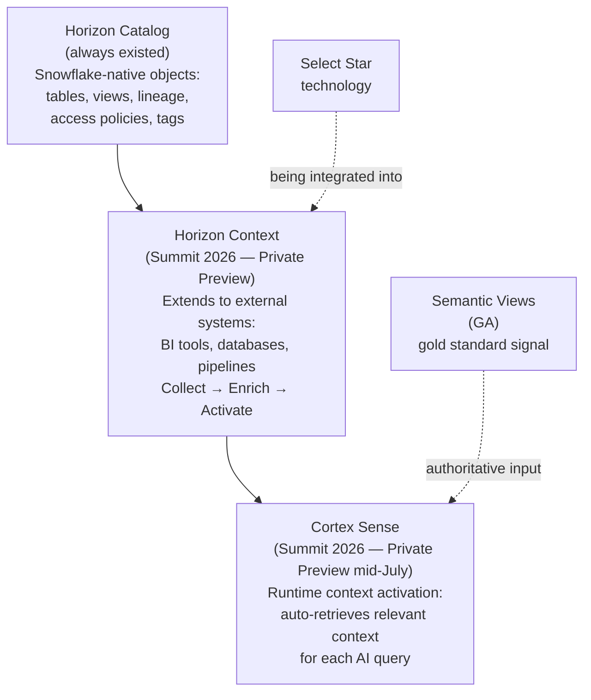

# Horizon Context + Cortex Sense: The Catalog Pivot Explained

Snowflake's [acquisition of Select Star](https://www.snowflake.com/en/blog/snowflake-acquire-select-star/), combined with the Summit 2026 announcements of [Horizon Context](https://www.snowflake.com/en/blog/horizon-context-governed-context/) and [Cortex Sense](https://www.snowflake.com/en/blog/enterprise-ai-agents-grounded-context/), represents a significant shift in how data context reaches AI agents. This guide explains the full stack, what changed for customers who built security boundaries around semantic views and agents, and what questions remain open.

**Audience:** SEs fielding questions from customers who have deployed Cortex Agents, semantic views, or third-party data catalogs — and now need to understand the new model.
**Created:** 2026-07-09 | **Expires:** 2026-10-09 | **Status:** ACTIVE

Pair-programmed by SE Community + Cortex Code

> **Availability caveat.** The features in this guide are moving fast. Horizon Context metadata connectors and Cortex Sense are both in **private preview** as of this writing. Every availability status is noted inline. Re-verify before quoting specific claims to customers. Benchmark figures are from Snowflake's internal tests and do not represent guaranteed customer results.

---

## Vocabulary

| Term | Plain meaning |
|---|---|
| **Horizon Catalog** | Snowflake's built-in data governance and discovery layer. Covers Snowflake-native objects: tables, views, lineage, access policies, tags, and documentation. Has always existed; Horizon Context builds on top of it. |
| **Horizon Context** | Announced Summit 2026. Extends Horizon Catalog to pull metadata from systems outside Snowflake — BI tools, databases, data pipelines — and enriches it into a governed semantic foundation. |
| **Metadata Connector** | A built-in integration that ingests schemas, query logs, and dashboard definitions from an external system into Horizon Catalog. |
| **Select Star** | A data catalog company Snowflake acquired (technology and team). Known for cross-system lineage and usage-based popularity signals. Its integrations are being incorporated into Horizon Context. |
| **Semantic View** | A Snowflake object that defines business metrics, dimensions, and relationships over raw tables. Used by Cortex Analyst to answer natural-language questions. |
| **Cortex Sense** | Announced Summit 2026 (private preview mid-July 2026). A runtime context layer that automatically retrieves and injects the most relevant catalog context into AI queries — without the agent having to discover it manually. |
| **Cortex Analyst** | The Snowflake service that generates SQL from natural language using a semantic view as its business logic layer. |
| **CoWork** | Snowflake's business-user-facing agent interface, rebranded from Snowflake Intelligence at Summit 2026. Coordinates specialist agents; Cortex Sense powers its context retrieval. |
| **OpenLineage** | An open standard for lineage metadata. Systems like Apache Airflow can push lineage directly into Horizon Catalog via the OpenLineage API. |
| **OSI** | Open Semantic Interchange — a Snowflake-led open standard for exchanging semantic metadata across catalog vendors. |
| **RBAC** | Role-based access control. Governs which Snowflake roles can access which objects. |
| **GA / Public Preview / Private Preview** | Snowflake maturity labels. GA = production-ready. Public Preview = available to all accounts, may change. Private Preview = limited access, must request. |

---

## The Problem Catalogs Were Built to Solve

In 2026, your head of sales sees $14.2 million in Q3 revenue. Your CFO sees $12.8 million. Both asked an AI agent the same question this morning. This is the metric drift problem — business logic scattered across a BI model only one team owns, a calculation buried in a dashboard, instructions hardcoded into an LLM prompt. *(Opening scenario from [Snowflake's Horizon Context announcement](https://www.snowflake.com/en/blog/horizon-context-governed-context/).)*

Traditional data catalogs (Alation, Collibra, and their predecessors) were built to solve a version of this: make it possible to find your data and understand what it means. They built inventories. They worked well for human data stewards.

They were never designed for what AI agents need: **business meaning embedded at query time, automatically, every time, for every agent.** An agent does not browse a catalog. It needs the right context injected into its reasoning before it can answer correctly.

That gap — passive inventory vs active runtime context — is what Snowflake's current catalog pivot is about.

---

## What Select Star Brought

Select Star was a data catalog platform that did two things particularly well:

1. **Cross-system lineage.** It traced data from source databases through transformation pipelines into BI dashboards — not just within Snowflake, but across PostgreSQL, MySQL, Tableau, Power BI, dbt, and Airflow.

2. **Usage-based popularity signals.** Rather than relying on manual tagging, it used actual query logs and access patterns to identify which data assets were authoritative and trusted.

[Snowflake acquired the Select Star team and platform technology](https://www.snowflake.com/en/blog/snowflake-acquire-select-star/). These integrations are being incorporated into Horizon Context. No public announcement has been made about the Select Star standalone product roadmap; Snowflake's stated intent is to expand Horizon Catalog's reach using this technology.

---

## The Three-Layer Stack

Understanding the current architecture requires seeing all three layers together:



Each layer has a distinct job:
- **Horizon Catalog** — the governed inventory of everything Snowflake knows about your data
- **Horizon Context** — expands that inventory to external systems and enriches raw metadata into business meaning
- **Cortex Sense** — makes that enriched context *active* at query time, injecting what each AI query actually needs

---

## Horizon Context in Detail

Horizon Context organizes its work into three phases.

### Collect

Horizon Context pulls metadata from systems outside Snowflake using built-in metadata connectors. Wave 1 connectors (all in **private preview** [as announced June 2026](https://www.snowflake.com/en/blog/horizon-context-governed-context/)):

| Connector | What it collects |
|---|---|
| PostgreSQL | Schemas, query logs |
| Microsoft SQL Server | Schemas, query logs |
| Tableau | Dashboard definitions, calculated fields |
| Power BI | Report definitions, measures |
| dbt | Model definitions, column descriptions, lineage |

Additionally, the **OpenLineage API** ([public preview](https://www.snowflake.com/en/blog/horizon-context-governed-context/)) allows systems like Apache Airflow to push lineage data directly into Horizon Catalog without a pull connector.

The **Open Semantic Interchange (OSI)** standard — led by Snowflake with [54 participating vendors as of June 2026](https://www.snowflake.com/en/blog/open-semantic-interchanges-specs-finalized/) — defines a common format for exchanging semantic metadata across catalog vendors and BI tools.

### Enrich

Once collected, raw metadata is enriched into usable business context:

- **End-to-end column-level lineage** — stitched together from Snowflake query logs, external system logs, BI definitions, and OpenLineage feeds
- **Popularity signals** — query and access frequency used to identify which assets are authoritative vs experimental
- **AI-generated documentation** — table and column descriptions generated from metadata (and optionally sample data)
- **Semantic Views** — the governed business definition layer. [Semantic View Autopilot](https://docs.snowflake.com/en/user-guide/views-semantic/autopilot) (GA as of February 3, 2026) can generate semantic views from existing SQL, Tableau `.twb`/`.twbx`, and Power BI `.pbix` files.

### Activate

Enriched context is only valuable if it reaches the AI at the right moment:

- **Universal Search** — CoCo's context retrieval uses hybrid keyword + semantic search, filtered by access control policies, ranked by popularity
- **Automatic semantic view discovery** — when asked a data question, CoCo searches for and uses relevant semantic views, falling back to direct table access if none exist
- **Semantic View interoperability** — semantic views exposed via MCP allow Claude, Cursor, and other MCP clients to query Snowflake data with governed business logic. Power BI (private preview, coming soon), Excel (private preview, coming soon), ThoughtSpot (early access), and Looker (preview) are expanding the ecosystem.

---

## Cortex Sense: The Runtime Activation Layer

Horizon Context builds the enriched catalog. Cortex Sense is what makes that catalog *work automatically for every AI query* — without anyone having to configure which context each agent receives.

### Why It Exists

Snowflake's own product team found that even with Semantic View Autopilot, they had covered [fewer than 5% of their 9,685 internal tables](https://www.snowflake.com/en/blog/enterprise-ai-agents-grounded-context/) with semantic views. Any query that fell outside that 5% either got a wrong answer or no answer. Tables created two weeks ago have no semantic view. Cortex Sense is designed to fill that gap.

### How It Works

Cortex Sense builds a working model of your data estate automatically from signals your organization already produces:
- Query history from Snowflake and connected external systems
- Object metadata and table structures
- BI dashboard definitions (Power BI, Tableau) via Horizon Context connectors
- Semantic views — treated as the authoritative, highest-ranked signal

Rather than injecting the full catalog into every prompt (expensive, slow, and often wrong), Sense retrieves only the context relevant to the specific query. It ranks candidates by relevance, authority, popularity, and freshness.

### Accuracy and Cost (Snowflake Internal Benchmark)

Snowflake published the following results from [internal testing on their own product analytics data in June 2026](https://www.snowflake.com/en/blog/enterprise-ai-agents-grounded-context/). These are internal benchmarks; they do not represent guaranteed results on customer workloads.

| Setup | Accuracy |
|---|---|
| Frontier coding agent with direct SQL access (no context layer) | ~24% |
| CoCo with Cortex Sense | ~86% |

Snowflake's blog states accuracy "improved from 24.1% to 86.3%." An intermediate data point for vanilla CoCo is visible in the chart in the blog post but is not stated in the text; it is not quoted here to avoid misrepresentation.

Cost comparison on the same benchmark:

| Setup | Estimated cost per query |
|---|---|
| Frontier agent (manually inspecting tables via DESCRIBE) | ~$1.76 |
| CoCo + Cortex Sense | ~$0.59 |

The cost reduction comes from eliminating the agent's need to run `DESCRIBE TABLE` on dozens of objects to figure out what exists. Sense tells it where to look. Note: there is an upfront one-time indexing cost when Sense first ingests your data estate; Snowflake's blog states this is recoverable over time through lower per-query costs.

### Self-Correcting Evaluation Loop

Because Sense builds its understanding automatically rather than from hand-curated definitions, it includes a mechanism to surface and resolve conflicts:

- When evaluation queries fail, Sense reflects on why and attempts to update its own model
- When it detects conflicting definitions (e.g., multiple teams computing "daily active users" differently), it surfaces the conflict to the admin and asks them to resolve it in natural language
- Evaluation inputs come from three sources: your own gold-standard benchmark queries, end-user feedback, and Sense's own suggestions for areas where its coverage is thin

### Access Control in Private Preview

From [Snowflake's official blog (June 30, 2026)](https://www.snowflake.com/en/blog/enterprise-ai-agents-grounded-context/):

> *"Cortex Sense will only ingest metadata and usage patterns, not your actual data rows. But like all other Snowflake objects, access will be scoped by role through Snowflake's existing governance. We're starting our private preview soon by allowing users to specify a single role that will get access to all of Cortex Sense, and will plan to expand to per-role contexts in the future, so your marketing team and finance team will get access to different contexts."*

**Current state (private preview):** A single designated role governs access to all Cortex Sense context. Per-role context differentiation is on the roadmap but not yet available.

---

## The Security Boundary Question

This is the section most customers with existing deployments will care about most.

### The Architecture Many Customers Built

Security-conscious customers — particularly in financial services, healthcare, and regulated industries — built a deliberate two-checkpoint model:

```
Layer 1: RBAC
  The calling role's access scope.
  Controls what data the user (and agents acting as the user)
  can physically query.

    ↓

Layer 2: Semantic view as explicit tool configuration
  The agent is configured to use only sv_regional_sales.
  Even though the analyst role has SELECT on finance.*,
  the agent's declared tool interface is the semantic view —
  a hard programmatic ceiling below the role's theoretical scope.
```

This gave customers two independently auditable checkpoints. Compliance teams could state: *"This agent could only ever answer questions through these 5 metrics. Here is the tool configuration that proves it."*

### What Changes With Cortex Sense

**What does NOT change:**

- RBAC still governs what data the agent can query. Sense ingests metadata and usage patterns only — not data rows. An agent cannot access data its role cannot reach.
- Semantic views are still supported as explicit tool configurations for Cortex Agents.
- Snowflake [states that governance policies follow context](https://www.snowflake.com/en/blog/horizon-context-governed-context/): *"role-based access control policies and row-level masking follow the context: every tool, every query and every AI response."*

**What is different:**

Cortex Sense automatically retrieves and injects context from across the catalog at query time, ranked by relevance, authority, popularity, and freshness. The agent receives a richer, algorithmically-assembled context rather than a fixed, declared one.

In the current private preview, Sense operates at a single-role scope — not at individual agent tool boundaries. This means:

- An agent running under a broad analyst role will receive Sense context drawn from the full scope of what that role can see — not limited to the specific semantic view declared in the agent's tool configuration
- The agent's **data access** remains bounded by its tool configuration and role. Its **context awareness** (what it knows exists) may be broader

**The question Snowflake has not yet answered publicly:**

> *Does Cortex Sense context retrieval respect an agent's configured tool scope (e.g., limited to `sv_regional_sales`), or does it operate at the calling user's full RBAC role scope?*

Snowflake's blog states access is scoped by role. It does not specify that Sense context is scoped to configured agent tools. If your use case requires that an agent not only be unable to query certain data but be unaware of its existence, this distinction matters. **Raise this question with your Snowflake account team before enabling Cortex Sense on sensitive workloads.**

### The Related Agent Identity Risk

Separately from Sense, security practitioners (including [P0 Security's April 2026 research](https://p0.dev/blog/when-your-snowflake-ai-agent-can-query-everything-you-can-query/), summarized by NHIMG) have documented a privilege inheritance pattern:

> [Cortex Agents inherit the Snowflake session permissions of the **calling user's default role**](https://docs.snowflake.com/en/user-guide/snowflake-cortex/cortex-agents), not a purpose-built minimal agent role. An analyst role with broad SELECT access that was acceptable for deliberate human use becomes a broader blast radius when inherited by an autonomous agent operating at machine speed.

This is not a new risk introduced by Horizon Context or Cortex Sense. It is a pre-existing design characteristic of how Cortex Agents execute. Sense does not make it worse — but it makes it more visible, because the value of Sense is directly proportional to how much of your data estate the agent can draw context from.

### Practical Guidance

For customers navigating this:

| Use case | Recommended approach |
|---|---|
| Discovery, analytics, CoWork queries | Enable Cortex Sense. This is what it is designed for. |
| Regulated workload with auditability requirement | Keep explicit semantic view tool configuration. Do not rely on Sense for scope control until per-role context is GA. |
| Any agent deployment | Use purpose-built, minimal-privilege agent roles — not reused analyst or developer roles. |
| MCP-connected agents | Inventory every downstream system that can receive agent output. The data path extends beyond the warehouse. |

---

## Governance: What Snowflake Claims

From the [Horizon Context blog (June 2, 2026)](https://www.snowflake.com/en/blog/horizon-context-governed-context/):

> *"Because [Horizon Context] is native to the Snowflake engine, governance framework is enforced at the meaning level, not just the table level. Your role-based access control policies and row-level masking follow the context: every tool, every query and every AI response. A definition restricted for the finance team stays restricted in Power BI, in Salesforce and in any agent that queries it."*

The key claim is that governance is enforced at the engine, not cached or copied to a secondary system. This is Snowflake's competitive argument against third-party semantic layers: when definitions live inside the governance engine, they can't drift out of sync with policies. The same masking and access controls that apply to direct table queries apply to semantic view queries, BI queries, and agent queries.

For customers with Alation, Collibra, or Atlan: Snowflake has announced integration partnerships with all three. Horizon Context is positioned as a complementary metadata destination, not a replacement for enterprise catalog platforms that serve broader discovery, stewardship, and lineage use cases across heterogeneous stacks.

---

## Availability Summary

| Feature | Status | Notes |
|---|---|---|
| Horizon Catalog (base) | **GA** | Always available |
| Semantic Views | **GA** | Foundation of the semantic layer |
| Semantic View Autopilot | **GA** | Auto-generates semantic views from SQL, Tableau, Power BI files |
| OpenLineage API | **Public Preview** | Configure Airflow etc. to push lineage to Horizon Catalog |
| Horizon Context metadata connectors (PostgreSQL, SQL Server, Tableau, Power BI, dbt) | **Private Preview** | Request access via Snowflake account team |
| Semantic Studio (AI-assisted semantic view IDE) | **Private Preview** | |
| Advanced Semantics (LOD calculations, composable definitions) | **Private Preview** | |
| Cortex Sense | **Private Preview (mid-July 2026)** | Single-role access only; per-role context is roadmap |
| Cortex Sense — per-role context differentiation | **Roadmap** | Explicitly called out as future in Snowflake's blog |
| Power BI semantic view interop | **Private Preview (soon)** | |
| Excel semantic view interop | **Private Preview (soon)** | |

---

## Competitive Context

**Atlan, Alation, Collibra:** All three announced integrations *with* Horizon Context at Summit 2026. Snowflake is not positioning as a wholesale catalog replacement. The pitch is that semantic definitions governed inside Snowflake flow *to* these catalogs, not that Snowflake eliminates them. Atlan states (in their own marketing) that they ship 100+ connectors in GA. Snowflake's current Wave 1 has five connectors in private preview. The breadth gap is real for customers who need broad cross-system catalog coverage today.

**Databricks Genie Ontology:** [Announced at Databricks Data + AI Summit 2026](https://www.databricks.com/blog/introducing-genie-one-genie-ontology-and-genie-agents) (June 16, 2026), approximately two weeks after Snowflake's Summit announcements. Addresses the same problem — a continuously learned context layer for AI agents built from query history, pipelines, and connected applications. Different architectural approach and platform. Customers evaluating both platforms should do a structured comparison; the problem statement is identical, the implementation is platform-specific.

---

## Common Objections and How to Respond

**"We already have Alation/Collibra. Do we need this?"**
Horizon Context is not asking you to replace your enterprise catalog. It is asking whether the semantic context that governs your AI agents should live inside the engine that enforces your access policies, or in a separate system that has to stay in sync. For agent workloads specifically, the native-to-engine argument is worth evaluating.

**"The connectors are in private preview. When is it GA?"**
Snowflake hasn't published a GA date. Private preview means limited access today; request access through your account team. Be transparent with customers that this is early access.

**"We built semantic views as security boundaries. Does Sense break that?"**
Data access boundaries (RBAC) are unchanged. The open question is whether Sense context retrieval is scoped to configured agent tools or only to the calling role. Snowflake has not specified this publicly. Don't promise it works either way — raise it with the account team.

**"Select Star was an independent product. Are you killing it?"**
Snowflake announced acquisition of the technology and team. No public statement has been made about the Select Star standalone product roadmap. Point to Snowflake's acquisition blog post and let the account team address product transition questions.

**"Benchmarks don't mean much."**
Agree — the 24% → 86% figure is from Snowflake's internal testing on their own data. The relevant question for any customer is: *what percentage of your data estate is covered by semantic views today?* If the answer is low (Snowflake found theirs was under 5%), then the gap Sense fills is real regardless of the exact benchmark.

---

## External References

- [Horizon Context blog — Snowflake (June 2, 2026)](https://www.snowflake.com/en/blog/horizon-context-governed-context/)
- [Cortex Sense blog — Snowflake (June 30, 2026)](https://www.snowflake.com/en/blog/enterprise-ai-agents-grounded-context/)
- [Snowflake to Acquire Select Star — Snowflake blog](https://www.snowflake.com/en/blog/snowflake-acquire-select-star/)
- [Horizon Context product page](https://www.snowflake.com/en/product/features/horizon-context/)
- [Horizon Catalog product page](https://www.snowflake.com/en/product/features/horizon/)
- [Cortex Agents documentation](https://docs.snowflake.com/en/user-guide/snowflake-cortex/cortex-agents)
- [Cortex Agents access control and authentication](https://docs.snowflake.com/en/user-guide/snowflake-cortex/cortex-agents-setup)
- [Semantic View Autopilot](https://docs.snowflake.com/en/user-guide/views-semantic/autopilot)
- [Open Semantic Interchange specification](https://www.snowflake.com/en/blog/open-semantic-interchanges-specs-finalized/)
- [P0 Security: Snowflake Cortex agents and privilege inheritance (April 2026)](https://p0.dev/blog/when-your-snowflake-ai-agent-can-query-everything-you-can-query/) — external security research, not a Snowflake statement

---

Pair-programmed by SE Community + Cortex Code
