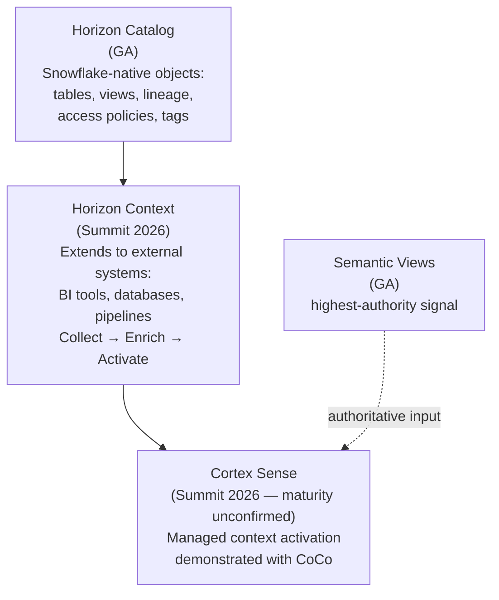

# Horizon Context + Cortex Sense: The Context Stack Explained

Snowflake's Summit 2026 announcements of [Horizon Context](https://www.snowflake.com/en/blog/horizon-context-governed-context/) and [Cortex Sense](https://www.snowflake.com/en/blog/enterprise-ai-agents-grounded-context/) changed how data context reaches AI agents. This guide separates the three layers of that stack, records the verified availability status of each piece, and states plainly which agent security boundaries Snowflake has documented and which remain open questions.

**Audience:** SEs and platform owners who have deployed Cortex Agents or semantic views and need to know what the context layer does to their existing access-control model.
**Created:** 2026-07-09 | **Expires:** 2027-01-09 | **Status:** ACTIVE

Pair-programmed by SE Community + Cortex Code

> **No support provided.** Reference only; validate before production use.

> **Availability caveat.** Statuses in this guide were re-verified against Snowflake product documentation on **2026-09-21** and are recorded in [Availability Summary](#availability-summary). Several pieces of this stack have no product documentation page at all — where that is true, this guide says so rather than inferring a maturity level. Benchmark figures are from Snowflake's internal tests and do not represent guaranteed customer results.

---

## Start Here

Use this guide in three passes:

1. Read **The Three-Layer Stack** to separate Horizon Catalog, Horizon Context, and Cortex Sense. These are three different things and customers routinely conflate them.
2. Read **The Agent Security Boundary** before discussing regulated or least-privilege deployments. This is the durable core of the guide.
3. Check **Availability Summary** before quoting any status to a customer. Two rows changed maturity in the last month.

Treat announced roadmap behavior, current product availability, and documented Cortex Agent controls as three separate categories of fact. This guide marks the boundaries between them explicitly.

Ready to act? Use [What Can I Do Now?](docs/01-WHAT-CAN-I-DO-NOW.md) for a capability-by-capability checklist and 30-day action plan.

---

## Vocabulary

| Term | Plain meaning |
| --- | --- |
| **Horizon Catalog** | Snowflake's built-in governance and discovery layer over Snowflake-native objects: tables, views, lineage, access policies, tags, documentation. Has always existed; Horizon Context builds on top of it. |
| **Horizon Context** | Announced Summit 2026. Extends Horizon Catalog to pull metadata from systems outside Snowflake — BI tools, databases, pipelines — and enrich it into a governed semantic foundation. |
| **Metadata Connector** | A built-in integration that ingests schemas, query logs, and dashboard definitions from an external system into Horizon Catalog. |
| **Semantic View** | A Snowflake object defining business metrics, dimensions, and relationships over raw tables. Used by Cortex Analyst to answer natural-language questions. |
| **Cortex Sense** | Announced Summit 2026 as a managed context layer that retrieves relevant catalog context at query time, demonstrated with CoCo. It has no product documentation page; see [Availability Summary](#availability-summary). |
| **Cortex Analyst** | The Snowflake service that generates SQL from natural language using a semantic view as its business logic layer. |
| **CoWork** | Snowflake's business-user-facing agent interface, renamed from Snowflake Intelligence at Summit 2026. The `SNOWFLAKE_INTELLIGENCE` database identifier used in DDL is unchanged. |
| **OpenLineage** | An open standard for lineage metadata. Tools such as dbt and Apache Airflow push lineage into Horizon Catalog through Snowflake's external lineage REST endpoint. |
| **Apache Ossie (Incubating)** | The vendor-neutral semantic specification formerly called Open Semantic Interchange (OSI). Accepted into the Apache Incubator under its new name in July 2026. |
| **RBAC** | Role-based access control. Governs which Snowflake roles can access which objects. |
| **GA / Public Preview / Private Preview** | Snowflake maturity labels. GA = production-ready. Public Preview = available to all accounts, may change. Private Preview = limited access, must request. |

---

## Why a Context Layer Exists

Your head of sales sees $14.2 million in Q3 revenue. Your CFO sees $12.8 million. Both asked an AI agent the same question this morning. This is metric drift — business logic scattered across a BI model only one team owns, a calculation buried in a dashboard, instructions hardcoded into a prompt. *(Opening scenario from [Snowflake's Horizon Context announcement](https://www.snowflake.com/en/blog/horizon-context-governed-context/).)*

A catalog that is a passive inventory does not fix this. It tells a human where to look. An agent answering a question needs the governed definition handed to it at the moment it is asked, and needs to be told which of several competing definitions is authoritative.

That gap — passive inventory versus active runtime context — is what this stack addresses.

---

## The Three-Layer Stack


```mermaid
flowchart TD
    HC["Horizon Catalog\n(GA)\nSnowflake-native objects:\ntables, views, lineage,\naccess policies, tags"]
    HCtx["Horizon Context\n(Summit 2026)\nExtends to external systems:\nBI tools, databases, pipelines\nCollect → Enrich → Activate"]
    CS["Cortex Sense\n(Summit 2026 — maturity unconfirmed)\nManaged context activation\ndemonstrated with CoCo"]

    HC --> HCtx --> CS

    SV["Semantic Views\n(GA)\nhighest-authority signal"] -.->|"authoritative input"| CS
```

Each layer has a distinct job:

- **Horizon Catalog** — the governed inventory of everything Snowflake knows about your data.
- **Horizon Context** — expands that inventory to external systems and enriches raw metadata into business meaning.
- **Cortex Sense** — the layer Snowflake demonstrated making enriched context active at query time for CoCo, retrieving relevant context instead of inspecting the estate table by table.

The distinction that matters operationally: the first two layers are about what Snowflake *knows*. The third is about what an agent *receives at query time*. Access-control questions live almost entirely in the third layer.

---

## Horizon Context in Detail

Horizon Context organizes its work into three phases.

### Collect

Horizon Context pulls metadata from systems outside Snowflake using built-in metadata connectors. The Wave 1 connectors [announced June 2026](https://www.snowflake.com/en/blog/horizon-context-governed-context/):

| Connector | What it collects |
| --- | --- |
| PostgreSQL | Schemas, query logs |
| Microsoft SQL Server | Schemas, query logs |
| Tableau | Dashboard definitions, calculated fields |
| Power BI | Report definitions, measures |
| dbt | Model definitions, column descriptions, lineage |

These were announced in private preview and have no product documentation page as of this revision. Confirm availability per account and region with the Snowflake account team before committing to any of them in a design.

Separately, **[external lineage](https://docs.snowflake.com/en/user-guide/external-lineage)** — the OpenLineage ingestion path — reached **GA on September 3, 2026**. Tools such as dbt and Apache Airflow POST OpenLineage `COMPLETE` events to `/api/v2/lineage/external-lineage` and they appear in the native Snowsight lineage graph. This is the one Collect path you can build on today without a preview request. Operational constraints worth knowing up front: it requires Enterprise Edition, the sending role needs `INGEST LINEAGE` on the account *and* must be able to resolve every Snowflake object named in the payload (one unresolvable object rejects the whole event), and an account can hold at most 20,000 external lineage edges.

**[Apache Ossie (Incubating)](https://www.snowflake.com/en/blog/apache-ossie-open-semantic-interchange-incubator/)** — formerly Open Semantic Interchange (OSI) — defines a vendor-neutral format for exchanging semantic metadata across catalog vendors, BI tools, query engines, and AI agents. The June 2026 Horizon Context announcement cited 54 participating vendors; the July Apache update describes the coalition as more than 50 organizations.

### Enrich

Once collected, raw metadata is enriched into usable business context:

- **End-to-end column-level lineage** — stitched from Snowflake query logs, external system logs, BI definitions, and OpenLineage feeds. Column-level mappings arrive through the OpenLineage `columnLineage` facet and are resolved best-effort: an unresolvable column is skipped rather than failing the event.
- **Popularity signals** — query and access frequency used to distinguish authoritative assets from experimental ones.
- **Certification status** — the explicit human signal that an asset is trusted. Note the tag moved: `SNOWFLAKE.TAGS.CERTIFICATION_STATUS` arrived in public preview on August 31, 2026 and is now the recommended tag. `SNOWFLAKE.CORE.CERTIFICATION_STATUS` is **still supported and has not been deprecated**, but Snowflake documents it as planned for deprecation in a future release. New work should use the `SNOWFLAKE.TAGS` tag, whose allowed values are fixed by Snowflake and cannot be modified by account administrators — which is what lets governance and AI workflows interpret it consistently.
- **AI-generated documentation** — table and column descriptions generated from metadata and optionally sample data.
- **Semantic Views** — the governed business definition layer. [Semantic View Autopilot](https://docs.snowflake.com/en/user-guide/views-semantic/autopilot) can generate a view from selected tables plus example SQL, and can ingest Tableau `.twb`, `.twbx`, `.tds`, and `.tdsx` files. [Power BI ingestion became GA on August 18, 2026](https://docs.snowflake.com/en/release-notes/2026/other/2026-08-18-semantic-views-power-bi-ingestion-ga) and supports `.pbit` and `.pbix`; report-level measures and time-intelligence functions such as `PREVIOUSMONTH` and `SAMEPERIODLASTYEAR` are not yet fully supported.

### Activate

Enriched context is only valuable if it reaches the AI at the right moment:

- **Universal Search** — CoCo's context retrieval uses hybrid keyword plus semantic search, filtered by access control policies, ranked by popularity.
- **Automatic semantic view discovery** — when asked a data question, CoCo searches for and uses relevant semantic views, falling back to direct table access if none exist. That fallback is the behavior to understand before assuming a semantic view constrains what an agent will consult.
- **Semantic View interoperability** — semantic views exposed via MCP allow Claude, Cursor, and other MCP clients to query Snowflake data with governed business logic. Power BI, Excel, ThoughtSpot, and Looker were all named as expanding this ecosystem; none of those four statuses could be confirmed against product documentation for this revision.

---

## Cortex Sense: The Runtime Activation Layer

Horizon Context builds the enriched catalog. Cortex Sense is the managed layer Snowflake demonstrated activating that context for CoCo queries.

Two things to hold steady when discussing it. First, public sources demonstrate Cortex Sense grounding **CoCo**; they do not establish transparent injection into every Cortex Agent, every third-party agent, or arbitrary AI requests. Second, as of 2026-09-21 Cortex Sense has **no product documentation page and no GA release note** — unlike Cortex Agents (GA 2025-11-04) and Cortex Search (GA 2024-10-04), both of which have dated GA release notes. Do not describe it as GA, and do not assume it is already active in a customer account.

### Why It Exists

Snowflake's own product team found that even with Semantic View Autopilot, they had covered [fewer than 5% of their 9,685 internal tables](https://www.snowflake.com/en/blog/enterprise-ai-agents-grounded-context/) with semantic views. Any query outside that 5% got a wrong answer or no answer. Tables created two weeks ago have no semantic view. Cortex Sense is designed to fill that gap.

That statistic is also the most useful diagnostic question to ask a customer: *what percentage of your estate is covered by semantic views today?* If the answer is low, the gap is real regardless of how any benchmark is read.

### How It Works

Cortex Sense builds a working model of the data estate from signals the organization already produces:

- Query history from Snowflake and connected external systems
- Object metadata and table structures
- BI dashboard definitions (Power BI, Tableau) via Horizon Context connectors
- Semantic views — treated as the authoritative, highest-ranked signal

Rather than injecting the full catalog into every prompt, Sense retrieves only the context relevant to the specific query, ranking candidates by relevance, authority, popularity, and freshness.

### Accuracy and Cost (Snowflake Internal Benchmark)

Snowflake published the following from [internal testing on their own product analytics data in June 2026](https://www.snowflake.com/en/blog/enterprise-ai-agents-grounded-context/). These are internal benchmarks on Snowflake's own data; they are not a forecast for any customer workload.

| Setup | Accuracy | Estimated cost per query |
| --- | --- | --- |
| Frontier coding agent with direct SQL access (no context layer) | ~24% | ~$1.76 |
| CoCo with Cortex Sense | ~86% | ~$0.59 |

Snowflake's blog states accuracy "improved from 24.1% to 86.3%." An intermediate data point for vanilla CoCo appears in the blog's chart but is not stated in the text; it is not quoted here. The cost reduction comes from eliminating the agent's need to run `DESCRIBE TABLE` across dozens of objects to discover what exists. There is also an upfront one-time indexing cost when Sense first ingests the estate, which Snowflake's blog states is recoverable over time through lower per-query cost.

### Self-Correcting Evaluation Loop

Because Sense builds its understanding automatically rather than from hand-curated definitions, it includes a mechanism to surface and resolve conflicts:

- When evaluation queries fail, Sense reflects on why and attempts to update its own model.
- When it detects conflicting definitions (for example, multiple teams computing "daily active users" differently), it surfaces the conflict to an admin to resolve in natural language.
- Evaluation inputs come from three sources: the customer's gold-standard benchmark queries, end-user feedback, and Sense's own suggestions where coverage is thin.

### Announced Access Model

From [Snowflake's blog (June 30, 2026)](https://www.snowflake.com/en/blog/enterprise-ai-agents-grounded-context/):

> *"Cortex Sense will only ingest metadata and usage patterns, not your actual data rows. But like all other Snowflake objects, access will be scoped by role through Snowflake's existing governance. We're starting our private preview soon by allowing users to specify a single role that will get access to all of Cortex Sense, and will plan to expand to per-role contexts in the future, so your marketing team and finance team will get access to different contexts."*

**Announced initial model:** one designated role receives access to all Cortex Sense context, with per-role differentiation planned as future work. This is a forward-looking statement from a blog post, not documented current behavior. Verify both access and actual retrieval behavior with the account team.

---

## The Agent Security Boundary

This is the section most customers with existing deployments will care about, and the reason to keep this guide.

### The Architecture Many Customers Built

Security-conscious customers — particularly in financial services, healthcare, and regulated industries — built a deliberate two-checkpoint model:

```text
Layer 1: RBAC
  The calling role's access scope.
  Controls what data the user (and agents acting as the user)
  can physically query.

    ↓

Layer 2: Semantic view as explicit tool configuration
  The agent is configured to use only sv_regional_sales.
  Even though the analyst role has SELECT on finance.*,
  the agent's declared Analyst tool is the semantic view.
```

This gave two independently auditable checkpoints: the role's data privileges, and the agent's declared tools. Tool configuration narrows the resources an agent is designed to use. It is not a replacement for least-privilege RBAC.

### What Is Documented, and What Is Not

**Documented, and unchanged by the context layer:**

- RBAC still governs what data an agent can query. Sense ingests metadata and usage patterns, not data rows. An agent cannot read data its role cannot reach.
- Semantic views are still supported as explicit tool configurations for Cortex Agents.
- Snowflake [states that governance policies follow context](https://www.snowflake.com/en/blog/horizon-context-governed-context/): *"role-based access control policies and row-level masking follow the context: every tool, every query and every AI response."* Policies execute at the query engine layer rather than the application layer, so they apply to a human analyst, a BI tool, and an agent identically.

**The documented Cortex Agent controls — keep these four separate:**

- **Execution identity:** Cortex Agents determine permissions from the querying user's **default role**, not the role currently active in the session. This is the single most commonly misunderstood control.
- **Configured tools:** the default role must have privileges on each tool and its underlying resources. Explicit Cortex Analyst and Cortex Search resources narrow those tools, but tool configuration is not a universal execution ceiling: SQL execution, code execution, functions, and generic tools act within their own definitions and the default role's privileges.
- **Inaccessible tools:** by default, `orchestration.tool_not_accessible: accept` lets a run continue with the accessible configured tools and emits warnings for inaccessible named ones. Set it to `reject` when every named tool must be accessible before a run starts. This setting does not grant privileges.
- **Agent privilege ceiling:** [Restricted Session Scope](https://docs.snowflake.com/en/user-guide/restricted-session-scope) can limit what agent-active sessions may do, intersecting with RBAC. It does not establish or document Cortex Sense's context-retrieval boundary.

### The Open Question

> *Does Cortex Sense context retrieval respect an agent's configured tool scope (for example, limited to `sv_regional_sales`), or does it operate at the calling user's full RBAC role scope?*

**Status as of 2026-09-21: still unanswered, and the documentation record has not moved.** This is not a question that was asked once in June and quietly resolved since. Re-verified for this revision: Cortex Sense has no product documentation page, so there is no authoritative source that either confirms or denies tool-scoped retrieval. The June blog states access is scoped by role; it does not state that Sense context is scoped to an agent's configured tools. Those are different claims, and only the first one has been made.

Why this matters in practice: if a use case requires that an agent not merely be unable to *query* certain data but be unaware of its *existence* — deal rooms, pre-announcement financials, segregated client books — then role-scoped retrieval and tool-scoped retrieval are materially different security postures. Metadata leakage (a table name, a column name, a metric definition) can be the disclosure.

**What to do with this:** raise it explicitly with the Snowflake account team before enabling Cortex Sense on a sensitive workload, and get the answer in writing for the specific account and release. Do not promise either behavior to a customer. Until it is answered, design as if retrieval follows the role, and make least-privilege RBAC — not tool configuration — carry the security requirement.

### The Related Agent Identity Risk

Separately from Sense, [Snowflake's Cortex Agent access-control documentation](https://docs.snowflake.com/en/user-guide/snowflake-cortex/cortex-agents-setup) defines the execution identity, and [P0 Security's April 2026 research](https://p0.dev/blog/when-your-snowflake-ai-agent-can-query-everything-you-can-query/) discusses its security implications:

> Cortex Agents determine permissions from the **querying user's default role**, not the role currently active in the session. That default role also needs privileges on the agent's configured tools and underlying resources.

This is not a new risk introduced by Horizon Context or Cortex Sense. It is a pre-existing characteristic of how Cortex Agents execute, and it predates both. The practical control is a purpose-built, minimal-privilege default role, optionally paired with Restricted Session Scope for agent-active sessions. A user whose default role is broad does not get narrower because an agent was configured narrowly.

### Practical Guidance

| Use case | Recommended approach |
| --- | --- |
| Discovery, analytics, CoWork queries | Enable Cortex Sense when available. This is what it is designed for. |
| Regulated workload with an auditability requirement | Keep explicit semantic view tool configuration, set `tool_not_accessible` to `reject` when all declared tools are mandatory, and do not treat Sense retrieval as a scope control. |
| Workload where metadata itself is sensitive | Do not rely on tool configuration to hide object existence. Separate the data into a database the agent's default role cannot reach at all. |
| Any agent deployment | Use a purpose-built, minimal-privilege default role; consider Restricted Session Scope as an additional ceiling. |
| MCP-connected agents | Inventory every downstream system that can receive agent output. The data path extends beyond the warehouse. |

---

## Availability Summary

Re-verified against Snowflake product documentation on **2026-09-21**. Rows marked *changed* moved since this guide's previous revision.

| Feature | Status | Evidence / notes |
| --- | --- | --- |
| Horizon Catalog (base) | **GA** | Documented user guide, no preview banner |
| Semantic Views | **GA** | Querying semantic views reached GA in the 9.25 release (August 2025) |
| Semantic View Autopilot | **GA** | Documentation page carries no preview banner. Note its entry point is Semantic Studio, which is public preview |
| Power BI ingestion for Semantic View Autopilot | **GA (August 18, 2026)** | Dated GA release note. `.pbit` and `.pbix`; report-level measures and time-intelligence functions remain limited |
| External lineage / OpenLineage ingestion | **GA (September 3, 2026)** — *changed, was Public Preview* | Dated GA release note. Requires Enterprise Edition; needs `INGEST LINEAGE` on account; 20,000 external lineage edges per account |
| Semantic Studio (semantic view authoring environment) | **Public Preview (August 26, 2026)** — *changed, was Private Preview* | Dated preview release note; available to all accounts |
| Horizon Context metadata connectors (PostgreSQL, SQL Server, Tableau, Power BI, dbt) | **Announced private preview — unconfirmed** | Blog announcement only; no product documentation page found. Verify with your account team |
| Advanced Semantics (LOD calculations, composable definitions) | **Unconfirmed — verify with your account team** | Could not confirm a status against product documentation for this revision |
| Cortex Sense | **Unconfirmed — do not label GA** | No GA release note and no product documentation page as of 2026-09-21, unlike Cortex Agents and Cortex Search which both have dated GA release notes. Verify with your account team |
| Cortex Sense — per-role context differentiation | **Announced as future work — unconfirmed** | Stated as a plan in Snowflake's June 2026 blog; no documentation |
| Power BI semantic view interop | **Unconfirmed — verify with your account team** | Named in the Summit announcement; status not confirmable against documentation |
| Excel semantic view interop | **Unconfirmed — verify with your account team** | Named in the Summit announcement; status not confirmable against documentation |
| Cortex Agents | **GA (November 4, 2025)** | Asynchronous API reached GA August 30, 2026 |
| Cortex Search | **GA (October 4, 2024)** | Dated GA release note |
| `SNOWFLAKE.TAGS.CERTIFICATION_STATUS` | **Public Preview (August 31, 2026)** | Recommended replacement; allowed values fixed by Snowflake and not modifiable |
| `SNOWFLAKE.CORE.CERTIFICATION_STATUS` | **Still supported; not yet deprecated** | Documented as planned for deprecation in a future release. Migrate new work to the `SNOWFLAKE.TAGS` tag |

---

## Related Guides

- [Snowflake Horizon Catalog](https://docs.snowflake.com/en/user-guide/snowflake-horizon)
- [Cortex Agents access control and authentication](https://docs.snowflake.com/en/user-guide/snowflake-cortex/cortex-agents-setup)
- [Restricted Session Scope for agents](https://docs.snowflake.com/en/user-guide/restricted-session-scope)
- [Best practices for modeling semantic views](https://docs.snowflake.com/en/user-guide/views-semantic/best-practices)
- [External lineage](https://docs.snowflake.com/en/user-guide/external-lineage)
- [Snowflake-provided tags](https://docs.snowflake.com/en/user-guide/object-tagging/snowflake-provided-tags)

---

## Development Tools

- `AGENTS.md` records project-specific claim and availability rules.
- `.claude/skills/guide-horizon-context-catalog/SKILL.md` defines the maintenance workflow for future status updates.
- `docs/01-WHAT-CAN-I-DO-NOW.md` translates the guide into currently actionable steps and preview-access questions.

---

## External References

- [Horizon Context blog — Snowflake (June 2, 2026)](https://www.snowflake.com/en/blog/horizon-context-governed-context/)
- [Cortex Sense blog — Snowflake (June 30, 2026)](https://www.snowflake.com/en/blog/enterprise-ai-agents-grounded-context/)
- [Snowflake Horizon Catalog](https://docs.snowflake.com/en/user-guide/snowflake-horizon)
- [Cortex Agents documentation](https://docs.snowflake.com/en/user-guide/snowflake-cortex/cortex-agents)
- [Cortex Agents access control and authentication](https://docs.snowflake.com/en/user-guide/snowflake-cortex/cortex-agents-setup)
- [Cortex Agents inaccessible tool handling](https://docs.snowflake.com/en/user-guide/snowflake-cortex/cortex-agents-inaccessible-tool-handling)
- [Restricted Session Scope for agents](https://docs.snowflake.com/en/user-guide/restricted-session-scope)
- [Semantic View Autopilot](https://docs.snowflake.com/en/user-guide/views-semantic/autopilot)
- [Semantic Studio](https://docs.snowflake.com/en/user-guide/views-semantic/semantic-studio)
- [Semantic Studio — Public Preview release note (August 26, 2026)](https://docs.snowflake.com/en/release-notes/2026/other/2026-08-26-semantic-studio-preview)
- [Power BI ingestion for Semantic View Autopilot — GA release note (August 18, 2026)](https://docs.snowflake.com/en/release-notes/2026/other/2026-08-18-semantic-views-power-bi-ingestion-ga)
- [External lineage](https://docs.snowflake.com/en/user-guide/external-lineage)
- [External lineage — GA release note (September 3, 2026)](https://docs.snowflake.com/en/release-notes/2026/other/2026-09-03-external-lineage-ga)
- [Snowflake-provided tags](https://docs.snowflake.com/en/user-guide/object-tagging/snowflake-provided-tags)
- [Snowflake-provided tags — Public Preview release note (August 31, 2026)](https://docs.snowflake.com/en/release-notes/2026/other/2026-08-31-snowflake-provided-tags-preview)
- [Apache Ossie (Incubating), formerly Open Semantic Interchange](https://www.snowflake.com/en/blog/apache-ossie-open-semantic-interchange-incubator/)
- [P0 Security: Snowflake Cortex agents and privilege inheritance (April 2026)](https://p0.dev/blog/when-your-snowflake-ai-agent-can-query-everything-you-can-query/) — external security research, not a Snowflake statement
