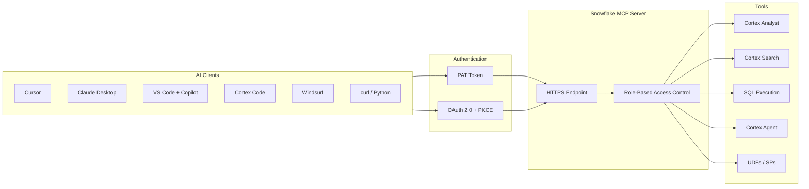
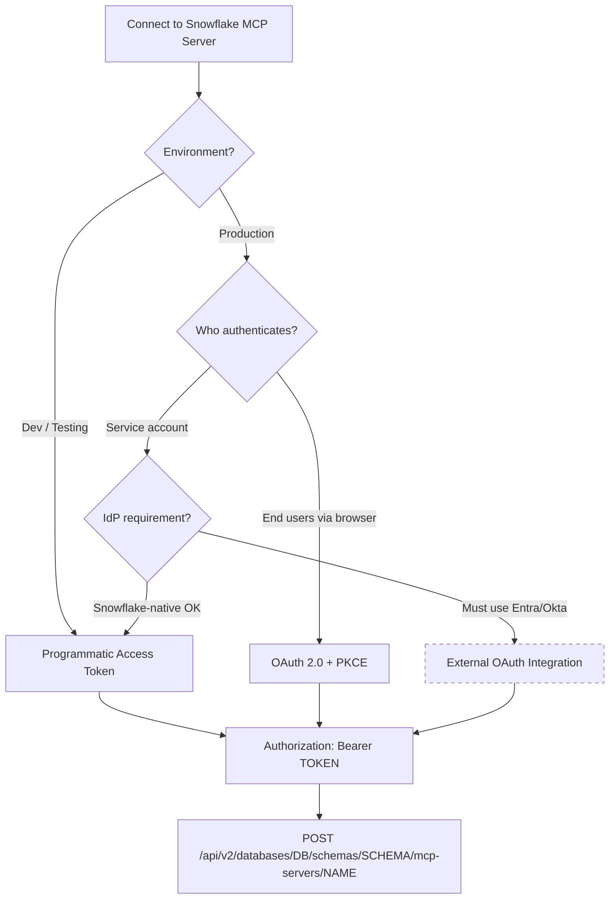
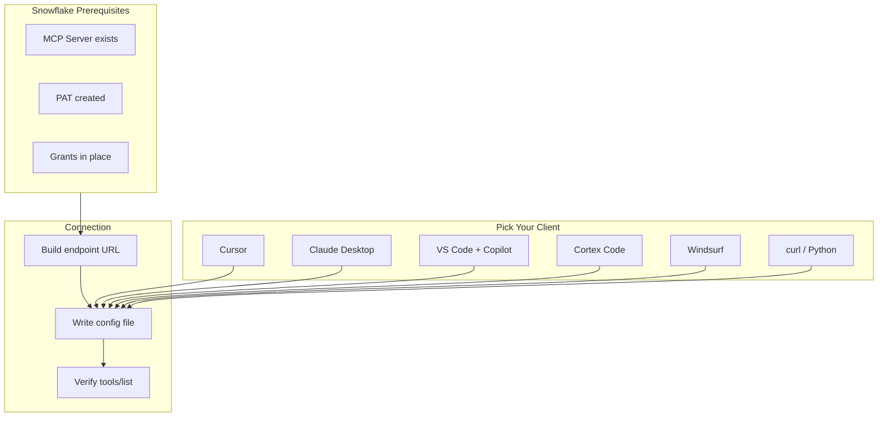
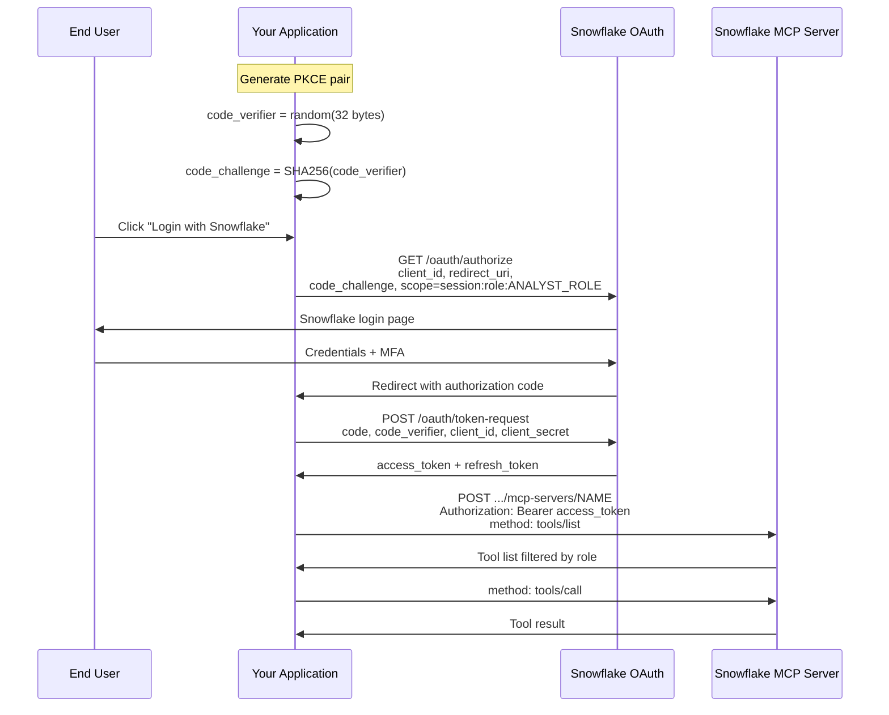
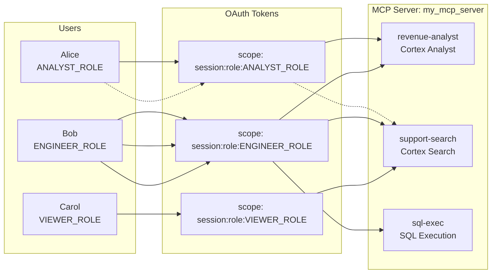

# MCP Server Authentication Guide

> [!CAUTION]
> **No support provided.** This content is for reference only. Review and validate before applying to any production workflow.


**Pair-programmed by:** SE Community + Cortex Code
**Created:** 2026-03-25 | **Expires:** 2027-03-25 | **Status:** ACTIVE

How to connect AI clients to Snowflake's managed MCP server -- and how authentication works under the hood. Starts with the question everyone asks first (*"how do I connect Cursor / Claude Desktop / VS Code?"*), then goes deep on OAuth, RBAC, multi-tenant patterns, and known limitations.



**Time:** ~30 minutes to read | **Result:** Working Snowflake MCP connection in your AI client + understanding of production auth patterns

## Who This Is For

Anyone who wants to connect an AI client to Snowflake data through MCP. **Part 2 is the fast path** -- it has exact configs for every major client. The rest of the guide covers production-grade auth patterns for teams shipping real applications.

New to MCP? Start with the [Snowflake MCP Server docs](https://docs.snowflake.com/en/user-guide/snowflake-cortex/cortex-agents-mcp) or the [Getting Started Quickstart](https://quickstarts.snowflake.com/guide/getting-started-with-snowflake-mcp-server/index.html).

---

## Part 1: The Authentication Landscape

Snowflake's managed MCP server supports two authentication methods today. Every MCP request carries a Bearer token in the `Authorization` header -- the difference is how that token is obtained.



The dashed border on External OAuth is intentional -- external IdP tokens for the managed MCP server are not yet fully productized. Part 5 covers this honestly.

### Decision Matrix

| Scenario | Auth Method | Best For | Identity Type |
|---|---|---|---|
| Developer in Cursor or Claude Desktop | PAT | Quick setup, individual use | Service identity |
| Streamlit / web app with user login | OAuth + PKCE | Production multi-user apps | End-user identity |
| Automated pipeline or CI/CD | PAT with least-privilege role | Non-interactive service accounts | Service identity |
| Multi-tenant SaaS platform | OAuth + PKCE with role scoping | Role-based data isolation | End-user + role identity |
| Enterprise with Entra/Okta mandate | External OAuth (limited today) | Federated auth compliance | Federated identity |

### What Both Methods Share

Regardless of which method produces the token:

- The MCP endpoint URL format is always: `https://<ORG-ACCOUNT>.snowflakecomputing.com/api/v2/databases/<DB>/schemas/<SCHEMA>/mcp-servers/<NAME>`
- The token is sent as `Authorization: Bearer <token>` on every request
- Snowflake RBAC determines which tools are discoverable and invocable
- Access to the MCP server does **not** grant access to tools -- both must be explicitly granted

---

## Part 2: Connect Your AI Client to Snowflake

> **This is the section most people are looking for.** Client-by-client configuration for connecting Cursor, Claude Desktop, VS Code Copilot, Cortex Code, Windsurf, and custom apps to Snowflake's managed MCP server.



### Prerequisites (Snowflake Side)

Before configuring any client, you need three things in Snowflake. If you already have an MCP server and a PAT, skip to your client below.

**1. An MCP server object.** Create one in a Snowsight SQL worksheet:

```sql
CREATE MCP SERVER my_mcp_server
  FROM SPECIFICATION $$
    tools:
      - name: "revenue-analyst"
        identifier: "MY_DB.MY_SCHEMA.FINANCIAL_ANALYTICS"
        type: "CORTEX_ANALYST_MESSAGE"
        description: "Query revenue and financial data using natural language"
        title: "Revenue Analyst"
      - name: "support-search"
        identifier: "MY_DB.MY_SCHEMA.SUPPORT_TICKETS"
        type: "CORTEX_SEARCH_SERVICE_QUERY"
        description: "Search support tickets and customer interactions"
        title: "Support Search"
      - name: "sql-exec"
        type: "SYSTEM_EXECUTE_SQL"
        description: "Execute SQL queries against the connected Snowflake database"
        title: "SQL Execution"
  $$;
```

**2. A Programmatic Access Token (PAT).** In Snowsight: **Settings > Authentication > Programmatic Access Tokens > + Token**. Choose a least-privilege role -- if the MCP server only needs `ANALYST_ROLE`, don't use `ACCOUNTADMIN`. Copy the token immediately; it is only shown once.

Or via SQL:

```sql
CREATE PROGRAMMATIC ACCESS TOKEN my_mcp_pat
  FOR USER = CURRENT_USER()
  WITH ROLE = ANALYST_ROLE
  COMMENT = 'PAT for MCP server access from Cursor';
```

**3. Grants on both the MCP server and underlying tools:**

```sql
GRANT USAGE ON MCP SERVER MY_DB.MY_SCHEMA.MY_MCP_SERVER TO ROLE ANALYST_ROLE;

GRANT SELECT ON SEMANTIC VIEW MY_DB.MY_SCHEMA.FINANCIAL_ANALYTICS TO ROLE ANALYST_ROLE;
GRANT USAGE ON CORTEX SEARCH SERVICE MY_DB.MY_SCHEMA.SUPPORT_TICKETS TO ROLE ANALYST_ROLE;
GRANT USAGE ON WAREHOUSE MY_WH TO ROLE ANALYST_ROLE;
```

Missing the tool grants is the #1 setup mistake -- you'll discover tools but get permission errors when calling them.

### Build Your Endpoint URL

Every client needs the same URL. The format is:

```
https://<ORG-ACCOUNT>.snowflakecomputing.com/api/v2/databases/<DB>/schemas/<SCHEMA>/mcp-servers/<NAME>
```

Replace each placeholder with your values:

| Placeholder | Where to Find It | Example |
|---|---|---|
| `<ORG-ACCOUNT>` | Snowsight URL bar or `SELECT CURRENT_ORGANIZATION_NAME() \|\| '-' \|\| CURRENT_ACCOUNT_NAME()` | `myorg-myaccount` |
| `<DB>` | Database where MCP server was created | `MY_DB` |
| `<SCHEMA>` | Schema where MCP server was created | `MY_SCHEMA` |
| `<NAME>` | Name from `CREATE MCP SERVER` | `MY_MCP_SERVER` |

**Hostname rule:** Use hyphens, never underscores. If your account identifier contains underscores, replace them with hyphens in the URL. Underscores cause TLS connection failures.

---

### Cursor

Cursor connects to Snowflake's MCP server over HTTP. No npm packages, no local processes -- just a URL and a token.

**Config file:** `.cursor/mcp.json` at the root of your project (or `~/.cursor/mcp.json` for global config)

```json
{
    "mcpServers": {
        "snowflake": {
            "url": "<YOUR-MCP-ENDPOINT-URL>",
            "headers": {
                "Authorization": "Bearer <YOUR-PAT-TOKEN>"
            }
        }
    }
}
```

**Verify:** Go to **Cursor > Settings > Cursor Settings > Tools & MCP**. You should see "snowflake" under Installed Servers with a green status. If it shows red, check the server output log for error details.

**Usage:** Start a new Agent chat and Cursor will automatically discover the MCP tools. Ask questions like *"What were our top revenue products last quarter?"* and Cursor will route to the Cortex Analyst tool.

---

### Claude Desktop

Claude Desktop supports HTTP MCP servers natively. The config is nearly identical to Cursor.

**Config file locations:**

| OS | Path |
|---|---|
| macOS | `~/Library/Application Support/Claude/claude_desktop_config.json` |
| Windows | `%APPDATA%\Claude\claude_desktop_config.json` |
| Linux | `~/.config/Claude/claude_desktop_config.json` |

You can also open it from Claude Desktop: **Settings > Developer > Edit Config**.

**Config:**

```json
{
    "mcpServers": {
        "snowflake": {
            "url": "<YOUR-MCP-ENDPOINT-URL>",
            "headers": {
                "Authorization": "Bearer <YOUR-PAT-TOKEN>"
            }
        }
    }
}
```

**Restart required.** Claude Desktop must be fully restarted (not just the window) after editing the config.

**Verify:** After restart, open a new conversation. You should see a hammer icon in the chat input area indicating MCP tools are available. Click it to see the tool list from your Snowflake MCP server.

---

### VS Code + GitHub Copilot

VS Code uses a slightly different config format with a `servers` object (not `mcpServers`) and a `type` field.

**Config file:** `.vscode/mcp.json` in your workspace, or open it via **Command Palette > MCP: Open User Configuration** for global config.

```json
{
    "inputs": [
        {
            "type": "promptString",
            "id": "snowflake-pat",
            "description": "Snowflake PAT for MCP Server",
            "password": true
        }
    ],
    "servers": {
        "snowflake": {
            "type": "http",
            "url": "<YOUR-MCP-ENDPOINT-URL>",
            "headers": {
                "Authorization": "Bearer ${input:snowflake-pat}"
            }
        }
    }
}
```

The `inputs` block is a VS Code feature that prompts you for the PAT on first connection and stores it securely -- the token never appears in the config file. If you prefer to manage the token yourself, you can hardcode it directly (but add `mcp.json` to `.gitignore`).

**Verify:** Open the Command Palette and run **MCP: List Servers**. You should see "snowflake" with a running status. Copilot will automatically use the MCP tools when relevant to your questions in Agent mode.

**Known issue:** Some versions of GitHub Copilot expect string `request.id` values in the MCP protocol, but Snowflake returns integers. If tools fail silently, check for client updates.

---

### Cortex Code (Claude Code)

Cortex Code has built-in MCP support with a dedicated config path and CLI commands.

**Config file:** `~/.snowflake/cortex/mcp.json`

```json
{
    "mcpServers": {
        "snowflake": {
            "url": "<YOUR-MCP-ENDPOINT-URL>",
            "headers": {
                "Authorization": "Bearer <YOUR-PAT-TOKEN>"
            }
        }
    }
}
```

**Or use the CLI:**

```bash
cortex mcp add
```

This launches an interactive prompt to configure the server name, URL, and headers.

**Verify:** Inside a Cortex Code session, type `/mcp` to list connected MCP servers and their tools. You should see your Snowflake MCP server with all configured tools listed.

**Manage servers:**

| Command | Action |
|---|---|
| `/mcp` | List servers and tools in the current session |
| `cortex mcp list` | List all configured servers |
| `cortex mcp add` | Add a new server interactively |
| `cortex mcp remove <name>` | Remove a server |

---

### Windsurf

Windsurf supports MCP servers through its config file, similar to Cursor.

**Config file:** Open via **Windsurf > Settings > MCP Configuration**, or edit directly:

| OS | Path |
|---|---|
| macOS | `~/.codeium/windsurf/mcp_config.json` |
| Windows | `%APPDATA%\Windsurf\mcp_config.json` |
| Linux | `~/.config/windsurf/mcp_config.json` |

```json
{
    "mcpServers": {
        "snowflake": {
            "serverUrl": "<YOUR-MCP-ENDPOINT-URL>",
            "headers": {
                "Authorization": "Bearer <YOUR-PAT-TOKEN>"
            }
        }
    }
}
```

Note: Windsurf uses `serverUrl` instead of `url` in some versions. If one doesn't work, try the other. Check Windsurf's current documentation for the exact field name.

**Verify:** Open **Settings > MCP Servers** in Windsurf. The Snowflake server should appear with available tools listed.

---

### ChatGPT (Custom GPTs)

ChatGPT supports connecting to external MCP servers through the ChatGPT interface when you have a Plus or Enterprise plan.

**Setup:** In ChatGPT, go to **Settings > Connected Apps** or configure within a Custom GPT's action settings. Add the MCP endpoint URL and provide the PAT as a Bearer token in the authentication section.

The exact UI flow changes frequently -- consult [OpenAI's MCP documentation](https://platform.openai.com/docs/guides/tools-remote-mcp) for the current steps.

---

### Custom Clients (curl / Python)

For testing, automation, or building your own MCP client.

**curl:**

```bash
export SNOWFLAKE_ACCOUNT="<your-org-your-account>"
export SNOWFLAKE_PAT="<your-pat-token>"
export MCP_URL="https://${SNOWFLAKE_ACCOUNT}.snowflakecomputing.com/api/v2/databases/MY_DB/schemas/MY_SCHEMA/mcp-servers/MY_MCP_SERVER"

curl -X POST "${MCP_URL}" \
  -H "Content-Type: application/json" \
  -H "Authorization: Bearer ${SNOWFLAKE_PAT}" \
  -d '{"jsonrpc":"2.0","id":1,"method":"initialize","params":{"protocolVersion":"2025-06-18"}}'
```

Then list tools:

```bash
curl -X POST "${MCP_URL}" \
  -H "Content-Type: application/json" \
  -H "Authorization: Bearer ${SNOWFLAKE_PAT}" \
  -d '{"jsonrpc":"2.0","id":2,"method":"tools/list","params":{}}'
```

Then call a tool:

```bash
curl -X POST "${MCP_URL}" \
  -H "Content-Type: application/json" \
  -H "Authorization: Bearer ${SNOWFLAKE_PAT}" \
  -d '{"jsonrpc":"2.0","id":3,"method":"tools/call","params":{"name":"revenue-analyst","arguments":{"message":"What were total sales last quarter?"}}}'
```

**Python (httpx):**

```python
import httpx
import os

MCP_URL = (
    f"https://{os.environ['SNOWFLAKE_ACCOUNT']}.snowflakecomputing.com"
    f"/api/v2/databases/MY_DB/schemas/MY_SCHEMA"  # pragma: allowlist secret
    f"/mcp-servers/MY_MCP_SERVER"
)
HEADERS = {
    "Authorization": f"Bearer {os.environ['SNOWFLAKE_PAT']}",
    "Content-Type": "application/json"
}

def list_tools():
    r = httpx.post(MCP_URL, headers=HEADERS, json={
        "jsonrpc": "2.0", "id": 1, "method": "tools/list", "params": {}
    })
    return r.json()["result"]["tools"]

def call_tool(name, arguments):
    r = httpx.post(MCP_URL, headers=HEADERS, json={
        "jsonrpc": "2.0", "id": 1, "method": "tools/call",
        "params": {"name": name, "arguments": arguments}
    })
    return r.json()

tools = list_tools()
print(f"Available tools: {[t['name'] for t in tools]}")

result = call_tool("revenue-analyst", {"message": "Top 5 customers by revenue"})
print(result)
```

---

### Troubleshooting (All Clients)

If your client can't connect, **always test with `curl` first**. If `curl` works but your client doesn't, the issue is client-side configuration, not Snowflake auth.

| Symptom | Cause | Fix |
|---|---|---|
| `401 Unauthorized` | Invalid or expired PAT | Regenerate the PAT in Snowsight |
| `403 Forbidden` | Role lacks MCP server USAGE grant | `GRANT USAGE ON MCP SERVER ... TO ROLE ...` |
| TLS handshake failure | Underscores in hostname | Replace `_` with `-` in the URL |
| Tools show in list but calls fail | Missing grants on underlying objects | Grant SELECT/USAGE on each tool's backing object |
| "Loading tools" hangs forever | Malformed tool spec or invalid identifier | Run `DESCRIBE MCP SERVER ...` and verify all identifiers exist |
| Client shows "connected" but no tools | MCP server has no tools, or role can't see any | Check tool spec and role grants |
| Silent failures in VS Code Copilot | Integer vs string `request.id` mismatch | Update the client; tracked as a known interop issue |
| Works in `curl` but not in client | Client sends wrong headers or transport | Check client logs; some clients only support stdio, not HTTP |

### Security Checklist

- [ ] PAT uses least-privilege role (not ACCOUNTADMIN)
- [ ] Token is not committed to version control
- [ ] All `mcp.json` / config files are in `.gitignore`
- [ ] PAT has a reasonable expiration (not indefinite)
- [ ] Rotation is planned -- see [tool-secrets-rotation-aws](../tool-secrets-rotation-aws/) for automation
- [ ] Each developer uses their own PAT (don't share tokens across users)

---

## Part 3: Production Web App with OAuth + PKCE

> **Scenario:** Your team is building a Streamlit or web application where end users log in with their Snowflake credentials and interact with MCP tools. You need per-user identity, session-based tokens, MFA support, and audit trails.

PATs won't work here -- you need OAuth 2.0 Authorization Code Flow with PKCE.



### Step 1: Create the Security Integration

```sql
CREATE OR REPLACE SECURITY INTEGRATION mcp_app_oauth
    TYPE = OAUTH
    OAUTH_CLIENT = CUSTOM
    ENABLED = TRUE
    OAUTH_CLIENT_TYPE = 'CONFIDENTIAL'
    OAUTH_REDIRECT_URI = 'https://your-app.example.com/callback'
    OAUTH_ISSUE_REFRESH_TOKENS = TRUE
    OAUTH_REFRESH_TOKEN_VALIDITY = 86400
    PRE_AUTHORIZED_ROLES_LIST = ('ANALYST_ROLE', 'ENGINEER_ROLE');
```

Key parameters:

| Parameter | Purpose |
|---|---|
| `OAUTH_CLIENT_TYPE = 'CONFIDENTIAL'` | Your server can securely store the client secret |
| `OAUTH_REDIRECT_URI` | Must match your app URL exactly -- Snowflake validates this |
| `OAUTH_ISSUE_REFRESH_TOKENS = TRUE` | Avoids forcing re-login on every token expiry |
| `PRE_AUTHORIZED_ROLES_LIST` | Roles that can use this integration without additional consent |

For **local development only**, you can allow non-TLS redirects:

```sql
ALTER SECURITY INTEGRATION mcp_app_oauth SET
    OAUTH_REDIRECT_URI = 'http://localhost:3000/callback'
    OAUTH_ALLOW_NON_TLS_REDIRECT_URI = TRUE;
```

### Step 2: Retrieve OAuth Credentials

```sql
SELECT SYSTEM$SHOW_OAUTH_CLIENT_SECRETS('MCP_APP_OAUTH');
```

This returns your `OAUTH_CLIENT_ID` and `OAUTH_CLIENT_SECRET`. Store these securely -- treat the secret like a database password.

To find your authorization and token endpoints:

```sql
DESCRIBE SECURITY INTEGRATION mcp_app_oauth;
```

Look for `OAUTH_AUTHORIZATION_ENDPOINT` and `OAUTH_TOKEN_ENDPOINT` in the output.

### Step 3: Implement PKCE

PKCE (Proof Key for Code Exchange) prevents authorization code interception. Generate a verifier/challenge pair before each login:

```python
import hashlib
import base64
import secrets

def generate_pkce_pair():
    code_verifier = base64.urlsafe_b64encode(
        secrets.token_bytes(32)
    ).decode('utf-8').rstrip('=')

    code_challenge = base64.urlsafe_b64encode(
        hashlib.sha256(code_verifier.encode('utf-8')).digest()
    ).decode('utf-8').rstrip('=')

    return code_verifier, code_challenge
```

### Step 4: Build the Authorization URL

```python
from urllib.parse import urlencode

def get_authorization_url(state, code_challenge, role='ANALYST_ROLE'):
    params = {
        'client_id': OAUTH_CLIENT_ID,
        'redirect_uri': REDIRECT_URI,
        'response_type': 'code',
        'state': state,
        'code_challenge': code_challenge,
        'code_challenge_method': 'S256',
        'scope': f'session:role:{role}'
    }
    return f"https://{ACCOUNT_HOSTNAME}/oauth/authorize?{urlencode(params)}"
```

The `scope=session:role:{ROLE}` parameter is critical -- it binds the resulting token to a specific Snowflake role. The user must have this role granted to them, or authorization will fail.

### Step 5: Exchange Code for Token

After the user authenticates, Snowflake redirects back to your app with an authorization code. Exchange it:

```python
import httpx

async def exchange_code_for_token(code, code_verifier):
    async with httpx.AsyncClient(timeout=30.0) as client:
        response = await client.post(
            f"https://{ACCOUNT_HOSTNAME}/oauth/token-request",
            data={
                'grant_type': 'authorization_code',
                'code': code,
                'redirect_uri': REDIRECT_URI,
                'client_id': OAUTH_CLIENT_ID,
                'client_secret': OAUTH_CLIENT_SECRET,
                'code_verifier': code_verifier
            },
            headers={'Content-Type': 'application/x-www-form-urlencoded'}
        )
        tokens = response.json()
        return tokens['access_token'], tokens.get('refresh_token')
```

Authorization codes expire within seconds. If you get `invalid_grant`, the code has already expired -- redirect the user to authenticate again.

### Step 6: Call MCP Tools

```python
async def call_mcp_tool(access_token, tool_name, arguments):
    mcp_url = (
        f"https://{ACCOUNT_HOSTNAME}/api/v2/databases/{DATABASE}"
        f"/schemas/{SCHEMA}/mcp-servers/{MCP_SERVER_NAME}"
    )
    async with httpx.AsyncClient(timeout=120.0) as client:
        response = await client.post(
            mcp_url,
            json={
                "jsonrpc": "2.0",
                "method": "tools/call",
                "params": {"name": tool_name, "arguments": arguments},
                "id": 1
            },
            headers={
                'Authorization': f'Bearer {access_token}',
                'Content-Type': 'application/json'
            }
        )
        return response.json()
```

### Step 7: Refresh Tokens

Access tokens expire in approximately 10 minutes. Use the refresh token to get a new one without forcing re-login:

```python
async def refresh_access_token(refresh_token):
    async with httpx.AsyncClient(timeout=30.0) as client:
        response = await client.post(
            f"https://{ACCOUNT_HOSTNAME}/oauth/token-request",
            data={
                'grant_type': 'refresh_token',
                'refresh_token': refresh_token,
                'client_id': OAUTH_CLIENT_ID,
                'client_secret': OAUTH_CLIENT_SECRET
            },
            headers={'Content-Type': 'application/x-www-form-urlencoded'}
        )
        return response.json()['access_token']
```

<details>
<summary>Complete Streamlit integration pattern</summary>

```python
import streamlit as st
import asyncio
import secrets

def main():
    st.set_page_config(page_title="Snowflake MCP Agent")

    if 'code' in st.query_params:
        code = st.query_params['code']
        state = st.query_params.get('state', '')
        code_verifier = st.session_state.get('code_verifier')

        if code_verifier:
            access_token, refresh_token = asyncio.run(
                exchange_code_for_token(code, code_verifier)
            )
            st.session_state.access_token = access_token
            st.session_state.refresh_token = refresh_token
            st.query_params.clear()
            st.rerun()

    with st.sidebar:
        if st.session_state.get('access_token'):
            st.success("Authenticated")
            if st.button("Logout"):
                st.session_state.access_token = None
                st.rerun()
        else:
            role = st.selectbox("Role", ["ANALYST_ROLE", "ENGINEER_ROLE"])
            if st.button("Login with Snowflake"):
                code_verifier, code_challenge = generate_pkce_pair()
                state = secrets.token_urlsafe(32)
                st.session_state.code_verifier = code_verifier
                auth_url = get_authorization_url(state, code_challenge, role)
                st.markdown(f'<meta http-equiv="refresh" content="0;url={auth_url}">')
                st.stop()

    if prompt := st.chat_input("Ask about your data..."):
        if not st.session_state.get('access_token'):
            st.error("Please authenticate first.")
            return
        result = asyncio.run(call_mcp_tool(
            st.session_state.access_token,
            "revenue-analyst",
            {"message": prompt}
        ))
        st.write(result)
```

</details>

---

## Part 4: Multi-Tenant RBAC with Role-Scoped Tokens

> **Scenario:** Your platform serves multiple teams -- analysts who query revenue data, engineers who run SQL, and viewers who only search support tickets. All connect through the same MCP server, but each role sees different tools and data.



### The Role-Scoping Pattern

The role is embedded in the OAuth scope at authorization time:

```
scope=session:role:ANALYST_ROLE
```

This does three things:

1. **Binds the token** -- the access token can only act as `ANALYST_ROLE`, cryptographically enforced
2. **Validates the grant** -- Snowflake checks that the user actually has `ANALYST_ROLE` before issuing the token
3. **Scopes discovery** -- `tools/list` only returns tools the role can invoke

To switch roles, the user must re-authenticate with a different scope. There is no way to escalate a token to a different role after issuance.

### Grant Structure for Three Roles

```sql
-- All roles need MCP server access
GRANT USAGE ON MCP SERVER MY_DB.MY_SCHEMA.MY_MCP_SERVER TO ROLE ANALYST_ROLE;
GRANT USAGE ON MCP SERVER MY_DB.MY_SCHEMA.MY_MCP_SERVER TO ROLE ENGINEER_ROLE;
GRANT USAGE ON MCP SERVER MY_DB.MY_SCHEMA.MY_MCP_SERVER TO ROLE VIEWER_ROLE;

-- ANALYST_ROLE: revenue analytics + support search
GRANT SELECT ON SEMANTIC VIEW MY_DB.MY_SCHEMA.FINANCIAL_ANALYTICS TO ROLE ANALYST_ROLE;
GRANT USAGE ON CORTEX SEARCH SERVICE MY_DB.MY_SCHEMA.SUPPORT_TICKETS TO ROLE ANALYST_ROLE;

-- ENGINEER_ROLE: everything
GRANT SELECT ON SEMANTIC VIEW MY_DB.MY_SCHEMA.FINANCIAL_ANALYTICS TO ROLE ENGINEER_ROLE;
GRANT USAGE ON CORTEX SEARCH SERVICE MY_DB.MY_SCHEMA.SUPPORT_TICKETS TO ROLE ENGINEER_ROLE;
GRANT USAGE ON WAREHOUSE MY_WH TO ROLE ENGINEER_ROLE;

-- VIEWER_ROLE: search only
GRANT USAGE ON CORTEX SEARCH SERVICE MY_DB.MY_SCHEMA.SUPPORT_TICKETS TO ROLE VIEWER_ROLE;
```

### What Each Role Sees

| Request | ANALYST_ROLE | ENGINEER_ROLE | VIEWER_ROLE |
|---|---|---|---|
| `tools/list` | revenue-analyst, support-search | revenue-analyst, support-search, sql-exec | support-search |
| `tools/call` revenue-analyst | Works | Works | Permission denied |
| `tools/call` sql-exec | Permission denied | Works | Permission denied |

### Row Access Policies for Data Isolation

When multiple tenants share the same tables, use Row Access Policies to enforce per-user data boundaries. The MCP server respects whatever RBAC context the calling user has:

```sql
CREATE OR REPLACE ROW ACCESS POLICY tenant_isolation
  AS (row_region VARCHAR) RETURNS BOOLEAN ->
    CASE
        WHEN CURRENT_ROLE() IN ('ACCOUNTADMIN', 'SYSADMIN') THEN TRUE
        WHEN CURRENT_ROLE() = 'ANALYST_NA' THEN row_region = 'North America'
        WHEN CURRENT_ROLE() = 'ANALYST_EMEA' THEN row_region = 'EMEA'
        ELSE FALSE
    END;

ALTER TABLE MY_DB.MY_SCHEMA.REVENUE_DATA
  ADD ROW ACCESS POLICY tenant_isolation ON (region);
```

With this policy, an analyst authenticated with `scope=session:role:ANALYST_NA` querying through the MCP server's Cortex Analyst tool will only see North American data -- the policy is enforced at the SQL layer, invisible to the MCP client.

For the complete multi-tenant pattern with Azure AD OAuth, see [guide-agent-multi-tenant](../guide-agent-multi-tenant/).

---

## Part 5: Enterprise with Corporate IdP -- The Gap and Workarounds

> **Scenario:** Your enterprise security team mandates that all authentication flows through Entra ID (Azure AD) or Okta. They want MCP access tokens issued by the corporate IdP, not by Snowflake's built-in OAuth.

### The Current State (Honest Assessment)

External IdP OAuth tokens for the Snowflake-managed MCP server are **not yet fully supported**. Today, the managed MCP server authenticates via:

1. **Snowflake's built-in OAuth** (CREATE SECURITY INTEGRATION with OAUTH_CLIENT = CUSTOM)
2. **Programmatic Access Tokens** (PATs)

There is no path to hand the MCP server a token issued by Entra ID or Okta and have it accepted directly. This is a known product gap -- customers who require uniform IdP-issued tokens across all access paths see MCP as a compliance gap until this is delivered.

### Workaround 1: Snowflake External OAuth + Custom Token Exchange

Snowflake supports [External OAuth](https://docs.snowflake.com/en/user-guide/oauth-ext-overview) for regular SQL connections. You can create a security integration that trusts your IdP:

```sql
CREATE SECURITY INTEGRATION ext_oauth_entra
    TYPE = EXTERNAL_OAUTH
    ENABLED = TRUE
    EXTERNAL_OAUTH_TYPE = AZURE
    EXTERNAL_OAUTH_ISSUER = 'https://sts.windows.net/<TENANT_ID>/'
    EXTERNAL_OAUTH_JWS_KEYS_URL = 'https://login.microsoftonline.com/<TENANT_ID>/discovery/v2.0/keys'
    EXTERNAL_OAUTH_AUDIENCE_LIST = ('https://<ACCOUNT>.snowflakecomputing.com')
    EXTERNAL_OAUTH_TOKEN_USER_MAPPING_CLAIM = 'upn'
    EXTERNAL_OAUTH_SNOWFLAKE_USER_MAPPING_ATTRIBUTE = 'login_name';
```

The limitation: this integration works for SQL API connections and the Snowflake Python connector, but **may not be accepted by the managed MCP endpoint**. Test thoroughly in your environment before committing to this path.

### Workaround 2: Service Account PAT with Automated Rotation

For service-to-service flows where the enterprise accepts a Snowflake-issued credential (as long as it's properly rotated and scoped):

1. Create a dedicated Snowflake service user with a least-privilege role
2. Generate a PAT scoped to that role
3. Rotate automatically using [tool-secrets-rotation-aws](../tool-secrets-rotation-aws/) or your vault

```sql
CREATE USER mcp_service_user
    PASSWORD = NULL
    DEFAULT_ROLE = MCP_SERVICE_ROLE
    COMMENT = 'Service account for MCP server access';

GRANT ROLE MCP_SERVICE_ROLE TO USER mcp_service_user;
```

### Workaround 3: Proxy Pattern

Build a thin proxy service that:

1. Accepts IdP-issued tokens from your users
2. Validates them against your IdP's JWKS endpoint
3. Maps the user identity to a Snowflake user/role
4. Calls the Snowflake MCP server with a Snowflake-native token (PAT or OAuth)
5. Returns the MCP response to the caller

This adds latency and operational complexity, but satisfies the "all auth through our IdP" requirement at the edge while using Snowflake-native auth under the hood.

### What's Coming

The product gap for external OAuth token validation on the MCP endpoint is tracked internally. When delivered, it will allow the managed MCP server to accept tokens from registered external IdPs without a proxy layer. No committed timeline.

For network-level security patterns that complement any auth approach, see [guide-external-access-playbook](../guide-external-access-playbook/).

---

## Part 6: Known Limitations and Gotchas

Collected from production deployments, support cases, and internal documentation. These are real constraints -- not theoretical concerns.

### Authentication and Identity

| Limitation | Impact | Status |
|---|---|---|
| External IdP tokens not accepted by managed MCP endpoint | Enterprises requiring federated auth need workarounds (Part 5) | Product gap, actively tracked |
| No per-tool OAuth scopes | Cannot scope a token to specific tools within an MCP server; access control is per-server via RBAC | By design -- use Snowflake roles for per-tool control |
| No per-tool RBAC at MCP layer | All tools in one MCP server execute under the same role context | Use multiple MCP servers for hard isolation between tool sets |
| Secret management for external MCP calls still maturing | When Snowflake agents call external MCP servers, token refresh and least-privilege patterns are limited | Under active development |

### Protocol and Client Interoperability

| Limitation | Impact | Status |
|---|---|---|
| No streaming responses | Full responses only; clients expecting partial progress get degraded UX | Product gap filed |
| Integer vs string `request.id` mismatch | Some clients (GitHub Copilot, Copilot Studio) expect string IDs but Snowflake returns integers | Tracked in support |
| HTTP transport only | Clients expecting stdio MCP need a bridge (e.g., `mcp-remote`) | By design -- use HTTP adapter |
| Hostname underscores cause TLS failures | Account identifiers with underscores fail MCP connections | Use hyphens instead of underscores |

### Server Behavior

| Limitation | Impact | Status |
|---|---|---|
| Read-mostly by design | DDL via `sql_exec_tool` is unreliable and may error even with correct RBAC | Expected behavior, not a bug |
| No MCP-specific billing breakdown | MCP usage rolls into existing Cortex/REST credit tables | No dedicated usage view yet |
| Tool loading hangs on malformed specs | Invalid Cortex Search identifiers or bad schemas cause "Loading tools" to hang | No schema linting in Snowsight |
| MCP servers are account-local | No cross-account sharing; must recreate the MCP definition per account/region | Cross-shard sharing under design |
| PrivateLink requires exact hostname | TLS hostname mismatches between expected endpoint and PL hostname cause silent failures | Must match DNS CN/SAN precisely |

### Practical Tips

1. **Always test with `curl` first.** If `curl` works but your MCP client doesn't, the issue is client-side, not auth.

2. **Check both grant layers.** The most common "it was working yesterday" issue is a missing grant on the underlying tool object, not the MCP server itself.

3. **Credentials in Cloud Workspaces are ephemeral.** After any VM restart, re-run `sf auth login` and restart MCP hosts.

4. **Some MCP clients simply cannot integrate today.** Protocol mismatches mean certain clients won't work until either the client or Snowflake updates. This is logged as feature feedback, not misconfiguration.

---

## Production Readiness Checklist

| Category | Check | Reference |
|---|---|---|
| **Auth Method** | PAT for dev only; OAuth + PKCE for production | Parts 2, 3 |
| **Auth Method** | Security integration created with correct redirect URI | Part 3 |
| **Auth Method** | `PRE_AUTHORIZED_ROLES_LIST` includes only necessary roles | Part 3 |
| **Access Control** | `GRANT USAGE ON MCP SERVER` to each consuming role | Part 4 |
| **Access Control** | Underlying tool objects (semantic views, search services, UDFs) granted per role | Part 4 |
| **Access Control** | Row Access Policies for multi-tenant data isolation | Part 4 |
| **Credentials** | PAT uses least-privilege role (never ACCOUNTADMIN) | Part 2 |
| **Credentials** | PAT rotation automated if PATs are used | Part 2 |
| **Credentials** | `mcp.json` in `.gitignore` -- tokens never in version control | Part 2 |
| **Credentials** | OAuth client secret stored securely (vault, not env vars in code) | Part 3 |
| **Network** | Hostname uses hyphens, not underscores | Part 6 |
| **Network** | Network policy restricts MCP endpoint access to known IPs | Part 6 |
| **Network** | PrivateLink hostname matches certificate CN/SAN if applicable | Part 6 |
| **Validation** | MCP server tools verified with `curl tools/list` before client setup | Part 2 |
| **Validation** | Tool specs validated -- no invalid identifiers causing loading hangs | Part 6 |
| **Monitoring** | MCP usage tracked via existing Cortex credit views | Part 6 |

---

## Related Projects

- [`guide-agent-governance`](../guide-agent-governance/) -- Agent governance playbook: RBAC, monitoring, cost controls, audit trails
- [`guide-agent-multi-tenant`](../guide-agent-multi-tenant/) -- Multi-tenant agent pattern with Azure AD OAuth + Row Access Policies
- [`guide-api-agent-context`](../guide-api-agent-context/) -- Agent Run API with PAT, key-pair JWT, and OAuth auth methods
- [`guide-external-access-playbook`](../guide-external-access-playbook/) -- External access patterns: network rules, secrets, OAuth integrations
- [`tool-secrets-rotation-aws`](../tool-secrets-rotation-aws/) -- Automated PAT and key-pair rotation with AWS Secrets Manager
- [`tool-cortex-cost-intelligence`](../tool-cortex-cost-intelligence/) -- Cortex cost governance with MCP integration documentation
- [`demo-coco-governance-github`](../demo-coco-governance-github/) -- GitHub MCP setup with PAT and 1Password patterns

## External References

- [Snowflake MCP Server Documentation](https://docs.snowflake.com/en/user-guide/snowflake-cortex/cortex-agents-mcp)
- [Getting Started Quickstart](https://quickstarts.snowflake.com/guide/getting-started-with-snowflake-mcp-server/index.html)
- [CREATE MCP SERVER Reference](https://docs.snowflake.com/en/sql-reference/sql/create-mcp-server)
- [Snowflake OAuth for Custom Clients](https://docs.snowflake.com/en/user-guide/oauth-custom)
- [OAuth + RBAC Blog Post (Ram Palagummi)](https://medium.com/snowflake/connecting-to-snowflake-mcp-servers-with-oauth-2-0-and-role-based-access-control-a-complete-guide-c17d20be8a67)
- [PKCE RFC 7636](https://datatracker.ietf.org/doc/html/rfc7636)
