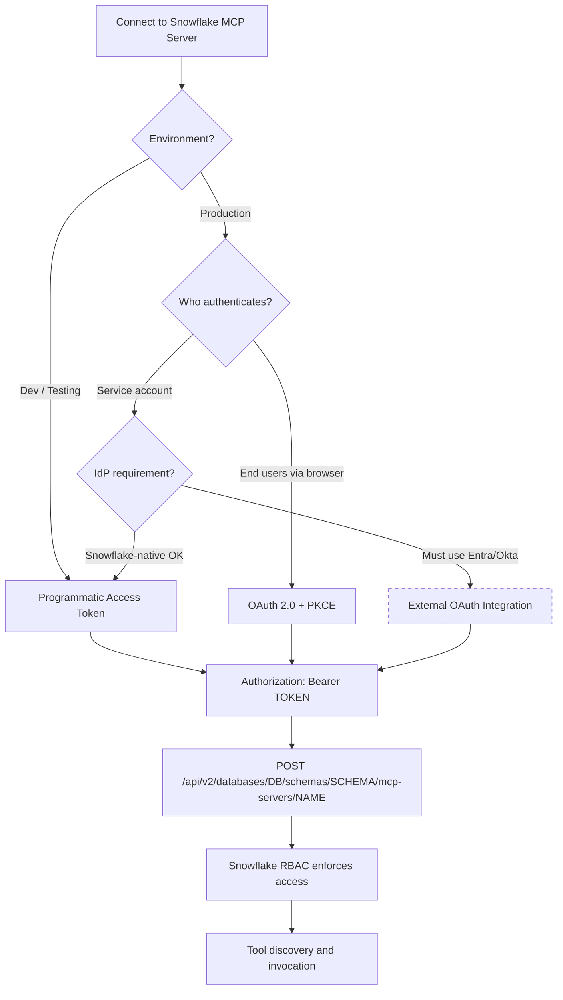

# MCP Server Authentication Landscape

Which authentication method fits your scenario? Both paths converge at the same MCP endpoint -- the difference is how the Bearer token is obtained.

The dashed border on External OAuth indicates this path has limitations -- external IdP tokens for the managed MCP server are not yet fully productized. See Part 5 of the guide for workarounds.

## Decision Matrix

| Scenario | Auth Method | Token Lifetime | Rotation | Identity |
|---|---|---|---|---|
| Developer in Cursor/Claude Desktop | PAT | Configurable (days-months) | Manual or automated | Service identity |
| Streamlit / web app with login | OAuth + PKCE | ~10 minutes (access token) | Refresh token flow | End-user identity |
| Automated pipeline / CI | PAT with least-privilege role | Short-lived, rotated | AWS Secrets Manager / vault | Service identity |
| Multi-tenant SaaS | OAuth + PKCE with role scoping | ~10 minutes | Per-session | End-user + role identity |
| Enterprise with IdP mandate | External OAuth (limited) | Varies by IdP | IdP-managed | Federated identity |
