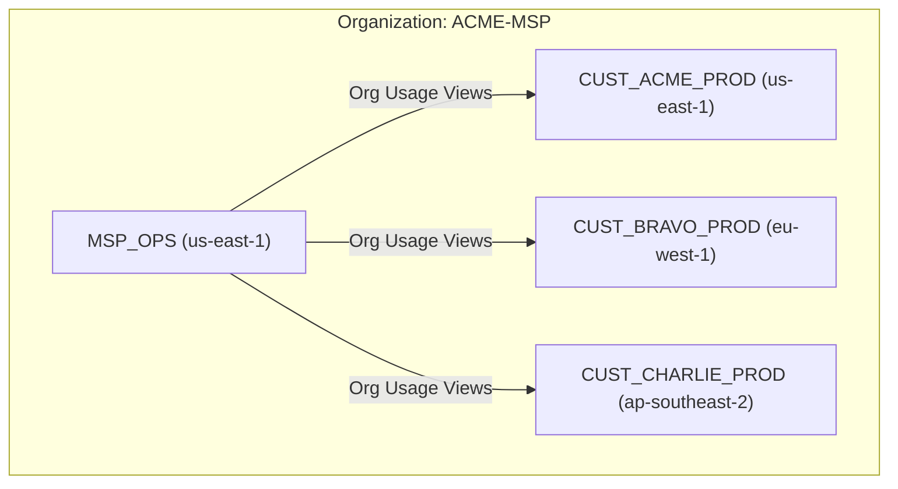
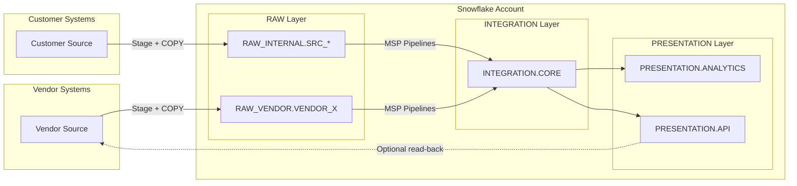
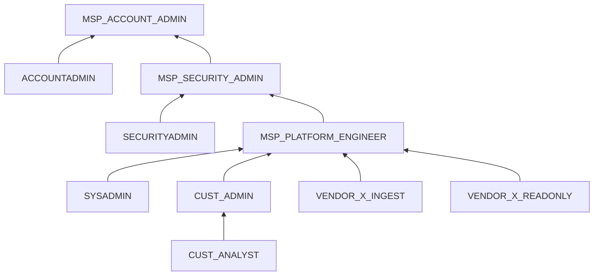

# Snowflake MSP Provider Guide

Inspired by a real customer question: *"We're an MSP. We manage Snowflake accounts for our customers. Now a 3rd-party vendor needs Snowsight access to bring in their own data. How do we do that securely without losing control?"*

One concrete architecture for per-customer Snowflake accounts where MSP staff, customer users, and 3rd-party vendors all coexist safely. Every section includes copy-paste SQL.

**Pair-programmed by:** SE Community + Cortex Code
**Created:** 2026-04-10 | **Expires:** 2026-05-10 | **Status:** ACTIVE

> **No support provided.** This content is for reference only. Review and validate before applying to any production workflow.

**Time:** ~30 minutes to read, ~2 hours to implement per customer | **Result:** A secure, repeatable multi-tenant pattern

---

## Who This Is For

MSP platform engineers who:
- Manage one or more Snowflake accounts per customer under a Snowflake Organization
- Need to give 3rd-party vendors **Snowsight UI access** to bring in their own data feeds
- Want a repeatable, automatable pattern that scales to dozens of customers

Comfortable with Snowflake RBAC and SQL DDL. No prior multi-tenant MSP experience required.

---

## Architecture Overview

### Organization Level



- A single Snowflake **Organization** spans all regions and cloud platforms. You do not need one Organization per region -- one Organization holds every account regardless of where it runs (AWS us-east-1, Azure westeurope, etc.). Multiple Organizations only arise from separate legal entities or acquisitions.
- Under the Organization: **one account per customer** (optionally Dev/Test/Prod per customer), placed in the region closest to the customer's data.
- One **MSP_OPS account** for central monitoring and cost analysis.
- MSP_OPS uses **Organization Usage views** (`SNOWFLAKE.ORGANIZATION_USAGE`) for cross-account telemetry -- no data shares required for basic monitoring. These views cover all accounts across all regions in the Organization. **Prerequisite:** Organization Usage views are premium views available only in the [organization account](https://docs.snowflake.com/en/user-guide/organization-accounts). The MSP_OPS account must be the organization account, or an account with the ORGADMIN role.
- All 3rd-party users log into the **customer account**, never into MSP_OPS.

### Per-Account Data Flow



- **Vendors** own their data path up to `RAW_VENDOR.VENDOR_X`.
- **MSP pipelines** validate, join, transform, and expose curated outputs.
- Optionally expose specific views in `PRESENTATION.API` back to vendors.

---

## Part 1: Account Baseline

> **Problem:** You need a repeatable foundation for every customer account -- roles, databases, schemas, warehouses -- before any vendor touches it.

Full script: [`sql/01_account_baseline.sql`](sql/01_account_baseline.sql)

### Role Hierarchy



**MSP roles:**

| Role | Inherits | Purpose |
|------|----------|---------|
| `MSP_ACCOUNT_ADMIN` | ACCOUNTADMIN | Top-level MSP admin. Only MSP staff. |
| `MSP_SECURITY_ADMIN` | SECURITYADMIN | Users, roles, network policies. |
| `MSP_PLATFORM_ENGINEER` | SYSADMIN | Warehouses, databases, pipelines. |

`MSP_ACCOUNT_ADMIN` is **granted the ACCOUNTADMIN role** -- it inherits all ACCOUNTADMIN privileges. It does not sit "above" ACCOUNTADMIN. This distinction matters because ACCOUNTADMIN is the ceiling of the system role hierarchy.

**Customer roles:**

| Role | Purpose |
|------|---------|
| `CUST_ADMIN` | Limited admin. Cannot modify MSP roles or network policies. |
| `CUST_ANALYST` | Read-only on PRESENTATION layer. |

**Key constraint on CUST_ADMIN:** Granting `CREATE USER` or `CREATE ROLE` directly to a custom role is risky -- it could create users with any default role. Instead, delegate user management through a **stored procedure with EXECUTE AS OWNER**:

```sql
CREATE OR REPLACE PROCEDURE WORKSPACE.MSP.CREATE_CUSTOMER_USER(
    p_username     VARCHAR,
    p_default_role VARCHAR,
    p_email        VARCHAR
)
RETURNS VARCHAR
LANGUAGE SQL
EXECUTE AS OWNER
AS
$$
BEGIN
    IF (:p_default_role NOT IN ('CUST_ADMIN', 'CUST_ANALYST')) THEN
        RETURN 'ERROR: default_role must be CUST_ADMIN or CUST_ANALYST';
    END IF;
    IF (:p_username RLIKE '.*[^A-Za-z0-9_].*') THEN
        RETURN 'ERROR: username must be alphanumeric/underscores only';
    END IF;
    IF (:p_email LIKE '%''%' OR :p_email LIKE '%;%') THEN
        RETURN 'ERROR: email contains invalid characters';
    END IF;
    EXECUTE IMMEDIATE
        'CREATE USER IF NOT EXISTS IDENTIFIER(''' || :p_username || ''')'  ||
        ' DEFAULT_ROLE = ' || :p_default_role ||
        ' EMAIL = ''' || :p_email || '''' ||
        ' MUST_CHANGE_PASSWORD = TRUE';
    EXECUTE IMMEDIATE
        'GRANT ROLE ' || :p_default_role ||
        ' TO USER IDENTIFIER(''' || :p_username || ''')';
    RETURN 'User ' || :p_username || ' created with role ' || :p_default_role;
END;
$$;
```

This runs with the owner's privileges (ACCOUNTADMIN) but validates inputs: only `CUST_ADMIN` or `CUST_ANALYST` as the default role, alphanumeric usernames only, and no SQL-injectable characters in email.

### Databases and Schemas

| Database | Schema | Purpose | Managed Access? |
|----------|--------|---------|-----------------|
| RAW_INTERNAL | SRC_\<system\> | Customer raw sources | No |
| RAW_VENDOR | VENDOR_\<name\> | One schema per vendor | **Yes** |
| INTEGRATION | CORE | Business logic, joins | Yes |
| PRESENTATION | ANALYTICS | BI-facing tables/views | Yes |
| PRESENTATION | API | App/vendor read-back views | Yes |
| WORKSPACE | MSP | MSP experiments | No |
| WORKSPACE | CUST | Customer sandbox | No |

**Why Managed Access?** In a standard schema, the object owner can grant privileges to other roles. In a `WITH MANAGED ACCESS` schema, only the schema owner controls grants. This prevents vendors from granting access to objects they create in `RAW_VENDOR.VENDOR_X` to anyone other than the MSP.

```sql
CREATE SCHEMA IF NOT EXISTS RAW_VENDOR.VENDOR_X
    WITH MANAGED ACCESS
    COMMENT = 'Raw landing zone for vendor VENDOR_X';
```

### Warehouses

| Warehouse | Used By | Size |
|-----------|---------|------|
| MSP_ELT_WH | MSP pipelines | SMALL+ |
| CUST_ANALYTICS_WH | Customer analysts, BI | XSMALL |
| VENDOR_X_INGEST_WH | Vendor X only | XSMALL |

Each warehouse gets a resource monitor and a cost attribution tag.

### Cost Attribution Tags

```sql
CREATE TAG IF NOT EXISTS RAW_INTERNAL.PUBLIC.COST_CENTER
    ALLOWED_VALUES 'msp', 'customer', 'vendor';

ALTER WAREHOUSE MSP_ELT_WH SET TAG RAW_INTERNAL.PUBLIC.COST_CENTER = 'msp';
ALTER WAREHOUSE CUST_ANALYTICS_WH SET TAG RAW_INTERNAL.PUBLIC.COST_CENTER = 'customer';
```

---

## Part 2: Vendor Onboarding

> **Problem:** A new 3rd-party vendor needs Snowsight access to configure stages, file formats, and landing tables -- without seeing other vendors or touching your core models.

Full script: [`sql/02_vendor_onboard.sql`](sql/02_vendor_onboard.sql)

### Steps

Set the vendor name once, then run the script top to bottom:

```sql
SET vendor_name     = 'VENDOR_X';
SET vendor_wh_size  = 'XSMALL';
SET vendor_ip_range = '203.0.113.0/24';
```

| Step | What | Why |
|------|------|-----|
| 1 | Create `VENDOR_X_INGEST` and `VENDOR_X_READONLY` roles | Isolation per vendor |
| 2 | Create `RAW_VENDOR.VENDOR_X` schema with MANAGED ACCESS | Vendor creates objects; only MSP controls grants |
| 3 | Create `VENDOR_X_INGEST_WH` with resource monitor + cost tag | Cost isolation and control |
| 4 | Grant CREATE TABLE, CREATE STAGE, CREATE FILE FORMAT, CREATE PIPE, CREATE TASK on the vendor schema | The specific set of privileges vendors need |
| 5 | Set up future grants so MSP pipelines can read vendor-created objects | Without this, MSP has no access to tables the vendor creates |
| 6 | Create a network rule + policy for the vendor's IP range | Network-level isolation |
| 7 | Create an authentication policy requiring MFA | Security enforcement per vendor |
| 8 | Create vendor users, assign roles + policies | User provisioning |

### Future Grants

When vendors create new tables, your MSP pipelines need automatic read access:

```sql
GRANT SELECT ON FUTURE TABLES IN SCHEMA RAW_VENDOR.VENDOR_X
    TO ROLE MSP_PLATFORM_ENGINEER;
GRANT USAGE  ON FUTURE STAGES IN SCHEMA RAW_VENDOR.VENDOR_X
    TO ROLE MSP_PLATFORM_ENGINEER;
```

### Network Rules (Modern Syntax)

Use network rules instead of the legacy `ALLOWED_IP_LIST` parameter:

```sql
CREATE NETWORK RULE IF NOT EXISTS RAW_VENDOR.VENDOR_X.VENDOR_INGRESS_RULE
    MODE       = INGRESS
    TYPE       = IPV4
    VALUE_LIST = ('203.0.113.0/24');

CREATE NETWORK POLICY IF NOT EXISTS VENDOR_X_NETWORK_POLICY
    ALLOWED_NETWORK_RULE_LIST = (RAW_VENDOR.VENDOR_X.VENDOR_INGRESS_RULE);
```

Apply the policy at the **user level** (takes precedence over account-level policy):

```sql
ALTER USER VENDOR_X_ENGINEER_1 SET NETWORK_POLICY = VENDOR_X_NETWORK_POLICY;
```

### Authentication Policies

Enforce MFA for vendor users:

```sql
CREATE AUTHENTICATION POLICY IF NOT EXISTS RAW_VENDOR.VENDOR_X.VENDOR_AUTH_POLICY
    MFA_ENROLLMENT = 'REQUIRED';

ALTER USER VENDOR_X_ENGINEER_1 SET AUTHENTICATION POLICY
    RAW_VENDOR.VENDOR_X.VENDOR_AUTH_POLICY;
```

### What Vendors Can Do

- Create stages and file formats in `RAW_VENDOR.VENDOR_X`
- Create and load tables in `RAW_VENDOR.VENDOR_X`
- Create pipes and tasks in `RAW_VENDOR.VENDOR_X`
- Use `VENDOR_X_INGEST_WH`

### What Vendors Cannot Do

- See other vendors' schemas
- Read or write to RAW_INTERNAL, INTEGRATION, PRESENTATION, or WORKSPACE
- Create databases, schemas outside their own, or warehouses
- Manage shares (CREATE SHARE, IMPORT SHARE)
- Grant access to their objects (Managed Access prevents this)

---

## Part 3: Vendor Offboarding

> **Problem:** A vendor engagement ends. You need to revoke access immediately, preserve data for MSP pipelines, and clean up resources.

Full script: [`sql/03_vendor_offboard.sql`](sql/03_vendor_offboard.sql)

### Steps

| Step | What | Why |
|------|------|-----|
| 1 | Disable vendor users | Immediate access revocation |
| 2 | Revoke role grants from users | Belt and suspenders |
| 3 | Suspend vendor warehouse | Stop credit burn |
| 4 | Transfer ownership of vendor objects to MSP | Preserve data for pipelines |
| 5 | Revoke all grants from vendor roles | Clean slate |
| 6 | (Optional) Drop vendor schema and warehouse | Only after data is migrated/archived |
| 7 | Unset policies from users, then drop users | Policies cannot be dropped while assigned to a user |
| 8 | Drop network and auth policies | Now safe to drop (unassigned) |
| 9 | Drop vendor roles | Final role cleanup |
| 10 | Drop resource monitor | Final resource cleanup |
| 11 | Verify nothing remains | Audit check |

Two ordering constraints: **step 4** -- transfer ownership before dropping roles (or objects become orphaned), and **step 7** -- unset and drop users before dropping policies (Snowflake blocks dropping active policies).

```sql
GRANT OWNERSHIP ON ALL TABLES IN SCHEMA RAW_VENDOR.VENDOR_X
    COPY CURRENT GRANTS TO ROLE MSP_PLATFORM_ENGINEER REVOKE CURRENT GRANTS;
```

---

## Part 4: Guardrails

> **Problem:** You need security controls that actually prevent drift, not just documentation that says "please don't."

Full script: [`sql/05_guardrails.sql`](sql/05_guardrails.sql)

### Network Controls

**Account-level policy** restricts access to MSP and customer IP ranges:

```sql
CREATE NETWORK RULE IF NOT EXISTS MSP_INGRESS_RULE
    MODE = INGRESS TYPE = IPV4 VALUE_LIST = ('198.51.100.0/24');
CREATE NETWORK RULE IF NOT EXISTS CUST_INGRESS_RULE
    MODE = INGRESS TYPE = IPV4 VALUE_LIST = ('192.0.2.0/24');

CREATE NETWORK POLICY IF NOT EXISTS ACCOUNT_NETWORK_POLICY
    ALLOWED_NETWORK_RULE_LIST = (MSP_INGRESS_RULE, CUST_INGRESS_RULE);
ALTER ACCOUNT SET NETWORK_POLICY = ACCOUNT_NETWORK_POLICY;
```

**Vendor-specific policies** are applied per-user and take precedence over the account policy. This means a vendor user's IP must match both the account policy (if they aren't overridden) or their user-level policy.

### Masking Policies

Protect sensitive columns before exposing to customer analysts or vendor read-only roles:

```sql
CREATE MASKING POLICY PRESENTATION.ANALYTICS.EMAIL_MASK AS
    (val STRING) RETURNS STRING ->
    CASE
        WHEN IS_ROLE_IN_SESSION('MSP_ACCOUNT_ADMIN')
          OR IS_ROLE_IN_SESSION('MSP_SECURITY_ADMIN')
          OR IS_ROLE_IN_SESSION('MSP_PLATFORM_ENGINEER')
        THEN val
        ELSE REGEXP_REPLACE(val, '.+@', '***@')
    END;
```

Use `IS_ROLE_IN_SESSION()` instead of `CURRENT_ROLE()` -- it respects the role hierarchy and secondary roles. `CURRENT_ROLE()` only matches the exact active primary role.

### Row Access Policies

Restrict vendor READONLY roles to see only their own data in shared views:

```sql
CREATE ROW ACCESS POLICY PRESENTATION.API.VENDOR_ROW_FILTER AS
    (vendor_col STRING) RETURNS BOOLEAN ->
    CASE
        WHEN IS_ROLE_IN_SESSION('MSP_ACCOUNT_ADMIN')
          OR IS_ROLE_IN_SESSION('MSP_PLATFORM_ENGINEER')
          OR IS_ROLE_IN_SESSION('CUST_ADMIN')
          OR IS_ROLE_IN_SESSION('CUST_ANALYST')
        THEN TRUE
        WHEN CURRENT_ROLE() LIKE 'VENDOR_%_READONLY'
        THEN vendor_col = REPLACE(CURRENT_ROLE(), '_READONLY', '')
        ELSE FALSE
    END;
```

### Periodic Audit Checks

Run these weekly (or automate with a task):

| Check | What to Look For |
|-------|-----------------|
| Vendor roles with dangerous grants | OWNERSHIP, CREATE SHARE, MANAGE GRANTS on vendor roles |
| Vendor objects outside RAW_VENDOR | Objects owned by vendor roles in wrong databases |
| Users without MFA | `HAS_MFA = FALSE` in ACCOUNT_USAGE.USERS |

---

## Part 5: Monitoring

> **Problem:** You manage dozens of customer accounts and need to see credit burn, vendor activity, and pipeline health across all of them from one place.

Full script: [`sql/04_monitoring.sql`](sql/04_monitoring.sql)

### Cross-Account Monitoring (MSP_OPS Account)

Use **Organization Usage views** -- no data shares required:

```sql
-- Credit consumption per account, last 30 days
SELECT account_name, service_type, SUM(credits_used) AS total_credits
FROM SNOWFLAKE.ORGANIZATION_USAGE.METERING_HISTORY
WHERE start_time >= DATEADD('day', -30, CURRENT_TIMESTAMP())
GROUP BY account_name, service_type
ORDER BY total_credits DESC;
```

| View | What It Shows |
|------|--------------|
| `METERING_HISTORY` | Credit consumption per account and service type |
| `WAREHOUSE_METERING_HISTORY` | Per-warehouse credit burn across accounts |
| `LOGIN_HISTORY` | Login events across all accounts |
| `STORAGE_USAGE` | Storage consumption per account |

### Per-Account Monitoring

Key queries to run in each customer account:

| Query | Purpose |
|-------|---------|
| Vendor login activity | Track who is logging in and from where |
| DDL/DML by vendor roles | Catch unexpected schema changes or large data operations |
| Credit use per warehouse with cost_center tag | Attribution for chargebacks |
| Failed tasks | Pipeline health |
| Privilege audit | Detect vendor roles with grants they should not have |

### Cost Attribution

Tag-based attribution lets you answer "how much did this vendor cost us this month?":

```sql
SELECT
    wh.warehouse_name,
    tv.tag_value AS cost_center,
    SUM(wh.credits_used) AS total_credits
FROM SNOWFLAKE.ACCOUNT_USAGE.WAREHOUSE_METERING_HISTORY wh
LEFT JOIN SNOWFLAKE.ACCOUNT_USAGE.TAG_REFERENCES tv
    ON  tv.object_name = wh.warehouse_name
    AND tv.tag_name    = 'COST_CENTER'
    AND tv.domain      = 'WAREHOUSE'
WHERE wh.start_time >= DATEADD('day', -30, CURRENT_TIMESTAMP())
GROUP BY wh.warehouse_name, tv.tag_value
ORDER BY total_credits DESC;
```

---

## Part 6: Change Management

> **Problem:** You need vendor onboarding and RBAC changes to be auditable, repeatable, and not dependent on one person remembering the right SQL.

### Config-as-Code

Maintain a per-customer YAML file describing the account state:

```yaml
# cust_acme_prod.yaml
customer:
  name: ACME
  account: CUST_ACME_PROD

vendors:
  - name: VENDOR_X
    ip_range: "203.0.113.0/24"
    warehouse_size: XSMALL
    users:
      - username: VENDOR_X_ENGINEER_1
        email: engineer@vendorx.com
        role: VENDOR_X_INGEST
  - name: VENDOR_Y
    ip_range: "198.51.100.128/25"
    warehouse_size: XSMALL
    users:
      - username: VENDOR_Y_DBA_1
        email: dba@vendory.com
        role: VENDOR_Y_INGEST
```

Your automation reads this file and generates the SQL from `02_vendor_onboard.sql` or `03_vendor_offboard.sql`.

### Recommended Automation Path

1. **Start here:** Parameterised SQL scripts (this guide)
2. **Next step:** Wrap scripts in a CI/CD pipeline (GitHub Actions, GitLab CI) that reads the YAML config
3. **Production:** Terraform with the [Snowflake provider](https://registry.terraform.io/providers/Snowflake-Labs/snowflake/latest) for full state management

### Change Control Process

Treat RBAC changes and vendor lifecycle as change-controlled actions:

1. Ticket raised (Jira, ServiceNow, etc.)
2. Config YAML updated in a pull request
3. Peer review and approval
4. CI/CD pipeline applies changes
5. Audit queries from `04_monitoring.sql` confirm state

---

## Troubleshooting

| Symptom | Likely Cause | Fix |
|---------|-------------|-----|
| Vendor user cannot log in | Network policy blocking their IP | Check user-level and account-level network policies. `SHOW PARAMETERS LIKE 'NETWORK_POLICY' IN USER <user>` |
| Vendor can log in but sees no objects | Missing `USAGE` on database or schema | Grant `USAGE ON DATABASE RAW_VENDOR` and `USAGE ON SCHEMA RAW_VENDOR.VENDOR_X` to the vendor role |
| Vendor creates a table but MSP pipeline cannot read it | Missing future grants | Run `GRANT SELECT ON FUTURE TABLES IN SCHEMA RAW_VENDOR.VENDOR_X TO ROLE MSP_PLATFORM_ENGINEER` and then `GRANT SELECT ON ALL TABLES ...` for existing tables |
| Vendor granted access to objects they should not see | Schema not using Managed Access | `ALTER SCHEMA RAW_VENDOR.VENDOR_X SET MANAGED ACCESS;` then revoke inappropriate grants |
| Credit runaway from vendor warehouse | Resource monitor not set or threshold too high | Check `SHOW RESOURCE MONITORS` and adjust quota |
| CUST_ADMIN created a user with ACCOUNTADMIN default role | Direct `CREATE USER` privilege instead of stored procedure | Revoke `CREATE USER` from CUST_ADMIN, use the stored procedure pattern from Part 1 |
| Vendor user sees other vendors' query history | ACCOUNT_USAGE access granted too broadly | Vendor roles should never have access to SNOWFLAKE.ACCOUNT_USAGE. Only MSP roles. |

---

## SQL Reference Scripts

| Script | Purpose | Run As |
|--------|---------|--------|
| [`sql/01_account_baseline.sql`](sql/01_account_baseline.sql) | Roles, databases, schemas, warehouses, resource monitors, tags | ACCOUNTADMIN |
| [`sql/02_vendor_onboard.sql`](sql/02_vendor_onboard.sql) | Parameterised vendor onboarding (roles, schema, warehouse, grants, network, auth) | ACCOUNTADMIN |
| [`sql/03_vendor_offboard.sql`](sql/03_vendor_offboard.sql) | Vendor offboarding (disable, transfer ownership, revoke, clean up) | ACCOUNTADMIN |
| [`sql/04_monitoring.sql`](sql/04_monitoring.sql) | Organization-level and per-account monitoring queries | ACCOUNTADMIN |
| [`sql/05_guardrails.sql`](sql/05_guardrails.sql) | Network rules, auth policies, masking, row access, audit checks | ACCOUNTADMIN |

---

## Sources

- [Snowflake Organizations](https://docs.snowflake.com/en/user-guide/organizations)
- [Access Control Privileges](https://docs.snowflake.com/en/user-guide/security-access-control-privileges)
- [Access Control Best Practices](https://docs.snowflake.com/en/user-guide/security-access-control-considerations)
- [Network Policies with Network Rules](https://docs.snowflake.com/en/user-guide/network-policies)
- [Authentication Policies](https://docs.snowflake.com/en/user-guide/authentication-policies)
- [Managed Access Schemas](https://docs.snowflake.com/en/user-guide/security-access-control-overview)
- [Masking Policies](https://docs.snowflake.com/en/user-guide/security-column-ddm-intro)
- [Row Access Policies](https://docs.snowflake.com/en/user-guide/security-row-intro)
- [Resource Monitors](https://docs.snowflake.com/en/user-guide/resource-monitors)
- [Organization Usage Views](https://docs.snowflake.com/en/sql-reference/organization-usage)
- [Object Tagging for Cost Attribution](https://docs.snowflake.com/en/user-guide/cost-attributing)
