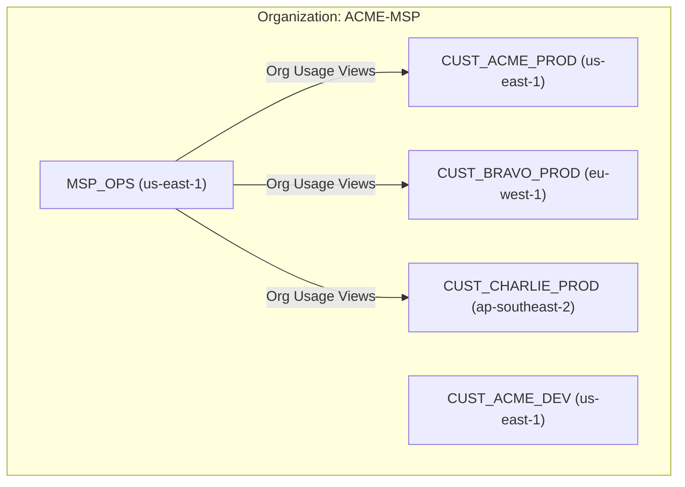
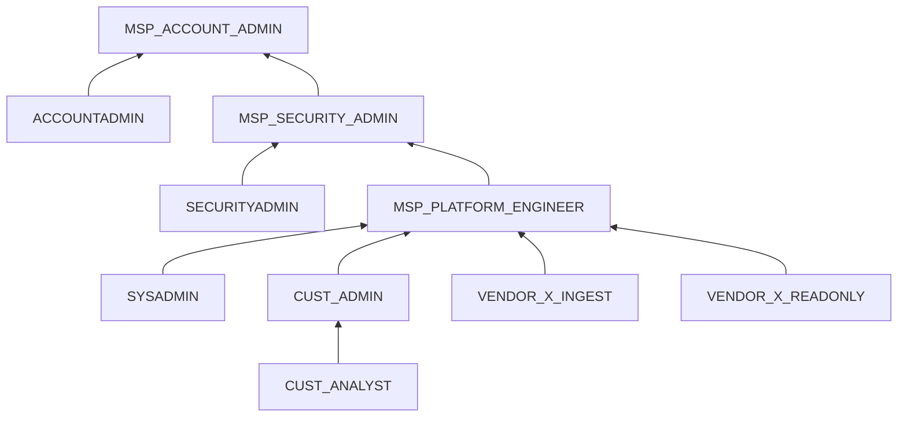
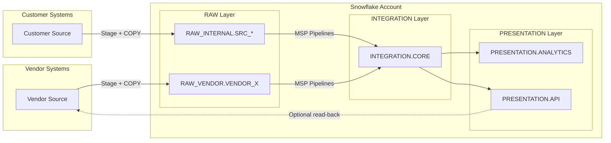
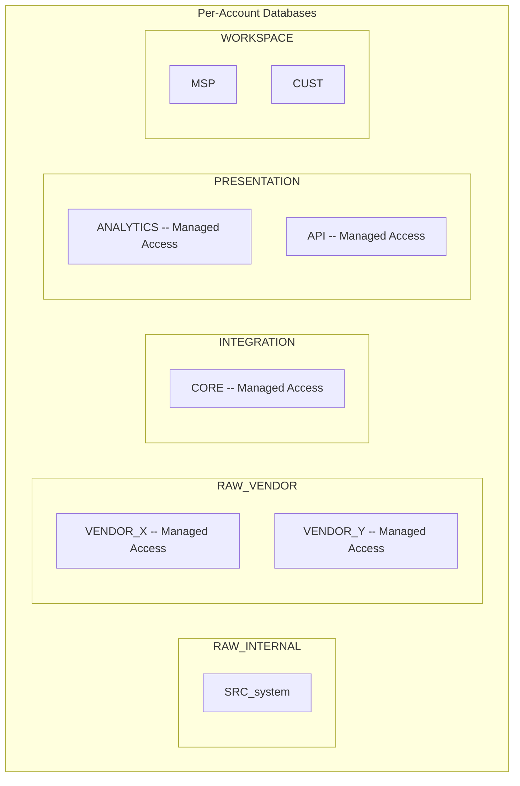

# Architecture Diagrams -- MSP Provider Guide

## Organization Layout

```mermaid
flowchart TB
    subgraph org [Organization: ACME-MSP]
        OPS["MSP_OPS (us-east-1)"]
        ACME_DEV["CUST_ACME_DEV (us-east-1)"]
        ACME_PROD["CUST_ACME_PROD (us-east-1)"]
        BRAVO["CUST_BRAVO_PROD (eu-west-1)"]
        CHARLIE["CUST_CHARLIE_PROD (ap-southeast-2)"]
    end

    OPS -->|"Org Usage Views"| ACME_PROD
    OPS -->|"Org Usage Views"| BRAVO
    OPS -->|"Org Usage Views"| CHARLIE
```

## Per-Account Role Hierarchy

```mermaid
flowchart BT
    ACCOUNTADMIN

    MSP_AA[MSP_ACCOUNT_ADMIN]
    MSP_SA[MSP_SECURITY_ADMIN]
    MSP_PE[MSP_PLATFORM_ENGINEER]
    CUST_A[CUST_ADMIN]
    CUST_AN[CUST_ANALYST]

    VX_I[VENDOR_X_INGEST]
    VX_R[VENDOR_X_READONLY]

    ACCOUNTADMIN --> MSP_AA
    SECURITYADMIN --> MSP_SA
    SYSADMIN --> MSP_PE

    MSP_SA --> MSP_AA
    MSP_PE --> MSP_SA

    CUST_AN --> CUST_A
    CUST_A --> MSP_PE

    VX_I --> MSP_PE
    VX_R --> MSP_PE
```

## Per-Account Data Flow

```mermaid
flowchart LR
    subgraph vendors [Vendor Systems]
        VS[Vendor Source]
    end

    subgraph customer [Customer Systems]
        CS[Customer Source]
    end

    subgraph snowflake [Snowflake Account]
        subgraph raw [RAW Layer]
            RV[RAW_VENDOR.VENDOR_X]
            RI[RAW_INTERNAL.SRC_*]
        end
        subgraph integration [INTEGRATION Layer]
            CORE[INTEGRATION.CORE]
        end
        subgraph presentation [PRESENTATION Layer]
            ANALYTICS[PRESENTATION.ANALYTICS]
            API[PRESENTATION.API]
        end
    end

    VS -->|"Stage + COPY"| RV
    CS -->|"Stage + COPY"| RI
    RV -->|"MSP Pipelines"| CORE
    RI -->|"MSP Pipelines"| CORE
    CORE --> ANALYTICS
    CORE --> API
    API -.->|"Optional read-back"| VS
```

## Database and Schema Layout

```mermaid
flowchart TB
    subgraph databases [Per-Account Databases]
        subgraph ri_db [RAW_INTERNAL]
            SRC[SRC_system]
        end
        subgraph rv_db [RAW_VENDOR]
            VX[VENDOR_X -- Managed Access]
            VY[VENDOR_Y -- Managed Access]
        end
        subgraph int_db [INTEGRATION]
            CORE_S[CORE -- Managed Access]
        end
        subgraph pres_db [PRESENTATION]
            ANALYTICS_S[ANALYTICS -- Managed Access]
            API_S[API -- Managed Access]
        end
        subgraph ws_db [WORKSPACE]
            MSP_S[MSP]
            CUST_S[CUST]
        end
    end
```
