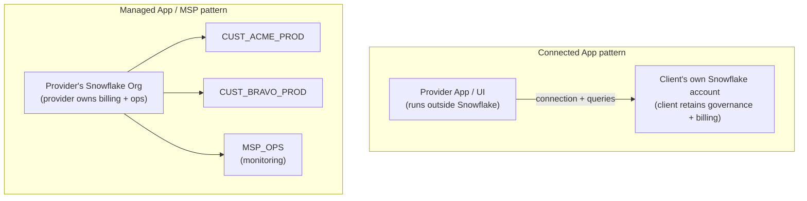
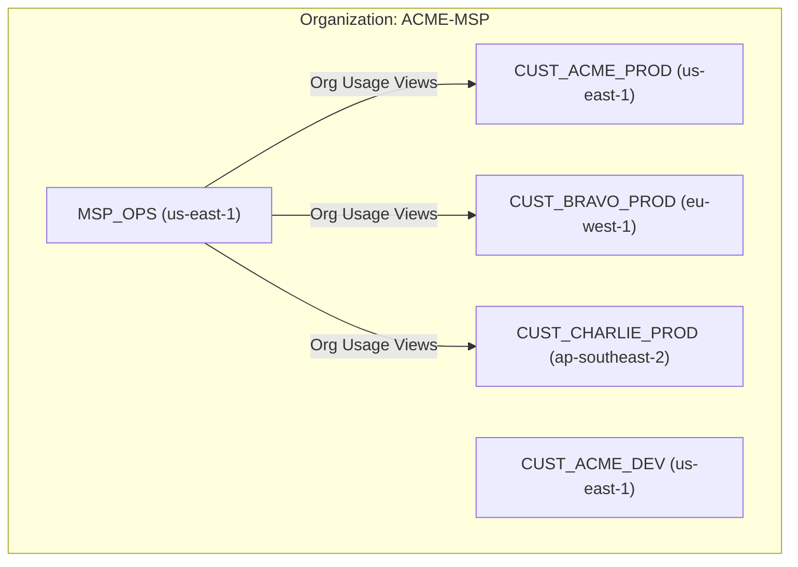
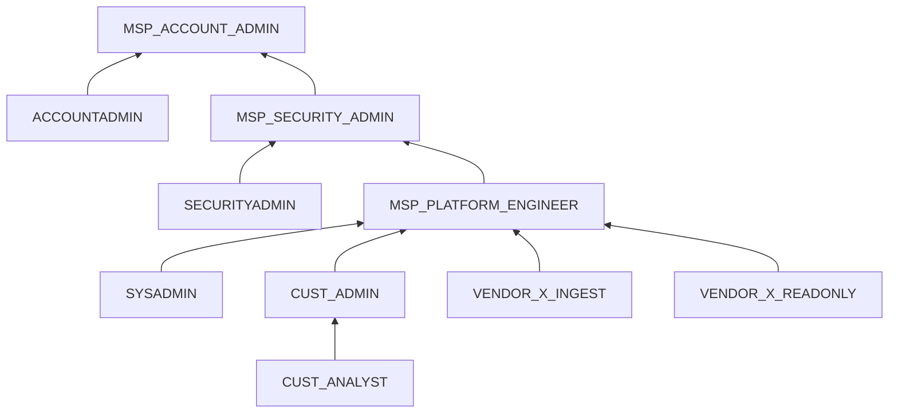
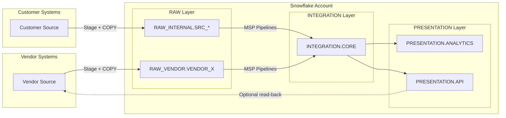
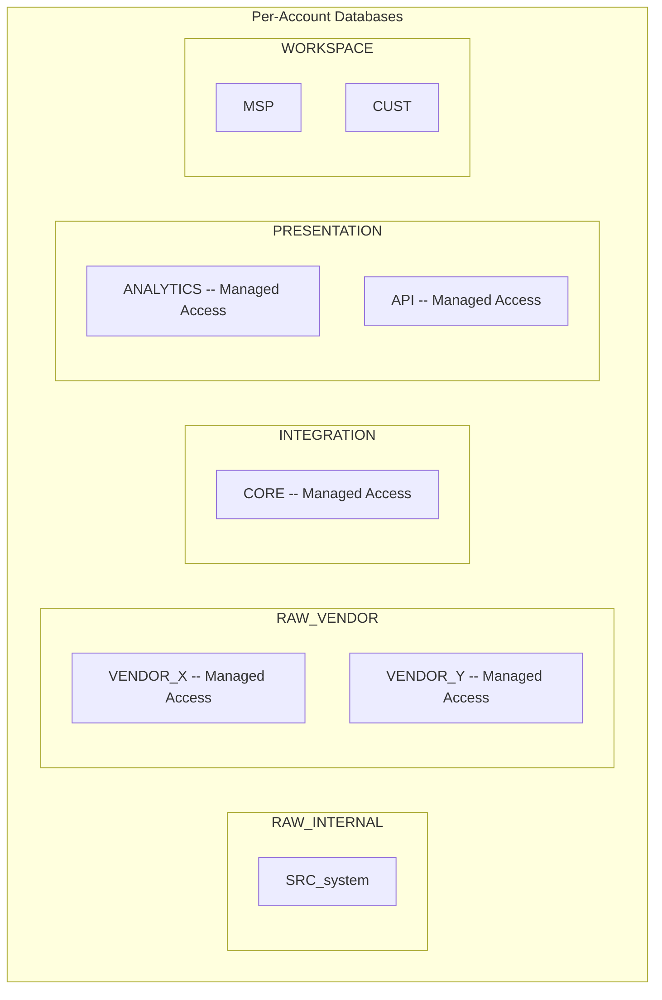

# Architecture Diagrams -- MSP Provider Guide

## Connected App vs Managed App (MSP)

Two fundamentally different patterns. Gate 1 — whether 3rd parties log directly into Snowflake and write data — is the dividing line.

| | Connected App | Managed App (MSP) |
|-|--------------|-------------------|
| Gate 1: direct login + write | No | Yes |
| Gate 2: data responsibility | No | Yes |
| Gate 3: billing entity | Client | Provider |
| Data lives in | Client's account | Provider's org |
| SPN enrollment | AI Data Cloud Products → Connected | AI Data Cloud Products → Managed Applications |

---

## Organization Layout (Managed App / MSP Pattern)

## Per-Account Role Hierarchy (Gate 1 + 2: who can write, who owns the result)

## Per-Account Data Flow (Gate 2: MSP owns everything past the RAW boundary)

## Database and Schema Layout (Gate 2: Managed Access enforces who controls grants)

