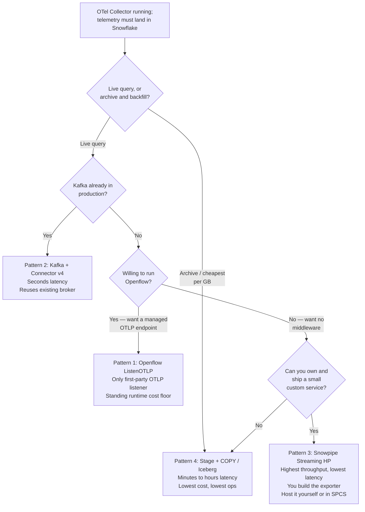
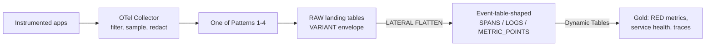

# OpenTelemetry into Snowflake: Ingestion and Reporting Guide

Your applications already emit OpenTelemetry logs, metrics, and traces. This guide covers
landing that telemetry **into** Snowflake tables you own, then reporting on it with SQL and
Dynamic Tables — an observability data lake next to your business data, with one governance
model and no per-seat APM pricing.

This is the inbound direction, and it is the opposite of most Snowflake telemetry
documentation. Snowflake's own event tables, the Openflow monitoring guide, and the
OpenTelemetry Collector's Snowflake receiver all move data the *other* way: Snowflake's
internal telemetry out to an observability backend. Confusing the two directions is the most
common wrong turn on this path, so [Gotchas](#gotchas-read-before-you-build) addresses it directly.

**Audience:** SEs, platform and observability engineers, and data engineers who own an OTel
Collector and want its output queryable in Snowflake.

Pair-programmed by SE Community + Cortex Code

**Created:** 2026-09-10 | **Expires:** 2027-03-10 | **Status:** ACTIVE

> **No support provided.** Reference only; validate before production use. Every SQL example
> here was executed against Snowflake on the created date above, and every availability claim
> was checked against the linked documentation on that date. Re-verify before quoting.

---

## Read These Words First

| Term | In plain words |
|---|---|
| **OTLP** | OpenTelemetry Protocol — the wire format telemetry travels in. Two encodings (Protobuf and JSON) over two transports (gRPC and HTTP). Everything in this guide lands OTLP **JSON**, because that is what Snowflake-side tooling produces and what `PARSE_JSON` can read. |
| **Signal** | One of the three telemetry types: logs, metrics, traces. OTLP keeps them in separate payload shapes, so each needs its own landing table and its own shredding query. |
| **Collector** | The OpenTelemetry Collector — a standalone process that receives telemetry from your apps, filters and batches it, and exports it onward. Every pattern here assumes you have one. It is the correct place to drop, sample, and redact, because it is the only place upstream of your storage bill. |
| **Span** | One timed operation inside a request — a handler, a query, an outbound call. Spans sharing a `trace_id` form one distributed trace; `parent_span_id` gives it a tree shape. |
| **Resource attributes** | Key-value pairs identifying *what emitted* the telemetry (`service.name`, `deployment.environment`, pod, host). Set once per batch, not per record. Your primary filter and join key. |
| **Event table** | A special Snowflake table type with OTel-shaped columns that collects telemetry **Snowflake itself generates**. You cannot write your application's OTel into one. It is still the right column layout to copy — see [The landing model](#the-landing-model-borrow-the-event-table-shape). |
| **Envelope** | OTLP's array nesting: `resourceSpans[] → scopeSpans[] → spans[]`. Three levels of arrays wrapping every record. This single fact drives the whole design — see [Gotchas](#gotchas-read-before-you-build). |
| **Shredding** | Unpacking that envelope into flat rows with `LATERAL FLATTEN`. |
| **Cardinality** | How many distinct attribute-value combinations you store. High cardinality is what makes observability data expensive — in Snowflake it shows up as storage and scan cost. |

---

## Start Here

### First fork: buy or build

Before comparing ingestion patterns, answer whether you should be ingesting at all.

**Observe is now part of Snowflake.** It reads event tables natively, centralizes telemetry
across regions and accounts, and gives you an AI-assisted observability product without your
operating a pipeline. Datadog's Snowflake integration does the same for Datadog shops. See
[Route telemetry to third-party observability tools](https://docs.snowflake.com/en/developer-guide/native-apps/native-apps-third-party-observability).

Build the pipeline in this guide when at least one of these is true:

- You want telemetry **joined to business data** — revenue impact per incident, error rates per
  customer tier, latency per contract. This is the strongest reason, and no APM tool does it.
- You need **long retention at storage prices** rather than APM ingest pricing.
- You are consolidating a **security and observability lake** and telemetry is one feed among many.
- Your governance model requires telemetry to stay inside your Snowflake perimeter.

Buy instead when you need turnkey alerting, service maps, and on-call workflows. Snowflake is a
query engine, not a paging system, and this guide will not give you one.

### Second fork: which ingestion pattern



If that tree lands you in two places, prefer the one whose failure mode you already know how to
operate. All four converge on the same landing tables and the same reporting layer, so this is a
reversible decision.

---

## Pattern Comparison

| | [1: Openflow ListenOTLP](pattern-1-openflow-listenotlp.md) | [2: Kafka + Connector v4](pattern-2-kafka-connector.md) | [3: Snowpipe Streaming HP](pattern-3-snowpipe-streaming.md) | [4: Stage + COPY / Iceberg](pattern-4-batch-stage-iceberg.md) |
|---|---|---|---|---|
| **How telemetry arrives** | Collector exports OTLP straight to a Snowflake-hosted listener | Collector → Kafka topic → Snowflake sink connector | Collector → your exporter → Snowpipe Streaming REST/SDK | Collector writes files → object storage → Snowflake reads |
| **Typical latency** | Seconds | Seconds | Under 10 seconds | Minutes to hours |
| **Status** | GA | GA (connector v4) | GA Sep 2025 (AWS), Nov 2025 (Azure, GCP) | GA |
| **Cloud limits** | Snowflake Deployment: AWS, Azure, GCP. BYOC: AWS only | Any | AWS, Azure, GCP — excluding government regions | Any |
| **You must build** | Nothing — canvas configuration | Kafka topics + connector config | **A custom OTLP exporter** (none exists upstream). Host it yourself or in SPCS | Collector exporter config + `COPY` schedule |
| **Ops burden** | Openflow runtime to size and monitor | Kafka cluster plus Connect workers | Your exporter's retry, offset, and backpressure logic | Lowest — file drops and a task |
| **Cost shape** | Standing runtime floor, always on | Kafka cost you already pay, plus streaming ingest | Throughput-based streaming ingest, plus a compute pool if hosted in SPCS | Storage plus periodic warehouse |
| **What it does not do** | No per-runtime cost attribution | Will not flatten OTLP for you (see below) | Not available in government regions | Not for live incident response |

---

## The Landing Model: Borrow the Event Table Shape

All four patterns land the **raw OTLP JSON envelope** in a `VARIANT` column, then shred it in
SQL. Do not try to make the ingestion layer flatten OTel for you — [Gotchas](#gotchas-read-before-you-build)
explains why that fails.

The useful decision is what the *shredded* tables look like. Model them on Snowflake's own
[event table columns](https://docs.snowflake.com/en/developer-guide/logging-tracing/event-table-columns):
`TIMESTAMP`, `START_TIMESTAMP`, `OBSERVED_TIMESTAMP`, `TRACE`, `RESOURCE_ATTRIBUTES`, `SCOPE`,
`RECORD_TYPE`, `RECORD`, `RECORD_ATTRIBUTES`, `VALUE`.

That choice pays off three ways:

1. **One query set spans both worlds.** A latency or error query written against your application
   telemetry runs nearly unchanged against `SNOWFLAKE.TELEMETRY.EVENTS` for your Snowflake-side
   procedures and tasks. You get end-to-end views without a translation layer.
2. **`RECORD_TYPE` gives you a union.** `LOG`, `SPAN`, `SPAN_EVENT`, `METRIC` are the same
   discriminator Snowflake uses, so one wide table can hold every signal if you prefer that to
   three narrow ones.
3. **It is a documented, stable contract** rather than a shape you invented, which matters when
   the next engineer inherits it.

The full DDL, the validated shredding SQL for all three signals, and the Dynamic Table gold
layer are in **[shredding-and-reporting.md](shredding-and-reporting.md)**. Start there once you
have picked a pattern — it is the half of the work that every pattern shares.



---

## Pattern Guides

| Guide | Read it when |
|---|---|
| [Pattern 1: Openflow ListenOTLP](pattern-1-openflow-listenotlp.md) | You want a managed OTLP endpoint and no custom code, and sustained volume justifies a standing runtime |
| [Pattern 2: Kafka + Connector v4](pattern-2-kafka-connector.md) | Kafka is already load-bearing in your stack |
| [Pattern 3: Snowpipe Streaming HP](pattern-3-snowpipe-streaming.md) | You need maximum throughput and can ship and operate a small relay service — on your own platform or hosted in SPCS |
| [Pattern 4: Stage + COPY / Iceberg](pattern-4-batch-stage-iceberg.md) | Retention and cost matter more than latency |
| [Shredding and reporting](shredding-and-reporting.md) | Always — after you pick a pattern |

---

## Gotchas: Read Before You Build

### 1. You cannot write your application's OTel into an event table

This is the first thing most people try, and it does not work. Event tables collect telemetry
that **Snowflake generates** — your procedures, UDFs, tasks, Streamlit apps, Openflow runtimes.
You associate one with an account or a database and Snowflake populates it. There is no
supported path to insert external telemetry into `SNOWFLAKE.TELEMETRY.EVENTS` or into a table
you create with `CREATE EVENT TABLE`.

Land external OTel in **ordinary tables**. Copy the event table's *column layout*, per
[The landing model](#the-landing-model-borrow-the-event-table-shape), and get the query
portability without fighting the object type. See
[Event table overview](https://docs.snowflake.com/en/developer-guide/logging-tracing/event-table-setting-up).

### 2. The Collector's Snowflake component points the wrong way

Searching for "OpenTelemetry Snowflake" surfaces the **`snowflakereceiver`** in
`opentelemetry-collector-contrib`. A *receiver* is an input: it logs into your account and
queries `ACCOUNT_USAGE` to pull Snowflake's own metrics out. Wiring it up gives you Snowflake
metrics in your APM tool — the opposite of this guide.

A Snowflake **exporter** was proposed in collector-contrib issue #29618 and was never merged.
As of the created date above there is no upstream exporter that writes to Snowflake. That is
precisely why Pattern 3 requires you to build one, and why Patterns 1, 2, and 4 route through
components that already exist.

If you are willing to own that component, Snowflake will at least host it: the Snowpipe Streaming
SDK runs inside Snowpark Container Services with workload-identity authentication as of SDK 1.5.0,
so the bridge you write can live inside your Snowflake perimeter with no stored credential. See
[Where to run the relay](pattern-3-snowpipe-streaming.md#where-to-run-the-relay). That changes
where the code runs and how it authenticates — it does not remove the need to write it.

### 3. Ingestion-layer schematization will not flatten OTLP

Kafka Connector schematization explicitly does not support further schematization of
JSON arrays
([documentation](https://docs.snowflake.com/en/user-guide/snowpipe-streaming/snowpipe-streaming-classic-kafka-schema-detection)).
OTLP is arrays all the way down — `resourceSpans[] → scopeSpans[] → spans[] → attributes[]`.
Point schematization at OTLP and you get columns for the top-level envelope keys, not the spans
you wanted.

Land raw `VARIANT`, shred in SQL. Every pattern in this guide does this, and it is a feature:
one shredding implementation serves all four ingestion paths, and a shredding bug is fixed with
`CREATE OR REPLACE` rather than a connector redeploy and backfill.

### 4. Integers arrive as JSON strings

OTLP encodes 64-bit integers as **quoted strings** so they survive JSON parsers with 53-bit
floats. Verified: `{"intValue":"500"}`, `"bucketCounts":["10","80","25","5"]`, and every
`timeUnixNano`.

Always cast through the string:

```sql
-- Correct
TO_TIMESTAMP_NTZ(TO_NUMBER(dp.value:timeUnixNano::STRING), 9)

-- Wrong: reads a nanosecond epoch as a float and silently loses sub-second precision
TO_TIMESTAMP_NTZ(dp.value:timeUnixNano::FLOAT)
```

Nanosecond epochs are 19 digits. A `FLOAT` cast will not error — it will quietly round, and
your span durations will look plausible and be wrong.

### 5. Attributes are arrays of typed unions, not objects

An OTel attribute is `{"key": "...", "value": {"<type>Value": ...}}`, and the type key varies
per attribute. So `attributes:"service.name"` returns nothing — `attributes` is an array, not an
object. Collapsing it to a queryable `OBJECT` is the single most important transformation in this
guide; the working, executed version uses `REDUCE` and lives in
[shredding-and-reporting.md](shredding-and-reporting.md#the-one-trick-worth-learning-first).

Three traps inside that pattern:

- **Prefer `REDUCE` over `OBJECT_AGG` with a `LATERAL FLATTEN` and a join back.** The join-based
  form is correct for a single row but silently mixes attributes between rows once your landing
  table has more than one, because `FLATTEN`'s `index` is unique only *within* a source row.
- `COALESCE` is safe for `boolValue: false` because it skips only `NULL` — verified. Do not
  "fix" it with `IFNULL` chains that treat falsy values as missing.
- `arrayValue` and `kvlistValue` stay nested; they do not collapse to scalars. Expect
  `[{"stringValue":"a"}]`, not `["a"]`.

### 6. Histograms are not a single number

A histogram data point carries `count`, `sum`, `bucketCounts[]`, and `explicitBounds[]`.
A shredder that only reads `asDouble`/`asInt` drops every histogram silently — you lose exactly
the latency distributions you need for percentiles, and nothing errors.

Model histogram points explicitly. Also note that a bucketed histogram gives you *bounded*
percentile estimates, not exact ones; if you need exact p99, either emit spans and compute from
durations, or accept the bucket resolution you configured.

### 7. Cardinality is your cost control, and it lives in the Collector

Telemetry cost is driven by distinct attribute combinations. Attach a user ID, a request ID, or
a full URL with query string as an attribute and cardinality explodes.

Fix it upstream, in Collector processors — `filter`, `transform`, `tail_sampling`,
`redaction`. Snowflake will faithfully store whatever you send and bill you for it. Dropping a
noisy attribute in the Collector is free; deleting it from Snowflake later costs a rewrite.

There is a second, quantifiable version of this. Ingesting into a single `VARIANT` column bills
you for **all JSON bytes including the keys**, whereas `MATCH_BY_COLUMN_NAME` bills only the
values actually landed
([best practices](https://docs.snowflake.com/en/user-guide/snowpipe-streaming/snowpipe-streaming-high-performance-best-practices)).
OTLP JSON is unusually key-heavy — every attribute costs you `"key"`, `"value"`, and a type
discriminator. Pattern 3 covers how to trade raw-envelope fidelity against that bill.

### 8. Use `TRY_PARSE_JSON` on the landing path

Telemetry payloads come from many services, and one malformed batch should degrade a row, not
fail a Dynamic Table refresh. `PARSE_JSON` raises; `TRY_PARSE_JSON` returns `NULL`. Filter
`WHERE payload IS NOT NULL` in the shredding layer and count the rejects as a monitored metric —
a rising reject count is a real signal about an upstream deploy.

---

## Related Guides

- [Snowflake event table columns](https://docs.snowflake.com/en/developer-guide/logging-tracing/event-table-columns) — the column contract this guide's landing model copies
- [Logging, tracing, and metrics in Snowflake](https://docs.snowflake.com/en/developer-guide/logging-tracing/logging-tracing-overview) — the outbound counterpart: instrumenting Snowflake's own code
- [Route telemetry to third-party observability tools](https://docs.snowflake.com/en/developer-guide/native-apps/native-apps-third-party-observability) — Observe and Datadog, the buy-side of the first fork
- [Dynamic Tables](https://docs.snowflake.com/en/user-guide/dynamic-tables-about) — the incremental engine behind the gold layer

## External References

- [OpenTelemetry Collector documentation](https://opentelemetry.io/docs/collector/)
- [OTLP specification](https://opentelemetry.io/docs/specs/otlp/) — the envelope and encoding rules
- [OpenTelemetry semantic conventions](https://opentelemetry.io/docs/specs/semconv/) — canonical attribute names worth conforming to before you model
- [Openflow ListenOTLP processor](https://docs.snowflake.com/en/user-guide/data-integration/openflow/processors/listenotlp)
- [Snowflake Connector for Kafka](https://docs.snowflake.com/en/connectors/kafkahp/about)
- [Snowpipe Streaming high-performance architecture](https://docs.snowflake.com/en/user-guide/snowpipe-streaming/data-load-snowpipe-streaming-overview)
- [Snowpipe Streaming best practices](https://docs.snowflake.com/en/user-guide/snowpipe-streaming/snowpipe-streaming-high-performance-best-practices)
- [Kafka connector with Iceberg tables](https://docs.snowflake.com/en/user-guide/kafka-connector-iceberg)
- [COPY INTO table](https://docs.snowflake.com/en/sql-reference/sql/copy-into-table)
