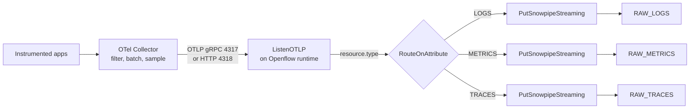

# Pattern 1: Openflow ListenOTLP

Snowflake's Openflow ships a `ListenOTLP` processor that speaks OTLP directly. It is the only
first-party OpenTelemetry listener Snowflake offers, and it is GA. Point your Collector at it,
route on signal type, and land the payloads with `PutSnowpipeStreaming` — no custom code.

Pair-programmed by SE Community + Cortex Code

> Part of [OpenTelemetry into Snowflake](README.md). Read the
> [gotchas](README.md#gotchas-read-before-you-build) first.

---

## Read This Before You Start

**There is an unresolved network-reachability question, and it may disqualify this pattern for
your topology.** Resolve it before building anything.

`ListenOTLP` binds a TCP port on the Openflow runtime — conventionally 4317 for OTLP/gRPC and
4318 for OTLP/HTTP. Your Collector has to reach that port. What Snowflake documents is:

- For **Snowflake Deployments**, Openflow creates DNS records, a public load balancer, and
  manages TLS for runtimes. The documented, worked example of what that exposes is the runtime
  **canvas UI**, at `https://<host>/<runtime-name>/nifi/` on 443.
- For **BYOC deployments on AWS**, you can take over ingress yourself with
  [custom ingress](https://docs.snowflake.com/en/user-guide/data-integration/openflow/setup-openflow-byoc-custom-ingress).
  That documentation also routes 443 to the runtime, but because the load balancer and target
  groups are in **your** AWS account, you control what else you can route.

What is **not** documented is whether an arbitrary listener port on a Snowflake Deployment
runtime is reachable from outside Snowflake. Every `Listen*` processor in the Openflow catalog
has the same open question, so this is not specific to OTLP.

Three practical consequences:

1. **Confirm reachability with your account team before committing.** Ask specifically: can an
   external client open a TCP connection to a non-443 port on an Openflow Snowflake Deployment
   runtime, and if not, what is the supported ingress path? Do not infer an answer from the fact
   that the processor exists.
2. **BYOC on AWS is the safer choice** if you need this pattern and your Collector lives outside
   Snowflake, because ingress is yours to configure.
3. **If reachability does not resolve, this pattern is out** and Pattern 2 or 3 is your answer.
   That is a normal outcome, not a failure — Kafka and Snowpipe Streaming are both
   Collector-initiated *outbound* connections, which sidesteps the entire question.

This caveat is why the [decision tree](README.md#second-fork-which-ingestion-pattern) gates
Pattern 1 behind willingness to run Openflow rather than treating it as the default.

## When This Pattern Wins

- You want a managed OTLP endpoint and are not willing to write and operate a custom exporter.
- You have no Kafka and do not want to introduce it.
- Your telemetry volume is sustained, so a standing runtime is amortized rather than wasted.
- You want the rest of the Openflow processor catalog available for enrichment, routing, and
  fan-out to a second destination.

## What This Pattern Costs You

Creating an Openflow deployment starts the **Openflow Management Services compute pool** — one
`CPU_X64_S` node — which bills continuously for as long as the deployment exists, whether or not
any runtime is running. On top of that you pay for runtime nodes while they are active, plus the
streaming ingest itself.

Two honest consequences:

- **There is a volume floor below which this pattern does not pay off.** Compare the standing
  deployment plus runtime cost against the marginal cost of Pattern 2 or 4 at your actual daily
  telemetry volume. For intermittent or low-volume telemetry, Pattern 4 will be cheaper by a
  wide margin. Do the arithmetic with your own numbers rather than trusting a rule of thumb.
- **You cannot attribute cost per runtime.** Openflow bills at the compute-pool level, so if you
  run telemetry ingestion and other connectors in the same deployment, you cannot cleanly answer
  "what did OTel ingestion cost me." If that attribution matters — for chargeback, or for
  proving the pipeline's value — use a dedicated deployment and accept the duplicated base cost.

Suspending the runtime stops runtime cost. Only dropping the deployment stops the base cost.

---

## Architecture



`ListenOTLP` does the signal separation for you. It writes three FlowFile attributes:

| Attribute | Value |
|---|---|
| `resource.type` | `LOGS`, `METRICS`, or `TRACES` — route on this |
| `mime.type` | `application/json` — the processor emits JSON regardless of whether the client sent Protobuf |
| `resource.count` | Number of resource elements in the message — useful as a throughput metric |

That `mime.type` is the pattern's quiet advantage: the Collector can speak efficient Protobuf on
the wire, and Snowflake still receives parseable JSON. You get compact transport without a
decoding step you have to build.

Source: [ListenOTLP](https://docs.snowflake.com/en/user-guide/data-integration/openflow/processors/listenotlp).
It implements OTLP Specification 1.0.0 over both gRPC and HTTP, and detects the protocol from the
HTTP `Content-Type` header. `Input Requirement: FORBIDDEN` confirms it is a source processor —
it starts a flow and takes no upstream connection.

---

## Step 1: Snowflake Objects

Land raw envelopes in three ordinary tables. Not event tables — see
[Gotcha 1](README.md#1-you-cannot-write-your-applications-otel-into-an-event-table).

```sql
USE ROLE SYSADMIN;

CREATE DATABASE IF NOT EXISTS OTEL_LAKE
    COMMENT = 'External OpenTelemetry ingestion and reporting';

CREATE SCHEMA IF NOT EXISTS OTEL_LAKE.RAW
    COMMENT = 'Landing zone: unmodified OTLP JSON envelopes';

-- One table per signal. PAYLOAD holds the OTLP envelope exactly as received.
-- INGESTED_AT is server-side so you can measure pipeline lag independently of
-- the timestamps inside the payload, which come from the emitting host's clock.
CREATE TABLE IF NOT EXISTS OTEL_LAKE.RAW.RAW_TRACES (
    PAYLOAD        VARIANT,
    RESOURCE_COUNT NUMBER,
    INGESTED_AT    TIMESTAMP_NTZ DEFAULT SYSDATE()
)
COMMENT = 'OTLP resourceSpans envelopes from ListenOTLP';

CREATE TABLE IF NOT EXISTS OTEL_LAKE.RAW.RAW_LOGS (
    PAYLOAD        VARIANT,
    RESOURCE_COUNT NUMBER,
    INGESTED_AT    TIMESTAMP_NTZ DEFAULT SYSDATE()
)
COMMENT = 'OTLP resourceLogs envelopes from ListenOTLP';

CREATE TABLE IF NOT EXISTS OTEL_LAKE.RAW.RAW_METRICS (
    PAYLOAD        VARIANT,
    RESOURCE_COUNT NUMBER,
    INGESTED_AT    TIMESTAMP_NTZ DEFAULT SYSDATE()
)
COMMENT = 'OTLP resourceMetrics envelopes from ListenOTLP';
```

Then the execute-as role the runtime uses to write:

```sql
USE ROLE ACCOUNTADMIN;

CREATE ROLE IF NOT EXISTS OTEL_RUNTIME_EXECUTE_AS_RL
    COMMENT = 'Openflow runtime identity for OTel ingestion; write-only on RAW';

GRANT USAGE ON DATABASE OTEL_LAKE            TO ROLE OTEL_RUNTIME_EXECUTE_AS_RL;
GRANT USAGE ON SCHEMA   OTEL_LAKE.RAW        TO ROLE OTEL_RUNTIME_EXECUTE_AS_RL;
GRANT INSERT ON TABLE OTEL_LAKE.RAW.RAW_TRACES  TO ROLE OTEL_RUNTIME_EXECUTE_AS_RL;
GRANT INSERT ON TABLE OTEL_LAKE.RAW.RAW_LOGS    TO ROLE OTEL_RUNTIME_EXECUTE_AS_RL;
GRANT INSERT ON TABLE OTEL_LAKE.RAW.RAW_METRICS TO ROLE OTEL_RUNTIME_EXECUTE_AS_RL;
```

`INSERT` only, with no `SELECT`, `UPDATE`, or `DELETE`. An ingestion identity has no reason to
read or mutate history, and a write-only role means a compromised runtime cannot exfiltrate the
telemetry lake or erase evidence. Grant `SELECT` to your analyst role separately.

## Step 2: Deployment and Runtime

```sql
-- syntax from docs, not executed: Openflow DDL cannot be compile-checked
-- outside an Openflow-enabled account. Re-verify at the expiry date.
-- SOURCE https://docs.snowflake.com/en/sql-reference/sql/create-openflow-deployment
USE ROLE OPENFLOW_ADMIN;

CREATE OPENFLOW DEPLOYMENT IF NOT EXISTS OTEL_DEPLOYMENT
  DEPLOYMENT_TYPE = SNOWFLAKE
  EVENT_TABLE     = 'OTEL_LAKE.RAW.OPENFLOW_EVENTS'
  DISPLAY_NAME    = 'OpenTelemetry ingestion'
  COMMENT         = 'Hosts the ListenOTLP runtime';

SELECT SYSTEM$WAIT_FOR_OPENFLOW_DEPLOYMENT_STATUS('OTEL_DEPLOYMENT', 'ACTIVE', 900);
```

Note the recursion worth being deliberate about: the deployment writes **its own** operational
telemetry to an event table, and that telemetry is separate from the application telemetry
flowing through it. Keep them apart. The event table tells you whether the pipeline is healthy;
`RAW_*` tells you whether your applications are healthy. Conflating them makes both harder to
reason about, and the Openflow event table is the one you query when ingestion breaks.

```sql
-- syntax from docs, not executed
-- SOURCE https://docs.snowflake.com/en/sql-reference/sql/create-openflow-runtime
CREATE OPENFLOW RUNTIME IF NOT EXISTS OTEL_LAKE.RAW.OTEL_RUNTIME
  IN DEPLOYMENT OTEL_DEPLOYMENT
  NODE_TYPE       = MEDIUM
  MIN_NODES       = 1
  MAX_NODES       = 3
  EXECUTE_AS_ROLE = OTEL_RUNTIME_EXECUTE_AS_RL
  DISPLAY_NAME    = 'OTLP listener'
  COMMENT         = 'ListenOTLP plus PutSnowpipeStreaming';

SELECT SYSTEM$WAIT_FOR_OPENFLOW_RUNTIME_STATUS('OTEL_LAKE.RAW.OTEL_RUNTIME', 'ACTIVE', 600);
```

**Sizing, stated as facts then judgment.** `NODE_TYPE` is immutable after creation: `SMALL` is
1 vCPU / 2 GB, `MEDIUM` is 4 vCPU / 10 GB, `LARGE` is 8 vCPU / 20 GB, and nodes range 1-50.
Snowflake publishes packing guidance for CDC connectors, **not** for OTLP listening, so there is
no authoritative starting point for this workload.

`MEDIUM` with 1-3 nodes is a defensible starting guess, not a recommendation derived from
published guidance. Telemetry ingestion is decode-and-serialize work, which is CPU-bound and
scales with span rate rather than payload size, so measure before you scale. Openflow's own
metrics tell you what to do next — see [Step 5](#step-5-monitor-the-listener). Note that no
`EXTERNAL_ACCESS_INTEGRATIONS` is needed: telemetry arrives inbound, so the runtime makes no
outbound calls.

## Step 3: Build the Flow on the Canvas

`ListenOTLP` is configured on the NiFi canvas, not in SQL. Add the processor and set:

| Property | Value | Why |
|---|---|---|
| `Port` | `4318` | The OTLP/HTTP convention. Protocol is detected from `Content-Type`, so one port can serve both, but running gRPC on `4317` separately is clearer to operate. |
| `Address` | Leave default | Default listens on all addresses. |
| `SSL Context Service` | A configured `StandardRestrictedSSLContextService` | **Not optional.** Telemetry routinely carries user IDs, request paths, and exception messages. Unencrypted OTLP is a data-exposure finding waiting to happen. |
| `Client Authentication` | `REQUIRED` | Makes the listener mTLS. Without it, anyone who can reach the port can inject arbitrary telemetry into your lake — which corrupts dashboards and, if you alert on this data, lets an attacker suppress or fabricate signals. |
| `Batch Size` | Start `100` | Resource elements per FlowFile. Higher means fewer, larger FlowFiles and better throughput at the cost of latency. |
| `Queue Capacity` | Start `10000` | The in-memory buffer. This is your burst absorber; see the backpressure note below. |
| `Worker Threads` | Start at the node's vCPU count | Threads decoding and queueing incoming requests. |

Then `RouteOnAttribute` on `${resource.type}` into three branches, each terminating in a
`PutSnowpipeStreaming` writing to the matching `RAW_*` table.

**On backpressure, which is the failure mode that will actually bite you.** `Queue Capacity`
bounds what the listener holds in memory. When Snowflake-side writes slow down or the runtime
saturates, that queue fills and the listener starts rejecting requests. The Collector's
`sending_queue` and retry settings then decide whether telemetry is buffered or dropped.

Telemetry is lossy by design and that is usually the right tradeoff — you do not want an
observability pipeline applying backpressure to production. But it must be a decision you made,
not one you discovered during an incident. Configure the Collector's `sending_queue` deliberately,
enable `file_storage` for a persistent queue if you cannot tolerate loss during a Snowflake-side
stall, and alert on the Collector's own dropped-span counters. The Collector knows it dropped
data; Snowflake cannot know what never arrived.

## Step 4: Configure the Collector

```yaml
# collector-config.yaml — Openflow ListenOTLP destination
receivers:
  otlp:
    protocols:
      grpc: { endpoint: 0.0.0.0:4317 }
      http: { endpoint: 0.0.0.0:4318 }

processors:
  # Cap memory before the Collector becomes the problem.
  memory_limiter:
    check_interval: 1s
    limit_percentage: 75
    spike_limit_percentage: 20

  # Drop high-cardinality attributes here. This is the only place it is free.
  # See README Gotcha 7.
  attributes/scrub:
    actions:
      - key: http.request.header.authorization
        action: delete
      - key: user.email
        action: delete
      - key: url.query
        action: delete

  batch:
    timeout: 5s
    send_batch_size: 512
    send_batch_max_size: 1024

exporters:
  otlphttp/snowflake:
    endpoint: https://<your-openflow-runtime-host>:4318
    compression: gzip
    tls:
      insecure: false
      cert_file: /etc/otel/certs/client.crt
      key_file: /etc/otel/certs/client.key
    # Buffer through transient runtime unavailability rather than dropping.
    sending_queue:
      enabled: true
      num_consumers: 4
      queue_size: 5000
    retry_on_failure:
      enabled: true
      initial_interval: 5s
      max_interval: 30s
      max_elapsed_time: 300s

service:
  pipelines:
    traces:
      receivers: [otlp]
      processors: [memory_limiter, attributes/scrub, batch]
      exporters: [otlphttp/snowflake]
    logs:
      receivers: [otlp]
      processors: [memory_limiter, attributes/scrub, batch]
      exporters: [otlphttp/snowflake]
    metrics:
      receivers: [otlp]
      processors: [memory_limiter, attributes/scrub, batch]
      exporters: [otlphttp/snowflake]
```

Processor order matters and is not arbitrary: `memory_limiter` first so it can shed load before
anything else allocates, `attributes/scrub` before `batch` so you are not paying to batch fields
you are about to delete.

## Step 5: Monitor the Listener

Openflow writes runtime metrics and logs to the deployment's event table. These queries are the
Openflow-specific half of monitoring; the pipeline-health queries that apply to all four patterns
are in [shredding-and-reporting.md](shredding-and-reporting.md).

**Is the listener queue backing up?** A rising trend here is your early warning that the runtime
is undersized, well before the Collector starts reporting rejections.

```sql
SELECT
    TIMESTAMP,
    RESOURCE_ATTRIBUTES:"k8s.pod.name"::STRING AS runtime_pod,
    RECORD_ATTRIBUTES:name::STRING             AS connection_name,
    TO_NUMBER(VALUE)                           AS queued_items
FROM OTEL_LAKE.RAW.OPENFLOW_EVENTS
WHERE RECORD_TYPE = 'METRIC'
  AND RECORD:metric:name = 'connection.queued.count'
  AND TIMESTAMP > DATEADD('hour', -6, SYSDATE())
ORDER BY TIMESTAMP DESC, queued_items DESC;
```

**Is the runtime CPU-saturated?** If this sits high while the runtime is already at `MAX_NODES`,
raise `MAX_NODES` or split into a second runtime. Prefer splitting — it bounds blast radius, and
a single runtime scaled to its ceiling has no headroom left for a burst.

```sql
SELECT
    TIMESTAMP,
    RESOURCE_ATTRIBUTES:"k8s.pod.name"::STRING AS runtime_pod,
    TO_NUMBER(VALUE, 10, 3) * 100              AS cpu_usage_pct
FROM OTEL_LAKE.RAW.OPENFLOW_EVENTS
WHERE RECORD_TYPE = 'METRIC'
  AND RECORD:metric:name = 'container.cpu.usage'
  AND RESOURCE_ATTRIBUTES:"k8s.container.name"::STRING ILIKE '%-server'
  AND TIMESTAMP > DATEADD('hour', -6, SYSDATE())
ORDER BY TIMESTAMP DESC;
```

**What is erroring?** Openflow runtime logs arrive as JSON in `VALUE`.

```sql
SELECT
    TIMESTAMP,
    parsed:loggerName::STRING       AS logger,
    parsed:formattedMessage::STRING AS message,
    parsed:throwable:className::STRING AS exception_class
FROM (
    SELECT TIMESTAMP, TRY_PARSE_JSON(VALUE) AS parsed
    FROM OTEL_LAKE.RAW.OPENFLOW_EVENTS
    WHERE RECORD_TYPE = 'LOG'
      AND TIMESTAMP > DATEADD('hour', -6, SYSDATE())
)
WHERE parsed:level::STRING = 'ERROR'
ORDER BY TIMESTAMP DESC
LIMIT 100;
```

**Is anything arriving at all?** The cheapest end-to-end check, and the one to alert on.

```sql
SELECT
    'RAW_TRACES'                                  AS landing_table,
    COUNT(*)                                      AS rows_last_hour,
    MAX(INGESTED_AT)                              AS newest_row,
    DATEDIFF('second', MAX(INGESTED_AT), SYSDATE()) AS seconds_since_last_row
FROM OTEL_LAKE.RAW.RAW_TRACES
WHERE INGESTED_AT > DATEADD('hour', -1, SYSDATE())
UNION ALL
SELECT
    'RAW_LOGS',
    COUNT(*),
    MAX(INGESTED_AT),
    DATEDIFF('second', MAX(INGESTED_AT), SYSDATE())
FROM OTEL_LAKE.RAW.RAW_LOGS
WHERE INGESTED_AT > DATEADD('hour', -1, SYSDATE())
UNION ALL
SELECT
    'RAW_METRICS',
    COUNT(*),
    MAX(INGESTED_AT),
    DATEDIFF('second', MAX(INGESTED_AT), SYSDATE())
FROM OTEL_LAKE.RAW.RAW_METRICS
WHERE INGESTED_AT > DATEADD('hour', -1, SYSDATE());
```

`UNION ALL` rather than `UNION` is deliberate — these are known-distinct rows and deduplication
would be wasted work.

---

## Next Step

Land data, confirm the freshness query returns rows, then go to
**[shredding-and-reporting.md](shredding-and-reporting.md)** to turn the raw envelopes into
queryable spans, logs, and metric points.

## External References

- [ListenOTLP processor](https://docs.snowflake.com/en/user-guide/data-integration/openflow/processors/listenotlp)
- [CREATE OPENFLOW DEPLOYMENT](https://docs.snowflake.com/en/sql-reference/sql/create-openflow-deployment)
- [CREATE OPENFLOW RUNTIME](https://docs.snowflake.com/en/sql-reference/sql/create-openflow-runtime)
- [Openflow BYOC custom ingress](https://docs.snowflake.com/en/user-guide/data-integration/openflow/setup-openflow-byoc-custom-ingress)
- [Monitor Openflow using telemetry data](https://docs.snowflake.com/en/user-guide/data-integration/openflow/monitor)
- [OTel Collector otlphttp exporter](https://github.com/open-telemetry/opentelemetry-collector/tree/main/exporter/otlphttpexporter)
