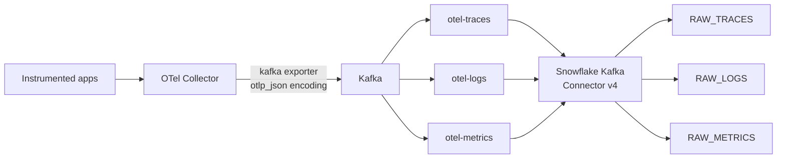

# Pattern 2: OTel Collector to Kafka to Snowflake Connector v4

If Kafka is already load-bearing in your stack, this is the lowest-friction pattern. The
Collector's `kafka` exporter and Snowflake's Kafka Connector are both mature GA components, and
neither needs custom code. Kafka also gives you something no other pattern here does: a durable
replayable buffer, so a Snowflake-side outage costs you nothing.

Pair-programmed by SE Community + Cortex Code

> Part of [OpenTelemetry into Snowflake](README.md). Read the
> [gotchas](README.md#gotchas-read-before-you-build) first.

---

## When This Pattern Wins

- **Kafka is already in production.** The marginal cost of three more topics is close to zero,
  and your team already knows how to operate the failure modes.
- **You cannot lose telemetry.** Kafka's retention is your replay buffer. If the Snowflake sink
  breaks for four hours, you fix it and the connector catches up from the retained offsets.
  Patterns 1 and 3 buffer only in Collector memory or disk.
- **Telemetry has more than one consumer.** A stream processor doing real-time alerting and
  Snowflake doing analysis can read the same topics independently. This is a genuinely better
  architecture than fanning out from the Collector, because each consumer tracks its own offsets.
- **You want the ingestion path to be boring.** Every component is GA and widely deployed.

Do not stand up Kafka *for* this. If you have no broker, Pattern 1 or 4 is less work and less
ongoing cost than operating a cluster.

## Pin Connector v4

Use the **Snowflake Connector for Kafka v4** for anything new. Snowflake's guidance is explicit:
the classic connector (v3 and earlier) is fully supported today but planned for deprecation, with
a formal announcement expected mid-2026 followed by an 18-month migration window.

Three practical notes:

- **v4 is not a drop-in replacement for v3.** Different connector class
  (`SnowflakeStreamingSinkConnector` vs `SnowflakeSinkConnector`), different defaults, and a
  reduced property set. Do not copy v3 configuration from older blog posts — several v3 properties
  are rejected outright by v4, and v4's startup compatibility check is designed to catch exactly
  that mistake.
- **v4 is key-pair authentication only.** If you use OAuth with v3, switch to key-pair before
  migrating; `snowflake.oauth.*` is not accepted in v4.
- The deprecation timeline is *planned*, not announced. As of September 2026 Snowflake's
  documentation still describes the formal deprecation announcement as expected rather than
  issued, with an 18-month migration window to follow it. Verify current status before you cite
  dates to anyone. See
  [Snowflake Connector for Kafka](https://docs.snowflake.com/en/connectors/kafkahp/about) and
  [Migrate from v3 to v4](https://docs.snowflake.com/en/user-guide/kafka-connector/migrate-v3-to-v4).

---

## Architecture



Three topics, one per signal. The Collector's `kafka` exporter defaults to exactly this
(`otlp_spans`, `otlp_logs`, `otlp_metrics`), and topic-per-signal is the right shape regardless:
the three signals have different volumes, different retention needs, and different value
densities. Metrics are high-volume and low-value-per-record; traces are the opposite. One topic
would force a single retention policy on all three.

---

## Step 1: Do Not Rely on Schematization

This is the decision that defines the pattern, so make it deliberately.

Snowflake's Kafka connector can infer a schema from JSON and create typed columns. It will not
help you here. The documentation states plainly that **JSON ARRAY is not supported for further
schematization**
([schema detection and evolution](https://docs.snowflake.com/en/user-guide/snowpipe-streaming/snowpipe-streaming-classic-kafka-schema-detection)).

OTLP is arrays at every level:

```text
resourceSpans[]  →  scopeSpans[]  →  spans[]  →  attributes[]
```

Turn schematization on and you get columns for the outermost envelope keys, with the spans you
actually wanted still buried in an array. Worse, JSON schema evolution sends messages with a new
column whose value is `null` or `[]` to the dead-letter queue — and sparse attributes are normal
in telemetry, so you would be DLQ-ing valid data.

**Set `snowflake.enable.schematization = FALSE` and shred in SQL.** This is not a workaround; it
is the better design:

- One shredding implementation serves all four ingestion patterns.
- A shredding bug is fixed with `CREATE OR REPLACE` on a view or Dynamic Table. With
  connector-side schematization it would be a connector redeploy plus a backfill.
- Adding a new attribute needs no schema change at all — it appears in the `VARIANT` and your
  shredder picks it up or ignores it.

The tradeoff is real and worth stating: you are billed for all JSON bytes including keys, and
OTLP is key-heavy. See [Gotcha 7](README.md#7-cardinality-is-your-cost-control-and-it-lives-in-the-collector)
and [Pattern 3](pattern-3-snowpipe-streaming.md), which covers trading envelope fidelity against
that bill.

## Step 2: Snowflake Objects

```sql
USE ROLE SYSADMIN;

CREATE DATABASE IF NOT EXISTS OTEL_LAKE
    COMMENT = 'External OpenTelemetry ingestion and reporting';

CREATE SCHEMA IF NOT EXISTS OTEL_LAKE.RAW
    COMMENT = 'Landing zone: unmodified OTLP JSON envelopes';
```

With schematization off, the connector lands two `VARIANT` columns: `RECORD_CONTENT` (your OTLP
envelope) and `RECORD_METADATA` (Kafka topic, partition, offset, timestamp). Let the connector
create these tables — it manages the exact shape it expects.

`RECORD_METADATA` is not overhead. Partition and offset are your provenance and your gap
detector:

```sql
-- Gap detection: has the connector missed offsets in any partition?
-- A row here means a gap between consecutive offsets, which points at a
-- connector restart, a DLQ event, or a retention expiry that outran the sink.
SELECT
    RECORD_METADATA:topic::STRING     AS topic,
    RECORD_METADATA:partition::NUMBER AS partition,
    RECORD_METADATA:offset::NUMBER    AS current_offset,
    LAG(RECORD_METADATA:offset::NUMBER) OVER (
        PARTITION BY RECORD_METADATA:topic::STRING,
                     RECORD_METADATA:partition::NUMBER
        ORDER BY RECORD_METADATA:offset::NUMBER
    )                                 AS previous_offset
FROM OTEL_LAKE.RAW.RAW_TRACES
WHERE RECORD_METADATA:CreateTime::NUMBER
      > DATE_PART('epoch_millisecond', DATEADD('hour', -6, SYSDATE()))
QUALIFY current_offset != previous_offset + 1;
```

`QUALIFY` filters the window function without a subquery — the correct Snowflake idiom. The
`WHERE` clause is sargable against the raw epoch-millisecond value rather than wrapping the
column in a conversion, so it can still prune.

One verified nuance: the first row of each partition has a `NULL` `previous_offset`, so the
comparison evaluates to `NULL` and the row is excluded rather than reported as a gap. That is the
behavior you want — a gap cannot be detected at the start of a window — but it also means this
query will not tell you that a partition's *earliest* retained offset skipped ahead. Compare
`MIN(offset)` against the broker's earliest available offset if that matters to you.

Then the connector's role. Kafka Connect authenticates with key-pair, so this is a service user
with no password:

```sql
USE ROLE ACCOUNTADMIN;

CREATE ROLE IF NOT EXISTS OTEL_KAFKA_CONNECTOR_RL
    COMMENT = 'Snowflake Kafka Connector v4 identity for OTel topics';

GRANT USAGE  ON DATABASE OTEL_LAKE     TO ROLE OTEL_KAFKA_CONNECTOR_RL;
GRANT USAGE  ON SCHEMA   OTEL_LAKE.RAW TO ROLE OTEL_KAFKA_CONNECTOR_RL;
-- CREATE TABLE so the connector can provision its own target tables.
GRANT CREATE TABLE ON SCHEMA OTEL_LAKE.RAW TO ROLE OTEL_KAFKA_CONNECTOR_RL;

CREATE USER IF NOT EXISTS OTEL_KAFKA_SVC
    DEFAULT_ROLE      = OTEL_KAFKA_CONNECTOR_RL
    DEFAULT_WAREHOUSE = NULL
    TYPE              = SERVICE
    COMMENT           = 'Key-pair only; no password. Rotate per your policy.';

GRANT ROLE OTEL_KAFKA_CONNECTOR_RL TO USER OTEL_KAFKA_SVC;

-- Attach the public key generated in Step 4.
-- ALTER USER OTEL_KAFKA_SVC SET RSA_PUBLIC_KEY = '<public key body>';
```

`TYPE = SERVICE` blocks interactive login entirely and exempts the user from human-oriented MFA
policy — the correct object type for a connector identity.

## Step 3: Configure the Collector

```yaml
# collector-config.yaml — Kafka destination
receivers:
  otlp:
    protocols:
      grpc: { endpoint: 0.0.0.0:4317 }
      http: { endpoint: 0.0.0.0:4318 }

processors:
  memory_limiter:
    check_interval: 1s
    limit_percentage: 75
    spike_limit_percentage: 20

  # Drop high-cardinality and sensitive attributes before they cost anything.
  attributes/scrub:
    actions:
      - key: http.request.header.authorization
        action: delete
      - key: user.email
        action: delete
      - key: url.query
        action: delete

  batch:
    timeout: 5s
    send_batch_size: 1024

exporters:
  kafka:
    brokers: [kafka-1:9093, kafka-2:9093, kafka-3:9093]
    # otlp_json is what makes the Snowflake side readable with PARSE_JSON.
    # Protobuf encodings land as bytes you would then have to decode yourself.
    encoding: otlp_json
    topic_from_attribute: ""
    auth:
      tls:
        insecure: false
        ca_file: /etc/otel/certs/ca.crt
        cert_file: /etc/otel/certs/client.crt
        key_file: /etc/otel/certs/client.key
    producer:
      compression: zstd
      max_message_bytes: 1000000
    sending_queue:
      enabled: true
      queue_size: 5000
    retry_on_failure:
      enabled: true
      initial_interval: 5s
      max_interval: 30s

service:
  pipelines:
    traces:
      receivers: [otlp]
      processors: [memory_limiter, attributes/scrub, batch]
      exporters: [kafka]
    logs:
      receivers: [otlp]
      processors: [memory_limiter, attributes/scrub, batch]
      exporters: [kafka]
    metrics:
      receivers: [otlp]
      processors: [memory_limiter, attributes/scrub, batch]
      exporters: [kafka]
```

`encoding: otlp_json` is the load-bearing line. The exporter also offers Protobuf encodings,
which are more compact on the wire but land in Snowflake as bytes you would need a UDF to decode.
Take the JSON verbosity; `zstd` compression on the producer recovers most of the wire cost, and
`PARSE_JSON` works out of the box.

`max_message_bytes` must stay under your broker's `message.max.bytes`. A single oversized batch
that the broker rejects is a silent gap — the Collector reports the failure, but nothing in
Snowflake will tell you a batch never arrived.

## Step 4: Configure the Snowflake Sink Connector

Generate the key pair first:

```bash
# Encrypted private key for the connector; passphrase goes in your secret store.
openssl genrsa 2048 | openssl pkcs8 -topk8 -inform PEM -out otel_kafka_key.p8
openssl rsa -in otel_kafka_key.p8 -pubout -out otel_kafka_key.pub
```

Attach the public key body (no header, footer, or newlines) with the `ALTER USER` from Step 2.

```json
{
  "name": "otel-snowflake-sink",
  "config": {
    "connector.class": "com.snowflake.kafka.connector.SnowflakeStreamingSinkConnector",
    "tasks.max": "6",
    "topics": "otlp_spans,otlp_logs,otlp_metrics",

    "snowflake.topic2table.map": "otlp_spans:RAW_TRACES,otlp_logs:RAW_LOGS,otlp_metrics:RAW_METRICS",

    "snowflake.url.name": "<org>-<account>.snowflakecomputing.com:443",
    "snowflake.user.name": "OTEL_KAFKA_SVC",
    "snowflake.role.name": "OTEL_KAFKA_CONNECTOR_RL",
    "snowflake.private.key": "${file:/etc/kafka/secrets/otel.properties:private_key}",
    "snowflake.private.key.passphrase": "${file:/etc/kafka/secrets/otel.properties:key_passphrase}",

    "snowflake.database.name": "OTEL_LAKE",
    "snowflake.schema.name": "RAW",

    "snowflake.enable.schematization": "false",
    "snowflake.validation": "client_side",
    "snowflake.compatibility.enable.column.identifier.normalization": "true",
    "snowflake.compatibility.enable.autogenerated.table.name.sanitization": "true",
    "snowflake.streaming.classic.offset.migration": "skip",

    "key.converter": "org.apache.kafka.connect.storage.StringConverter",
    "value.converter": "org.apache.kafka.connect.storage.StringConverter",

    "errors.tolerance": "all",
    "errors.deadletterqueue.topic.name": "otel-dlq",
    "errors.deadletterqueue.topic.replication.factor": "3",
    "errors.log.enable": "true"
  }
}
```

Six choices worth explaining:

- **`SnowflakeStreamingSinkConnector`, not `SnowflakeSinkConnector`.** v4 is a ground-up rewrite
  with a different connector class. The v3 class name will not load v4, and v4 is not a drop-in
  replacement for a v3 config.
- **There is no `snowflake.ingestion.method`.** v4 uses Snowpipe Streaming exclusively, so the
  property was removed — along with `buffer.*`, `snowflake.authenticator`, and `snowflake.oauth.*`
  (v4 supports key-pair authentication only). Setting a removed property is a config error, not a
  no-op.
- **The four `snowflake.validation` / `compatibility` / `offset.migration` lines are mandatory,
  not stylistic.** v4 runs a startup compatibility check that fails the connector if you have not
  explicitly set them — it exists specifically to stop a copied v3 config from starting. Note that
  `snowflake.enable.schematization` defaults to `true` in v4 (it was `false` in v3), so the
  explicit `false` above is what keeps raw OTLP JSON in a `VARIANT` column. `offset.migration` is
  `skip` because this is a new deployment with no v3 channels to inherit offsets from.
- **`snowflake.private.key` uses a config provider**, not a literal. Never put a private key in a
  connector config that lands in Git or in Connect's REST API responses.
- **`StringConverter`, not `JsonConverter`.** v4 removed Snowflake's own converters
  (`SnowflakeJsonConverter`, `SnowflakeAvroConverter`), so a community converter is required
  regardless. The Collector already produced OTLP JSON. A
  `JsonConverter` would parse it into a Connect struct and re-serialize it — wasted CPU, and a
  chance to mangle nesting. Pass the bytes through as a string and let Snowflake's `VARIANT`
  parse once.
- **`errors.tolerance = all` with a DLQ.** One malformed payload should not stop the sink. With
  schematization off, DLQ traffic should be near zero, which makes a non-empty DLQ a meaningful
  alert rather than routine noise.
- **`tasks.max` at or below total partition count.** Extra tasks sit idle.

**Monitor the DLQ.** An empty DLQ is the expected state, so any depth at all is a signal:

```sql
-- Pipeline health: per-topic volume and lag.
-- Run alongside the DLQ depth check on the Kafka side.
SELECT
    RECORD_METADATA:topic::STRING                  AS topic,
    COUNT(*)                                       AS rows_last_hour,
    COUNT(DISTINCT RECORD_METADATA:partition::NUMBER) AS partitions_seen,
    MAX(RECORD_METADATA:offset::NUMBER)            AS max_offset,
    DATEDIFF(
        'second',
        TO_TIMESTAMP_NTZ(MAX(RECORD_METADATA:CreateTime::NUMBER), 3),
        SYSDATE()
    )                                              AS lag_seconds
FROM OTEL_LAKE.RAW.RAW_TRACES
WHERE RECORD_METADATA:CreateTime::NUMBER
      > DATE_PART('epoch_millisecond', DATEADD('hour', -1, SYSDATE()))
GROUP BY RECORD_METADATA:topic::STRING
ORDER BY topic;
```

`TO_TIMESTAMP_NTZ(..., 3)` is correct here: Kafka's `CreateTime` is **milliseconds**, unlike the
nanoseconds inside OTLP payloads. Mixing up the two scales is an easy and quiet error — a scale-9
cast on a millisecond epoch lands you in 1970.

## Step 5: Set Retention Deliberately

Kafka retention is your replay window, and it should exceed your worst realistic
time-to-recovery on the Snowflake side. If retention is 6 hours and a sink outage lasts 8, you
have permanently lost 2 hours of telemetry and nothing will tell you which 2.

Set retention per topic, because the three signals differ:

```bash
# Traces: high volume, high value during incidents. Favor a longer replay window.
kafka-configs --alter --entity-type topics --entity-name otlp_spans \
  --add-config retention.ms=86400000,compression.type=zstd

# Metrics: highest volume, individually least valuable. Shorter is fine.
kafka-configs --alter --entity-type topics --entity-name otlp_metrics \
  --add-config retention.ms=43200000,compression.type=zstd

# Logs: middle ground.
kafka-configs --alter --entity-type topics --entity-name otlp_logs \
  --add-config retention.ms=86400000,compression.type=zstd
```

Do **not** enable log compaction on these topics. Compaction keeps the latest value per key and
discards the rest; telemetry is an append-only event stream where every record matters. Compaction
would silently destroy your data.

---

## Next Step

Confirm rows are landing and the gap-detection query returns nothing, then go to
**[shredding-and-reporting.md](shredding-and-reporting.md)**. Note that with this pattern your
envelope is in `RECORD_CONTENT` rather than a `PAYLOAD` column — the shredding file covers the
column-name difference.

## External References

- [Snowflake Connector for Kafka](https://docs.snowflake.com/en/connectors/kafkahp/about)
- [Migrate from v3 to v4](https://docs.snowflake.com/en/connectors/kafkahp/migration)
- [Kafka connector schema detection and evolution](https://docs.snowflake.com/en/user-guide/snowpipe-streaming/snowpipe-streaming-classic-kafka-schema-detection)
- [Kafka connector with Iceberg tables](https://docs.snowflake.com/en/user-guide/kafka-connector-iceberg)
- [OTel Collector Kafka exporter](https://github.com/open-telemetry/opentelemetry-collector-contrib/tree/main/exporter/kafkaexporter)
- [Key-pair authentication](https://docs.snowflake.com/en/user-guide/key-pair-auth)
