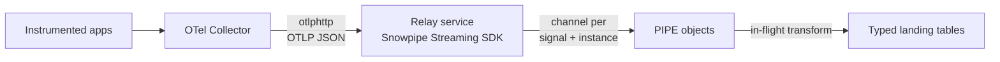

# Pattern 3: OTel Collector to Snowpipe Streaming (High-Performance)

The lowest-latency, highest-throughput path: up to 10 GB per second per table with
ingest-to-query latency typically under 10 seconds, no broker and no Openflow runtime in the
middle. The catch is that **no OpenTelemetry exporter for Snowflake exists**, so you write the
bridge yourself.

If you are willing to run that bridge as a container, Snowflake will host it for you:
the Snowpipe Streaming SDK supports running inside Snowpark Container Services with
workload-identity authentication, which removes the credential-management burden that used to be
this pattern's worst ongoing cost. See [Where to run the relay](#where-to-run-the-relay).

Pair-programmed by SE Community + Cortex Code

> Part of [OpenTelemetry into Snowflake](README.md). Read the
> [gotchas](README.md#gotchas-read-before-you-build) first.

---

## One Hard Gate

**You build the bridge.** There is no Snowflake exporter in
`opentelemetry-collector-contrib`. One was proposed in issue #29618 and never merged. The
`snowflakereceiver` that search results surface points the **opposite** direction — see
[Gotcha 2](README.md#2-the-collectors-snowflake-component-points-the-wrong-way).

That gate is smaller than it sounds, because Snowflake ships Python and Node.js SDKs alongside
Java. You do not need to write Go or fork the Collector.

### Cloud availability is no longer a gate

Earlier guidance on this pattern — including earlier revisions of this page — described
Snowpipe Streaming high-performance architecture as AWS-only, which was true at its September 2025
GA. That restriction has lifted:

| Cloud | High-performance architecture GA |
|---|---|
| AWS | September 2025 |
| Azure | [November 5, 2025](https://docs.snowflake.com/en/release-notes/2025/other/2025-11-05-snowpipe-streaming-azure-ga) |
| GCP | [November 10, 2025](https://docs.snowflake.com/en/release-notes/2025/other/2025-11-10-snowpipe-streaming-gcp-ga) |

Snowflake documents the service as available in all AWS, Azure, and Google Cloud regions **except
government-specific regions**
([limitations](https://docs.snowflake.com/en/user-guide/snowpipe-streaming/snowpipe-streaming-high-performance-limitations)).
If you are in a government region, this pattern is still unavailable to you — use Pattern 1, 2,
or 4.

The practical consequence: the decision between this pattern and the others is now purely about
whether you will own a custom component, not about which cloud you happen to be on.

## When This Pattern Wins

- Volume or latency that Patterns 1 and 2 cannot meet.
- You want the fewest moving parts in the data path: Collector, one service, Snowflake.
- You want **typed columns at ingest** rather than a `VARIANT` envelope, for the cost reason in
  [Step 3](#step-3-decide-what-you-are-billed-for). This is the only pattern here that makes that
  practical, and at high volume it is the difference that pays for the build.
- You are already comfortable operating a small stateful service — or you are willing to run one
  as an SPCS service, in which case Snowflake operates the container for you.

Skip it if you have Kafka (Pattern 2 is strictly less work) or if nobody will own the bridge
service after the person who built it changes teams. An unowned custom component in the telemetry
path is worse than a slower supported one. Hosting it in SPCS reduces the *operational* half of
that risk but not the *ownership* half — someone still has to understand the code.

---

## Choose Your Bridge

| | Option A: Relay service | Option B: Collector exporter in Go |
|---|---|---|
| **Shape** | Collector `otlphttp` → your HTTP service → Snowflake SDK | Custom exporter compiled into your Collector build |
| **Language** | Python or Node.js | Go only |
| **Effort** | A few hundred lines | A Collector component plus a custom build pipeline |
| **Deployment** | One more service to run | No extra service; you own a Collector distribution |
| **Backpressure** | Return 429/503 and let the Collector's queue absorb it | Native Collector queue and retry |
| **Recommended** | **Yes, start here** | Only if you must ship a Collector-native component |

Option A is the pragmatic default. You inherit the Collector's `sending_queue`,
`retry_on_failure`, and persistent-queue machinery for free, and you write ordinary application
code against a supported SDK instead of learning the Collector's exporter interfaces. Option B is
the right call if you distribute a Collector build to teams who cannot run a sidecar, or if you
intend to contribute the exporter upstream.

The rest of this guide assumes Option A.

---

## Architecture



The `PIPE` object is where this pattern gets its leverage. It is server-side, so schema
validation and in-flight transformation happen in Snowflake rather than in your relay. Your relay
stays a dumb, fast forwarder — which is exactly what you want in a component you wrote yourself.

---

## Step 1: Landing Tables

Unlike the other patterns, land **typed columns**. The pipe does the extraction.

```sql
USE ROLE SYSADMIN;

CREATE DATABASE IF NOT EXISTS OTEL_LAKE
    COMMENT = 'External OpenTelemetry ingestion and reporting';

CREATE SCHEMA IF NOT EXISTS OTEL_LAKE.RAW
    COMMENT = 'Landing zone for streamed OpenTelemetry';

-- Envelope-level landing. One row per OTLP resource element, not per span:
-- the relay forwards resource elements and the shredding layer expands them.
-- CHANNEL_ID and STREAM_OFFSET are mandatory, not optional -- see Step 5.
CREATE TABLE IF NOT EXISTS OTEL_LAKE.RAW.STREAM_TRACES (
    CHANNEL_ID     NUMBER        NOT NULL,
    STREAM_OFFSET  NUMBER        NOT NULL,
    PIPE_ID        NUMBER,
    PAYLOAD        VARIANT,
    INGESTED_AT    TIMESTAMP_NTZ
)
CLUSTER BY (TO_DATE(INGESTED_AT))
COMMENT = 'OTLP resourceSpans elements via Snowpipe Streaming';

CREATE TABLE IF NOT EXISTS OTEL_LAKE.RAW.STREAM_LOGS (
    CHANNEL_ID     NUMBER        NOT NULL,
    STREAM_OFFSET  NUMBER        NOT NULL,
    PIPE_ID        NUMBER,
    PAYLOAD        VARIANT,
    INGESTED_AT    TIMESTAMP_NTZ
)
CLUSTER BY (TO_DATE(INGESTED_AT))
COMMENT = 'OTLP resourceLogs elements via Snowpipe Streaming';

CREATE TABLE IF NOT EXISTS OTEL_LAKE.RAW.STREAM_METRICS (
    CHANNEL_ID     NUMBER        NOT NULL,
    STREAM_OFFSET  NUMBER        NOT NULL,
    PIPE_ID        NUMBER,
    PAYLOAD        VARIANT,
    INGESTED_AT    TIMESTAMP_NTZ
)
CLUSTER BY (TO_DATE(INGESTED_AT))
COMMENT = 'OTLP resourceMetrics elements via Snowpipe Streaming';
```

`CLUSTER BY (TO_DATE(INGESTED_AT))` matters more here than in the other patterns. Streaming
ingest produces many small files in arrival order, and telemetry queries are almost always
time-bounded. Clustering on the ingest date gives the pruning that makes "last 30 minutes"
queries cheap instead of full scans. Cluster on the **date**, not the raw timestamp — clustering
on a high-cardinality timestamp produces excessive partitions and costs more to maintain than it
saves.

## Step 2: The Pipe

A streaming pipe uses `DATA_SOURCE(TYPE => 'STREAMING')` in the `FROM` clause. There is no stage
and no `AUTO_INGEST`.

```sql
CREATE OR REPLACE PIPE OTEL_LAKE.RAW.OTEL_TRACES_PIPE
    COMMENT = 'Streaming ingest for OTLP resourceSpans'
AS
COPY INTO OTEL_LAKE.RAW.STREAM_TRACES (
    CHANNEL_ID, STREAM_OFFSET, PIPE_ID, PAYLOAD, INGESTED_AT
)
FROM (
    SELECT
        $1:channel_id::NUMBER,
        $1:stream_offset::NUMBER,
        1,
        $1:payload,
        TO_TIMESTAMP_NTZ($1:ingested_at::NUMBER, 3)
    FROM TABLE(DATA_SOURCE(TYPE => 'STREAMING'))
);
```

Repeat for logs and metrics with distinct `PIPE_ID` values. `PIPE_ID` lets you trace a row back
to its ingestion path when more than one pipe writes to a table; keep a small lookup table
mapping integers to pipe names rather than storing the names on every row.

Two notes:

- **Every table gets a default pipe automatically**, named `<TABLE_NAME>-STREAMING`, created on
  demand when a channel opens against it. You only need a custom pipe for in-flight
  transformation or pre-clustering — which is exactly what we are doing here.
- **Do not use `CURRENT_TIMESTAMP()` or `SYSDATE()` in a pipe definition.** Snowflake documents a
  known issue where values inserted by these functions can be hours off from actual load time.
  That is why `INGESTED_AT` is supplied by the relay as a millisecond epoch and cast, rather than
  generated server-side.

Grants — note this role needs `SELECT` as well as `INSERT`, because the pipe reads the target
table's schema for server-side validation:

```sql
USE ROLE ACCOUNTADMIN;

CREATE ROLE IF NOT EXISTS OTEL_STREAM_RL
    COMMENT = 'Snowpipe Streaming relay identity';

GRANT USAGE ON DATABASE OTEL_LAKE     TO ROLE OTEL_STREAM_RL;
GRANT USAGE ON SCHEMA   OTEL_LAKE.RAW TO ROLE OTEL_STREAM_RL;

GRANT SELECT, INSERT ON TABLE OTEL_LAKE.RAW.STREAM_TRACES  TO ROLE OTEL_STREAM_RL;
GRANT SELECT, INSERT ON TABLE OTEL_LAKE.RAW.STREAM_LOGS    TO ROLE OTEL_STREAM_RL;
GRANT SELECT, INSERT ON TABLE OTEL_LAKE.RAW.STREAM_METRICS TO ROLE OTEL_STREAM_RL;

GRANT OPERATE, MONITOR ON PIPE OTEL_LAKE.RAW.OTEL_TRACES_PIPE TO ROLE OTEL_STREAM_RL;
```

How the relay assumes that role depends on where it runs, and the choice matters:

```sql
-- Relay runs OUTSIDE Snowflake (your Kubernetes, VMs, ECS).
-- You provision and rotate a key pair yourself.
CREATE USER IF NOT EXISTS OTEL_STREAM_SVC
    DEFAULT_ROLE      = OTEL_STREAM_RL
    DEFAULT_WAREHOUSE = NULL
    TYPE              = SERVICE
    COMMENT           = 'Key-pair only. Snowpipe Streaming needs no warehouse.';

GRANT ROLE OTEL_STREAM_RL TO USER OTEL_STREAM_SVC;
```

If the relay runs **inside** SPCS, skip the service user entirely — grant `OTEL_STREAM_RL` to the
role that owns the service instead, and the SDK authenticates as that role with no stored
credential. See [Where to run the relay](#where-to-run-the-relay).

`DEFAULT_WAREHOUSE = NULL` is correct and worth noticing: Snowpipe Streaming is serverless, so
this identity needs no warehouse at all. Granting one would be unnecessary attack surface and a
misleading cost signal.

## Step 3: Decide What You Are Billed For

This is the decision that most affects your bill, and this pattern is where you have the most
leverage over it.

Ingesting into a single `VARIANT` bills you for **all JSON bytes, including keys**.
`MATCH_BY_COLUMN_NAME = CASE_SENSITIVE`, or explicit column expressions in the pipe, bills only
the values that land
([best practices](https://docs.snowflake.com/en/user-guide/snowpipe-streaming/snowpipe-streaming-high-performance-best-practices)).

OTLP is pathologically key-heavy. Every single attribute costs you the literals `"key"`,
`"value"`, and a type discriminator like `"stringValue"` — often more bytes of structure than of
payload.

So you have a real choice:

| | Land the full envelope in `VARIANT` | Extract typed columns in the pipe |
|---|---|---|
| **Ingest cost** | Billed on every key and every structural literal | Billed on values only |
| **Fidelity** | Lossless; you can re-shred later with a fixed query | Lossy; anything not extracted is gone forever |
| **Schema changes** | New attributes appear automatically | Requires a pipe change to capture |
| **Best for** | Low to moderate volume; still exploring the data | High volume with a settled query set |

The recommendation, stated as a decision rather than a rule: **start with the full envelope**,
because early on you do not yet know which attributes matter, and re-shredding from a lossless
landing table is free while re-collecting discarded telemetry is impossible. Then, once your
queries stabilize and volume justifies it, add a second pipe that extracts the hot columns and
narrow the envelope you retain.

The hybrid that most teams land on: extract the dozen fields you always filter and group by into
typed columns, keep the remaining attributes as one `VARIANT` for the long tail, and drop the
structural envelope. You keep pruning-friendly typed predicates and an escape hatch, without
paying to store `"stringValue"` several million times a day.

## Step 4: The Relay

A sketch, not a production service. It shows the contract and the non-obvious requirements.

```python
"""OTLP/HTTP JSON to Snowpipe Streaming relay.

Receives OTLP JSON from an OTel Collector otlphttp exporter and appends
resource elements to Snowpipe Streaming channels.

Deliberate choices:
  - One long-lived channel per (signal, replica). Channels are expensive to
    open and cheap to hold; see Snowflake's channel-management guidance.
  - Deterministic channel names so a restarted replica resumes its own channel
    rather than orphaning it.
  - STREAM_OFFSET is monotonic per channel, which is what makes the SQL gap
    detection in Step 5 work.
  - 429 on backpressure so the Collector's queue absorbs the surge instead of
    this process buffering unboundedly and being OOM-killed.
"""

import itertools
import os
import time

from fastapi import FastAPI, Request, Response

# Signal to (pipe, table) mapping. The Collector posts to /v1/{signal}.
SIGNALS = {
    "traces":  ("OTEL_TRACES_PIPE",  "resourceSpans"),
    "logs":    ("OTEL_LOGS_PIPE",    "resourceLogs"),
    "metrics": ("OTEL_METRICS_PIPE", "resourceMetrics"),
}

# Stable per-replica identity. In Kubernetes use the StatefulSet ordinal so a
# restarted pod reclaims its own channel. A random ID here would leak channels.
REPLICA_ID = int(os.environ["REPLICA_ORDINAL"])

app = FastAPI()
_offsets = {signal: itertools.count(1) for signal in SIGNALS}
_channels: dict = {}


def channel_for(signal: str):
    """Open once, reuse forever. Reopen only after a 409 invalidation."""
    if signal not in _channels:
        pipe, _ = SIGNALS[signal]
        _channels[signal] = open_channel(
            # Deterministic: otel-prod-traces-0
            name=f"otel-{os.environ['ENVIRONMENT']}-{signal}-{REPLICA_ID}",
            database="OTEL_LAKE",
            schema="RAW",
            pipe=pipe,
        )
    return _channels[signal]


@app.post("/v1/{signal}")
async def ingest(signal: str, request: Request) -> Response:
    if signal not in SIGNALS:
        return Response(status_code=404)

    body = await request.json()
    _, envelope_key = SIGNALS[signal]

    # OTLP batches many resource elements per request. One row each keeps
    # rows small and lets the shredding layer parallelize.
    rows = []
    now_ms = int(time.time() * 1000)
    for element in body.get(envelope_key, []):
        rows.append({
            "channel_id": REPLICA_ID,
            "stream_offset": next(_offsets[signal]),
            # Native dict, NOT json.dumps(). The SDK stores a native object as
            # structured JSON; a string literal is stored as escaped text and
            # PARSE_JSON downstream then has to undo it.
            "payload": {envelope_key: [element]},
            "ingested_at": now_ms,
        })

    if not rows:
        return Response(status_code=204)

    try:
        channel_for(signal).append_rows(rows, str(rows[-1]["stream_offset"]))
    except ChannelInvalidated:
        # 409. Drop the channel; the next request reopens it. Replay from the
        # last committed offset token if you cannot tolerate the gap.
        _channels.pop(signal, None)
        return Response(status_code=503)
    except Throttled:
        # 429 upstream. Push back rather than buffering here.
        return Response(status_code=429, headers={"Retry-After": "5"})

    return Response(status_code=200)
```

Four requirements that are easy to miss and expensive to discover:

1. **Pass native objects, never `json.dumps()` strings.** The SDK converts a native dict into a
   structured `VARIANT`. A string is stored as escaped text, and every downstream query then needs
   an extra `PARSE_JSON` to undo it.
2. **Handle 409 and 429 distinctly.** 409 means the channel was invalidated and must be reopened,
   then replayed from `getLatestCommittedOffsetToken`. 429 means slow down — retry with
   exponential backoff, never immediately.
3. **Some errors arrive asynchronously.** A successful `append_rows` does not mean the rows
   landed. Poll `getChannelStatus` and watch `row_error_count`; a rising count is your signal that
   something is being rejected server-side.
4. **Keep channels long-lived and deterministically named.** Open once and hold. Random channel
   names leak channels on every restart and make recovery guesswork.

Collector side:

```yaml
exporters:
  otlphttp/relay:
    endpoint: http://otel-relay.internal:8080
    compression: gzip
    # Persist across Collector restarts so a relay outage is not data loss.
    sending_queue:
      enabled: true
      num_consumers: 8
      queue_size: 10000
      storage: file_storage/otel
    retry_on_failure:
      enabled: true
      initial_interval: 5s
      max_interval: 60s
      max_elapsed_time: 600s

extensions:
  file_storage/otel:
    directory: /var/lib/otelcol/queue
```

If you use the REST API directly instead of an SDK, the physical limit is **4 MB per request** on
the observed transfer size — so compression raises your effective payload. Snowflake documents
both Gzip and `ZSTD` as supported for this purpose.

### Where to Run the Relay

The relay is a container. You can run it on your own infrastructure, or you can run it inside
Snowpark Container Services — and since **SDK version 1.5.0** the SDK supports SPCS directly with
workload-identity authentication
([documentation](https://docs.snowflake.com/en/user-guide/snowpipe-streaming/snowpipe-streaming-high-performance-spcs)).
This is a supported, documented deployment target for the Java, Python, and Node.js SDKs, not a
creative reuse of SPCS.

| | Your own infrastructure | SPCS service |
|---|---|---|
| **Credentials** | You provision and rotate an RSA key pair, PAT, or OAuth client | None stored. SPCS mounts a short-lived token; the SDK reads and refreshes it |
| **Identity** | A `TYPE = SERVICE` user you create and manage | The role that owns the service |
| **Who patches the host** | You | Snowflake |
| **Cost shape** | Compute you already pay for | Compute pool credits — a standing floor, like Pattern 1's runtime |
| **Where the Collector points** | An endpoint you already control | An SPCS endpoint, reachable from your network |
| **Best when** | You have a mature container platform and spare capacity | You want the custom code inside the Snowflake perimeter, or you do not want to run a platform for one service |

The credential difference is the one that changes the ongoing cost of this pattern. Outside
Snowflake, the relay's private key is a secret you have to store, distribute, and rotate on a
schedule — a small recurring task that tends to be skipped until it expires at 3 a.m. Inside SPCS,
the runtime mounts a bearer token at `/snowflake/session/token` and rotates it for you; the SDK
rereads the file in the background and your code never touches it.

Two configuration requirements, both easy to miss:

```json
{
  "authorization_type": "SPCS",
  "url": "https://<account_identifier>.snowflakecomputing.com",
  "account": "<account>",
  "role": "OTEL_STREAM_RL",
  "spcs_token_path": "/snowflake/session/token"
}
```

`user`, `private_key`, and the OAuth properties are unused when `authorization_type` is `SPCS`.
And the service specification must explicitly opt in to receiving the token — without this the
token file is not mounted and the SDK cannot authenticate:

```yaml
spec:
  containers:
    - name: otel-relay
      image: /OTEL_LAKE/RAW/RELAY_REPO/otel-relay:latest
      readinessProbe:
        port: 8080
        path: /healthcheck
  endpoints:
    - name: otlp
      port: 8080
      public: false
capabilities:
  securityContext:
    enableCustomCredentials: true
```

Four things to get right that the pattern's own design depends on:

1. **Grant the ingest role to the service owner role.** The service executes SQL as its owner
   role, so that role — not a separate user — needs the grants from
   [Step 2](#step-2-the-pipe).
2. **Do not enable auto-suspend.** Snowflake documents that auto-suspension does not track ingress
   traffic, so a relay receiving a steady OTLP stream can still be judged idle and suspended
   mid-flight. Leave `AUTO_SUSPEND_SECS` unset — it defaults to no automatic suspension, and the
   property is itself a preview feature.
3. **Replica identity needs care.** The relay sketch in [Step 4](#step-4-the-relay) reads
   `REPLICA_ORDINAL` from a Kubernetes StatefulSet to keep channel names stable across restarts.
   SPCS does give each instance a stable ordinal — it appears as `snow.service.instance` in the
   event table, as `INSTANCE_ID` from `SPCS_GET_LOGS`, and in `SHOW SERVICE INSTANCES IN SERVICE`.
   What is missing is a documented **environment variable** carrying it: `SNOWFLAKE_JOB_INDEX` is
   populated for job services, not long-running ones. Either run a single instance, or confirm how
   your runtime exposes the ordinal before relying on it — a random per-restart identity leaks
   channels, per [Step 4 requirement 4](#step-4-the-relay).
4. **Egress to Snowflake must be permitted.** The SDK's traffic out of the container is subject to
   your SPCS network configuration. Snowflake calls this out explicitly in the SPCS SDK
   limitations.

One thing SPCS does **not** change: the OTel Collector still runs outside Snowflake, and it is
still where you drop, sample, and redact. SPCS hosts the terminus you wrote, not the pipeline.
Cardinality control remains a Collector concern —
see [Gotcha 7](README.md#7-cardinality-is-your-cost-control-and-it-lives-in-the-collector).

A useful side effect: because SPCS writes container stdout and stderr to your account's event
table, the relay's own operational logs land in Snowflake next to the telemetry it is ingesting.
You can query relay health and ingested spans in a single join.

## Step 5: Verify Nothing Was Lost

`CHANNEL_ID` and `STREAM_OFFSET` exist for this query. Without them you have no way to prove
completeness, and "did we lose telemetry" becomes unanswerable.

```sql
-- Gap detection. A row here means a missing or out-of-order offset.
SELECT
    PIPE_ID,
    CHANNEL_ID,
    STREAM_OFFSET,
    LAG(STREAM_OFFSET) OVER (
        PARTITION BY PIPE_ID, CHANNEL_ID
        ORDER BY STREAM_OFFSET
    )                                       AS previous_offset,
    LAG(STREAM_OFFSET) OVER (
        PARTITION BY PIPE_ID, CHANNEL_ID
        ORDER BY STREAM_OFFSET
    ) + 1                                   AS expected_next
FROM OTEL_LAKE.RAW.STREAM_TRACES
WHERE INGESTED_AT > DATEADD('hour', -1, SYSDATE())
QUALIFY STREAM_OFFSET != previous_offset + 1;
```

One caveat about this query that the documentation does not spell out: a relay restart resets an
in-memory counter, so offsets restart and this query reports a gap that is really a restart. Two
ways to handle it, and you should pick one consciously:

- Persist the counter, seeding it from `MAX(STREAM_OFFSET)` for that channel on startup. More
  correct, slightly more work.
- Include a relay-generation identifier in `CHANNEL_ID` so each restart is a distinct channel.
  Simpler, at the cost of unbounded channel-name growth.

Throughput and lag:

```sql
SELECT
    CHANNEL_ID,
    COUNT(*)                                          AS rows_last_hour,
    MIN(STREAM_OFFSET)                                AS min_offset,
    MAX(STREAM_OFFSET)                                AS max_offset,
    MAX(INGESTED_AT)                                  AS newest_row,
    DATEDIFF('second', MAX(INGESTED_AT), SYSDATE())   AS lag_seconds
FROM OTEL_LAKE.RAW.STREAM_TRACES
WHERE INGESTED_AT > DATEADD('hour', -1, SYSDATE())
GROUP BY CHANNEL_ID
ORDER BY CHANNEL_ID;
```

Also scrape the SDK's own Prometheus metrics. Set `SS_ENABLE_METRICS=true` and the client exposes
`/metrics` on `SS_METRICS_IP:SS_METRICS_PORT`, default `127.0.0.1:50000`. That gives you the
client-side view — what the relay attempted — which is the half Snowflake cannot show you.

**One operational note if you deploy the relay on the JVM:** the SDK includes a native Rust
component that allocates outside the JVM heap, so cap `-Xmx` at roughly 50% of available memory.
The default JVM sizing will lead to native allocation failures that look like unexplained
crashes. This applies equally in SPCS, where the container memory limit from your service
specification is the ceiling the JVM must be sized against.

---

## Next Step

Confirm the gap query returns nothing and lag is within your target, then go to
**[shredding-and-reporting.md](shredding-and-reporting.md)**.

## External References

- [Snowpipe Streaming overview](https://docs.snowflake.com/en/user-guide/snowpipe-streaming/data-load-snowpipe-streaming-overview)
- [High-performance architecture best practices](https://docs.snowflake.com/en/user-guide/snowpipe-streaming/snowpipe-streaming-high-performance-best-practices)
- [High-performance architecture configurations](https://docs.snowflake.com/en/user-guide/snowpipe-streaming/snowpipe-streaming-high-performance-configurations)
- [High-performance architecture limitations](https://docs.snowflake.com/en/user-guide/snowpipe-streaming/snowpipe-streaming-high-performance-limitations) — authoritative source for current cloud and region availability
- [Run the Snowpipe Streaming SDK in Snowpark Container Services](https://docs.snowflake.com/en/user-guide/snowpipe-streaming/snowpipe-streaming-high-performance-spcs)
- [Snowpipe Streaming SDK release notes](https://docs.snowflake.com/en/release-notes/clients-drivers/snowpipe-streaming-sdk-2026) — SPCS support landed in 1.5.0
- [Snowpark Container Services: working with services](https://docs.snowflake.com/en/developer-guide/snowpark-container-services/working-with-services)
- [CREATE PIPE](https://docs.snowflake.com/en/sql-reference/sql/create-pipe)
- [AWS GA release note, September 2025](https://docs.snowflake.com/en/release-notes/2025/other/2025-09-23-snowpipe-streaming-high-performance-architecture)
- [Azure GA release note, November 2025](https://docs.snowflake.com/en/release-notes/2025/other/2025-11-05-snowpipe-streaming-azure-ga)
- [GCP GA release note, November 2025](https://docs.snowflake.com/en/release-notes/2025/other/2025-11-10-snowpipe-streaming-gcp-ga)
- [Snowpipe Streaming with Iceberg tables](https://docs.snowflake.com/en/user-guide/snowpipe-streaming/snowpipe-streaming-high-performance-iceberg)
