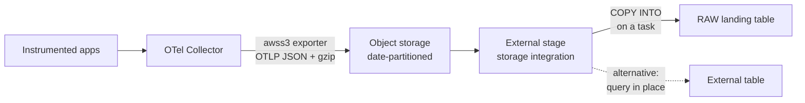

# Pattern 4: Files to Stage to COPY INTO or Iceberg

The Collector writes OTLP JSON files to object storage; Snowflake reads them. Minutes to hours of
latency, the lowest cost per gigabyte of any pattern here, and almost nothing to operate.

This is the pattern most teams should start with, and the one most teams skip because streaming
sounds better. If you are standing up telemetry-in-Snowflake for the first time, build this first:
it proves the shredding and reporting layer — the half of the work that actually delivers value —
without committing you to a broker, a runtime, or a bespoke service. Every other pattern reuses
what you build downstream of here.

Pair-programmed by SE Community + Cortex Code

> Part of [OpenTelemetry into Snowflake](README.md). Read the
> [gotchas](README.md#gotchas-read-before-you-build) first.

---

## When This Pattern Wins

- **Retention and cost dominate.** Long-horizon telemetry for trend analysis, capacity planning,
  audit, or compliance. Storage prices rather than ingest prices.
- **You are proving the concept.** Fastest path to real data in real tables.
- **The consumer is analytical, not operational.** Weekly reliability reviews, error-budget
  reporting, quarterly capacity planning. Nobody is paging off this data.
- **You already archive telemetry to object storage.** If your Collector or APM vendor writes to
  S3 today, Snowflake can read that existing archive with no new pipeline at all — often the
  cheapest useful thing in this entire guide.
- **You need to backfill.** Historical telemetry sitting in buckets loads with `COPY INTO` and no
  streaming infrastructure.

## What This Pattern Does Not Do

Live incident response. If someone needs to know what is happening right now, minutes-to-hours
latency is useless and you want Pattern 1, 2, or 3.

The honest framing is that these are **complementary, not competing**. A common mature setup runs
streaming ingest into a short-retention hot table for live work, and this pattern into a
long-retention cold table for history. Both feed the same shredding logic.

---

## Architecture



Two shapes, and the choice matters:

- **`COPY INTO` on a schedule.** Data lands in Snowflake tables. You pay storage twice (bucket
  plus Snowflake) but get full performance, clustering, and Time Travel. Right for anything
  queried regularly.
- **External table or `COPY` on demand.** Data stays in the bucket; Snowflake reads it when asked.
  You pay storage once and scan cost per query. Right for archives queried rarely — a compliance
  corpus you touch twice a year.

Start with `COPY INTO` for anything in an active dashboard, and leave genuinely cold data external.

---

## Step 1: Configure the Collector to Write Files

```yaml
# collector-config.yaml — object storage destination
receivers:
  otlp:
    protocols:
      grpc: { endpoint: 0.0.0.0:4317 }
      http: { endpoint: 0.0.0.0:4318 }

processors:
  memory_limiter:
    check_interval: 1s
    limit_percentage: 75
    spike_limit_percentage: 20

  attributes/scrub:
    actions:
      - key: http.request.header.authorization
        action: delete
      - key: user.email
        action: delete
      - key: url.query
        action: delete

  # Batch harder than in the streaming patterns. Latency is already minutes,
  # so trade it for fewer, larger files -- see the small-files note below.
  batch:
    timeout: 60s
    send_batch_size: 8192
    send_batch_max_size: 16384

exporters:
  awss3:
    s3uploader:
      region: us-west-2
      s3_bucket: my-otel-archive
      # Date-partitioned prefix. This is what makes stage-level pruning and
      # selective backfill possible; see Step 3.
      s3_prefix: otel
      s3_partition_format: '%Y/%m/%d/%H'
      compression: gzip
    marshaler: otlp_json

service:
  pipelines:
    traces:
      receivers: [otlp]
      processors: [memory_limiter, attributes/scrub, batch]
      exporters: [awss3]
    logs:
      receivers: [otlp]
      processors: [memory_limiter, attributes/scrub, batch]
      exporters: [awss3]
    metrics:
      receivers: [otlp]
      processors: [memory_limiter, attributes/scrub, batch]
      exporters: [awss3]
```

Three settings carry most of the weight:

- **`marshaler: otlp_json`.** The exporter also offers Protobuf, which lands as bytes you would
  need a UDF to decode. Take JSON; `gzip` recovers the size difference.
- **`s3_partition_format`.** Hour-level partitioning is the sweet spot. Day-level makes selective
  reload coarse; minute-level creates enough prefixes to slow stage listing.
- **Aggressive `batch` settings.** This is the small-files problem, and it is the main way this
  pattern goes wrong. Thousands of tiny files make `COPY INTO` slow and expensive because per-file
  overhead dominates. Snowflake's guidance for bulk loading favors files roughly in the
  100-250 MB compressed range. A 60-second timeout with large batch sizes gets you closer to that
  than the streaming-oriented defaults, which would produce a file every few seconds.

If you use Azure or GCS, the equivalent exporters follow the same shape; the marshaler and
partitioning advice is unchanged.

## Step 2: Storage Integration and Stage

```sql
USE ROLE ACCOUNTADMIN;

-- Storage integration: Snowflake assumes an IAM role you control. Never use
-- long-lived access keys in a stage definition.
CREATE STORAGE INTEGRATION IF NOT EXISTS OTEL_ARCHIVE_INT
    TYPE = EXTERNAL_STAGE
    STORAGE_PROVIDER = 'S3'
    STORAGE_AWS_ROLE_ARN = 'arn:aws:iam::<account-id>:role/snowflake-otel-archive'
    ENABLED = TRUE
    -- Scope to the exact prefix. A bucket-wide integration is an
    -- unnecessary blast radius.
    STORAGE_ALLOWED_LOCATIONS = ('s3://my-otel-archive/otel/')
    COMMENT = 'Read-only access to the OpenTelemetry archive prefix';

-- Run DESC INTEGRATION to get STORAGE_AWS_IAM_USER_ARN and
-- STORAGE_AWS_EXTERNAL_ID, then add them to the IAM role's trust policy.
DESC INTEGRATION OTEL_ARCHIVE_INT;
```

```sql
USE ROLE SYSADMIN;

CREATE DATABASE IF NOT EXISTS OTEL_LAKE
    COMMENT = 'External OpenTelemetry ingestion and reporting';
CREATE SCHEMA IF NOT EXISTS OTEL_LAKE.RAW
    COMMENT = 'Landing zone for OpenTelemetry archives';

-- STRIP_OUTER_ARRAY is wrong here and would silently mangle the envelope:
-- each OTLP file is a JSON object, not an array of records.
CREATE FILE FORMAT IF NOT EXISTS OTEL_LAKE.RAW.OTLP_JSON_FF
    TYPE = JSON
    COMPRESSION = GZIP
    STRIP_OUTER_ARRAY = FALSE
    COMMENT = 'gzipped OTLP JSON as written by the Collector';

CREATE STAGE IF NOT EXISTS OTEL_LAKE.RAW.OTEL_ARCHIVE_STAGE
    STORAGE_INTEGRATION = OTEL_ARCHIVE_INT
    URL = 's3://my-otel-archive/otel/'
    FILE_FORMAT = OTEL_LAKE.RAW.OTLP_JSON_FF
    DIRECTORY = (ENABLE = TRUE)
    COMMENT = 'OpenTelemetry archive; directory table enabled for file auditing';
```

`DIRECTORY = (ENABLE = TRUE)` gives you a directory table over the stage, which is how you answer
"is the Collector still writing files" without loading anything:

```sql
-- Files landed in the last two hours. If this is empty, the problem is upstream
-- of Snowflake and no amount of COPY debugging will help.
SELECT
    RELATIVE_PATH,
    SIZE,
    LAST_MODIFIED
FROM DIRECTORY(@OTEL_LAKE.RAW.OTEL_ARCHIVE_STAGE)
WHERE LAST_MODIFIED > DATEADD('hour', -2, SYSDATE())
ORDER BY LAST_MODIFIED DESC
LIMIT 50;
```

## Step 3: Landing Table and COPY

```sql
CREATE TABLE IF NOT EXISTS OTEL_LAKE.RAW.ARCHIVE_TELEMETRY (
    PAYLOAD       VARIANT,
    -- Provenance. SOURCE_FILE makes a bad batch removable by predicate, and
    -- makes "where did this row come from" answerable a year later.
    SOURCE_FILE   STRING,
    FILE_ROW_NUM  NUMBER,
    -- Derived from the file's partition prefix so time predicates prune
    -- without opening the payload.
    EVENT_HOUR    TIMESTAMP_NTZ,
    LOADED_AT     TIMESTAMP_NTZ
)
CLUSTER BY (TO_DATE(EVENT_HOUR))
COMMENT = 'All three OTLP signals; discriminate by envelope key at shred time';
```

One table for all three signals here, unlike the streaming patterns. The Collector's S3 exporter
does not separate signals by prefix by default, and the envelope key (`resourceSpans`,
`resourceLogs`, `resourceMetrics`) already tells you which signal a payload is. The shredding
layer filters on that key, so separate tables would add work without adding clarity.

```sql
COPY INTO OTEL_LAKE.RAW.ARCHIVE_TELEMETRY (
    PAYLOAD, SOURCE_FILE, FILE_ROW_NUM, EVENT_HOUR, LOADED_AT
)
FROM (
    SELECT
        $1,
        METADATA$FILENAME,
        METADATA$FILE_ROW_NUMBER,
        -- Reconstruct the hour from the otel/YYYY/MM/DD/HH/ prefix.
        TRY_TO_TIMESTAMP_NTZ(
            REGEXP_SUBSTR(METADATA$FILENAME, 'otel/(\\d{4}/\\d{2}/\\d{2}/\\d{2})', 1, 1, 'e'),
            'YYYY/MM/DD/HH24'
        ),
        METADATA$START_SCAN_TIME
    FROM @OTEL_LAKE.RAW.OTEL_ARCHIVE_STAGE
)
FILE_FORMAT = (FORMAT_NAME = OTEL_LAKE.RAW.OTLP_JSON_FF)
ON_ERROR = CONTINUE;
```

Four choices to understand rather than copy blindly:

- **`METADATA$START_SCAN_TIME`, not `CURRENT_TIMESTAMP()`.** Snowflake documents a known issue
  where the current-time functions can be hours off from actual load time. `METADATA$START_SCAN_TIME`
  is the accurate representation of when a record loaded.
- **`TRY_TO_TIMESTAMP_NTZ`, not `TO_TIMESTAMP_NTZ`.** A file that lands outside the expected prefix
  should produce a `NULL` hour, not fail the load. Monitor for `EVENT_HOUR IS NULL` — it means
  someone changed the Collector's partition format.
- **`ON_ERROR = CONTINUE`.** One corrupt file should not block a batch. Check
  `COPY_HISTORY` for skipped rows afterward; silence here is not success.
- **`COPY INTO` tracks load history for 64 days** and skips files it has already loaded, which is
  what makes re-running this statement safe and idempotent. Beyond 64 days that guarantee lapses,
  so a re-run against old files can duplicate. This is the single sharpest edge in this pattern —
  keep `SOURCE_FILE` so you can detect and remove duplicates if it happens.

Schedule it:

```sql
CREATE TASK IF NOT EXISTS OTEL_LAKE.RAW.LOAD_OTEL_ARCHIVE
    WAREHOUSE = OTEL_LOAD_WH
    SCHEDULE = 'USING CRON 15 * * * * UTC'
    COMMENT = 'Hourly COPY of new OTLP files; safe to re-run'
AS
    COPY INTO OTEL_LAKE.RAW.ARCHIVE_TELEMETRY (
        PAYLOAD, SOURCE_FILE, FILE_ROW_NUM, EVENT_HOUR, LOADED_AT
    )
    FROM (
        SELECT
            $1,
            METADATA$FILENAME,
            METADATA$FILE_ROW_NUMBER,
            TRY_TO_TIMESTAMP_NTZ(
                REGEXP_SUBSTR(METADATA$FILENAME, 'otel/(\\d{4}/\\d{2}/\\d{2}/\\d{2})', 1, 1, 'e'),
                'YYYY/MM/DD/HH24'
            ),
            METADATA$START_SCAN_TIME
        FROM @OTEL_LAKE.RAW.OTEL_ARCHIVE_STAGE
    )
    FILE_FORMAT = (FORMAT_NAME = OTEL_LAKE.RAW.OTLP_JSON_FF)
    ON_ERROR = CONTINUE;

ALTER TASK OTEL_LAKE.RAW.LOAD_OTEL_ARCHIVE RESUME;
```

Run at `:15` rather than `:00` so the hour's files have finished landing. A task at the top of the
hour races the Collector's final flush and reliably misses data, which then shows up as a
mysterious dip at the end of every hour.

Set a timeout on the warehouse so a pathological batch cannot run away:

```sql
CREATE WAREHOUSE IF NOT EXISTS OTEL_LOAD_WH
    WAREHOUSE_SIZE = 'SMALL'
    AUTO_SUSPEND = 60
    AUTO_RESUME = TRUE
    STATEMENT_TIMEOUT_IN_SECONDS = 3600
    COMMENT = 'Dedicated to OTel archive loading; sized for hourly batches';
```

Verify the load:

```sql
-- COPY_HISTORY is the authoritative record. Non-zero errors mean ON_ERROR
-- silently skipped rows -- investigate rather than assuming success.
SELECT
    FILE_NAME,
    STATUS,
    ROW_COUNT,
    ROW_PARSED,
    ERROR_COUNT,
    FIRST_ERROR_MESSAGE,
    LAST_LOAD_TIME
FROM TABLE(OTEL_LAKE.INFORMATION_SCHEMA.COPY_HISTORY(
    TABLE_NAME => 'OTEL_LAKE.RAW.ARCHIVE_TELEMETRY',
    -- START_TIME requires TIMESTAMP_LTZ. SYSDATE() returns TIMESTAMP_NTZ and
    -- is rejected with "invalid type for parameter 'START_TIME'".
    START_TIME  => DATEADD('hour', -24, CURRENT_TIMESTAMP())
))
WHERE ERROR_COUNT > 0 OR STATUS != 'LOADED'
ORDER BY LAST_LOAD_TIME DESC;
```

Two details worth carrying forward: `COPY_HISTORY` is a per-database `INFORMATION_SCHEMA`
function, so qualify it (or `USE DATABASE` first), and `START_TIME` must be `TIMESTAMP_LTZ`.
The `SYSDATE()` habit used elsewhere in this guide fails here specifically.

## Step 4 (Optional): Iceberg Instead

If other engines also need to read this telemetry, land it in a Snowflake-managed Iceberg table
rather than a standard one.

```sql
-- Snowflake-managed storage: no external volume to configure.
CREATE ICEBERG TABLE IF NOT EXISTS OTEL_LAKE.RAW.ARCHIVE_TELEMETRY_ICE (
    PAYLOAD      OBJECT(),
    SOURCE_FILE  STRING,
    EVENT_HOUR   TIMESTAMP_NTZ,
    LOADED_AT    TIMESTAMP_NTZ
)
    CATALOG = 'SNOWFLAKE'
    EXTERNAL_VOLUME = 'SNOWFLAKE_MANAGED'
    COMMENT = 'Iceberg variant; readable by Spark, Trino, and other engines';
```

Two constraints that will bite you if you assume Iceberg behaves like a standard table:

- **`VARIANT` is not supported.** Use structured `OBJECT` or `MAP`. `OBJECT()` with no declared
  fields accepts arbitrary keys, which is the closest equivalent for an OTLP envelope, but you lose
  some of `VARIANT`'s flexibility.
- **Length-constrained `VARCHAR` is not supported** for Iceberg with streaming ingest. Use
  `STRING` or unconstrained `VARCHAR`.

Set `ICEBERG_VERSION = 3` explicitly if you need v3; tables default to v2 when the parameter is
omitted. Only choose Iceberg if a non-Snowflake engine genuinely needs to read the data — the
type restrictions are real friction and a standard table is simpler.

## Step 5: Retention

The reason to choose this pattern is cost, so do not undermine it by keeping everything forever.

```sql
-- Trim the Snowflake copy; the bucket remains your archive of record.
DELETE FROM OTEL_LAKE.RAW.ARCHIVE_TELEMETRY
WHERE EVENT_HOUR < DATEADD('day', -90, CURRENT_DATE());
```

Wrap that in a monthly task with a retention window you have actually agreed with the data's
consumers. Two things to keep straight:

- Set `DATA_RETENTION_TIME_IN_DAYS` deliberately on the landing table. Time Travel on
  high-volume telemetry you will never roll back is pure cost — a low value is usually right here,
  unlike for business tables.
- Deleting from Snowflake does not touch the bucket. Apply an object-storage lifecycle policy
  separately, or your "cheap" pattern quietly accumulates cost in the place you were not watching.

---

## Next Step

Confirm `COPY_HISTORY` shows clean loads, then go to
**[shredding-and-reporting.md](shredding-and-reporting.md)**. Because this pattern lands all three
signals in one table, you will filter on the envelope key rather than reading three tables — the
shredding file covers that variant.

## External References

- [COPY INTO table](https://docs.snowflake.com/en/sql-reference/sql/copy-into-table)
- [CREATE STORAGE INTEGRATION](https://docs.snowflake.com/en/sql-reference/sql/create-storage-integration)
- [Configuring secure access to Amazon S3](https://docs.snowflake.com/en/user-guide/data-load-s3-config)
- [Loading semi-structured data](https://docs.snowflake.com/en/user-guide/semistructured-considerations)
- [Apache Iceberg tables](https://docs.snowflake.com/en/user-guide/tables-iceberg)
- [OTel Collector AWS S3 exporter](https://github.com/open-telemetry/opentelemetry-collector-contrib/tree/main/exporter/awss3exporter)
- [Directory tables](https://docs.snowflake.com/en/user-guide/data-load-dirtables)
