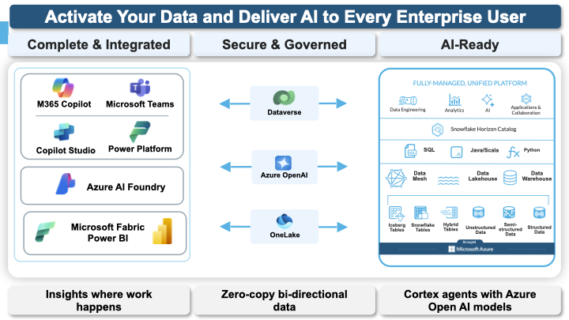
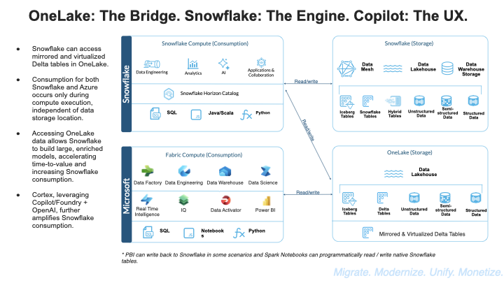
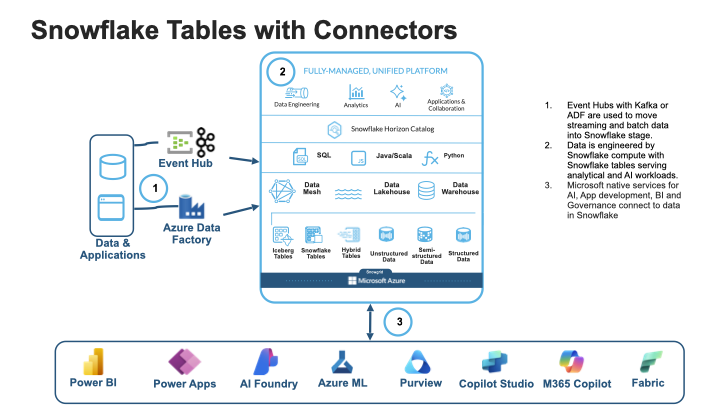
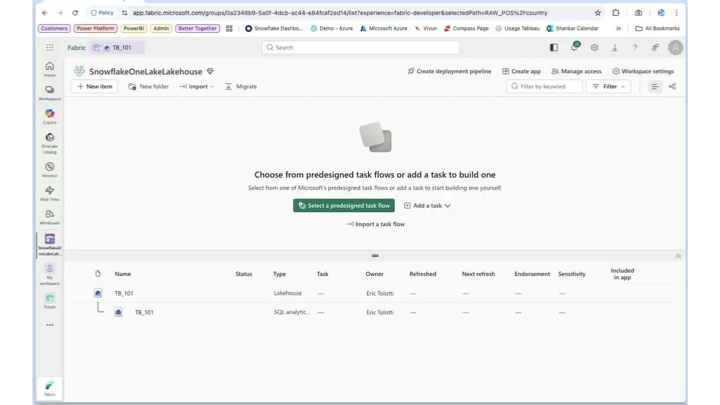
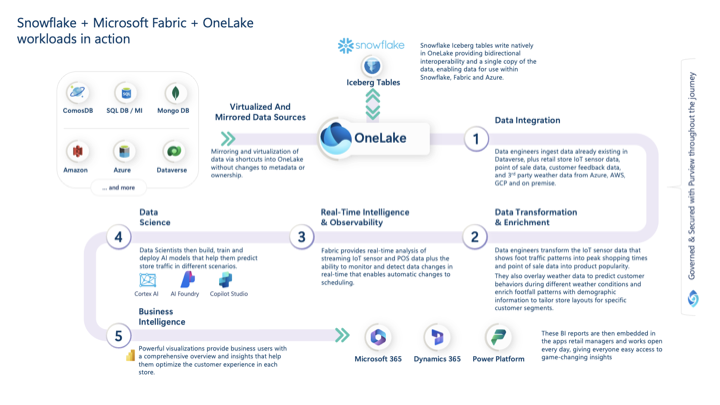
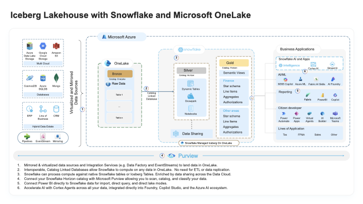
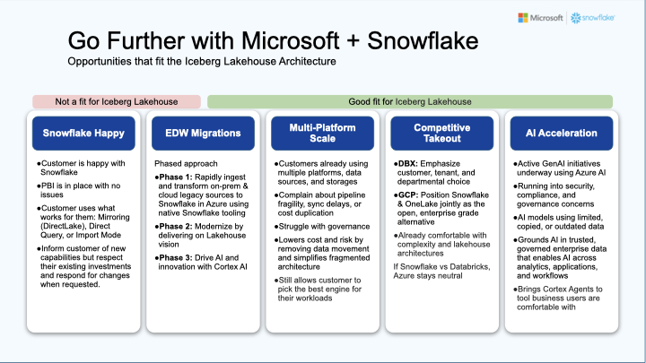

# Power BI + Snowflake via OneLake and Iceberg

> [!CAUTION]
> **No support provided.** This content is for reference only. Review and validate before applying to any production workflow.


**Pair-programmed by:** SE Community + Cortex Code
**Created:** 2026-03-24 | **Expires:** 2026-04-23 | **Status:** ACTIVE

> **Companion guide.** This guide covers the OneLake/Iceberg path for Power BI + Snowflake. For the DirectQuery path using interactive tables, hybrid tables, and standard optimization techniques, see [guide-powerbi-live-query](../guide-powerbi-live-query/).

Snowflake is the data engine -- transformation, governance, AI enrichment, and data sharing all happen here. For organizations that also run Microsoft Fabric, Apache Iceberg provides a bi-directional bridge (GA January 2026): Snowflake can ingest data from OneLake and serve curated Iceberg tables back to it. Power BI's **Direct Lake** mode can then read those Parquet files from OneLake for simple dashboard queries.

DirectQuery to Snowflake remains the most capable and most governed connection path. This guide covers when the OneLake/Iceberg path adds value alongside it -- and how to ensure Snowflake stays at the center of your data architecture when it does.

**Time:** ~30 minutes to read | **Result:** Architecture decision for when the OneLake/Iceberg path complements DirectQuery

## In This Guide

| # | Section | What You Get |
|---|---------|-------------|
| 1 | [The Architecture](#the-architecture) | [Big picture](#the-big-picture) ecosystem overview, bi-directional integration, and where value is created |
| 2 | [When to Use DirectQuery vs. Direct Lake](#when-to-use-directquery-vs-direct-lake) | Decision framework with clear default recommendation |
| 3 | [Direction 1: Bringing OneLake Data into Snowflake](#direction-1-bringing-onelake-data-into-snowflake) | Catalog-linked databases -- zero-ETL ingestion from OneLake |
| 4 | [Direction 2: Serving Curated Iceberg Tables to OneLake](#direction-2-serving-curated-iceberg-tables-to-onelake) | Snowflake-managed Iceberg tables synced to OneLake for Direct Lake |
| 5 | [The Iceberg Lakehouse Pattern](#the-iceberg-lakehouse-pattern) | Full medallion architecture with Snowflake at the center |
| 6 | [Cost Considerations](#cost-considerations) | Where value is created and who pays for what |
| 7 | [Current Limitations](#current-limitations) | GA constraints for bi-directional access and Iceberg tables |

## Who This Is For

Data engineers and architects operating in a Snowflake + Microsoft Fabric environment. You should be comfortable with Snowflake SQL and have access to a Microsoft Fabric workspace. No prior experience with Iceberg tables or OneLake is required.

**Already running DirectQuery?** Read the [decision section](#when-to-use-directquery-vs-direct-lake) to see if the OneLake path adds value for your workload. In many cases, DirectQuery with interactive warehouses already delivers sub-second performance with full governance -- and no Iceberg sync to manage.

### The Big Picture

The Snowflake + Microsoft integration spans the full enterprise data stack. Snowflake is the AI-ready engine (data engineering, analytics, AI, applications); Microsoft provides the consumption surfaces where users already work (Teams, Copilot Studio, Power BI, Azure AI Foundry). OneLake, Dataverse, and Azure OpenAI form the zero-copy bi-directional bridge between them.



---

## The Architecture

The Snowflake Partner SE enablement framing: **OneLake is the bridge. Snowflake is the engine. Copilot is the UX.**



The engine is where the value is created. Transformation, Horizon governance, Cortex AI enrichment, data sharing, dynamic tables, Snowpark -- all happen in Snowflake. OneLake is a delivery mechanism for one specific consumption pattern: Power BI Direct Lake mode.

The integration works in two directions, and the one that creates the most value is bringing data **into** Snowflake.

### Bringing Data into Snowflake (Catalog-Linked Databases)

Data that stays in OneLake is data that is not being enriched, governed, or AI-enabled. Catalog-linked databases fix that. Snowflake automatically discovers namespaces and Iceberg tables from OneLake and makes them queryable -- no ETL pipelines, no data replication, no manual table registration.

Once the data is visible in Snowflake, you can join it with Snowflake-native tables, transform it with dynamic tables and Snowpark, enrich it with Cortex AI, and govern it with Horizon policies. Every byte that enters Snowflake becomes more valuable.

**Use this direction when:** Data originates in Fabric (mirrored databases, EventStreams, Data Factory pipelines) and needs the transformation, governance, and AI capabilities that only Snowflake provides.

### Serving Curated Data to OneLake (Snowflake-Managed Iceberg)

After Snowflake has done the hard work -- ingestion, transformation, Cortex AI enrichment, Horizon governance -- you can optionally serve a curated subset as Iceberg tables that sync to OneLake. Power BI reads these via Direct Lake mode.

This is a delivery step, not a processing step. All intelligence stays in Snowflake. OneLake acts as a read cache for the narrow case where Direct Lake mode is useful.

**Use this direction when:** You have already invested in Fabric capacity and want Power BI to read pre-aggregated summaries from OneLake for simple dashboard queries. Note that DirectQuery with interactive warehouses often delivers the same sub-second latency without the complexity of managing Iceberg sync.

---

## When to Use DirectQuery vs. Direct Lake

> [!TIP]
> **DirectQuery to Snowflake is the recommended default.** It delivers full SQL capabilities, real-time data freshness, Horizon governance enforcement at query time, and sub-second latency with interactive warehouses. Direct Lake is a narrow complement for specific scenarios.

| Factor | DirectQuery to Snowflake | Direct Lake from OneLake |
|--------|------------------------|----------------------|
| SQL capabilities | Full Snowflake SQL: joins, window functions, UDFs, Cortex AI | Limited to Fabric SQL engine capabilities |
| Data freshness | Real-time (queries hit live Snowflake tables) | Depends on Iceberg snapshot sync frequency |
| Governance | Snowflake Horizon enforced at query time (RBAC, masking, row access) | Snowflake Horizon governs the Iceberg table; no enforcement at Power BI read time |
| Latency | Sub-second with interactive warehouses | Sub-second (data pre-loaded from OneLake) |
| Setup complexity | Security integration + warehouse | External volume + catalog integration + Fabric workspace + Iceberg sync |
| Ongoing management | Warehouse sizing and monitoring | Iceberg snapshot frequency, OneLake sync health, Fabric capacity planning |

**Use DirectQuery (the default) when:**
- You need full Snowflake SQL capabilities (complex joins, Cortex AI functions, hybrid table point lookups)
- Snowflake Horizon governance (row access policies, dynamic masking) must be enforced at query time
- You need real-time data -- not data lagging behind an Iceberg sync interval
- You are using interactive warehouses and already achieving sub-second latency
- You want the simplest architecture with the fewest moving parts

**Use Direct Lake as a supplement when all of these are true:**
- Fabric capacity is already a sunk cost with room to absorb dashboard reads
- The data model is simple pre-aggregated summaries that do not need Snowflake SQL at query time
- Near-real-time freshness (minutes, not seconds) is acceptable
- Snowflake Horizon enforcement at read time is not required for this specific dataset

In many architectures, **both paths coexist**: DirectQuery for complex, governed, real-time analytics, and Direct Lake for a curated set of simple summary tables where Fabric capacity can absorb the reads. Snowflake remains the single source of truth in both cases.

---

## Direction 1: Bringing OneLake Data into Snowflake



This is the high-value direction. Every dataset you bring into Snowflake becomes a candidate for transformation, AI enrichment, governance, and sharing. Catalog-linked databases make this zero-ETL.

### Prerequisites

- An Azure application registration with `user_impersonation` permission on Azure Storage
- Contributor access for the application on your Fabric workspace
- Iceberg tables in a Fabric data item (e.g., a lakehouse)

### Step 1: Create the Catalog Integration

<details>
<summary>SQL: Create Catalog Integration</summary>

```sql
CREATE OR REPLACE CATALOG INTEGRATION onelake_catalog_int
    CATALOG_SOURCE = ICEBERG_REST
    TABLE_FORMAT = ICEBERG
    REST_CONFIG = (
        CATALOG_URI = 'https://onelake.table.fabric.microsoft.com/iceberg'
        CATALOG_NAME = '<workspace-id>/<data-item-id>'
    )
    REST_AUTHENTICATION = (
        TYPE = OAUTH
        OAUTH_TOKEN_URI = 'https://login.microsoftonline.com/<tenant-id>/oauth2/v2.0/token'
        OAUTH_CLIENT_ID = '<entra-app-client-id>'
        OAUTH_CLIENT_SECRET = '<entra-app-client-secret>'
        OAUTH_ALLOWED_SCOPES = ('https://storage.azure.com/.default')
    )
    ENABLED = TRUE;
```

</details>

Replace the placeholder values:
- `<workspace-id>/<data-item-id>` -- from the Fabric workspace URL and lakehouse URL
- `<tenant-id>` -- your Entra tenant ID
- `<entra-app-client-id>` and `<entra-app-client-secret>` -- from your Azure application registration

### Step 2: Create the External Volume

<details>
<summary>SQL: Create External Volume</summary>

```sql
CREATE OR REPLACE EXTERNAL VOLUME onelake_extvol
    STORAGE_LOCATIONS = (
        (
            NAME = 'onelake_storage'
            STORAGE_PROVIDER = 'AZURE'
            STORAGE_BASE_URL = 'azure://onelake.dfs.fabric.microsoft.com/<workspace-id>/<data-item-id>'
            AZURE_TENANT_ID = '<tenant-id>'
        )
    )
    ALLOW_WRITES = FALSE;
```

</details>

After creating the volume, run `DESC EXTERNAL VOLUME onelake_extvol` and complete the consent flow using the `AZURE_CONSENT_URL`. Then grant the multi-tenant app Contributor access in your Fabric workspace.

### Step 3: Create the Catalog-Linked Database

```sql
CREATE OR REPLACE DATABASE fabric_data
    LINKED_CATALOG = (
        CATALOG = 'onelake_catalog_int'
    )
    EXTERNAL_VOLUME = 'onelake_extvol';
```

Snowflake automatically discovers namespaces and tables from OneLake. Check the sync status:

```sql
SELECT SYSTEM$CATALOG_LINK_STATUS('fabric_data');
```

### Step 4: Query, Enrich, and Govern in Snowflake

Once the data is in Snowflake, put it to work:

```sql
USE DATABASE fabric_data;

SELECT sale_date, region, SUM(revenue) AS total_revenue
FROM "dbo"."sales_data"
GROUP BY sale_date, region
ORDER BY sale_date DESC;
```

This is just the start. The real value comes from what Snowflake does next:

- **Join** OneLake data with Snowflake-native tables to build enriched models
- **Transform** with dynamic tables and Snowpark for production-grade pipelines
- **Enrich** with Cortex AI (classification, sentiment, summarization, embeddings)
- **Govern** with Horizon policies (row access, masking, tags, lineage)
- **Share** governed datasets across accounts and clouds with Snowflake data sharing

> [!IMPORTANT]
> Data that enters Snowflake becomes governed, enriched, and shareable. Data that stays in OneLake stays raw.

---

## Direction 2: Serving Curated Iceberg Tables to OneLake

After Snowflake has ingested, transformed, and governed the data, you can optionally publish a curated subset as Snowflake-managed Iceberg tables that sync to OneLake. Power BI can then read these via Direct Lake mode.

Remember: DirectQuery to Snowflake (especially with interactive warehouses) often achieves the same latency and delivers richer capabilities. Use this path when Fabric capacity is already a sunk cost and the dashboard queries are simple enough to not need Snowflake SQL.

### Prerequisites

**Snowflake side:**
- ACCOUNTADMIN or a role with CREATE USER and external volume privileges
- A standard database containing (or that will contain) Snowflake-managed Iceberg tables

**Fabric side:**
- Fabric workspace with administrator access
- Fabric tenant admin must enable "Enable Snowflake database item (Preview)" tenant setting
- Fabric tenant admin must enable "Service principals can call Fabric public APIs"

### Step 1: Create a Role and User for Fabric

<details>
<summary>SQL: Create Role and User for Fabric</summary>

```sql
USE ROLE ACCOUNTADMIN;

CREATE ROLE IF NOT EXISTS r_iceberg_metadata;

-- Grant access to your database (replace with your database name)
BEGIN
    LET db STRING := 'analytics_db';
    EXECUTE IMMEDIATE 'GRANT USAGE ON DATABASE ' || db || ' TO ROLE r_iceberg_metadata';
    EXECUTE IMMEDIATE 'GRANT USAGE ON ALL SCHEMAS IN DATABASE ' || db || ' TO ROLE r_iceberg_metadata';
    EXECUTE IMMEDIATE 'GRANT USAGE ON FUTURE SCHEMAS IN DATABASE ' || db || ' TO ROLE r_iceberg_metadata';
    EXECUTE IMMEDIATE 'GRANT SELECT ON ALL ICEBERG TABLES IN DATABASE ' || db || ' TO ROLE r_iceberg_metadata';
    EXECUTE IMMEDIATE 'GRANT SELECT ON FUTURE ICEBERG TABLES IN DATABASE ' || db || ' TO ROLE r_iceberg_metadata';
END;

GRANT USAGE ON WAREHOUSE sfe_powerbi_wh TO ROLE r_iceberg_metadata;

CREATE USER IF NOT EXISTS svc_fabric_iceberg
    TYPE = LEGACY_SERVICE
    LOGIN_NAME = 'svc_fabric_iceberg'
    DISPLAY_NAME = 'Service - Fabric Iceberg Metadata'
    DEFAULT_ROLE = r_iceberg_metadata;

GRANT ROLE r_iceberg_metadata TO USER svc_fabric_iceberg;
```

</details>

### Step 2: Connect Snowflake Database to Fabric

1. In Snowsight, navigate to **Ingestion > Add Data > Microsoft OneLake**
2. Enter your Fabric tenant ID and select Continue
3. Copy the **Multi-tenant app name** from the dialog (you will need it in Fabric)
4. Complete the consent flow when prompted
5. Select your Fabric workspace, enter the Snowflake connection ID from Fabric, and select the database
6. Select **Continue**, then **Create Volume** to create the external volume in OneLake

### Step 3: Create Snowflake-Managed Iceberg Tables

Publish the output of your Snowflake transformations as Iceberg tables:

<details>
<summary>SQL: Create Iceberg Table</summary>

```sql
CREATE ICEBERG TABLE analytics_db.public.sales_summary (
    sale_date DATE,
    region VARCHAR(50),
    product_category VARCHAR(100),
    total_quantity NUMBER,
    total_revenue NUMBER(18,2),
    transaction_count NUMBER
)
CATALOG = 'SNOWFLAKE';

INSERT INTO analytics_db.public.sales_summary
    SELECT
        sale_date,
        region,
        product_category,
        SUM(quantity),
        SUM(revenue),
        COUNT(*)
    FROM raw_sales
    GROUP BY sale_date, region, product_category;
```

</details>

These tables are the output of Snowflake's transformation and governance pipeline. They contain curated, governed, enriched data -- not raw source data.

### Step 4: View in Fabric



1. Open your Fabric workspace -- you should see a Snowflake database item named after your database
2. Open the item to browse schemas and tables
3. Select **SQL analytics endpoint** to query with SQL, or open in Power BI for Direct Lake reports

Power BI can read these tables via Direct Lake mode for simple dashboard queries. For anything requiring full SQL, Cortex AI, or Horizon governance enforcement, DirectQuery to Snowflake is the better path.

---

## The Iceberg Lakehouse Pattern

When both directions work together, Snowflake sits at the center of the architecture -- ingesting from every source, transforming everything, governing everything, and optionally publishing curated outputs to OneLake.



The slide above shows the end-to-end journey. Iceberg tables write natively in OneLake providing bi-directional interoperability. Data enters through Fabric connectors, gets transformed and enriched in Snowflake, and surfaces as insights through Cortex AI, Power BI, and Microsoft 365 apps. Every step from integration through BI is governed and secured.



1. **Ingest:** Data lands in OneLake via Fabric mirroring, EventStreams, or Data Factory
2. **Bring into Snowflake:** Catalog-linked databases make OneLake data queryable in Snowflake -- no ETL, no replication
3. **Transform:** Snowflake engineers the data with SQL, dynamic tables, and Snowpark
4. **Enrich:** Cortex AI adds classification, sentiment, summarization, and embeddings
5. **Govern:** Horizon policies enforce row access, masking, tagging, and lineage
6. **Serve:** Gold-layer Iceberg tables optionally sync to OneLake for Direct Lake consumption. DirectQuery serves everything else.
7. **Extend:** Cortex Agents, integrated into Copilot Studio and Teams, provide AI-powered access to the same governed data -- driving additional Snowflake compute for every interaction

> [!TIP]
> Every step from 2 through 7 runs on Snowflake. The more data and workloads you bring into Snowflake, the more value each step creates.

### Where This Pattern Fits

Not every customer needs the Iceberg lakehouse pattern. The slide below maps five common customer scenarios from "Not a fit" (Snowflake Happy -- already working well with DirectQuery) through high-fit opportunities where the lakehouse architecture creates the most value: multi-platform consolidation, competitive takeout, and AI acceleration.



| Scenario | Fit | Why |
|----------|-----|-----|
| Happy with Snowflake + Power BI DirectQuery | Low | DirectQuery is already excellent. Inform about OneLake capabilities but don't disrupt what works. |
| Multi-platform with pipeline fragility and cost duplication | High | Catalog-linked databases eliminate data movement. Snowflake becomes the single engine for transformation and governance across all sources. |
| EDW migration to Snowflake on Azure | High | Phase 1: Migrate to Snowflake. Phase 2: Add Iceberg lakehouse for any remaining Fabric data. Phase 3: Cortex AI across everything. Each phase increases Snowflake value. |
| Active GenAI initiatives with security concerns | High | Cortex AI grounds models in governed enterprise data. Cortex Agents connect to Copilot Studio and Teams, bringing Snowflake intelligence to every user. |

---

## Cost Considerations

The real cost story: **Snowflake is where the value is created.** Transformation, Cortex AI enrichment, Horizon governance, data sharing -- these capabilities justify Snowflake consumption because they make data usable, trusted, and intelligent.

| Component | Cost Owner | Value Created |
|-----------|-----------|---------------|
| Snowflake compute (transforms, AI, governance) | Snowflake | This is the core value: governed, enriched, AI-enabled data |
| Snowflake-managed Iceberg tables (storage) | Snowflake | Curated output, ready for any consumer |
| Catalog-linked database queries | Snowflake | Brings external data under Snowflake governance and enrichment |
| External volume metadata sync | Snowflake | Cloud services (free if under 10% daily compute) |
| OneLake storage | Microsoft | Delivery channel for Direct Lake reads |
| Power BI Direct Lake reads | Microsoft | Simple dashboard reads from OneLake (no Snowflake compute) |
| Power BI DirectQuery reads | Snowflake | Full SQL, live data, Horizon governance -- the premium path |

Direct Lake shifts simple dashboard reads to Fabric. Those reads only work because Snowflake did the hard work upstream: ingestion, transformation, AI enrichment, governance. The Snowflake processing is the valuable part of the pipeline.

DirectQuery with interactive warehouses is often the simpler path: no Iceberg sync to manage, full SQL at query time, real-time data, and Horizon enforcement on every read. Direct Lake makes sense as a supplement when Fabric capacity is already a sunk cost and the dashboard queries are simple pre-aggregated summaries that do not need Snowflake SQL.

---

<details>
<summary><strong>Current Limitations</strong></summary>

**Bi-directional access (GA January 2026):**
- Snowflake to Fabric direction requires the "Enable Snowflake database item" Fabric tenant setting
- Catalog-linked databases support both read and write operations (`ALLOWED_WRITE_OPERATIONS` defaults to `ALL`). Set to `NONE` for read-only access.

> [!WARNING]
> With write permissions enabled, dropping a table in Snowflake also drops it in the remote catalog.

- Catalog-linked databases do not sync remote catalog access control -- govern in Snowflake separately (this is a reason to do governance in Snowflake, not a limitation of Snowflake)
- By default, catalog-linked databases ignore nested namespaces (`NAMESPACE_MODE = IGNORE_NESTED_NAMESPACE`). To include nested namespaces, set `NAMESPACE_MODE = FLATTEN_NESTED_NAMESPACE` with a delimiter.
- Only schemas, externally managed Iceberg tables, and database roles can be created in a catalog-linked database. Other Snowflake objects (views, shares, etc.) are not currently supported.

**Iceberg tables:**
- Azure Data Lake Storage Gen2 support for external volumes is in Preview (March 2026)
- Iceberg tables have a different storage footprint than standard Snowflake tables
- Fail-safe is not available for Iceberg tables managed by Snowflake

</details>

---

<details>
<summary><strong>References</strong></summary>

| Resource | URL |
|----------|-----|
| Query Snowflake-Managed Iceberg Tables Using Fabric | https://docs.snowflake.com/en/user-guide/tables-iceberg-query-using-microsoft-fabric |
| Configure Catalog Integration for OneLake REST | https://docs.snowflake.com/en/user-guide/tables-iceberg-configure-catalog-integration-rest-onelake |
| Catalog-Linked Databases | https://docs.snowflake.com/en/user-guide/tables-iceberg-catalog-linked-database |
| Bi-Directional Access GA (Jan 2026) | https://docs.snowflake.com/en/release-notes/2026/other/2026-01-30-iceberg-microsoft-fabric-bidirectional-data-access-ga |
| Apache Iceberg Tables | https://docs.snowflake.com/en/user-guide/tables-iceberg |
| External Volume for Azure | https://docs.snowflake.com/en/user-guide/tables-iceberg-configure-external-volume-azure |
| OneLake Table APIs (Microsoft) | https://learn.microsoft.com/fabric/onelake/table-apis/table-apis-overview |
| Direct Lake Mode (Microsoft) | https://learn.microsoft.com/power-bi/enterprise/directlake-overview |
| Snowflake Horizon Catalog for Iceberg | https://docs.snowflake.com/en/user-guide/tables-iceberg-access-using-external-query-engine-snowflake-horizon |
| Power BI Live Query Guide (companion) | ../guide-powerbi-live-query/ |

</details>
