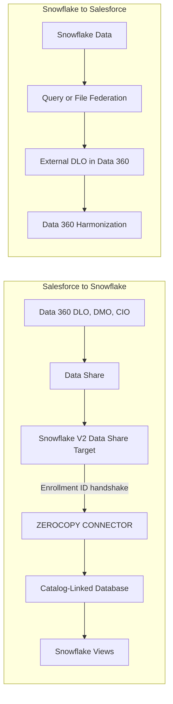

# Salesforce and Snowflake Zero Copy: V2, Federation, and Openflow

Salesforce and Snowflake now have several integrations whose names overlap. This
guide separates the directions and mechanisms, explains what **Salesforce V2**
means, and provides the public setup path for Salesforce Data 360 data shared to
Snowflake without replication.

**Audience:** Salesforce Data 360 administrators, Snowflake administrators, data
architects, and engineers choosing an integration pattern.

Pair-programmed by SE Community + Cortex Code

**Created:** 2026-09-08 | **Expires:** 2027-03-08 | **Status:** ACTIVE

> **No support provided.** Reference only; validate before production use.

---

## Start Here

The phrase **bidirectional zero copy** describes a portfolio with two directions.
It is not one read/write pipe.

| Need | Direction | Mechanism |
| --- | --- | --- |
| Query Salesforce Data 360 data products from Snowflake without copying them | Salesforce to Snowflake | **Salesforce V2 Zero-Copy Connector** and a catalog-linked database |
| Let Salesforce Data 360 query Snowflake data without copying it | Snowflake to Salesforce | **Query Federation** or **File Federation** configured in Salesforce |
| Copy Salesforce CRM objects into native Snowflake tables | Salesforce to Snowflake | **Openflow Connector for Salesforce Bulk API** |
| Give an agent tools to search or act in Salesforce | Agent to Salesforce API | **Salesforce MCP connector**, not a data-movement path |

Salesforce's current connector catalog marks the Snowflake connector **GA** and
**bidirectional**, with Query Federation, File Federation, and Data Share as its
zero-copy methods. The Snowflake V2 connector covered in the runbook below is the
**Data Share direction from Salesforce into Snowflake**. See the
[Salesforce connector catalog](https://developer.salesforce.com/docs/data/data-cloud-int/guide/c360-a-snowflake-connector.html).

## Terminology Map

| Term | Meaning |
| --- | --- |
| Salesforce Data Cloud / Data 360 | Salesforce's data platform; both names appear in current documentation |
| Salesforce V2 | The new Salesforce Data Share target and Snowflake `ZEROCOPY CONNECTOR` path |
| Data Share | A Salesforce-defined set of Data 360 objects made available to a target |
| Snowflake V2 Data Share Target | The Salesforce target authorized with an Enrollment ID |
| Zerocopy Connector | The Snowflake schema object that establishes the partner connection |
| Catalog-linked database | The Snowflake database that mounts one or more Salesforce Data Shares |
| DLO / DMO / CIO | Salesforce Data Lake, Data Model, and Calculated Insight object types |
| V1 / legacy / BYOL | The older Salesforce-to-Snowflake data-sharing path; use only while migrating an existing deployment |

**Use these routing phrases:** "Snowflake V2 Data Share Target" on the Salesforce
side and "Salesforce Zerocopy Connector" on the Snowflake side. Saying only
"BYOL" or "Salesforce connector" can route the discussion to a different path.

## Architecture: Two Directions



### Salesforce to Snowflake: V2 Data Share

Salesforce chooses the Data 360 objects to share. Snowflake mounts those data
products as schemas in a catalog-linked database and automatically creates views
over the objects. Salesforce remains the data owner; Snowflake queries the data
without an ETL copy. This flow is documented in
[About Salesforce Data Cloud and Snowflake](https://docs.snowflake.com/en/user-guide/data-integration/zero-copy/about-salesforce-datacloud).

### Snowflake to Salesforce: Federation

Salesforce configures a Snowflake connection and data stream. **Query Federation**
uses Snowflake compute through query pushdown. **File Federation** lets Data 360
read supported external storage through the open-table layer without invoking the
warehouse compute path. Salesforce publishes separate setup instructions for
[query federation](https://developer.salesforce.com/docs/data/data-cloud-int/guide/c360-a-set-up-data-federation-snowflake-connection.html)
and [file federation](https://developer.salesforce.com/docs/data/data-cloud-int/guide/c360-a-set-up-snowflake-file-federation-connection.html).

Salesforce also offers Cached Acceleration for cases where a temporary copy improves
performance or cost. That is a Salesforce-side choice, not a property of the V2
catalog-linked database in Snowflake. See
[Salesforce Zero Copy Connectivity](https://www.salesforce.com/data/connectivity/zero-copy/).

## Choose the Right Path

| | V2 Data Share | Snowflake Federation | Openflow Bulk API | Salesforce MCP |
| --- | --- | --- | --- | --- |
| Primary job | Query Data 360 products in Snowflake | Use Snowflake data in Data 360 | Replicate Salesforce objects | Give agents Salesforce tools |
| Copies source data | No | No by default; Salesforce can optionally cache | Yes | Not a data pipeline |
| Requires Data 360 | Yes | Yes | No | Depends on Salesforce MCP setup |
| Snowflake result | Views in a catalog-linked database | Existing Snowflake objects remain the source | Native destination tables | Tool results |
| Freshness control | Source availability plus metadata synchronization | Federation mode and Salesforce stream configuration | 1 minute to 24 hours | Request time |
| Choose when | Data must remain in Salesforce | Data must remain in Snowflake | Native copies or no Data 360 | Agent actions/search are the goal |

Openflow is not the "V2" in this guide. Its connector uses Salesforce Bulk API
2.0, Snowpipe Streaming, incremental polling, and merge operations. It is a useful
replication alternative with different delete, formula-field, attachment, and API
constraints. See the
[Openflow Salesforce Bulk API documentation](https://docs.snowflake.com/en/user-guide/data-integration/openflow/connectors/salesforce-bulk-api/about).

## V2 Prerequisites

### Snowflake

- An existing Standard, Enterprise, or Business Critical account.
- An account and Salesforce org in a combination supported by the live
  [zero-copy supported-regions page](https://docs.snowflake.com/en/user-guide/data-integration/zero-copy/supported-regions).
- `CREATE ZEROCOPY CONNECTOR` on the connector schema.
- `OPERATE` on the connector to retrieve its configuration and disconnect it.
- `USAGE` on the connector plus account-level `CREATE DATABASE` to mount shares.
- `MONITOR`, `MODIFY`, or `OWNERSHIP` only for the corresponding operational duties.

The complete privilege mapping is in the
[Snowflake security guide](https://docs.snowflake.com/en/user-guide/data-integration/zero-copy/salesforce/security).

### Salesforce

- Salesforce Data 360 provisioned for the organization.
- A Salesforce administrator with the **Data Cloud Architect** permission set.
- At least one eligible Data Share.
- The Enrollment ID generated by Snowflake.

One Snowflake setup page still says the Salesforce org must be enabled for the
"Snowflake V2 pilot," while Salesforce's current connector catalog says the
connector is GA. Treat the Salesforce catalog as the status source, but confirm that
**Snowflake V2** appears as a Data Share Target type in the actual Salesforce org
before scheduling a production cutover.

## Quick Start: Salesforce Data 360 to Snowflake

### 1. Create the Snowflake Connector

Run with a role that owns the target schema or has the documented connector
privileges:

```sql
CREATE DATABASE IF NOT EXISTS SALESFORCE_CONNECTIVITY;
CREATE SCHEMA IF NOT EXISTS SALESFORCE_CONNECTIVITY.ZERO_COPY;

CREATE ZEROCOPY CONNECTOR IF NOT EXISTS
  SALESFORCE_CONNECTIVITY.ZERO_COPY.SALESFORCE_DATA_360
  PARTNER = SALESFORCE;

SELECT SYSTEM$GET_ZEROCOPY_CONNECTOR_CONFIG(
  'SALESFORCE_CONNECTIVITY.ZERO_COPY.SALESFORCE_DATA_360'
);
```

Transmit the returned `enrollment_code` through an approved secure channel. Monitor
the state with:

```sql
DESC ZEROCOPY CONNECTOR
  SALESFORCE_CONNECTIVITY.ZERO_COPY.SALESFORCE_DATA_360;
```

The normal state sequence is `NEW`, `CONNECTING`, then `CONNECTED`.

### 2. Create and Link the Salesforce Target

In Salesforce Data 360:

1. Open **Data Shares** and create or select the Data Share to expose.
2. Open **Data Share Targets** and create a target.
3. Select connection type **Snowflake V2**.
4. Enter the Enrollment ID from Snowflake.
5. Link the Data Share to that target.

Salesforce automatically includes `IndividualGDPRState__dll` to carry consent
information. An external DLO, or a DMO mapped to an external DLO, cannot be included
in the outbound Data Share. These constraints are documented in
[Set up Salesforce Data Cloud for Zero-Copy](https://docs.snowflake.com/en/user-guide/data-integration/zero-copy/salesforce/setup-salesforce).

### 3. Discover and Mount Data Products

```sql
SELECT SYSTEM$ZEROCOPY_CONNECTOR_LIST_SHARES(
  'SALESFORCE_CONNECTIVITY.ZERO_COPY.SALESFORCE_DATA_360'
);
```

Mount every linked Data Share as a schema:

```sql
CREATE DATABASE SALESFORCE_DATA_360
  LINKED_ZEROCOPY_CONNECTOR = (
    CONNECTOR_NAME =
      'SALESFORCE_CONNECTIVITY.ZERO_COPY.SALESFORCE_DATA_360',
    ALL_SHARES = TRUE,
    SYNC_INTERVAL_SECONDS = 30
  );
```

For a narrower boundary, use one of these documented alternatives instead of
`ALL_SHARES = TRUE`:

```sql
-- One share
CREATE DATABASE SALESFORCE_ACCOUNTS
  LINKED_ZEROCOPY_CONNECTOR = (
    CONNECTOR_NAME =
      'SALESFORCE_CONNECTIVITY.ZERO_COPY.SALESFORCE_DATA_360',
    SHARE_NAME = 'account_share'
  );

-- Selected shares
CREATE DATABASE SALESFORCE_SELECTED
  LINKED_ZEROCOPY_CONNECTOR = (
    CONNECTOR_NAME =
      'SALESFORCE_CONNECTIVITY.ZERO_COPY.SALESFORCE_DATA_360',
    SHARE_NAME_FILTER = ('account_share', 'opportunity_share')
  );
```

### 4. Verify the Query Surface

```sql
SHOW SCHEMAS IN DATABASE SALESFORCE_DATA_360;
SHOW VIEWS IN SCHEMA SALESFORCE_DATA_360.<share_schema>;
SHOW COLUMNS IN VIEW SALESFORCE_DATA_360.<share_schema>.<object_view>;

SELECT
  <required_column_one>,
  <required_column_two>
FROM SALESFORCE_DATA_360.<share_schema>.<object_view>
LIMIT 10;
```

Views can take about one minute to appear after mounting. Discover the real object
and column names before creating downstream logic. The full mount behavior is in
[Explore data products from Salesforce Data Cloud](https://docs.snowflake.com/en/user-guide/data-integration/zero-copy/salesforce/explore-data-products).

## V1 to V2 Migration

Do not unlink the legacy target first. Snowflake's public migration note prescribes
this order:

1. Create the V2 connector and Snowflake V2 Data Share Target.
2. Link the existing Salesforce Data Share to V2.
3. Mount the V2 data product in Snowflake.
4. Compare schemas, row counts, key aggregates, freshness, and dependent objects.
5. Redirect consumers to the V2 catalog-linked database.
6. Observe a normal business and refresh cycle.
7. Unlink the legacy target only after V2 is proven.

The database and schema names can change. Inventory fully qualified references in
views, tasks, dynamic tables, BI tools, and applications before cutover. This guide
does not use internal compatibility flags that are absent from the public SQL reference.

## Operations and Failure Ladder

Check the earliest failing layer first:

```sql
SHOW ZEROCOPY CONNECTORS IN ACCOUNT;

DESC ZEROCOPY CONNECTOR
  SALESFORCE_CONNECTIVITY.ZERO_COPY.SALESFORCE_DATA_360;

SELECT SYSTEM$ZEROCOPY_CONNECTOR_LIST_SHARES(
  'SALESFORCE_CONNECTIVITY.ZERO_COPY.SALESFORCE_DATA_360'
);

SHOW DATABASES LIKE 'SALESFORCE_DATA_360%';
SHOW SCHEMAS IN DATABASE SALESFORCE_DATA_360;
```

| Layer | Symptom | Action |
| --- | --- | --- |
| Enrollment | Connector remains `NEW` | Confirm the target type is Snowflake V2 and uses this Enrollment ID |
| Connection | `CONNECT_ERROR` | Read `connection_error` from `DESC ZEROCOPY CONNECTOR` and correct the Salesforce authorization |
| Sharing | Connected but no shares appear | Link a Salesforce Data Share to the V2 target |
| Mount | Share reports `UNMOUNTED` | Create a linked database that includes that share |
| Views | Database exists but has no views | Wait one minute, then check the selected Data Share and schema again |
| Disconnect | Disconnect is rejected | Drop every catalog-linked database attached to the connector first |

Connector and catalog-linked database objects do not support `UNDROP`. A connector
can be dropped only in the documented terminal/error states. Plan teardown rather
than treating it as a reversible cleanup.

## Capability Boundaries

- `SYNC_INTERVAL_SECONDS` controls discovery of Data Share metadata changes. It is
  not an ETL refresh interval.
- Zero copy removes replication, not compute, governance, modeling, latency, or
  source-availability concerns.
- V2 exposes Salesforce objects as Snowflake views. Do not assume every table-only
  feature works on those views.
- Internal material describes Streams and Dynamic Tables improvements, but the current
  public V2 documentation reviewed for this guide does not define their supported
  semantics. Validate the exact downstream design before committing to it.
- The V2 Data Share mount does not make arbitrary Snowflake tables writable Salesforce
  objects. Snowflake-to-Salesforce federation is configured separately in Data 360.
- Salesforce describes File Federation as Beta on its current zero-copy overview.
  Recheck that status before choosing it over Query Federation.

## Architecture Meeting Checklist

1. Which direction is required: Salesforce to Snowflake, Snowflake to Salesforce, or both?
2. Is Salesforce Data 360 licensed and provisioned?
3. Does the Salesforce org show **Snowflake V2** as a Data Share Target type?
4. Must data remain in place, or are native Snowflake copies acceptable?
5. Which DLO, DMO, and CIO objects are in scope? Are any backed by external DLOs?
6. Is a legacy V1/BYOL target already in use?
7. Who owns Data Cloud Architect duties and the Snowflake connector role?
8. What freshness, concurrency, availability, and cost behavior is required in each direction?
9. Which downstream dependencies must move if database or schema names change?
10. What evidence authorizes cutover and legacy-target removal?

## Related Guides

- [Salesforce Snowflake Connector](https://developer.salesforce.com/docs/data/data-cloud-int/guide/c360-a-snowflake-connector.html)
- [Snowflake: About Salesforce Data Cloud and Snowflake](https://docs.snowflake.com/en/user-guide/data-integration/zero-copy/about-salesforce-datacloud)
- [Snowflake: Openflow Connector for Salesforce Bulk API](https://docs.snowflake.com/en/user-guide/data-integration/openflow/connectors/salesforce-bulk-api/about)

## External References

- [Set up the Salesforce Data Cloud Zerocopy Connector](https://docs.snowflake.com/en/user-guide/data-integration/zero-copy/salesforce/setup)
- [Set up Salesforce Data Cloud for Zero-Copy](https://docs.snowflake.com/en/user-guide/data-integration/zero-copy/salesforce/setup-salesforce)
- [Explore data products from Salesforce Data Cloud](https://docs.snowflake.com/en/user-guide/data-integration/zero-copy/salesforce/explore-data-products)
- [Salesforce Data Cloud Zerocopy Connector security and privileges](https://docs.snowflake.com/en/user-guide/data-integration/zero-copy/salesforce/security)
- [Set up a Snowflake Data Federation connection](https://developer.salesforce.com/docs/data/data-cloud-int/guide/c360-a-set-up-data-federation-snowflake-connection.html)
- [Create a Snowflake Data Stream](https://developer.salesforce.com/docs/data/data-cloud-int/guide/c360-a-create-snowflake-data-fed-data-stream.html)
- [Set up a Snowflake File Federation connection](https://developer.salesforce.com/docs/data/data-cloud-int/guide/c360-a-set-up-snowflake-file-federation-connection.html)
- [Create a Snowflake File Federation Data Stream](https://developer.salesforce.com/docs/data/data-cloud-int/guide/c360-a-create-snowflake-file-fed-data-stream.html)
- [Salesforce Zero Copy Connectivity](https://www.salesforce.com/data/connectivity/zero-copy/)
