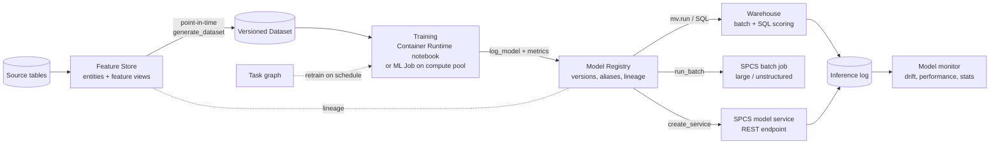

# Snowflake ML Lifecycle — Design, Serving, Monitoring, and Cost

An evaluation guide for teams that already run machine learning on AWS (usually SageMaker) and want to know how the same lifecycle works in Snowflake: where features live, where training runs, how models are versioned and served, how you watch them in production, and what the bill is made of. It answers five questions a platform team asks in an evaluation, and it is honest about the one it cannot answer for you: whether Snowflake serving is fast enough for *your* model. That one gets a test method, not a number.

**Audience:** ML platform engineers, MLOps leads, and architects running an evaluation against an existing AWS ML stack.

Pair-programmed by SE Community + Cortex Code

**Created:** 2026-09-30 | **Expires:** 2027-03-30 | **Status:** ACTIVE

> **No support provided.** Reference only; validate before production use.

---

## Start Here

| If you are asking… | Go to |
| --- | --- |
| "How do the pieces fit together end to end?" | [1. End-to-end design](#1-end-to-end-design-and-operation) |
| "How do I watch drift and performance in production?" | [2. Monitoring](#2-model-monitoring-and-metric-dashboards) |
| "Is real-time serving as fast as SageMaker endpoints?" | [3. Serving bake-off](#3-live-serving-versus-aws-run-a-bake-off) |
| "Can I keep training in SageMaker and serve here, or the reverse?" | [4. Cross-cloud registry](#4-cross-cloud-registry-integration) |
| "What will deployed models cost?" | [5. Cost drivers](#5-total-compute-cost-for-deployed-models) |

Companion files — copy-paste ready, nothing is deployed by this guide:

| File | What it is |
| --- | --- |
| `python/reference_pipeline.py` | One model through Feature Store → ML Job → Registry → batch scoring → REST service → retraining DAG |
| `sql/monitoring_queries.sql` | Model monitor DDL, drift/performance/stat queries, custom metric table, threshold alert |
| `sql/lineage_audit.sql` | `GET_LINEAGE` queries for "what trained this model" and impact analysis |
| `sql/cost_drivers.sql` | `ACCOUNT_USAGE` queries for every cost driver in section 5 |

**Before you start:** `snowflake-ml-python` 2.0.0 or later (required for `run_batch`), a compute pool for training and serving (this guide assumes `CPU_X64_S`), Enterprise Edition for ML Lineage.

---

## 1. End-to-end design and operation

| Stage | Snowflake capability | Status | Notes |
| --- | --- | --- | --- |
| Features | Feature Store: entities, feature views | GA | A feature view with `refresh_freq` is **managed** (a dynamic table Snowflake refreshes); without it, it is **external** (your table or view). |
| Training data | `generate_dataset` / `generate_training_set` | GA | Point-in-time correct via ASOF join; Datasets are versioned and immutable. |
| Online features | Hybrid-table online store (GA); Postgres online store (Preview) | Mixed | Postgres store is documented at ~10 ms p50 and bills continuously. |
| Training | Container Runtime notebooks, ML Jobs (`@remote`, `submit_file`, `submit_directory`) | GA | ML Jobs always need a compute pool; multi-node needs `MAX_NODES >= target_instances`. |
| Registry | `Registry.log_model` | GA | Versions, metrics (`set_metric`), default version, aliases (`ALTER MODEL`), system aliases `DEFAULT`/`FIRST`/`LAST`. |
| Batch inference | `mv.run()` in a warehouse, or SQL | GA | Runs in the session's warehouse; 15 GB model size limit for warehouse deployment. |
| Large batch | `mv.run_batch()` / `EXECUTE INFERENCE JOB SERVICE` | GA | Runs on SPCS; writes a `_SUCCESS` marker when done. |
| Real-time | `mv.create_service()` on SPCS | GA | REST endpoint named `inference`; PAT or key-pair auth. |
| Retraining | Task graphs via Python DAG API (`snowflake.core.task.dagv1`) | GA | `@remote` functions become compute-pool tasks with `definition=`. |
| Audit | ML Lineage (`GET_LINEAGE`, `.lineage()`) | GA (Enterprise) | Source table → feature view → dataset → model. |

**Operating model in one paragraph.** Features are defined once and reused for training and inference, so training/serving skew comes from code you did not share, not from two copies of the logic. Training writes a new model version with its metrics; nothing is promoted automatically. Promotion is a deliberate `ALTER MODEL … SET DEFAULT_VERSION` or alias change, which is what batch jobs and services resolve against. The task graph owns the schedule: refresh features, retrain, evaluate, and optionally promote.

**Lineage for audit.** Lineage is captured automatically when feature views, datasets, and models are created, and when `log_model` receives a Snowpark DataFrame (or a Dataset) as `sample_input_data`. Two gaps to plan around: there is no edge from a model to the tables its predictions are written to, and lineage is not replicated to other accounts. Domains are not what you might guess — feature views are queried as `'TABLE'` and models as `'MODULE'`. See `sql/lineage_audit.sql`.

## 2. Model monitoring and metric dashboards

**Model version monitors** (ML Observability, `CREATE MODEL MONITOR`) watch one model version by reading an inference log table you maintain. They compute three families of metrics on a refresh schedule, and a dashboard appears in Snowsight under **AI & ML → Models → *model* → Monitors**.

| Family | Function | Metrics |
| --- | --- | --- |
| Drift | `MODEL_MONITOR_DRIFT_METRIC` | Jensen-Shannon, difference of means, Wasserstein, PSI |
| Performance | `MODEL_MONITOR_PERFORMANCE_METRIC` | Regression: RMSE, MAE, MAPE, MSE. Binary: ROC AUC, accuracy, precision, recall, F1. Multiclass: accuracy, macro/micro precision and recall |
| Statistics | `MODEL_MONITOR_STAT_METRIC` | COUNT, COUNT_NULL, MIN, MAX, AVG, SUM |

Rules that shape the design:

- The model must be logged with `task=` set, or the monitor cannot choose its metrics.
- **No baseline, no drift.** The monitor snapshots the baseline table at creation, so populate it from your scored validation set *before* `CREATE MODEL MONITOR`. An empty or missing baseline cannot be fixed later without recreating the monitor.
- `TIMESTAMP_COLUMN` must be `TIMESTAMP_NTZ`. Minimum refresh interval is 60 seconds. One monitor per model version, single-output models only, up to five segment columns.
- Performance needs actuals. Design the inference log with a nullable actual column you backfill when labels arrive.
- A monitor suspends itself after five consecutive refresh failures — alert on that too.

**Custom metrics** (business KPIs, per-request latency pulled from inference logs) go in an ordinary table and render in a Streamlit app or dashboard. **Alerts** are standard `CREATE ALERT` objects whose condition queries a monitor function; they are created suspended and must be resumed. `CREATE ALERT` does not validate the condition SQL, so run the `SELECT` by hand first. All of this is in `sql/monitoring_queries.sql`.

When you are comparing two live services (champion/challenger, canary, shadow), that is a different object — a **gateway model monitor** (`GATEWAY =` instead of `VERSION`/`SOURCE`) over auto-captured inference logs. Confirm its current availability in your account before you design around it.

## 3. Live serving versus AWS: run a bake-off

There is no honest latency or throughput number to put in this guide. Serving performance depends on the model, the input payload, the instance type, concurrency, and — most of all — where the callers are. The useful answer is a test you run on your own model against your own targets.

**The two paths.** Warehouse inference (`mv.run`, SQL) is the batch path: it scales with the warehouse and suits scoring tables. SPCS model serving (`create_service`) is the real-time path: a REST endpoint on a compute pool. This guide assumes a CPU pool (`CPU_X64_S`); switch to a GPU instance family (for example `GPU_NV_S`) and set `gpu_requests` when the model needs it.

**Bake-off protocol.**

1. **Fix the targets first.** Write down p50/p95/p99 latency, sustained and peak QPS, payload size, and acceptable cold-start behaviour before either side is measured.
2. **Same model artifact.** Log the SageMaker-trained model into the Registry (section 4) so the comparison is serving, not training.
3. **Same caller location.** Run the load generator from where production callers will actually sit. Measure both endpoints from there.
4. **Measure three states:** warm steady state, burst above the minimum instance count (autoscaling), and first request after idle (cold start).
5. **Record cost alongside latency.** Credits from `sql/cost_drivers.sql` for the test window versus the AWS bill for the same window.

**Trade-offs to test, not assume.**

| Factor | What to know |
| --- | --- |
| Cold start | With `min_instances=0` (the default) a service suspends after 30 minutes idle and the next request waits for it to resume. Image builds take roughly 10 minutes (CPU) to 20 minutes (GPU) at deploy time. Set `min_instances >= 1` if first-request latency matters. |
| Autoscaling | Scaling between `min_instances` and `max_instances` reacts on the order of a minute plus node provisioning. Test the burst you actually expect, and set compute pool `MAX_NODES` high enough to hold the instances. |
| Network path | Callers outside Snowflake reach the endpoint over the public ingress (or private connectivity where configured) with PAT or key-pair auth. Callers inside Snowflake, or scoring data that already lives in Snowflake, avoid that hop entirely — that is usually where the real win is. |
| Operations | No endpoint configs, images, or scaling policies to maintain yourself; the trade is less low-level control over the serving container. |

## 4. Cross-cloud registry integration

The Registry has built-in support for scikit-learn, XGBoost, LightGBM, CatBoost, Prophet, PyTorch, TensorFlow, Keras, Hugging Face pipelines, Sentence Transformers, and MLflow pyfunc models, plus `CustomModel` for anything else. A model trained in SageMaker can be logged here like one trained in Snowflake; you provide sample input data or a signature, and dependencies are packaged with it.

Models can be **shared and replicated** across accounts and regions. On a shared model, `USAGE` allows warehouse inference without seeing internals; `READ` allows SPCS inference and metadata access. Lineage does not travel with replication.

**Confirm the system of record first.** The pattern depends on which registry is authoritative:

| System of record | Pattern | Watch for |
| --- | --- | --- |
| Snowflake | Train anywhere; the Registry holds every version, metric, and alias; serving and monitoring happen here. | Log training metrics at `log_model` time so the Registry is complete. |
| SageMaker (stays authoritative) | Promotion happens in SageMaker; a CI step exports the approved artifact and logs it into Snowflake as a governed serving copy, keeping the SageMaker version ID as the Snowflake version name or a tag. | Two registries drift unless one-way sync is automated. Never promote in Snowflake. |

The common reason to do either: serving and batch scoring move next to the data, under the same RBAC as the data, without copying feature tables out.

## 5. Total compute cost for deployed models

Every driver below is in credits and visible in `ACCOUNT_USAGE`. `sql/cost_drivers.sql` has a query for each. Convert with your contract rate; per-instance-family rates are in the Snowflake Credit Consumption Table.

| Driver | What bills | Where to see it | Control |
| --- | --- | --- | --- |
| Compute pool (serving, ML Jobs, `run_batch`) | Instance family × node-hours while any node is up, **including idle time** | `SNOWPARK_CONTAINER_SERVICES_HISTORY` | `MIN_NODES` (must be ≥ 1), `AUTO_SUSPEND_SECS` (default 3600), right-size `INSTANCE_FAMILY` |
| Warehouse batch inference | Warehouse credits for `mv.run` / SQL scoring | `WAREHOUSE_METERING_HISTORY`, `QUERY_ATTRIBUTION_HISTORY` by `QUERY_TAG` | Dedicated ML warehouse, auto-suspend, query tags |
| Model serving (summary) | Inference across warehouse and SPCS | `MODEL_SERVING_USAGE_HISTORY` | Attribution view: its SPCS share overlaps compute pool credits, so do not add them |
| Training | ML Job pool time; notebook Container Runtime time | `SNOWPARK_CONTAINER_SERVICES_HISTORY`, `NOTEBOOKS_CONTAINER_RUNTIME_HISTORY` | Separate training pool from serving pool |
| Feature view refresh | Dynamic-table refresh on the feature store warehouse; online store runs continuously | `WAREHOUSE_METERING_HISTORY` | `refresh_freq`, incremental refresh |
| Monitor refresh | Warehouse credits per refresh and dashboard load | `WAREHOUSE_METERING_HISTORY` | `REFRESH_INTERVAL` |
| Storage | Feature tables, datasets, model artifacts, inference logs | `DATABASE_STORAGE_USAGE_HISTORY` | Dataset retention, log retention |

**The one that surprises people:** a service with `min_instances=0` suspends after 30 idle minutes, but the compute pool underneath keeps its minimum node running until the pool's own `AUTO_SUSPEND_SECS` elapses — an hour by default. Service-level and pool-level idle settings are separate knobs, and the pool is what bills. Query 3 in `sql/cost_drivers.sql` finds off-hours pool time.

## Common Misconceptions

| Misconception | Reality |
| --- | --- |
| "Scale-to-zero means the endpoint costs nothing when idle." | The service can suspend; the compute pool bills until its own auto-suspend. |
| "The monitor will show drift once I add a baseline later." | Adding a baseline requires recreating the monitor. |
| "Lineage covers where predictions end up." | Model → prediction-table edges are not captured. |
| "Snowflake serving is faster/slower than SageMaker." | Neither is true in general. Run section 3 on your model. |

## Related Guides

- [Snowflake ML overview](https://docs.snowflake.com/en/developer-guide/snowflake-ml/overview)
- [Model inference overview and decision matrix](https://docs.snowflake.com/en/developer-guide/snowflake-ml/inference/inference-overview)
- [Start Here index for this repository](../README.md)

## External References

- [Feature Store](https://docs.snowflake.com/en/developer-guide/snowflake-ml/feature-store/overview)
- [ML Jobs](https://docs.snowflake.com/en/developer-guide/snowflake-ml/ml-jobs/overview)
- [Model Registry](https://docs.snowflake.com/en/developer-guide/snowflake-ml/model-registry/overview)
- [Batch inference jobs](https://docs.snowflake.com/en/developer-guide/snowflake-ml/inference/batch-inference-jobs)
- [Real-time inference REST API](https://docs.snowflake.com/en/developer-guide/snowflake-ml/inference/real-time-inference-rest-api)
- [ML Observability](https://docs.snowflake.com/en/developer-guide/snowflake-ml/model-registry/model-observability)
- [CREATE MODEL MONITOR](https://docs.snowflake.com/en/sql-reference/sql/create-model-monitor)
- [ML Lineage](https://docs.snowflake.com/en/developer-guide/snowflake-ml/ml-lineage)
- [CREATE COMPUTE POOL](https://docs.snowflake.com/en/sql-reference/sql/create-compute-pool)
- [CREATE ALERT](https://docs.snowflake.com/en/sql-reference/sql/create-alert)

Pair-programmed by SE Community + Cortex Code
