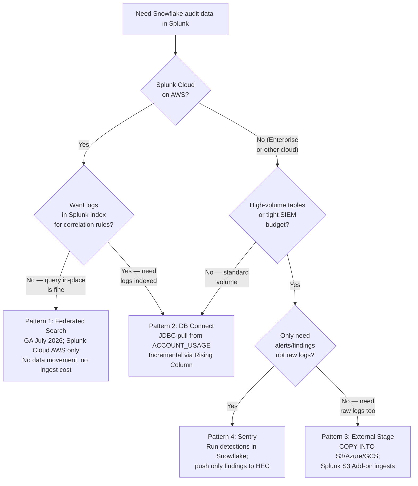

# Snowflake Logs → Splunk: Integration Guide

Snowflake does not generate traditional server log files. Its audit trail lives inside Snowflake itself — as SQL-queryable views in `SNOWFLAKE.ACCOUNT_USAGE`. Getting that data into Splunk requires one of four distinct patterns depending on your Splunk edition, cost tolerance, and latency needs.

This guide covers all four, with working SQL, decision criteria, and what each pattern does not do.

> **Applies beyond Splunk.** The mechanics here are properties of `ACCOUNT_USAGE`, not of
> Splunk. Any SIEM that pulls Snowflake audit data over JDBC or the SQL API — CrowdStrike,
> Sentinel, Chronicle, Elastic — hits the same latency, checkpointing, and
> minimum-billing behaviour described in [Pattern 2](pattern-2-db-connect.md). Read the
> Rising Column and anti-pattern sections regardless of which SIEM you run.

**Audience:** SEs, security architects, Splunk administrators setting up Snowflake monitoring.
**Created:** 2026-07-30 | **Expires:** 2026-10-30 | **Status:** ACTIVE

Pair-programmed by SE Community + Cortex Code

> **No support provided.** Reference only; test before you rely on it in production. SQL examples were verified against Snowflake docs on the created date above — re-verify before quoting them.

---

## Read These Words First

| Term | In plain words |
| --- | --- |
| **ACCOUNT_USAGE** | A shared database Snowflake provides to every account. Contains audit views like `LOGIN_HISTORY`, `QUERY_HISTORY`, `ACCESS_HISTORY`. No extra cost to query. Has 45-minute to 3-hour data latency. |
| **Information Schema** | A lower-latency (7-day retention) alternative to ACCOUNT_USAGE. Use for operational queries; ACCOUNT_USAGE for long-term audit. |
| **Rising Column** | The DB Connect technique for incremental ingest — a monotonically increasing column (like `EVENT_ID`) that tells Splunk "only fetch rows newer than this checkpoint." Must be open-ended (`> ?`), never a bounded window. |
| **Splunk HEC** | HTTP Event Collector — Splunk's REST endpoint for receiving JSON events. External systems push events to it. Requires a token for auth. |
| **DB Connect** | A Splunk add-on that runs SQL queries against external databases via JDBC and ingests the results as Splunk events. The traditional Snowflake→Splunk integration path. |
| **Federated Search** | A newer Splunk capability (GA July 2026, Cloud AWS only) that lets Splunk query Snowflake in-place without ingesting data. No SIEM storage cost for Snowflake data. |
| **Sentry** | Snowflake's open-source security monitoring framework. Pre-built MITRE-mapped detection queries you deploy inside Snowflake, exporting only findings to your SIEM. |
| **PAT** | Programmatic Access Token — Snowflake's preferred credential for service accounts. Used as a password by tools (like DB Connect) that don't support key-pair auth. |

---

## Which Pattern Do You Need?

---

## Pattern Comparison

| | [Pattern 1: Federated Search](pattern-1-federated-search.md) | [Pattern 2: DB Connect](pattern-2-db-connect.md) | [Pattern 3: External Stage](pattern-3-external-stage.md) | [Pattern 4: Sentry](pattern-4-sentry.md) |
| --- | --- | --- | --- | --- |
| **Data moves to Splunk?** | No — queried in-place | Yes — ingested as events | Yes — via cloud storage | Findings only |
| **Splunk ingest cost** | None | Per-GB of audit log volume | Per-GB (scope to what you need) | Minimal (findings only) |
| **Latency** | ACCOUNT_USAGE lag (45min–3hr) | ACCOUNT_USAGE lag (45min–3hr) | Configurable (task schedule) | Configurable (task schedule) |
| **Splunk edition** | Cloud AWS only (July 2026) | Cloud + Enterprise | Cloud + Enterprise | Cloud + Enterprise |
| **Complexity** | Low (add data source in UI) | Medium (JDBC driver, config) | Medium (SQL task + S3 config) | Medium-High (Sentry deploy) |
| **Best for** | Splunk Cloud teams wanting zero ingest cost | Most orgs; correlation rules requiring indexed data | High-cardinality tables, budget-constrained | Minimizing SIEM costs; detection-in-place |
| **Strategic direction?** | Yes | Mature / widely deployed | Complementary | Yes (Snowflake-preferred) |

---

## The Audit Views Worth Knowing

All views are in `SNOWFLAKE.ACCOUNT_USAGE`:

| View | What It Contains | ACCOUNT_USAGE Lag | Recommended Rising Column |
| --- | --- | --- | --- |
| `LOGIN_HISTORY` | All login attempts (success + failure), client type, MFA status | ~2 hours | `EVENT_ID` |
| `QUERY_HISTORY` | All queries: user, role, warehouse, runtime, bytes scanned | ~45 min | `START_TIME` (cast to TIMESTAMP_NTZ; not unique — see caveat) |
| `ACCESS_HISTORY` | Which tables/columns each query touched; lineage | ~3 hours | `QUERY_START_TIME` (cast to TIMESTAMP_NTZ; not unique) |
| `SESSIONS` | Session open/close events | ~3 hours | `SESSION_ID` |
| `COPY_HISTORY` | Files loaded/unloaded; Snowpipe activity | ~2 hours | `LAST_LOAD_TIME` |
| `GRANTS_TO_ROLES` | Privilege grants to roles (point-in-time snapshot) | ~2 hours | No good rising column; batch daily |
| `GRANTS_TO_USERS` | Role grants to users (point-in-time snapshot) | ~2 hours | No good rising column; batch daily |
| `DATA_TRANSFER_HISTORY` | Bytes transferred out of Snowflake | ~2 hours | `START_TIME` |
| `TRUST_CENTER_FINDINGS` | Snowflake-managed security posture findings | ~1 hour | `CREATED_ON` (low churn — poll daily) |

> **Poll no faster than the lag.** The lag column is a floor, not a target. Polling a
> 3-hour-latency view every few minutes does not get you fresher data — it gets you
> incomplete data, because the cursor advances past rows before they materialise. If you
> need genuinely recent activity, use the Information Schema table functions (no latency,
> 7-day retention) or Trust Center, not ACCOUNT_USAGE.

> **The grant views only show additions, not removals.** `GRANTS_TO_ROLES` and
> `GRANTS_TO_USERS` are snapshots, not event streams. Filtering them on `CREATED_ON`
> — the obvious choice for incremental ingest — means a **revoked** grant never produces
> a row, so privilege *removal* is invisible to your SIEM. Both views carry `DELETED_ON`;
> select it and ingest the full daily snapshot if you need revocation detection. This is
> the single most commonly missed gap in Snowflake privilege monitoring.

> **Non-unique rising columns need care.** `START_TIME` and `QUERY_START_TIME` are not
> unique. Combined with `>` and a `LIMIT`, a batch can cut mid-timestamp and the
> checkpoint will step over the remaining rows. Use `>=` plus downstream deduplication on
> `QUERY_ID`. See [Pattern 2](pattern-2-db-connect.md#rising-column-gotchas).

> **Cost note:** Querying ACCOUNT_USAGE is free. You pay for the virtual warehouse you use to run the queries (DB Connect, tasks) and for Splunk's ingest/storage pricing on what you land there. `ACCESS_HISTORY` and `QUERY_HISTORY` are high-cardinality — size your Splunk ingest budget before enabling them.

> **Warehouse cost is driven by poll frequency, not query cost.** These queries are
> tiny, but warehouses bill a **60-second minimum every time they resume**. A poller on a
> 5-minute interval pays that floor ~288 times a day regardless of how fast the SQL runs,
> which is why interval is the dominant cost lever. See
> [Sizing AUTO_SUSPEND for a poller](pattern-2-db-connect.md#sizing-auto_suspend-for-a-poller).
> If the warehouse exists *only* to serve a scheduled export you control, consider a
> serverless task instead ([Pattern 3](pattern-3-external-stage.md) /
> [Pattern 4](pattern-4-sentry.md)) — serverless bills per-second of actual compute with
> no resume minimum and no idle tail. That option is not available when an external tool
> pulls the data, as in Pattern 2.

---

## Pattern Guides

1. [Splunk Federated Search](pattern-1-federated-search.md) — Query Snowflake from Splunk without moving data (Splunk Cloud AWS, GA July 2026)
2. [Splunk DB Connect](pattern-2-db-connect.md) — JDBC pull with Rising Column incremental ingest (most widely deployed)
3. [External Stage Export](pattern-3-external-stage.md) — COPY INTO cloud storage + Splunk S3 Add-on (high-volume / cost-sensitive)
4. [Sentry Detection Push](pattern-4-sentry.md) — Run detections in Snowflake, push only findings to Splunk HEC

## Related Guides

For guides that work alongside this one, see the [**Start Here** index](../README.md#start-here).

---

## External References

- [Snowflake ACCOUNT_USAGE — Differences vs Information Schema](https://docs.snowflake.com/en/sql-reference/account-usage#differences-between-account-usage-and-information-schema)
- [Splunk DB Connect on Splunkbase](https://splunkbase.splunk.com/app/2686/)
- [Splunk DBX Add-on for Snowflake JDBC](https://splunkbase.splunk.com/app/6153)
- [Splunk Federated Search for Snowflake — Cisco press release](https://newsroom.cisco.com/c/r/newsroom/en/us/a/y2025/m09/cisco-advances-open-data-ecosystems-with-splunk-federated-search-for-snowflake.html)
- [Snowflake Sentry project](https://snowflake-labs.github.io/Sentry/)
- [Snowflake SIEM Integration Architectures (Snowflake blog)](https://medium.com/snowflake/siem-integration-architectures-patterns-9b29e0f42b1a)
- [Integrating Snowflake and Splunk with DBConnect (Snowflake Community)](https://community.snowflake.com/s/article/Integrating-Snowflake-and-Splunk-with-DBConnect)

---

Pair-programmed by SE Community + Cortex Code
