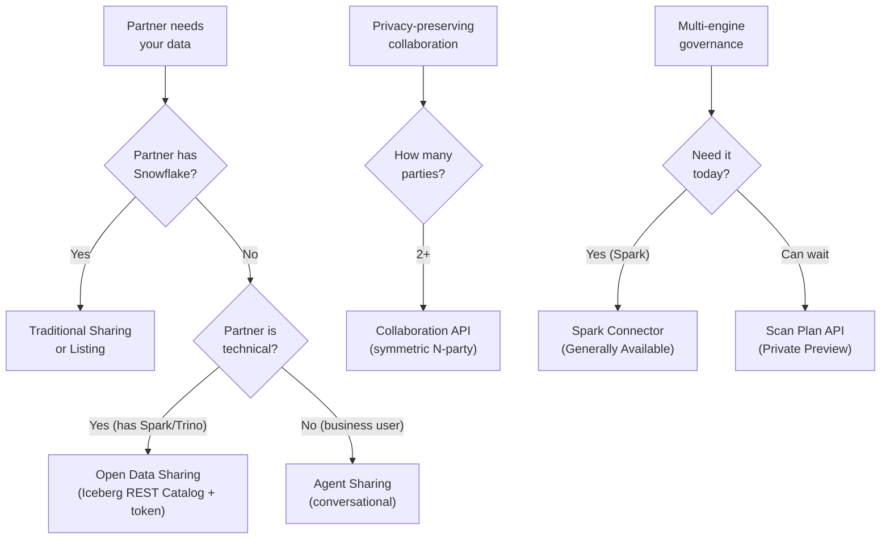
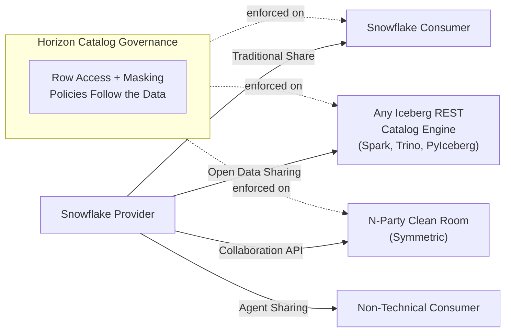
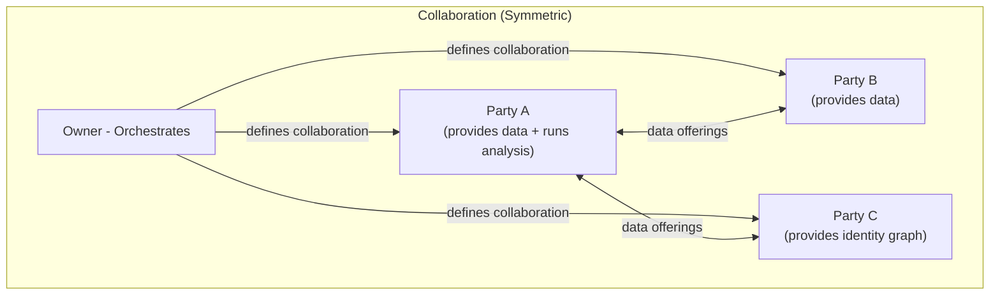

# Universal Data Sharing: What You Missed at Summit 2026

Summit 2026 had 500+ sessions and the agentic AI story dominated every keynote.

But quietly, Snowflake shipped something that solves the longest-standing objection to data sharing: **"What about partners who don't use Snowflake?"**

The answer is no longer "create a reader account." It's a collection of capabilities that make Snowflake the collaboration hub regardless of what your partners run.

**Audience:** Data Architects, Data Engineers, and technical decision-makers evaluating how to share data with partners who don't use Snowflake.
**Created:** 2026-07-28 | **Expires:** 2027-01-27 | **Status:** ACTIVE

Pair-programmed by SE Community + Cortex Code

> **No support provided.** Reference only; test before you rely on it. Features in Preview may change — re-verify before quoting. To refresh: check the [Feature Status Matrix](#feature-status-matrix-july-2026) against [Snowflake release notes](https://docs.snowflake.com/en/release-notes).

---

## Start Here

**Need to share data with a partner who doesn't use Snowflake?** Start with:
- [Common Scenarios](#common-scenarios) — find your situation, get the answer
- [Decision Tree](#decision-tree) — which mechanism fits

**Then read the deep-dive for the relevant capability:**

| # | Section | One-Line Summary |
|---|---------|-----------------|
| 1 | [Open Data Sharing](#1-open-data-sharing-private-preview) | Non-Snowflake consumers access shares via Iceberg REST Catalog APIs + access token |
| 2 | [Open Table Format Sharing](#2-open-table-format-sharing-ga) | Share Iceberg/Delta across clouds with auto-fulfillment (consumer has Snowflake) |
| 3 | [Multi-Party Clean Rooms](#3-multi-party-clean-rooms--collaboration-api-ga) | Symmetric N-party collaboration replacing the old 2-party model |
| ↳ | [Cross-Cloud Clean Rooms](#cross-cloud-clean-rooms-im-on-aws-my-partner-is-on-azure) | "I'm on AWS, my partner is on Azure" — solved |
| 4 | [Universal Governance](#4-universal-governance--policies-follow-the-data) | Policies enforced on external engines via Scan Plan API |
| 5 | [AI-Powered Sharing](#5-ai-powered-sharing--the-last-mile) | Auto-gen agents make shared data conversational for non-technical users |

**Reference:**
- [Feature Status Matrix](#feature-status-matrix-july-2026) — what's generally available vs Preview
- [Further Reading](#further-reading) — official docs links

---

## Decision Tree



**In plain text:** Snowflake consumer → traditional share. Technical non-Snowflake partner (Spark/Trino) → Open Data Sharing. Non-technical partner → Agent Sharing. Privacy-preserving multi-party → Collaboration API. Multi-engine policy enforcement on Spark → Spark Connector (generally available today).

---

## Common Scenarios

| Your Situation | Solution | Details |
|---|---|---|
| Partners don't use Snowflake | Open Data Sharing — any Iceberg REST Catalog-compatible engine connects with an access token. No account needed. Governance preserved. | [Section 1](#1-open-data-sharing-public-preview) |
| Need 3+ parties in a clean room | Collaboration API — fully symmetric, any party brings data or runs analysis. Generally available since April. | [Section 3](#3-multi-party-clean-rooms--collaboration-api-ga) |
| Run Spark + Snowflake and need consistent policies | Snowflake Connector for Apache Spark enforces Horizon policies today (generally available). Scan Plan API coming for all engines. | [Section 4](#4-universal-governance--policies-follow-the-data) |
| Business partners aren't technical enough for SQL | Auto-gen Agents create a conversational interface over any share — no SQL needed. | [Section 5](#5-ai-powered-sharing--the-last-mile) |
| Currently using reader accounts | Open Data Sharing eliminates reader account maintenance. Partners use their own tools with an access token. | [Section 1](#1-open-data-sharing-public-preview) |
| Partners are on a different cloud (AWS vs Azure vs GCP) | Cross-Cloud Auto-Fulfillment handles this — no data movement required. Must be planned at collaboration creation time. | [Cross-Cloud Clean Rooms](#cross-cloud-clean-rooms-im-on-aws-my-partner-is-on-azure) |

---

## Overview: Share With Anyone, Govern Everything



---

## 1. Open Data Sharing (Private Preview)

> **TL;DR:** Non-Snowflake consumers access your shared data via standard Iceberg REST Catalog APIs. No Snowflake account. No reader accounts. No data movement.

### How It Works

1. Provider creates an **EXTERNAL CONSUMER** — a restricted identity bound to a region
2. Provider adds a **Programmatic Access Token (PAT)** for authentication
3. Provider creates an Iceberg table and a traditional SHARE
4. Provider creates an **EXTERNAL LISTING** linking the share to the external consumer
5. Provider calls `SYSTEM$GET_LISTING_URL_FOR_EXTERNAL_CONSUMER` to get the catalog URL
6. External consumer connects with any Iceberg REST Catalog-compatible client (Spark, Trino, PyIceberg, DuckDB, etc.)

### Key SQL

<details>
<summary>Full workflow — click to expand</summary>

```sql
-- Step 1: Create an external consumer
CREATE EXTERNAL CONSUMER partner_analytics;

-- Step 2: Add a PAT (save the secret — you cannot retrieve it later)
ALTER EXTERNAL CONSUMER partner_analytics ADD PAT partner_pat;

-- Step 3: Create shared Iceberg data
CREATE ICEBERG TABLE my_db.sharing.revenue_metrics (region STRING, quarter STRING, revenue NUMBER)
  EXTERNAL_VOLUME = 'SNOWFLAKE_MANAGED'
  CATALOG = 'SNOWFLAKE';

-- Step 4: Create share + grant
CREATE SHARE revenue_share;
GRANT USAGE ON DATABASE my_db TO SHARE revenue_share;
GRANT USAGE ON SCHEMA my_db.sharing TO SHARE revenue_share;
GRANT SELECT ON TABLE my_db.sharing.revenue_metrics TO SHARE revenue_share;

-- Step 5: Create external listing
CREATE EXTERNAL LISTING revenue_listing SHARE revenue_share AS
$$
title: "Revenue Metrics - Partner Access"
description: "Quarterly revenue metrics for analytics partners"
listing_terms:
  type: "OFFLINE"
external_targets:
  access:
    - external_consumers: [PARTNER_ANALYTICS]
$$;

-- Step 6: Get the catalog URL for the partner
CALL SYSTEM$GET_LISTING_URL_FOR_EXTERNAL_CONSUMER('REVENUE_LISTING');
```

The partner receives a `catalog_uri` and uses their access token to authenticate via any Iceberg REST Catalog client.

</details>

### What's Enforced

All governance defined in Horizon Catalog travels with the data:
- Row access policies
- Dynamic data masking policies
- Projection, aggregation, and join policies

### Current Limitations (Private Preview)

> **Status note (Aug 2026):** Open Data Sharing is in **Private Preview** — available to selected accounts only. If you cannot find the relevant SQL commands in your account, contact your Snowflake representative to request access.

- Programmatic Access Tokens are the only authentication method (more coming)
- Read-only access for external consumers
- Region-locked to the provider's region during Private Preview (no cross-region yet)

> **Reference:** [Open Data Sharing Docs](https://docs.snowflake.com/en/user-guide/open-data-sharing)

---

## 2. Open Table Format Sharing (Generally Available)

> **TL;DR:** Share Iceberg and Delta Lake tables across clouds and regions with full governance. No ETL, no egress surprises. Consumer must have Snowflake.

This is the **foundation layer** that Open Data Sharing builds upon. Generally available since late 2025. Works with:

- **Snowflake-managed Iceberg** (Horizon Catalog)
- **Externally-managed Iceberg** (AWS Glue, Apache Polaris, Databricks Unity via Iceberg REST Catalog API)
- **Delta Lake** (via Delta Direct or Unity Catalog federation)

### Key Capabilities

| Capability | What It Does |
|---|---|
| Cross-Cloud Auto-Fulfillment | Automatically replicates shared data to consumer's region/cloud |
| Egress Cost Optimizer | Predictable costs — no per-query egress charges |
| Full Horizon Governance | Masking, row access, aggregation, join, and projection policies |
| Multi-format | Apache Iceberg + Delta Lake tables |
| Multi-cloud | Commercial, VPS, and U.S. government clouds |

### When You Need This vs. Open Data Sharing

| Scenario | Use |
|---|---|
| Consumer has Snowflake, data is Iceberg/Delta | Open Table Format Sharing |
| Consumer does NOT have Snowflake | Open Data Sharing |

Both use Iceberg underneath. Open Data Sharing builds on top of Open Table Format Sharing.

> **Reference:** [Extending Data Sharing to Open Table Formats](https://www.snowflake.com/en/blog/data-sharing-open-table-formats/) | [Auto-fulfillment with open format tables](https://docs.snowflake.com/en/collaboration/use-auto-fulfillment-with-open-table-formats)

---

## 3. Multi-Party Clean Rooms — Collaboration API (Generally Available)

> **TL;DR:** The Collaboration API replaces the legacy 2-party model with fully symmetric, N-party collaboration. Any participant provides data, contributes logic, or runs analysis. **Migrate before Oct 2026.**

### What Changed

| Before (Legacy) | After (Collaboration API) |
|---|---|
| Fixed provider/consumer roles | Fully symmetric — any party plays any role |
| 2-party only | N-party (advertiser + publisher + identity partner, etc.) |
| Provider controls everything | Owner orchestrates, but any party can contribute |
| Rigid templates | Flexible analysis templates contributed by any collaborator |

### Architecture



### Key API Call

<details>
<summary>INITIALIZE call for 3-party collaboration — click to expand</summary>

```sql
CALL SAMOOHA_BY_SNOWFLAKE_LOCAL_DB.COLLABORATION.INITIALIZE(
$$
api_version: 2.0.0
spec_type: collaboration
name: campaign_measurement
owner: advertiser_acct
collaborator_identifier_aliases:
  advertiser_acct: org1.acct1
  publisher_acct: org2.acct2
  identity_partner: org3.acct3
analysis_runners:
  advertiser_acct:
data_providers:
  publisher_acct:
  identity_partner:
data_offerings:
  - id: publisher_impressions_v1
  - id: identity_graph_v1
templates:
  - id: campaign_overlap_template_v1
$$, 'ANALYSIS_WH');
```

</details>

### Cross-Cloud Clean Rooms: "I'm on AWS, My Partner is on Azure"

This was previously a hard blocker. It's now solved — with caveats.

**The short answer:** Cross-cloud and cross-region clean rooms are fully supported. The platform handles data replication automatically. No one has to move their data.

**How it works:**

1. The collaboration must be **created as cross-cloud from the start** (you cannot convert a same-region collaboration later)
2. Each collaborator in a different cloud/region enables **Cross-Cloud Auto-Fulfillment** on their account:

```sql
-- Run once per account (not per collaboration)
CALL SAMOOHA_BY_SNOWFLAKE_LOCAL_DB.LIBRARY.ENABLE_GLOBAL_DATA_SHARING_FOR_ACCOUNT();
```

3. Once enabled, collaborators join normally — the platform replicates what's needed behind the scenes

**What to know:**

| Question | Answer |
|---|---|
| Does my data physically move? | Metadata and aggregated results replicate. Raw data stays in its home region. |
| Who pays for replication? | The analysis runner bears compute costs. Cross-cloud replication costs apply per Snowflake's standard pricing. |
| Can I add a cross-cloud partner after creation? | No. The collaboration must be set up for cross-cloud from day one. Plan ahead. |
| Which clouds are supported? | AWS, Azure, and GCP in [supported regions](https://docs.snowflake.com/user-guide/cleanrooms/installing-dcr#label-dcr-supported-regions). |
| What about government or VPS? | Not currently supported for Data Clean Rooms. |

> **Key takeaway:** The old "you have to move your data to my cloud" blocker is gone. But you must plan for cross-cloud at collaboration creation time — it can't be added retroactively.

### Timeline

> **Action required:** Legacy clean room deprecation is phased. Plan migration by Jun 2027.

- **Apr 2026:** Collaboration API goes generally available
- **Oct 2026:** No new legacy clean rooms via the web UI
- **Feb 2027:** Web app UI no longer accessible; no new legacy clean rooms via Provider and Consumer API
- **Jun 2027:** Legacy Provider and Consumer clean rooms fully decommissioned
- **Migration tool available** to convert existing legacy rooms

> **Reference:** [Collaboration API Reference](https://docs.snowflake.com/en/user-guide/cleanrooms/v2/v2-api-reference) | [Migration Guide](https://docs.snowflake.com/en/user-guide/cleanrooms/getting-started) | [Cross-Cloud Auto-Fulfillment](https://docs.snowflake.com/en/user-guide/cleanrooms/laf)

---

## 4. Universal Governance — Policies Follow the Data

> **TL;DR:** Define governance once in Horizon Catalog. It's enforced on Snowflake, Spark, Trino, and any Iceberg REST Catalog-compatible engine. **For Spark today: use the Snowflake Connector for Apache Spark (generally available).**

### The Problem It Solves

Multi-engine environments previously required duplicating access policies in each system. One misconfiguration = data leak.

### How It Works

1. **Horizon Catalog** manages all Iceberg tables (Snowflake-managed + external via Catalog-Linked Databases)
2. **Iceberg REST Scan Plan API** (Private Preview) pushes row-access and masking policies to external engines at query time
3. **Comprehensive Auditing** (Private Preview) logs all external engine operations in Snowflake Access History
4. **Snowflake Connector for Apache Spark** (Generally Available) enforces policies for Spark users today

### What's Available Today vs. Coming

| Layer | Status | What It Does |
|---|---|---|
| Catalog-Linked Databases (read/write) | Generally Available | Discover + access external Iceberg from Snowflake |
| Horizon Catalog Iceberg REST APIs for external engines | Private Preview | External engines read/write Snowflake-managed Iceberg |
| Iceberg REST Scan Plan API | Private Preview | Row-access + masking enforced on external engines |
| Comprehensive Auditing | Private Preview | All external engine ops in Access History |
| Snowflake Connector for Apache Spark | **Generally Available** | Enforces Horizon policies for Spark today |
| Private Link to External Catalogs | Generally Available | Keeps connections off public internet |

### The "Today" Answer for Spark Customers

> If a customer needs policy enforcement on Spark NOW:
> - **Snowflake Connector for Apache Spark (Generally Available)**
> - Enforces row-access + masking policies
> - Production-ready today
> - No additional configuration beyond connector setup

> **Reference:** [Interoperable Lakehouse Blog](https://www.snowflake.com/en/blog/interoperable-lakehouse-architecture/) | [Vended Credentials + Iceberg Interoperability](https://www.snowflake.com/en/blog/snowflake-commitment-iceberg-interoperability/)

---

## 5. AI-Powered Sharing — The Last Mile

> **TL;DR:** Sharing data is only useful if consumers can use it. Auto-gen Agents make shared data immediately conversational — no SQL required.

### Auto-gen Agents for Data Shares (Public Preview)

Any data listing or secure data share can instantly generate:
- A **Semantic View** defining the business logic over the shared data
- A **Cortex Agent** that consumers query in natural language

No manual development. Consumers get a governed, conversational experience out of the box.

### Cortex Agent Sharing (Public Preview)

Deploy Cortex Agents across Snowflake accounts via Marketplace:
- Internal teams via org listings
- Partners via private listings
- Broader ecosystem via public Marketplace

### Why This Matters for Non-Technical Consumers

The partner who doesn't have a Snowflake account AND doesn't know SQL can now:
1. Access shared data via Open Data Sharing (Iceberg REST Catalog-compatible tool)
2. OR interact with an Agent that already understands the data's semantics

This is the "last mile" — data sharing that reaches the business user, not just the data engineer.

---

## Feature Status Matrix (July 2026)

| Feature | Status | Key Limitation |
|---|---|---|
| Open Data Sharing | **Private Preview** (selected accounts) | Access tokens only; region-locked to provider region |
| Open Table Format Sharing (Iceberg/Delta) | Generally Available | CLDs with non-Iceberg-REST catalog integrations not yet supported |
| Collaboration API (multi-party Data Clean Rooms) | Generally Available | Legacy deprecated (phased: Oct 2026 → Feb 2027 → Jun 2027) |
| Iceberg REST Scan Plan API | Private Preview | No customer-facing config yet |
| Comprehensive Auditing (external engines) | Private Preview | No customer-facing config yet |
| Auto-gen Agents for Data Shares | Public Preview | Production-ready but preview status |
| Cortex Agent Sharing | Public Preview | Production-ready but preview status |
| Snowflake Connector for Apache Spark | **Generally Available** | Policy enforcement ready today |
| Vended Credentials (external engine R/W) | Generally Available | Full bidirectional interop |

---

## Further Reading

> **Re-verify before 2027-01-27.** This guide covers Summit 2026 announcements. Open Data Sharing is in Private Preview (selected accounts); the Scan Plan API uses terminology that differs from public docs ("Horizon Iceberg REST Catalog API" in docs). Re-verify feature status before quoting. Check [docs.snowflake.com](https://docs.snowflake.com) against the code samples here before using in a customer conversation.

- [Open Data Sharing Docs](https://docs.snowflake.com/en/user-guide/open-data-sharing)
- [Extending Data Sharing to Open Table Formats (Blog)](https://www.snowflake.com/en/blog/data-sharing-open-table-formats/)
- [Interoperable Lakehouse (Summit 2026 Blog)](https://www.snowflake.com/en/blog/interoperable-lakehouse-architecture/)
- [Collaboration API Reference](https://docs.snowflake.com/en/user-guide/cleanrooms/v2/v2-api-reference)
- [Data Sharing and Collaboration Overview](https://docs.snowflake.com/en/guides-overview-sharing)
