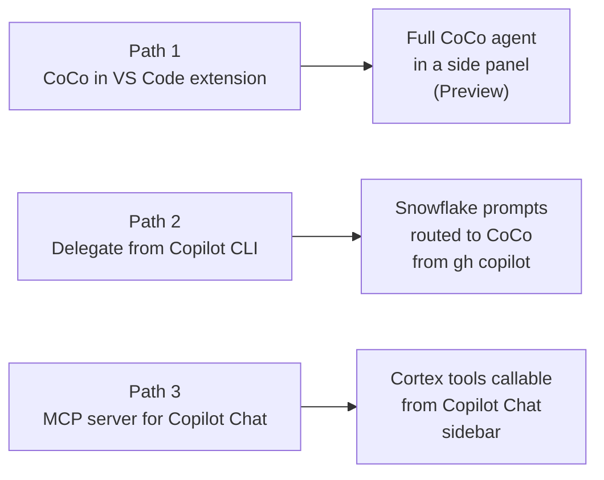

# Connecting VS Code to Snowflake Cortex

Three paths to bring Snowflake Cortex into VS Code — from the built-in CoCo panel in the official Snowflake extension, to delegating from the GitHub Copilot CLI, to a governed MCP server that adds tools to Copilot Chat.

**Audience:** SEs walking customers through setup + customer engineers configuring independently
**Created:** 2026-05-28 | **Revised:** 2026-07-06 | **Expires:** 2026-12-31 | **Status:** ACTIVE

> **No support provided.** Review and validate before applying to any production workflow. Preview capabilities are labeled where they appear.

> **Naming (Summit 26):** **CoCo** = formerly Cortex Code (CLI still invoked as `cortex`). **Snowflake CoWork** = formerly Snowflake Intelligence.

---

## Three paths



| | Path 1 — VS Code extension | Path 2 — Copilot CLI skill | Path 3 — MCP server |
|---|---|---|---|
| **Surface** | Dedicated CoCo panel in Activity Bar | GitHub Copilot CLI (`gh copilot`) terminal | Copilot Chat sidebar (VS Code) |
| **Agent** | CoCo | Copilot CLI → CoCo for Snowflake | Copilot's model + Snowflake tools |
| **Setup** | ~2 min — already signed into the extension? One click. | ~5 min | ~30 min, needs Snowflake admin |
| **Auth** | Extension's Snowflake sign-in | Inherits local `cortex` auth | OAuth (recommended) or PAT |
| **Snowflake admin needed?** | No | No | Yes |
| **GA / Preview** | Preview (open) | GA | GA |
| **Best for** | Working directly in CoCo alongside existing VS Code workflows | Engineers already on `gh copilot` who want Snowflake auto-routing | Orgs that need governed, auditable Snowflake tool access from Copilot Chat |

---

## Detailed guides

**[Path 1 — CoCo in the Snowflake VS Code extension](path-1-vscode-extension.md)** *(Preview)*
If you already sign into the Snowflake extension for SQL editing, CoCo is one click away. Full CoCo agent in a dedicated Activity Bar panel: visual diff review, inline SQL result grids, named session history. No admin required. Works in VS Code and Cursor.

**[Path 2 — Delegate to CoCo from GitHub Copilot](path-2-subagent-skill.md)**
The `subagent-cortex-code` skill teaches `gh copilot` to detect Snowflake-shaped prompts and route them to the local CoCo CLI. 5-minute install via `npx`. Everything non-Snowflake stays with Copilot.

**[Path 3 — Snowflake-managed MCP server](path-3-mcp.md)**
Create a Snowflake MCP server object that exposes Cortex Search, Cortex Analyst, Cortex Agents, and custom tools as callable functions inside Copilot Chat. Governed by RBAC. **Enterprise Copilot license holders (Business/Enterprise): your GitHub org admin must enable the "MCP servers in Copilot" policy before this works — check before starting setup.** Also read the `SYSTEM_EXECUTE_SQL` risk section — unconstrained SQL execution has real cost and accuracy implications.

---

## Prerequisites (all paths)

- VS Code or Cursor installed
- A Snowflake account the user can sign into
- Network reachability to the Snowflake account URL

Path-specific prerequisites are in each path doc.

---

## The semantic view foundation

All three paths get more accurate from the same groundwork: a **semantic view** describing your data in business terms, plus **verified queries** (real questions paired with correct SQL). Path 3's Cortex Analyst tool is only as accurate as the semantic view behind it; Paths 1 and 2 read your schema and context directly. Build it once, every path benefits.

- [Getting Started with Cortex Analyst](https://www.snowflake.com/en/developers/guides/getting-started-with-cortex-analyst/)
- [Overview of semantic views](https://docs.snowflake.com/en/user-guide/views-semantic/overview)
- [Verified Query Repository](https://docs.snowflake.com/en/user-guide/snowflake-cortex/cortex-analyst/verified-query-repository)

---

## Cross-path gotchas

- **Cortex rejects date-suffixed model IDs.** Pin to bare names: `claude-sonnet-4-6`, `claude-opus-4-6`, `claude-opus-4-7`. (`claude-haiku-4-5` is no longer a current Cortex model.)
- **Cross-region inference.** If a model isn't natively hosted in your region:
  ```sql
  ALTER ACCOUNT SET CORTEX_ENABLED_CROSS_REGION = 'AWS_GLOBAL';
  -- Azure: AZURE_GLOBAL; narrower: AWS_US, AWS_EU, AWS_APJ, AWS_AU, AZURE_US; multi-cloud: ANY_REGION
  ```
- **Government regions not supported** for CoCo on any path.
- **Network policy.** Confirm the user's machine IP is allowed: `SHOW PARAMETERS LIKE 'NETWORK_POLICY' IN USER <username>;`

---

## Related guides

- [`guide-connecting-claude-snowflake`](../guide-connecting-claude-snowflake/) — same patterns for Claude Desktop / Claude Code
- [`guide-mcp-auth`](../guide-mcp-auth/) — comprehensive MCP authentication across clients
- [`guide-agent-hardening`](../guide-agent-hardening/) — production governance for Cortex Agents
