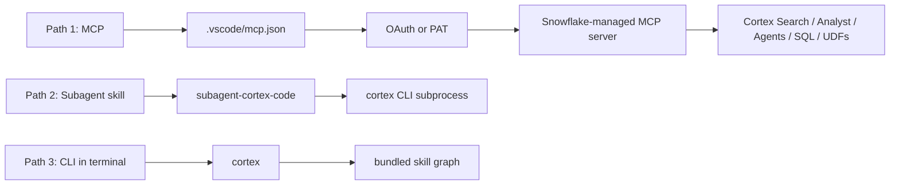
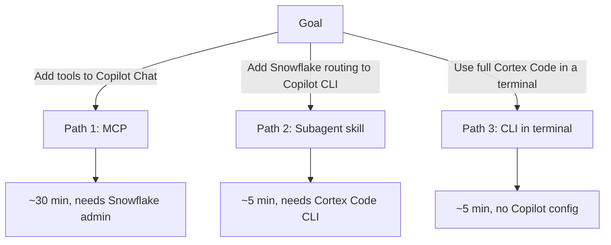

# Connecting VS Code GitHub Copilot to Snowflake Cortex

Three GA paths to bring Snowflake Cortex into the VS Code window where you already use GitHub Copilot — from a fully governed Snowflake-managed MCP server with OAuth, to a public Snowflake-Labs skill for the GitHub Copilot CLI, to running the Cortex Code CLI directly in the integrated terminal.

**Audience:** SEs walking customers through setup + customer engineers configuring independently
**Created:** 2026-05-28 | **Expires:** 2026-06-27 | **Status:** ACTIVE

> **No support provided.** This content is for reference only. Review and validate before applying to any production workflow.

---

## Three paths, one editor

All three are layerable in the same VS Code window. Path 1 lights up Copilot Chat in the sidebar; Path 2 lights up the GitHub Copilot CLI if you use it in a terminal pane; Path 3 lights up the Cortex Code CLI in any terminal pane. Pick whichever surfaces your team actually uses.

---

## Quick decision

| Criteria | Path 1 — MCP | Path 2 — Subagent skill | Path 3 — CLI in terminal |
|---|---|---|---|
| **Surface** | VS Code Copilot Chat (sidebar) | GitHub Copilot CLI (terminal) | Any VS Code terminal pane |
| **Setup time** | ~30 minutes | ~5 minutes | ~5 minutes |
| **What you gain** | Cortex Search, Cortex Analyst, Cortex Agents, SQL exec, custom UDFs as tools | Snowflake-shaped prompts auto-route to local CoCo | The full Cortex Code skill graph and CLI |
| **Inference path** | Copilot's normal model | Copilot CLI's normal model | Cortex Code's own model |
| **Auth** | OAuth (recommended) or PAT bearer | None — uses local `cortex` auth | Browser SSO, PAT, or key-pair |
| **Governance** | Snowflake RBAC, role default in OAuth session | Inherits CoCo CLI permissions | Inherits CoCo CLI permissions |
| **Data leaves Snowflake?** | Tool responses only (size-capped) | No — CoCo runs locally against Snowflake | No |
| **Best for** | Org rollout, governed agentic data access from Copilot Chat | Engineers on the Copilot CLI who want Snowflake routing | Power users who want CoCo's full skill graph |
| **Requires Snowflake admin?** | Yes (CREATE MCP SERVER, OAuth security integration) | No | No |

---

## Detailed guides

| | |
|---|---|
| **[Path 1 — Snowflake-managed MCP](path-1-mcp.md)** | Create an MCP server object exposing Cortex Search, Cortex Analyst, Cortex Agents, SQL execution, and custom tools. Configure VS Code Copilot Chat with OAuth (recommended) or PAT bearer. Includes the SQL for security integration with VS Code's multiple callback URLs. |
| **[Path 2 — `subagent-cortex-code` skill](path-2-subagent-skill.md)** | Install the public Snowflake-Labs skill into the **GitHub Copilot CLI** (the `gh copilot` terminal experience — a sibling product to VS Code's Copilot Chat). Snowflake-shaped prompts route to the local Cortex Code CLI as a subprocess. |
| **[Path 3 — Cortex Code CLI in the terminal](path-3-coco-cli-terminal.md)** | Run `cortex` in VS Code's integrated terminal. Not Copilot Chat, but lives in the same VS Code window. Shortest path to the full CoCo skill graph. |

---

## Prerequisites

All paths assume:

- **VS Code** installed.
- A **Snowflake account** the user can sign in to.
- Network reachability from the developer machine to the account URL.

Path-specific prerequisites:

- **Path 1 (MCP):** GitHub Copilot Chat extension in VS Code (Agent mode), VS Code 1.99 or later, and a Snowflake role with `SNOWFLAKE.CORTEX_USER` plus `USAGE` on the relevant MCP tools.
- **Path 2 (subagent skill):** GitHub Copilot CLI (`gh copilot`), Cortex Code CLI installed and authenticated, Node.js for `npx`.
- **Path 3 (CLI in terminal):** Cortex Code CLI installed.

Each path doc has its full prerequisite list.

---

## What is intentionally not covered

This guide covers only generally available components. Other Snowflake AI surfaces and Visual Studio Code AI features may evolve; consult the official documentation for current availability.

---

## Cross-path gotchas

Issues that span more than one path. Path-specific troubleshooting lives in each path doc.

- **Cortex rejects date-suffixed model IDs.** Some clients resolve a model alias like `haiku` to `claude-haiku-4-5-20251001`, which Cortex does not accept. Pin to bare names: `claude-haiku-4-5`, `claude-sonnet-4-6`, `claude-opus-4-6`.
- **Cross-region inference may be required.** If a model is not natively hosted in your account's region: `ALTER ACCOUNT SET CORTEX_ENABLED_CROSS_REGION = 'AWS_US';` (or `AWS_EU`, `AWS_APJ`, `AWS_AU`, `ANY_REGION`). Check with the account team — there are data-locality implications.
- **Network policy blocks PAT or OAuth.** Confirm the policy bound to the user or account (`SHOW PARAMETERS LIKE 'NETWORK_POLICY' IN USER <username>;`) and add the developer's source IP range with `ALTER NETWORK POLICY <name> SET ALLOWED_IP_LIST = (...)`.
- **Two MCP servers register tools with the same name.** Copilot picks one and shadows the other. Rename one of the tools, or scope each MCP server to a separate workspace.
- **PAT expired.** PATs have configurable lifetimes. When a Path 1 PAT or a Path 3 CLI PAT stops working, mint a fresh one in **Admin → Authentication → Programmatic Access Tokens** and update the corresponding config (`.vscode/mcp.json` for Path 1, `cortex connections` for Path 3).

---

## FAQ

**Q: Can I run all three paths at once?**
Yes. They do not conflict. The subagent skill triggers on prompt content, the MCP server adds tools, and the CLI is its own process.

**Q: What's the difference between GitHub Copilot Chat and GitHub Copilot CLI?**
They are different products. Copilot Chat is the sidebar chat panel inside VS Code. Copilot CLI is `gh copilot`, a terminal-based assistant. Path 1 (MCP) extends Copilot Chat. Path 2 (subagent skill) extends Copilot CLI. They can coexist in the same VS Code window.

**Q: Will Path 1 affect what model Copilot Chat uses for inference?**
No. Path 1 only adds tools. Copilot's model selection is unchanged. Tool responses come back as MCP results that the model reasons over.

**Q: Cortex Analyst over MCP — does it run the SQL it generates?**
It returns the SQL text. To execute, configure a separate `SYSTEM_EXECUTE_SQL` tool in the same MCP server (covered in Path 1).

**Q: Why does the docs URL use hyphens for the account name?**
Snowflake's MCP server has connection issues with hostnames containing underscores. Always use the hyphenated `<org>-<account>` form.

**Q: Does this work with Cursor?**
Cursor uses the same VS Code extension surface. Path 1 (MCP) and Path 3 (CLI in terminal) work identically. Path 2 ships a Cursor-specific install variant in the same `subagent-cortex-code` repo — see its README for the routing rule install.

---

## Related projects

- [`guide-connecting-claude-snowflake`](../guide-connecting-claude-snowflake/) — same patterns for Claude Desktop and Claude Code
- [`guide-connecting-copilot-studio-snowflake`](../guide-connecting-copilot-studio-snowflake/) — same patterns for Microsoft Copilot Studio
- [`guide-mcp-auth`](../guide-mcp-auth/) — comprehensive MCP authentication walkthrough across clients
- [`guide-agent-hardening`](../guide-agent-hardening/) — production governance for Cortex Agents

## External references

- [Snowflake-managed MCP server (docs)](https://docs.snowflake.com/en/user-guide/snowflake-cortex/cortex-agents-mcp)
- [Snowflake-managed MCP — GA release notes (Nov 4, 2025)](https://docs.snowflake.com/en/release-notes/2025/other/2025-11-04-cortex-agents-mcp)
- [Snowflake Intelligence — integrate tools and data](https://docs.snowflake.com/en/user-guide/snowflake-cortex/snowflake-intelligence/integrate-tools)
- [`Snowflake-Labs/subagent-cortex-code`](https://github.com/Snowflake-Labs/subagent-cortex-code)
- [VS Code: AI language models and BYOK](https://code.visualstudio.com/docs/copilot/customization/language-models)
- [GitHub Copilot Chat MCP support](https://docs.github.com/en/copilot/customizing-copilot/extending-copilot-chat-with-mcp)
