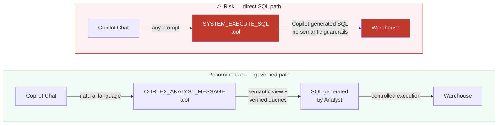
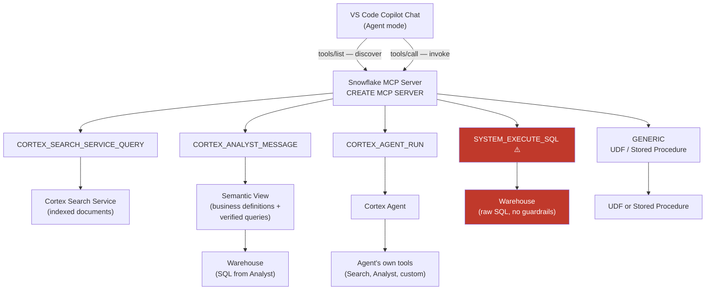

# Path 3 — Snowflake-managed MCP Server

Expose Cortex Search, Cortex Analyst, Cortex Agents, and custom tools as governed functions inside VS Code Copilot Chat. Inference stays on Copilot's normal model. Snowflake access is governed by RBAC and the user's `DEFAULT_ROLE`.

GA on Snowflake: November 4, 2025. Requires VS Code 1.99 or later with GitHub Copilot Chat in Agent mode.

> **Enterprise license holders: check this first.** If your organization's GitHub Copilot access comes through a **Copilot Business or Copilot Enterprise** license (standard for Microsoft Enterprise Agreements), MCP servers are disabled by default at the org level. Your GitHub organization admin must enable the **"MCP servers in Copilot"** policy before any MCP server will appear in Copilot Chat — regardless of how the Snowflake side is configured. Individual Copilot plans (Free, Pro, Pro+) have this on by default. Confirm the policy is enabled before spending time on the Snowflake setup.

---

## Read this before you add SYSTEM_EXECUTE_SQL

The MCP server supports a `SYSTEM_EXECUTE_SQL` tool that lets Copilot run arbitrary SQL against your warehouse. **Do not enable it without understanding the cost and accuracy implications.**



**Cost risk — warehouse billing per tool call.** Every `SYSTEM_EXECUTE_SQL` invocation runs a live query on the configured warehouse and bills at that warehouse's credit rate. Copilot can chain multiple tool calls in a single response. A Medium warehouse ($3/credit) running 20 exploratory queries per session accumulates fast — and there is no semantic layer to prevent Copilot from issuing full table scans or wide aggregations. Always set `query_timeout` and `read_only: true`. If you are using MCP for analytics questions, prefer `CORTEX_ANALYST_MESSAGE`.

**Accuracy risk — no semantic guardrails.** Cortex Analyst generates SQL from a semantic view that contains your business definitions, join paths, and verified query examples. `SYSTEM_EXECUTE_SQL` gives Copilot raw schema access and asks it to write SQL from scratch. Copilot will hallucinate column names, miss business-logic filters, and produce wrong aggregations — especially on complex schemas. If the question is answerable through a semantic view, route it through `CORTEX_ANALYST_MESSAGE` instead.

> **Rule of thumb:** Add `SYSTEM_EXECUTE_SQL` only for operational tasks (schema inspection, data profiling, one-off lookups) where you already understand the query scope. For business analytics questions, use `CORTEX_ANALYST_MESSAGE` with a semantic view.

---

## Architecture



**Key insight from the diagram:** `CORTEX_AGENT_RUN` invokes a Cortex Agent that has its own tool graph underneath — search, analyst, custom procedures. This is usually the right choice when you need multi-step reasoning over Snowflake data. `SYSTEM_EXECUTE_SQL` bypasses all of that and goes directly to compute.

---

## When to use this path

- You want Snowflake tools callable from **Copilot Chat** (the VS Code sidebar), not a separate panel.
- You need Copilot to query Cortex Search across indexed documents.
- You need Copilot to run natural-language analytics via a semantic view.
- You need Copilot to invoke a governed Cortex Agent.
- You need org-level RBAC governing exactly which tools are available and to whom.

If you just want to work in CoCo directly, **Path 1** (VS Code extension) is faster with less setup.

---

## Prerequisites

| | |
|---|---|
| **Snowflake** | Account with Cortex Agents enabled. Role with `CREATE MCP SERVER` in the target schema. Hostnames must use **hyphens, not underscores** in the account URL. |
| **Auth** | OAuth security integration (recommended) or Programmatic Access Token (PAT). |
| **VS Code** | Version 1.99 or later with the GitHub Copilot Chat extension installed in Agent mode. |

Privilege requirements per tool type:

| Tool type | Required privilege |
|---|---|
| `CORTEX_SEARCH_SERVICE_QUERY` | `USAGE` on the Cortex Search Service |
| `CORTEX_ANALYST_MESSAGE` | `SELECT` on the Semantic View |
| `CORTEX_AGENT_RUN` | `USAGE` on the Cortex Agent |
| `SYSTEM_EXECUTE_SQL` | Role access to the data the SQL will touch |
| `GENERIC` | `USAGE` on the UDF or stored procedure |

`USAGE` on the MCP server itself is also required for tool discovery.

---

## Step 1: Create the MCP server

Start with only the tools you need. The example below omits `SYSTEM_EXECUTE_SQL` deliberately — add it only after reading the risk section above.

```sql
CREATE OR REPLACE MCP SERVER my_mcp
  FROM SPECIFICATION $$
tools:
  - name: "product_search"
    type: "CORTEX_SEARCH_SERVICE_QUERY"
    identifier: "MY_DB.PUBLIC.PRODUCT_DOCS_SEARCH"
    description: "Search across product documentation."
    title: "Product Search"

  - name: "revenue_analyst"
    type: "CORTEX_ANALYST_MESSAGE"
    identifier: "MY_DB.PUBLIC.REVENUE_SEMANTIC_VIEW"
    description: "Answer revenue questions using the revenue semantic view."
    title: "Revenue Analyst"
$$;
```

> **Day-one testing without a semantic view?** Replace the above with a single `SYSTEM_EXECUTE_SQL` tool scoped to `read_only: true` and a short `query_timeout`. Remove it once you have a semantic view in place.

If you do add `SYSTEM_EXECUTE_SQL`, always include both guards:

```yaml
  - name: "run_select"
    type: "SYSTEM_EXECUTE_SQL"
    description: "Run a read-only SQL SELECT."
    config:
      read_only: true
      query_timeout: 30
      warehouse: "MY_WH"
```

Verify:

```sql
SHOW MCP SERVERS IN SCHEMA MY_DB.PUBLIC;
DESCRIBE MCP SERVER my_mcp;
```

Limits: maximum 50 tools per server. Tool-selection accuracy degrades as you approach the cap — split across servers if needed. `GENERIC` and `SYSTEM_EXECUTE_SQL` responses are truncated at 250 KB. Cortex Analyst returns SQL text, not results — pair with `SYSTEM_EXECUTE_SQL` if execution is required.

---

## Step 2: Create the OAuth security integration

OAuth is the supported path for any team rollout. PAT is acceptable for solo use and demos.

### OAuth (recommended)

```sql
CREATE OR REPLACE SECURITY INTEGRATION my_mcp_oauth
  TYPE = OAUTH
  OAUTH_CLIENT = CUSTOM
  ENABLED = TRUE
  OAUTH_CLIENT_TYPE = 'CONFIDENTIAL'
  OAUTH_REDIRECT_URI = 'https://vscode.dev/redirect'
  OAUTH_ALTERNATE_REDIRECT_URIS = (
    'http://localhost:33418/'
  );

SELECT SYSTEM$SHOW_OAUTH_CLIENT_SECRETS('MY_MCP_OAUTH');
```

Note the `OAUTH_CLIENT_ID` and `OAUTH_CLIENT_SECRET` from the result.

OAuth sessions use the user's `DEFAULT_ROLE`. Secondary roles are not honored. Set both for every user who will connect:

```sql
ALTER USER <username>
  SET DEFAULT_ROLE = '<mcp_access_role>'
      DEFAULT_WAREHOUSE = '<warehouse_name>';
```

DCR (Dynamic Client Registration) is not supported. Each VS Code instance reuses the single security integration's client ID and secret.

### PAT (fallback)

Generate a PAT in Snowsight: **Admin → Authentication → Programmatic Access Tokens**. Scope it to the least-privileged role that has the privileges listed in the prerequisites.

---

## Step 3: Grant tool privileges

```sql
GRANT USAGE ON MCP SERVER MY_DB.PUBLIC.MY_MCP TO ROLE <mcp_access_role>;

GRANT USAGE ON CORTEX SEARCH SERVICE MY_DB.PUBLIC.PRODUCT_DOCS_SEARCH
  TO ROLE <mcp_access_role>;
GRANT SELECT ON SEMANTIC VIEW MY_DB.PUBLIC.REVENUE_SEMANTIC_VIEW
  TO ROLE <mcp_access_role>;
GRANT USAGE ON WAREHOUSE MY_WH TO ROLE <mcp_access_role>;
```

---

## Step 4: Configure VS Code

The MCP endpoint URL pattern:

```
https://<org-account>.snowflakecomputing.com/api/v2/databases/<db>/schemas/<schema>/mcp-servers/<name>
```

Get your account identifier:

```sql
SELECT CURRENT_ORGANIZATION_NAME() || '-' || CURRENT_ACCOUNT_NAME();
```

Create `.vscode/mcp.json`. Keep secrets out of git — either add `.vscode/mcp.json` to `.gitignore` or use the user-profile config (**MCP: Open User Configuration** in the Command Palette).

**OAuth config:**

```json
{
  "servers": {
    "snowflake-cortex": {
      "type": "http",
      "url": "https://<org-account>.snowflakecomputing.com/api/v2/databases/<DB>/schemas/<SCHEMA>/mcp-servers/MY_MCP",
      "oauth": {
        "client_id": "<OAUTH_CLIENT_ID>",
        "client_secret": "<OAUTH_CLIENT_SECRET>",
        "scope": "session:role:<mcp_access_role>"
      }
    }
  }
}
```

**PAT config** (prompts for token at runtime, no secret on disk):

```json
{
  "inputs": [
    {
      "id": "snowflake_pat",
      "type": "promptString",
      "description": "Snowflake PAT for the MCP server",
      "password": true
    }
  ],
  "servers": {
    "snowflake-cortex": {
      "type": "http",
      "url": "https://<org-account>.snowflakecomputing.com/api/v2/databases/<DB>/schemas/<SCHEMA>/mcp-servers/MY_MCP",
      "headers": {
        "Authorization": "Bearer ${input:snowflake_pat}",
        "X-Snowflake-Authorization-Token-Type": "PROGRAMMATIC_ACCESS_TOKEN"
      }
    }
  }
}
```

Save the file. VS Code shows a **Start** button next to the server. Click it.

---

## Step 5: Verify in Copilot Chat

1. Open Copilot Chat, switch to **Agent** mode.
2. Click the tools icon. Your tools should appear.
3. Ask a question: *"Use product_search to find what the docs say about returns policy."*
4. Confirm the tool call when prompted.

Validate at the warehouse level:

```sql
SELECT QUERY_TYPE, QUERY_TEXT, ROLE_NAME, USER_NAME, START_TIME
FROM SNOWFLAKE.ACCOUNT_USAGE.QUERY_HISTORY
WHERE START_TIME > DATEADD(MINUTE, -10, CURRENT_TIMESTAMP())
  AND USER_NAME = '<your_user>'
ORDER BY START_TIME DESC;
```

---

## Troubleshooting

**Connection failure** — Confirm you're using the hyphenated `<org>-<account>` form, not underscores. Confirm the path uses `mcp-servers` (hyphenated), not `mcp_servers`. Check network policy — the machine's IP must be allowed.

**"Insufficient privileges"** — `USAGE` on the MCP server is necessary but not sufficient. Each tool's underlying object also requires its own privilege. Check with `SHOW GRANTS TO ROLE <mcp_access_role>`.

**OAuth session uses wrong role** — OAuth sessions use `DEFAULT_ROLE`. Set it explicitly with `ALTER USER`.

**`DEFAULT_WAREHOUSE` null** — Sessions fail to initialize if `DEFAULT_WAREHOUSE` is not set. Set it with `ALTER USER`.

**"session:role:all" in consent screen** — Display is cosmetic. Snowflake enforces the security integration's `OAUTH_USE_SECONDARY_ROLES` setting regardless of what the client requests.

**Copilot keeps prompting for OAuth approval on restart** — Add all VS Code callback URLs to `OAUTH_ALTERNATE_REDIRECT_URIS`. Different VS Code builds (stable, Insiders, web) use different callbacks.

**Cortex Analyst returns SQL but Copilot says "no data"** — Analyst returns SQL text only. Pair with `SYSTEM_EXECUTE_SQL` to execute. Understand the cost implications before doing so.

**Tool response truncated** — `GENERIC` and `SYSTEM_EXECUTE_SQL` responses cap at 250 KB. Narrow the query before it hits MCP.

---

## References

- [Snowflake-managed MCP server (docs)](https://docs.snowflake.com/en/user-guide/snowflake-cortex/cortex-agents-mcp)
- [GA release notes — Nov 4, 2025](https://docs.snowflake.com/en/release-notes/2025/other/2025-11-04-cortex-agents-mcp)
- [GitHub Copilot Chat: extending with MCP](https://docs.github.com/en/copilot/customizing-copilot/extending-copilot-chat-with-mcp)
- [VS Code: MCP servers](https://code.visualstudio.com/docs/copilot/customization/mcp-servers)
