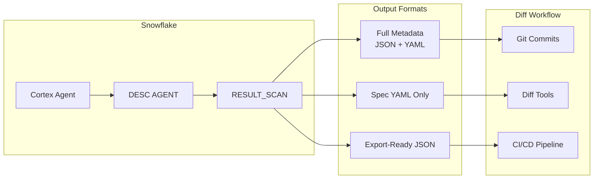

# Agent Config Diff

Inspired by a real operational question: *"We have six Cortex Agents across three environments -- how do we track what changed between versions?"*

This tool extracts Cortex Agent specifications via `DESC AGENT` and formats them for diff tools, version control commits, and configuration management. No persistent objects are created -- run the queries ad-hoc in Snowsight or programmatically via Python.

**Author:** SE Community
**Last Updated:** 2026-03-02 | **Expires:** 2026-05-01 | **Status:** ACTIVE

> **No support provided.** This code is for reference only. Review, test, and modify before any production use.
> This tool expires on 2026-05-01. After expiration, validate against current Snowflake docs before use.

---

## The Operational Pain

As teams build more Cortex Agents, configuration drift becomes invisible. An agent's YAML spec, profile, and tool list can change without anyone tracking what was different between yesterday's version and today's. There's no built-in diff, no change log, and no export format that plays well with Git.

---

## What It Does

### Option 1: Full Agent Metadata

Returns all agent properties with parsed profile JSON -- best for comprehensive config management.

### Option 2: Spec YAML Only

Returns just the agent specification -- best for diff tools and line-by-line comparison.

```bash
diff agent_a_spec.yaml agent_b_spec.yaml
# or
code --diff agent_a_spec.yaml agent_b_spec.yaml
```

### Option 3: Export-Ready JSON

Single JSON document with all configuration data -- best for version control commits.

> [!TIP]
> **Pattern demonstrated:** `DESC AGENT` + `RESULT_SCAN(LAST_QUERY_ID())` for extracting agent specs -- the ad-hoc pattern for agent configuration management.

---

## Architecture



---

<details>
<summary><strong>Deploy (no persistent objects)</strong></summary>

This tool creates no persistent objects. Open [`extract_agent_spec.sql`](extract_agent_spec.sql) in Snowsight, update the `agent_fqn` variable, and run the desired option.

```sql
SET agent_fqn = 'YOUR_DATABASE.YOUR_SCHEMA.YOUR_AGENT';
```

For programmatic extraction, use `extract_agent_spec.py` (no interactive session state needed).

</details>

<details>
<summary><strong>Troubleshooting</strong></summary>

| Symptom | Fix |
|---------|-----|
| "Object does not exist" | Verify the agent FQN is correct: `SHOW AGENTS IN SCHEMA <db>.<schema>`. |
| Empty `agent_spec` | Agent may have been created without a spec. Check with `DESC AGENT`. |
| `TRY_PARSE_JSON` returns NULL | Profile field may be empty. This is normal for agents without custom profiles. |

</details>

## Cleanup

No cleanup required -- this tool creates no persistent objects.

<details>
<summary><strong>Development Tools</strong></summary>

This project is designed for AI-pair development.

- **AGENTS.md** -- Project instructions for Cortex Code and compatible AI tools
- **.claude/skills/** -- Project-specific AI skills (Cursor + Claude Code)
- **Cortex Code in Snowsight** -- Open this project in a Workspace for AI-assisted development
- **Cursor** -- Open locally with Cursor for AI-pair coding

> New to AI-pair development? See [Cortex Code docs](https://docs.snowflake.com/en/user-guide/cortex-code/cortex-code)

</details>
