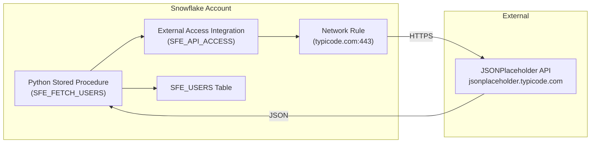

# API Data Fetcher

Inspired by a real customer question: *"What's the simplest way to call a REST API from inside Snowflake and store the results in a table?"*

This tool answers that question with a Python stored procedure that fetches data from a public REST API and stores it in a Snowflake table via External Access Integration. One procedure call, no external ETL tools.

**Author:** SE Community
**Last Updated:** 2026-03-02 | **Expires:** 2026-05-01 | **Status:** ACTIVE

> **No support provided.** This code is for reference only. Review, test, and modify before any production use.
> This tool expires on 2026-05-01. After expiration, validate against current Snowflake docs before use.

---

## The Operational Pain

Teams need to pull reference data from external REST APIs into Snowflake -- user directories, product catalogs, exchange rates -- but setting up a full ETL pipeline feels like overkill for a simple API call. They want something they can run from a SQL worksheet.

---

## What It Does

A single stored procedure call fetches JSON from a REST API, parses the response, and writes rows to a Snowflake table:

```sql
CALL SNOWFLAKE_EXAMPLE.SFE_API_FETCHER.SFE_FETCH_USERS();

SELECT user_id, name, email, company_name
FROM SNOWFLAKE_EXAMPLE.SFE_API_FETCHER.SFE_USERS
LIMIT 3;
```

| user_id | name | email | company_name |
|---------|------|-------|--------------|
| 1 | Leanne Graham | Sincere@april.biz | Romaguera-Crona |
| 2 | Ervin Howell | Shanna@melissa.tv | Deckow-Crist |
| 3 | Clementine Bauch | Nathan@yesenia.net | Romaguera-Jacobson |

> [!TIP]
> **Pattern demonstrated:** External Access Integration + Network Rule + Python stored procedure -- the minimal Snowflake-native pattern for REST API ingestion.

---

## Architecture



---

<details>
<summary><strong>Deploy (1 step, ~2 minutes)</strong></summary>

> [!IMPORTANT]
> Requires `ACCOUNTADMIN` role access (for External Access Integration creation).

Copy [`deploy.sql`](deploy.sql) into a Snowsight worksheet and click **Run All**.

### What Gets Created

| Object Type | Name | Purpose |
|-------------|------|---------|
| Schema | `SNOWFLAKE_EXAMPLE.SFE_API_FETCHER` | Tool namespace |
| Table | `SFE_USERS` | Stores fetched user data |
| Network Rule | `SFE_API_NETWORK_RULE` | Allows egress to API |
| Integration | `SFE_API_ACCESS` | External access integration |
| Procedure | `SFE_FETCH_USERS` | Fetches and stores data |

</details>

<details>
<summary><strong>Troubleshooting</strong></summary>

| Symptom | Fix |
|---------|-----|
| `SFE_FETCH_USERS` fails | Verify External Access Integration exists: `SHOW INTEGRATIONS`. Ensure ACCOUNTADMIN role was used for deploy. |
| Empty table after CALL | Check network rule allows egress to `jsonplaceholder.typicode.com`. |
| Permission denied on integration | External Access Integrations require ACCOUNTADMIN to create. |

</details>

## Cleanup

Run [`teardown.sql`](teardown.sql) in Snowsight to remove all tool objects.

<details>
<summary><strong>Development Tools</strong></summary>

This project is designed for AI-pair development.

- **AGENTS.md** -- Project instructions for Cortex Code and compatible AI tools
- **.claude/skills/** -- Project-specific AI skills (Cursor + Claude Code)
- **Cortex Code in Snowsight** -- Open this project in a Workspace for AI-assisted development
- **Cursor** -- Open locally with Cursor for AI-pair coding

> New to AI-pair development? See [Cortex Code docs](https://docs.snowflake.com/en/user-guide/cortex-code/cortex-code)

</details>
