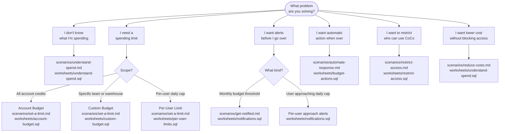

# Cortex Code — FinOps Governance Toolkit

**Pair-programmed by SE Community + Cortex Code**
**Created:** 2026-04-06 | **Expires:** 2026-07-06 | **Status:** ACTIVE

A notebook-first toolkit for understanding, controlling, and monitoring Cortex Code spend — covering **both the CLI and Snowsight surfaces**. Includes scenario-based runbooks, Snowsight-ready SQL worksheets, and a proactive threshold notification system.

> **No support provided.** Reference only. Review and validate before applying to any production workflow.

---

## Which scenario describes you?



---

## Quick Start

### Option A — One-Shot Deploy (recommended)

1. In Snowsight: open a new SQL worksheet
2. Paste the contents of [`deploy_all.sql`](deploy_all.sql)
3. Click **Run All**

This creates:
- Notebook `CORTEX_CODE_GOVERNANCE_NOTEBOOK` (fetched from GitHub)
- Notification objects: integration, stored procedure, task, audit table
- Schema `SNOWFLAKE_EXAMPLE.CORTEX_CODE_GOVERNANCE`

### Option B — Manual Deploy

#### Step 1 — Grant access (if not already granted)

```sql
GRANT IMPORTED PRIVILEGES ON DATABASE SNOWFLAKE TO ROLE <your_role>;
```

#### Step 2 — Run the Notebook

1. In Snowsight: **Projects > Notebooks > + Notebook > Import .ipynb**
2. Upload `notebook.ipynb`
3. Select a warehouse and run all cells

#### Step 3 — (Optional) Deploy notifications manually

Run `worksheets/notifications.sql` in Snowsight to set up the threshold alert system.

---

## What's Inside

### Notebook — 3 sections

| Section | What it does |
|---------|-------------|
| **A — Spend Analysis** | Daily trend, weekly trend, top users, hourly pattern, model breakdown, projections, CLI vs Snowsight comparison, pricing reference |
| **B — Per-User Daily Limits** | Current account/user parameter settings, user override listing, rolling 24h usage vs limits, limit calculator with ready-to-run ALTER statements |
| **C — Threshold Notifications** | Monthly budget alerts (native), per-user limit approach alerts (custom task that emails before a user is blocked) |

### Scenario Runbooks

| Scenario | Goal | Runbook | Worksheet |
|----------|------|---------|-----------|
| Understand spend | See totals, users, models, and projections | [understand-spend.md](scenarios/understand-spend.md) | [understand-spend.sql](worksheets/understand-spend.sql) |
| Set a limit | Monthly credit cap or per-user daily cap | [set-a-limit.md](scenarios/set-a-limit.md) | [account-budget.sql](worksheets/account-budget.sql) · [custom-budget.sql](worksheets/custom-budget.sql) · [per-user-limits.sql](worksheets/per-user-limits.sql) |
| Get notified | Email, Slack, Teams, or per-user approach alerts | [get-notified.md](scenarios/get-notified.md) | [notifications.sql](worksheets/notifications.sql) |
| Automate a response | Resize or suspend a warehouse automatically | [automate-response.md](scenarios/automate-response.md) | [budget-actions.sql](worksheets/budget-actions.sql) |
| Restrict access | Control who can use Cortex Code via RBAC | [restrict-access.md](scenarios/restrict-access.md) | [restrict-access.sql](worksheets/restrict-access.sql) |
| Reduce costs | Lower spend without blocking users | [reduce-costs.md](scenarios/reduce-costs.md) | [understand-spend.sql](worksheets/understand-spend.sql) |

### SQL Worksheets

| Worksheet | What it covers |
|-----------|---------------|
| [`understand-spend.sql`](worksheets/understand-spend.sql) | Daily trend, top users, model breakdown, cache efficiency, EOM projection |
| [`account-budget.sql`](worksheets/account-budget.sql) | Activate, set limit, email/Slack notification, AI_SERVICES spend history |
| [`custom-budget.sql`](worksheets/custom-budget.sql) | Create, ADD_RESOURCE vs ADD_RESOURCE_TAG, notifications, inspect, drop |
| [`budget-actions.sql`](worksheets/budget-actions.sql) | Action procedures (PROJECTED / ACTUAL / CYCLE_START), register, telemetry |
| [`restrict-access.sql`](worksheets/restrict-access.sql) | CORTEX_USER grants, network policy, unused-access audit |
| [`monitoring.sql`](worksheets/monitoring.sql) | Budget health, at-risk detection, WoW trend, telemetry events, debug checklist |
| [`per-user-limits.sql`](worksheets/per-user-limits.sql) | View/set/audit per-user daily credit limits, impact analysis |
| [`notifications.sql`](worksheets/notifications.sql) | Email/webhook integration, budget thresholds, per-user alert task + teardown |

---

## Cost Control Levers at a Glance

| Lever | Enforcement | Setup Time | Best For |
|-------|-------------|------------|----------|
| Model selection | Guidance / settings.json | 2 min | Lowest effort, highest leverage |
| Per-user daily limit | Hard enforcement (rolling 24h) | 5 min | Capping individual users |
| Account budget | Alert-only | 5 min | Simple account-wide monthly cap |
| Custom budget | Alert + automated actions | 15 min | Per-team or per-project tracking |
| Automated actions | Configured stored proc | 15 min | Hands-off enforcement |
| RBAC (CORTEX_USER) | Hard enforcement | 5 min | Block specific users or roles |
| Network policy | Hard enforcement | 5 min | Restrict by IP range |
| Threshold notifications | Proactive email/webhook | 10 min | Early warning before limits are hit |

---

## Prerequisites

- `ACCOUNTADMIN` role (or a role with `SNOWFLAKE.BUDGET_ADMIN`) for budget setup and per-user limits
- `IMPORTED PRIVILEGES ON DATABASE SNOWFLAKE` to query `ACCOUNT_USAGE` views
- At least some Cortex Code usage to monitor (CLI or Snowsight)

---

## How to Use This Toolkit

**With CoCo (recommended):**

```
Walk me through the "set a limit" scenario in the Cortex Code governance toolkit.
```

CoCo will read the runbook, guide you step by step, and verify each piece of SQL as you go.

**Self-guided:**

1. Use the decision tree above to identify your scenario.
2. Open the scenario runbook in `scenarios/` for step-by-step instructions.
3. Paste the matching worksheet from `worksheets/` into Snowsight for ad-hoc analysis and setup.

---

## Pricing Reference

Source: [Snowflake Service Consumption Table, Table 6(e) — Cortex Code](https://www.snowflake.com/legal-files/CreditConsumptionTable.pdf) (effective April 1, 2026)

| Model | Input | Output | Cache Write | Cache Read |
|-------|------:|-------:|------------:|-----------:|
| claude-4-sonnet | 1.50 | 7.50 | 1.88 | 0.15 |
| claude-opus-4-5/4-6 | 2.75 | 13.75 | 3.44 | 0.28 |
| claude-sonnet-4-5/4-6 | 1.65 | 8.25 | 2.07 | 0.17 |
| openai-gpt-5.2 | 0.97 | 7.70 | — | 0.10 |
| openai-gpt-5.4 | 1.38 | 8.25 | — | 0.14 |

_All rates are AI Credits per 1M tokens. On-demand global AI Credit price: **$2.00/credit**._

---

## Cleanup

If deployed via `deploy_all.sql`:
```sql
-- Suspend and drop notification objects
ALTER TASK SNOWFLAKE_EXAMPLE.CORTEX_CODE_GOVERNANCE.CORTEX_CODE_LIMIT_ALERT_TASK SUSPEND;
DROP SCHEMA IF EXISTS SNOWFLAKE_EXAMPLE.CORTEX_CODE_GOVERNANCE CASCADE;
DROP NOTIFICATION INTEGRATION IF EXISTS cortex_code_budget_email_int;
```

---

## Related

- **[Snowflake Budgets docs](https://docs.snowflake.com/en/user-guide/budgets)** — Official reference
- **[Cost controls for Cortex Code](https://docs.snowflake.com/en/user-guide/cortex-code/credit-usage-limit)** — Per-user daily credit limits
- **[Service Consumption Table, Table 6(e)](https://www.snowflake.com/legal-files/CreditConsumptionTable.pdf)** — Official Cortex Code pricing (effective April 1, 2026)
