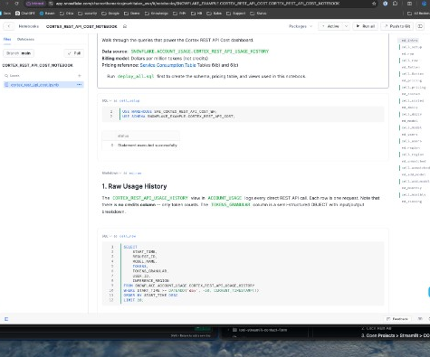

# Cortex REST API Cost


**TOOL PROJECT** | Pair-programmed by SE Community + Cortex Code

## Why This Exists

Snowflake Cortex REST API calls -- direct model inference via the `/api/v2/cortex/inference:complete` endpoint -- are billed in **dollars per million tokens**, not credits. This is a different billing model from SQL-invoked AI functions, Cortex Agents, and Snowflake Intelligence, which all bill in credits.

This tool queries the usage history for those REST API calls, applies the published per-model token rates from the [Service Consumption Table](https://www.snowflake.com/legal-files/CreditConsumptionTable.pdf) (Tables 6b/6c), and shows the actual dollar cost in a Streamlit dashboard.

## What You See


- **Total requests, tokens, and dollar cost** for a selectable lookback window (7 / 30 / 90 days)
- **Daily cost trend** as a bar chart
- **Cost by model** with request counts, token breakdown, and percentage of total spend

## Prerequisites

| Requirement | Why |
|-------------|-----|
| **ACCOUNTADMIN** (one-time) | Creates the Git API integration used to fetch code from GitHub |
| **SYSADMIN** | Creates schema, warehouse, views, and Streamlit app |
| **Access to `SNOWFLAKE.ACCOUNT_USAGE`** | The underlying view (`CORTEX_REST_API_USAGE_HISTORY`) lives here |

The `ACCOUNT_USAGE` views have up to **45 minutes of latency** -- recent API calls may not appear immediately.

## Quick Start

1. Copy [`deploy_all.sql`](deploy_all.sql) into a Snowsight worksheet
2. Click **Run All**
3. Open **Projects > Streamlit > CORTEX_REST_API_COST_APP** for the dashboard
4. Open **Projects > Notebooks > CORTEX_REST_API_COST_NOTEBOOK** to walk through the queries yourself



No data? Make a Cortex REST API call (e.g. via the [Anthropic-redirect pattern](../guide-cortex-anthropic-redirect/) or the [inference:complete endpoint](https://docs.snowflake.com/en/user-guide/snowflake-cortex/cortex-llm-rest-api)) and check back after the `ACCOUNT_USAGE` latency window.

## What Gets Deployed

| Object | Type | Purpose |
|--------|------|---------|
| `SNOWFLAKE_EXAMPLE.CORTEX_REST_API_COST` | Schema | All tool objects live here |
| `SFE_CORTEX_REST_API_COST_WH` | Warehouse | XS, auto-suspend 60s |
| `CORTEX_API_PRICING` | Table | $/million-token rates per model and region |
| `V_API_USAGE_DETAIL` | View | Flattens `TOKENS_GRANULAR` into input/output columns |
| `V_API_USAGE_COSTED` | View | Joins usage with pricing to compute dollar cost per request |
| `V_DAILY_COST_SUMMARY` | View | Daily aggregation |
| `V_MODEL_COST_SUMMARY` | View | Per-model aggregation with % of total |
| `CORTEX_REST_API_COST_APP` | Streamlit | Single-page cost dashboard |
| `CORTEX_REST_API_COST_NOTEBOOK` | Notebook | 10-step query walkthrough |

## How Pricing Works

The `CORTEX_API_PRICING` table contains rates from the Service Consumption Table (effective March 20, 2026):

- **Table 6(b)** models (prompt caching supported): input, output, cache_write, cache_read rates; varies by inference region (regional vs. global)
- **Table 6(c)** models (no caching): input and output rates only; no regional split

The `V_API_USAGE_COSTED` view joins each API request with the matching rate and computes:

```
cost = (input_tokens x input_rate / 1,000,000) + (output_tokens x output_rate / 1,000,000)
```

When a request's inference region indicates global routing, global rates are applied; otherwise regional (higher) rates are used as the default.

### Updating Rates

When Snowflake publishes updated rates, update or replace the rows in `CORTEX_API_PRICING`. The table is keyed on `(MODEL_NAME, REGION_CATEGORY)`. To add a new model:

```sql
INSERT INTO CORTEX_API_PRICING
    (MODEL_NAME, REGION_CATEGORY, INPUT_USD_PER_MTOK, OUTPUT_USD_PER_MTOK, SOURCE_TABLE)
VALUES
    ('new-model-name', 'DEFAULT', 1.50, 7.50, '6b');
```

No view changes are needed -- the join picks up new rows automatically.

## What This Does NOT Cover

This tool tracks **direct REST API model calls only**. Other Cortex billing surfaces have their own usage views:

| Billing Surface | Usage View | Billing Unit |
|-----------------|-----------|--------------|
| **REST API** (this tool) | `CORTEX_REST_API_USAGE_HISTORY` | $/million tokens |
| Cortex Agents | `CORTEX_AGENT_USAGE_HISTORY` | Credits/million tokens |
| SQL AI Functions | `CORTEX_AI_FUNCTIONS_USAGE_HISTORY` | Credits/million tokens |
| Snowflake Intelligence | `SNOWFLAKE_INTELLIGENCE_USAGE_HISTORY` | Credits/million tokens |
| Cortex Search | `CORTEX_SEARCH_DAILY_USAGE_HISTORY` | Credits/GB-month |

## Teardown

Copy [`teardown_all.sql`](teardown_all.sql) into Snowsight and click **Run All**. Removes the schema (CASCADE), warehouse, and Streamlit app. Does not touch shared infrastructure.

## Reference

- [CORTEX_REST_API_USAGE_HISTORY view](https://docs.snowflake.com/en/sql-reference/account-usage/cortex_rest_api_usage_history)
- [Service Consumption Table (PDF)](https://www.snowflake.com/legal-files/CreditConsumptionTable.pdf) -- Tables 6(b) and 6(c)
- [Cortex LLM REST API](https://docs.snowflake.com/en/user-guide/snowflake-cortex/cortex-llm-rest-api)
