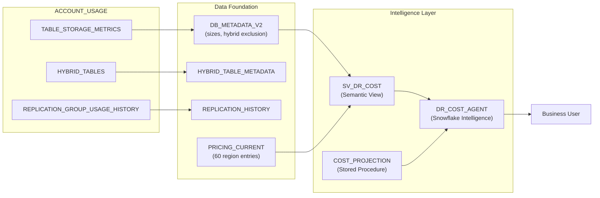

# DR Cost Agent

Inspired by a real customer question: *"We need to budget for cross-region replication, but some of our databases have hybrid tables that won't replicate -- how do we get an accurate estimate?"*

This tool answers that question with a Snowflake Intelligence agent that estimates DR/replication costs with hybrid-table awareness, pre-loaded Business Critical pricing for 60 AWS/Azure/GCP regions, and a custom cost projection procedure. Ask in natural language, get cost estimates with charts.

**Author:** SE Community
**Created:** 2025-12-08 | **Last Updated:** 2026-03-04 | **Expires:** 2026-05-01 | **Status:** ACTIVE

> **No support provided.** This code is for reference only. Review, test, and modify before any production use.
> This tool expires on 2026-05-01. After expiration, validate against current Snowflake docs before use.

---

## The Operational Pain

Cross-region replication pricing depends on database size, daily change rate, destination region, and cloud provider. But the estimate is wrong if you don't account for hybrid tables -- which are **silently skipped during replication refresh** (BCR-1560-1582). Most teams discover this gap only after deploying DR and wondering why certain tables don't appear in the secondary region.

---

## What It Does

Open **Snowflake Intelligence** and find the **DR Cost Estimator** agent. Try these conversation starters:

- *"Estimate DR costs to replicate my databases to a second region"*
- *"Which destination region is cheapest for DR?"*
- *"Do any of my databases have hybrid tables that won't replicate?"*
- *"What did replication actually cost last month?"*
- *"Compare costs if our daily change rate is 2% vs 10%"*

The agent combines live ACCOUNT_USAGE metadata (database sizes, hybrid table detection, historical replication costs) with a deterministic cost projection procedure and pre-loaded pricing rates.

> [!TIP]
> **Pattern demonstrated:** Cortex Agent with a custom `COST_PROJECTION` stored procedure as a tool -- the pattern for combining AI conversation with deterministic calculations.

---

## Architecture

---

<strong>Deploy (1 step, ~5 minutes)</strong>

> [!IMPORTANT]
> Requires `ACCOUNTADMIN` (for USAGE_VIEWER grant) and `SYSADMIN` for all other objects.

Copy [`deploy_standalone.sql`](deploy_standalone.sql) into a Snowsight worksheet and click **Run All**. Self-contained -- no Git integration needed.

Alternatively, use [`deploy.sql`](deploy.sql) for Git-integrated deployment with automatic updates.

### What Gets Created

| Object | Type | Purpose |
|--------|------|---------|
| `SNOWFLAKE_EXAMPLE.DR_COST_AGENT` | Schema | All tool objects |
| `SFE_TOOLS_WH` | Warehouse | Shared, XSmall, auto-suspend |
| `DB_METADATA_V2` | View | Database sizes with hybrid exclusion |
| `HYBRID_TABLE_METADATA` | View | Hybrid table detection |
| `PRICING_CURRENT` | Table | BC pricing for 60 regions |
| `SV_DR_COST` | Semantic View | Natural language interface |
| `COST_PROJECTION` | Procedure | Deterministic cost calculation |
| `DR_COST_AGENT` | Agent | Snowflake Intelligence conversational agent |

### Cost Disclaimer

This tool provides **estimates for budgeting purposes only.** Actual costs vary based on compression ratios, network conditions, change patterns, and contract terms. Consult your account team for production planning.

<strong>Troubleshooting</strong>

| Symptom | Fix |
|---------|-----|
| Agent not visible | Verify the semantic view `SV_DR_COST` exists in `SEMANTIC_MODELS` schema. |
| No database metadata | ACCOUNT_USAGE views lag up to 3 hours. Wait and retry. |
| Pricing seems wrong | Check `PRICING_CURRENT` rates against your contract terms. |
| Hybrid tables not detected | Ensure `SNOWFLAKE.USAGE_VIEWER` database role is granted. |

## Cleanup

Run [`teardown.sql`](teardown.sql) in Snowsight to remove all tool objects.

<strong>Development Tools</strong>

This project is designed for AI-pair development.

- **AGENTS.md** -- Project instructions for Cortex Code and compatible AI tools
- **.claude/skills/** -- Project-specific AI skill
- **Cortex Code in Snowsight** -- Open in a Workspace for AI-assisted development
- **Cursor** -- Open locally for AI-pair coding

> New to AI-pair development? See [Cortex Code docs](https://docs.snowflake.com/en/user-guide/cortex-code/cortex-code)

