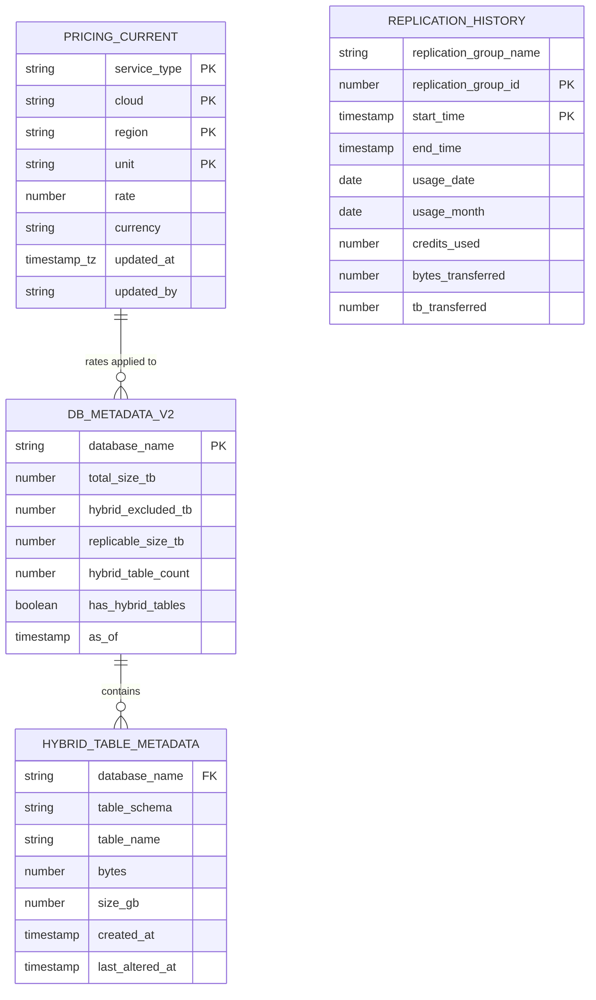

# Data Model - DR Cost Agent
Author: SE Community
Last Updated: 2026-03-04
Expires: 2026-05-01
Status: Reference Implementation

Reference Implementation: This code demonstrates production-grade architectural patterns and best practices. Review and customize security, networking, and logic for your organization's specific requirements before deployment.

## Overview
Data model for pricing, database metadata, hybrid table inventory, and replication history used by the DR Cost Agent.

## Component Descriptions
- **PRICING_CURRENT**: Normalized pricing rows (BC rates) per service/cloud/region. Includes HYBRID_STORAGE for the simplified March 2026 pricing model.
- **DB_METADATA_V2**: Database sizes with hybrid table exclusion. REPLICABLE_SIZE_TB = TOTAL_SIZE_TB minus HYBRID_EXCLUDED_TB.
- **HYBRID_TABLE_METADATA**: Individual hybrid table detail from ACCOUNT_USAGE. Hybrid tables are skipped during replication refresh (BCR-1560-1582).
- **REPLICATION_HISTORY**: Actual replication usage from ACCOUNT_USAGE (empty if no replication configured).
