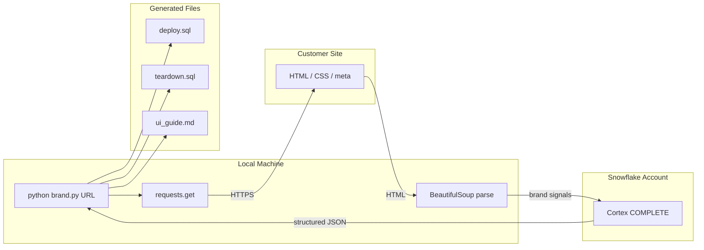
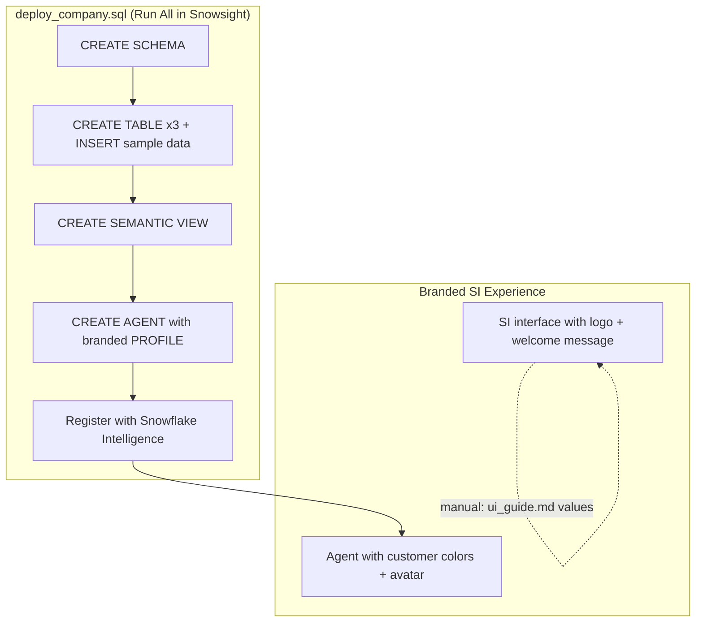

# SI Brand Configurator -- Data Flow

```mermaid
flowchart LR
    subgraph LOCAL ["Local Machine"]
        A["python brand.py URL"]
        B["requests.get"]
        C["BeautifulSoup parse"]
    end

    subgraph EXTERNAL ["Customer Site"]
        D["HTML / CSS / meta"]
    end

    subgraph SNOWFLAKE ["Snowflake Account"]
        E["Cortex COMPLETE"]
    end

    subgraph OUTPUT ["Generated Files"]
        F["deploy.sql"]
        G["teardown.sql"]
        H["ui_guide.md"]
    end

    A --> B -->|HTTPS| D
    D -->|HTML| C
    C -->|brand signals| E
    E -->|structured JSON| A
    A --> F
    A --> G
    A --> H
```

## Generated SQL Flow

```mermaid
flowchart TB
    subgraph deploySql ["deploy_company.sql (Run All in Snowsight)"]
        T1["CREATE SCHEMA"]
        T2["CREATE TABLE x3 + INSERT sample data"]
        T3["CREATE SEMANTIC VIEW"]
        T4["CREATE AGENT with branded PROFILE"]
        T5["Register with Snowflake Intelligence"]
    end

    T1 --> T2 --> T3 --> T4 --> T5

    subgraph result ["Branded SI Experience"]
        R1["Agent with customer colors + avatar"]
        R2["SI interface with logo + welcome message"]
    end

    T5 --> R1
    R2 -.->|"manual: ui_guide.md values"| R2
```
