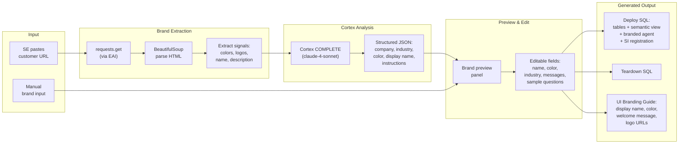
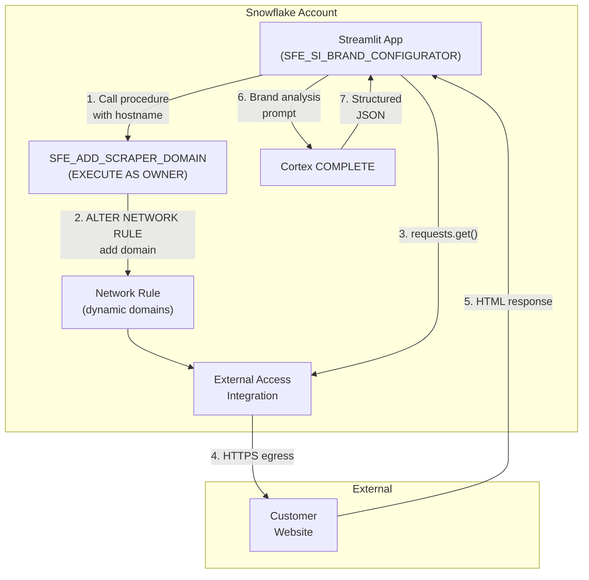

# SI Brand Configurator -- Data Flow

```mermaid
flowchart LR
    subgraph INPUT ["Input"]
        A["SE pastes<br/>customer URL"]
        B["Manual<br/>brand input"]
    end

    subgraph EXTRACT ["Brand Extraction"]
        C["requests.get<br/>(via EAI)"]
        D["BeautifulSoup<br/>parse HTML"]
        E["Extract signals:<br/>colors, logos,<br/>name, description"]
    end

    subgraph ANALYZE ["Cortex Analysis"]
        F["Cortex COMPLETE<br/>(claude-4-sonnet)"]
        G["Structured JSON:<br/>company, industry,<br/>color, display name,<br/>instructions"]
    end

    subgraph EDIT ["Preview & Edit"]
        H["Brand preview<br/>panel"]
        I["Editable fields:<br/>name, color,<br/>industry, messages,<br/>sample questions"]
    end

    subgraph OUTPUT ["Generated Output"]
        J["Deploy SQL:<br/>tables + semantic view<br/>+ branded agent<br/>+ SI registration"]
        K["Teardown SQL"]
        L["UI Branding Guide:<br/>display name, color,<br/>welcome message,<br/>logo URLs"]
    end

    A --> C --> D --> E --> F --> G --> H --> I
    B --> H
    I --> J
    I --> K
    I --> L
```

## Network Flow

```mermaid
flowchart TB
    subgraph SNOWFLAKE ["Snowflake Account"]
        SIS["Streamlit App<br/>(SFE_SI_BRAND_CONFIGURATOR)"]
        EAI["External Access<br/>Integration"]
        NR["Network Rule<br/>(dynamic domains)"]
        PROC["SFE_ADD_SCRAPER_DOMAIN<br/>(EXECUTE AS OWNER)"]
        CORTEX["Cortex COMPLETE"]
    end

    subgraph EXTERNAL ["External"]
        WEB["Customer<br/>Website"]
    end

    SIS -->|"1. Call procedure<br/>with hostname"| PROC
    PROC -->|"2. ALTER NETWORK RULE<br/>add domain"| NR
    NR --> EAI
    SIS -->|"3. requests.get()"| EAI
    EAI -->|"4. HTTPS egress"| WEB
    WEB -->|"5. HTML response"| SIS
    SIS -->|"6. Brand analysis<br/>prompt"| CORTEX
    CORTEX -->|"7. Structured<br/>JSON"| SIS
```
