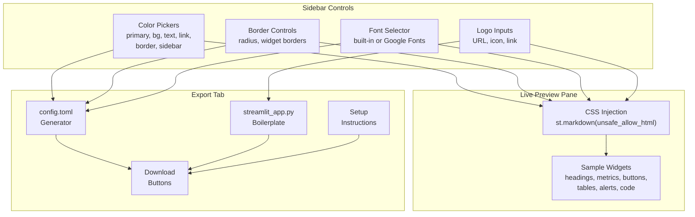

# Streamlit Brand Configurator -- Data Flow

## Flow Summary

1. User adjusts controls in the sidebar (colors, borders, fonts, logo)
2. Each change triggers a CSS `<style>` injection into the main pane
3. The preview pane re-renders sample widgets with the new styles
4. On the Export tab, generators build `config.toml` and `streamlit_app.py` from the same state
5. User downloads files and applies them to their own Streamlit project
