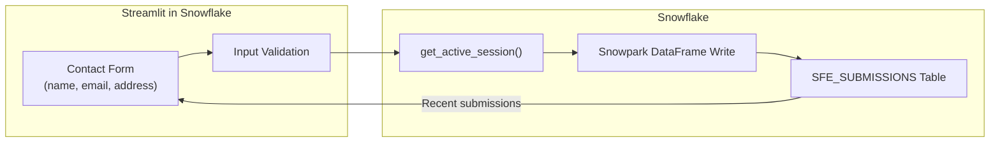

# Contact Form (Streamlit in Snowflake)

Inspired by a real customer question: *"What's the simplest Streamlit in Snowflake app I can build to collect user input and write it to a table?"*

This tool answers that question with a minimal contact form -- name, email, address -- that validates input and writes submissions directly to a Snowflake table. The simplest possible starting point for any Streamlit-in-Snowflake data collection app.

**Author:** SE Community
**Last Updated:** 2026-03-04 | **Expires:** 2026-05-01 | **Status:** ACTIVE

> **No support provided.** This code is for reference only. Review, test, and modify before any production use.
> This tool expires on 2026-05-01. After expiration, validate against current Snowflake docs before use.

---

## The Operational Pain

Teams want to collect structured input from users (feedback forms, intake requests, survey responses) and store it directly in Snowflake -- without standing up an external web app, API, or database. Streamlit in Snowflake can do this, but getting from zero to a working form with validation and table writes takes a few patterns that aren't obvious from the docs alone.

---

## What It Does

- Displays a contact form with name, email, and address fields
- Validates user input (required fields, email format)
- Writes submissions directly to a Snowflake table via Snowpark
- Shows recent submissions in a data table
- Tracks submission count

> [!TIP]
> **Pattern demonstrated:** `get_active_session()` + Snowpark DataFrame writes for Streamlit-to-table data collection -- the minimal Streamlit in Snowflake write pattern.

---

## Architecture

---

<strong>Deploy (1 step, ~2 minutes)</strong>

Copy [`deploy.sql`](deploy.sql) into a Snowsight worksheet and click **Run All**.

Then navigate to **Projects > Streamlit > SFE_CONTACT_FORM** in Snowsight.

### What Gets Created

| Object Type | Name | Purpose |
|-------------|------|---------|
| Schema | `SNOWFLAKE_EXAMPLE.SFE_CONTACT_FORM` | Tool namespace |
| Table | `SFE_SUBMISSIONS` | Stores form submissions |
| Stage | `SFE_STREAMLIT_STAGE` | Streamlit app files |
| Streamlit | `SFE_CONTACT_FORM` | The contact form app |
| Procedure | `SFE_SETUP_APP` | Uploads Streamlit code |

<strong>Troubleshooting</strong>

| Symptom | Fix |
|---------|-----|
| Streamlit app not visible | Navigate to Snowsight > Projects > Streamlit. Ensure `deploy.sql` ran successfully. |
| Submit button does nothing | Check browser console for errors. Verify the `SFE_SUBMISSIONS` table exists. |
| Permission denied | Ensure the Streamlit app's warehouse and schema grants are correct. |

## Cleanup

Run [`teardown.sql`](teardown.sql) in Snowsight to remove all tool objects.

<strong>Development Tools</strong>

This project is designed for AI-pair development.

- **AGENTS.md** -- Project instructions for Cortex Code and compatible AI tools
- **.claude/skills/** -- Project-specific AI skills (Cursor + Claude Code)
- **Cortex Code in Snowsight** -- Open this project in a Workspace for AI-assisted development
- **Cursor** -- Open locally with Cursor for AI-pair coding

> New to AI-pair development? See [Cortex Code docs](https://docs.snowflake.com/en/user-guide/cortex-code/cortex-code)

