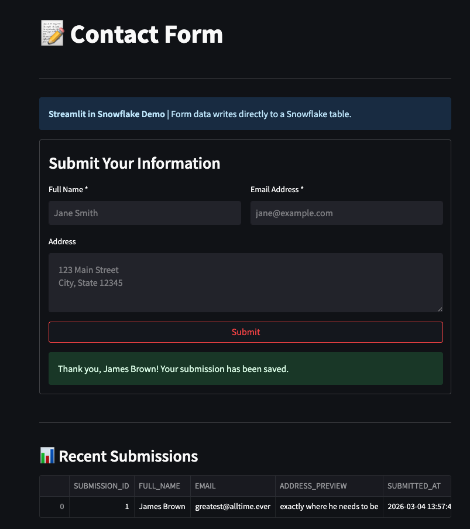

# Contact Form (Streamlit in Snowflake)

> DEMONSTRATION PROJECT - EXPIRES: 2026-05-01
> This tool uses Snowflake features current as of March 2026.
> **No support provided.** This code is for reference only. Review, test, and modify before any production use.

A simple contact form built with Streamlit in Snowflake that collects user information and writes directly to a Snowflake table.



---

## What It Does

- Displays a contact form with name, email, and address fields
- Validates user input (required fields, email format)
- Writes submissions directly to a Snowflake table
- Shows recent submissions in a data table
- Tracks submission count

---

## Snowflake Features Demonstrated

- **Streamlit in Snowflake** - Native Python UI framework
- **Snowpark** - DataFrame operations and SQL execution
- **Session Context** - Using `get_active_session()` for database access

---

## Quick Start

**Deploy in Snowsight (no clone needed):**
Copy [`deploy.sql`](deploy.sql) into a Snowsight worksheet and click **Run All**.

**Develop with Cortex Code:**
```bash
bash <(curl -sL https://raw.githubusercontent.com/sfc-gh-miwhitaker/sfe-public/main/shared/get-project.sh) tool-streamlit-contact-form
cd sfe-public/tool-streamlit-contact-form && cortex
```

### Use the Tool

1. Navigate to **Projects → Streamlit** in Snowsight
2. Find **SFE_CONTACT_FORM** in the list
3. Click to open the app
4. Fill out the form and click **Submit**
5. See your submission appear in the "Recent Submissions" table

---

## Objects Created

| Object Type | Name | Purpose |
|-------------|------|---------|
| Schema | `SNOWFLAKE_EXAMPLE.SFE_CONTACT_FORM` | Tool namespace |
| Table | `SFE_SUBMISSIONS` | Stores form submissions |
| Stage | `SFE_STREAMLIT_STAGE` | Streamlit app files |
| Streamlit | `SFE_CONTACT_FORM` | The contact form app |
| Procedure | `SFE_SETUP_APP` | Uploads Streamlit code |

---

## Sample Data

After submitting the form, your data appears in:

```sql
SELECT submission_id, full_name, email, address, submitted_at
FROM SNOWFLAKE_EXAMPLE.SFE_CONTACT_FORM.SFE_SUBMISSIONS
ORDER BY submitted_at DESC;
```

| submission_id | full_name | email | address | submitted_at |
|---------------|-----------|-------|---------|--------------|
| 1 | Jane Smith | jane@example.com | 123 Main St | 2025-12-10 10:30:00 |

---

## Cleanup

```sql
-- Copy teardown.sql into Snowsight, Run All
```

This removes:
- Schema `SFE_CONTACT_FORM` and all contained objects
- Does NOT remove shared infrastructure (database, warehouse)

---

## Architecture

See `diagrams/` for:
- `data-flow.md` - How form data flows from UI to table

---

## Customization Ideas

1. **Add more fields** - Phone number, company name, etc.
2. **Add validation** - More sophisticated email/phone validation
3. **Add export** - Download submissions as CSV
4. **Add charts** - Submission trends over time

## Troubleshooting

| Symptom | Fix |
|---------|-----|
| Streamlit app not visible | Navigate to Snowsight > Projects > Streamlit. Ensure `deploy.sql` ran successfully. |
| Submit button does nothing | Check browser console for errors. Verify the `SFE_SUBMISSIONS` table exists. |
| Permission denied | Ensure the Streamlit app's warehouse and schema grants are correct. |

## Development Tools

This project is designed for AI-pair development.

- **AGENTS.md** -- Project instructions for Cortex Code and compatible AI tools
- **.claude/skills/** -- Project-specific AI skills (Cursor + Claude Code)
- **Cortex Code in Snowsight** -- Open this project in a Workspace for AI-assisted development
- **Cursor** -- Open locally with Cursor for AI-pair coding

> New to AI-pair development? See [Cortex Code docs](https://docs.snowflake.com/en/user-guide/cortex-code/cortex-code)

---

*SE Community • Contact Form Tool • Last Updated: 2026-03-04*
